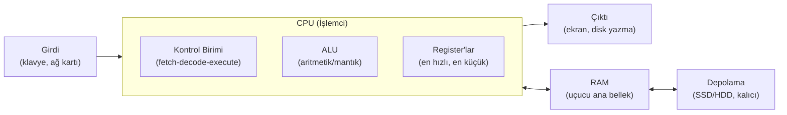
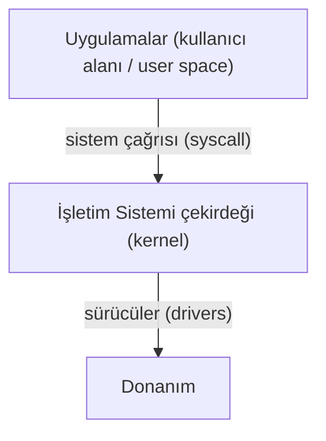

# 💻 Bilgisayar Temelleri

Güvenlik, bir bilgisayarın *nasıl* çalıştığını bilmeden yapılamaz. Bir zafiyet neredeyse her zaman donanım, veri temsili veya işletim sistemi katmanındaki bir varsayımın istismarıdır. Bu dosya, geri kalan tüm modüllerin üstüne inşa edildiği zemini kurar.

> İlgili derinlemesine modüller: işletim sistemi iç yapısı için [03-isletim-sistemi-ici](../03-isletim-sistemi-ici/surecler-ve-bellek.md), Linux/Windows için [02-linux-windows](../02-linux-windows/linux-temelleri.md). Terimler için [terminoloji-sozlugu.md](terminoloji-sozlugu.md).

---

## 1. Donanımın beş temel bloğu

Her bilgisayar, mimarisi ne olursa olsun, mantıksal olarak beş bloğa ayrılır. Bu ayrım 1945'te John von Neumann tarafından formüle edildi ve bugün hâlâ geçerli.



| Blok | Görev | Güvenlik açısından önemi |
|------|-------|--------------------------|
| **CPU** | Komutları getir-çöz-çalıştır (fetch-decode-execute). | Ayrıcalık halkaları (ring 0–3), Spectre/Meltdown gibi yan-kanal (side-channel) saldırıları burada yaşar. |
| **RAM** | Çalışan program ve verinin uçucu (volatile) tutulduğu yer. | Bellek adli analizi (memory forensics), kimlik bilgileri RAM'de düz metin kalabilir (bkz. Mimikatz). |
| **Depolama** | Kalıcı (non-volatile) veri: SSD/HDD. | Disk şifreleme (BitLocker/LUKS), silinmiş veri kurtarma, dosya sistemi adli analizi. |
| **Girdi/Çıktı** | Dış dünya ile iletişim (klavye, ağ, ekran). | Ağ kartı = saldırı yüzeyinin fiziksel giriş noktası; DMA saldırıları. |
| **Anakart / veri yolu (bus)** | Blokları birbirine bağlar. | Firmware/UEFI implant'ları, donanım implantları. |

**Bellek hiyerarşisi** (hızlı+pahalı+küçük → yavaş+ucuz+büyük): `Register → L1/L2/L3 önbellek (cache) → RAM → SSD → HDD → ağ/bulut depolama`. Bu hiyerarşiyi bilmek, önbellek zamanlama saldırılarını (cache-timing) ve performans temelli yan kanalları anlamanın anahtarıdır.

---

## 2. İkili (binary) ve onaltılık (hex) sistemler

Bilgisayarlar iki durumu (voltaj var/yok) temsil edebildiği için tabanları **2**'dir. İnsanlar bunu okumakta zorlandığından, 4 biti tek karaktere sıkıştıran **hex** (taban 16) kullanılır.

### Sayı sistemleri karşılaştırması

| Onluk (10) | İkili (2) | Onaltılık (16) |
|:-:|:-:|:-:|
| 0 | 0000 | 0 |
| 5 | 0101 | 5 |
| 10 | 1010 | A |
| 15 | 1111 | F |
| 16 | 1 0000 | 10 |
| 255 | 1111 1111 | FF |

### Neden hex her yerde?
- 1 byte = 8 bit = **tam 2 hex karakter** (`0x00`–`0xFF`). Bu yüzden MAC adresleri (`00:1A:2B:3C:4D:5E`), renk kodları (`#FF5733`), bellek adresleri ve hash çıktıları hep hex'tir.
- IPv4 subnetting'in tamamı ikili düşünmeyi gerektirir; bir maskenin `.192` oktetinin neden `11000000` = 2 bit olduğunu bilmek [subnetting](../01-ag-networking/subnetting-cidr.md) modülünün temelidir.

### Elle çevirim — pratik yöntem
Onluktan ikiliye: **kalanlı bölme** veya **bit değerlerini çıkarma**. İkincisi güvenlikte daha hızlıdır çünkü oktet değerlerini ezberlersin:

```
Bit değerleri (bir oktette):  128  64  32  16   8   4   2   1
Örnek: 202 sayısı            =  1   1   0   0   1   0   1   0
                              128 +64 + 0 + 0 + 8 + 0 + 2 + 0 = 202  → 11001010
```

```bash
# Komut satırında hızlı çeviri (Linux/macOS/WSL)
printf '%d\n' 0xFF          # hex -> onluk : 255
printf '%x\n' 255           # onluk -> hex : ff
echo "obase=2; 202" | bc    # onluk -> ikili : 11001010
```

```python
# Python ile
bin(202)      # '0b11001010'
hex(255)      # '0xff'
int('11001010', 2)   # 202
int('ff', 16)        # 255
```

---

## 3. Veri kodlama: bit'ten anlama

Ham bitlerin bir *anlamı* yoktur; anlam, üzerinde anlaşılan bir **kodlamayla** (encoding) doğar. Güvenlikte kodlama ≠ şifreleme ayrımı kritiktir.

### Karakter kodlama
- **ASCII (7 bit):** İngilizce harf + rakam + kontrol karakterleri (0–127). `A` = 65 = `0x41`.
- **UTF-8:** ASCII'yi kapsayan, değişken uzunluklu Unicode kodlaması. Bugünün web standardı. Türkçe karakterler (ç, ş, ğ) burada 2 byte'tır — bu, kötü yapılandırılmış sistemlerde kodlama karışıklığı (mojibake) ve bazı bypass tekniklerine yol açar.

### Kodlama vs şifreleme vs hash — sık karıştırılan üçlü

| | Amaç | Geri döndürülebilir mi? | Anahtar gerekir mi? |
|---|---|---|---|
| **Kodlama (encoding)** | Veriyi taşınabilir formata sokmak (Base64, URL-encode) | **Evet**, herkes çözer | Hayır |
| **Şifreleme (encryption)** | Gizlilik | **Evet**, sadece anahtarla | Evet |
| **Hash** | Bütünlük / parmak izi | **Hayır** (tek yönlü) | Hayır (ama HMAC'te evet) |

> ⚠️ **En sık yapılan başlangıç hatası:** Base64'ü "şifreleme" sanmak. `Base64` sadece kodlamadır; `echo "gizli" | base64` çıktısını herkes `base64 -d` ile geri açar. Bir sistemde parolayı Base64 ile "koruyorsa", parola korunmuyor demektir. Detaylı ayrım → [05-kriptografi/temel-kavramlar.md](../05-kriptografi/temel-kavramlar.md).

```bash
echo -n "parola123" | base64      # cGFyb2xhMTIz  (koruma DEĞİL!)
echo "cGFyb2xhMTIz" | base64 -d   # parola123     (herkes çözer)
```

---

## 4. İşletim sistemi türleri ve rolü

İşletim sistemi (OS), donanım ile uygulamalar arasında duran, kaynakları (CPU, bellek, disk, ağ) paylaştıran ve güvenlik sınırlarını (kullanıcı izolasyonu, izinler) uygulayan yazılımdır.



| Aile | Örnekler | Güvenlikte rolü |
|------|----------|-----------------|
| **Linux/Unix** | Ubuntu, Kali, Debian, RHEL | Sunucuların ve güvenlik araçlarının çoğunun ev sahibi; saldırı hedefi de araç platformu da. |
| **Windows** | 10/11, Server, Active Directory | Kurumsal masaüstünün çoğunluğu; AD saldırıları pentest'in kalbi. |
| **macOS** | Darwin (BSD tabanlı) | Geliştirici/yönetici uç noktaları. |
| **Mobil** | Android (Linux), iOS | Mobil uygulama güvenliği, MDM. |
| **Gömülü/RTOS** | IoT, endüstriyel (ICS/SCADA) | Genellikle güncellenmez → kalıcı zafiyet yüzeyi. |

**Kernel (çekirdek) modu vs user (kullanıcı) modu** ayrımı tüm modern güvenliğin temelidir: kullanıcı programları donanıma doğrudan erişemez, çekirdekten **sistem çağrısı (syscall)** ile rica eder. Bu sınırın aşılması = ayrıcalık yükseltme (privilege escalation). Derin anlatım → [03-isletim-sistemi-ici/kullanici-cekirdek-modu.md](../03-isletim-sistemi-ici/kullanici-cekirdek-modu.md).

---

## 5. Saldırı–savunma kesişimi: neden bu temel önemli?

- **Bellek uçuculuğu (volatility):** RAM uçucu olduğu için, çalışan bir zararlının ve kimlik bilgilerinin kanıtı yalnızca makine açıkken RAM'dedir. Bu yüzden olay müdahalesinde (incident response) "önce fişi çekme, önce RAM imajını al" kuralı vardır.
- **Veri temsili:** WAF (web application firewall) atlatma tekniklerinin çoğu, aynı saldırının farklı kodlamalarla (URL-encode, çift kodlama, Unicode normalizasyon) yazılıp filtre eşleşmesinden kaçınmasıdır. Kodlamayı bilmeyen, bu atlatmaları ne yapar ne tespit eder.
- **Sayı sistemleri:** IP/subnet, izin bitleri (`chmod 755`), bayrak (flag) değerleri, hash uzunlukları — hepsi taban-2/taban-16 akıl yürütmesi ister.

> **Bir sonraki adım:** Terimlerin tek-yerde sözlüğü için [terminoloji-sozlugu.md](terminoloji-sozlugu.md), ardından ağ temelleri için [01-ag-networking/temel-kavramlar.md](../01-ag-networking/temel-kavramlar.md).
