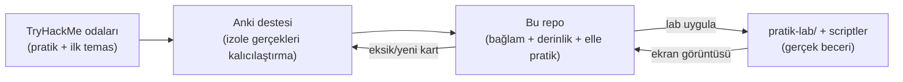

# 🧭 Bu Repo Nasıl Çalışılır?

Bu dosya, deponun **kullanım kılavuzudur**. İçeriğe dalmadan önce buradaki öğrenme modelini bir kez okursan, geri kalan ~60 dosyadan çok daha fazla verim alırsın. Repo bir "oku-geç" ders notu değil; **aktif çalışılan bir laboratuvar defteri** olarak tasarlandı.

---

## 1. Dört katmanlı derinlik modeli

Bu depodaki her önemli kavram, bir Anki kartının yüzeyselliğinden kaçınmak için dört katmanda işlenir. Yeni bir konu okurken bu dört soruyu kendine sor; bir kavramı gerçekten "bildiğin" ancak dördünü de cevaplayabildiğinde olur.

| Katman | Soru | Ne işe yarar |
|--------|------|--------------|
| **(a) Ne?** | Tanım / mekanizma nedir? | Kavramı adlandırır, sınırlarını çizer. |
| **(b) Neden?** | Bu kavram hangi problemi çözmek için var? | Ezberi anlama dönüştürür; "gereksiz detay" hissini yok eder. |
| **(c) Nüans** | Sık karıştırılan / yanlış anlaşılan ince ayrım nedir? | Mülakatta ve gerçek olayda seni acemiden ayıran katman. |
| **(d) Saldırı–savunma kesişimi** | Bu bilgi gerçek bir saldırı veya savunmada nasıl kullanılır? | Teoriyi operasyonel değere bağlar. |

> Bu model, çalışmanın temelini oluşturan Anki destesinin pedagojik omurgasıyla aynıdır. Destede bu katmanlar `KAVRAM`, `NEDEN`, `NÜANS`, `KESİŞİM` etiketleriyle ayrılmıştı; burada düzyazıya açıldı.

**Örnek — "broadcast adresi" kavramı bu modelle:**
- **(a) Ne?** Alt ağdaki host bitlerinin tamamı 1 olan adres (`192.168.1.0/24` → `192.168.1.255`).
- **(b) Neden?** Bir alt ağdaki *tüm* cihazlara aynı anda paket ulaştırmak için tek bir hedef adrese ihtiyaç vardır.
- **(c) Nüans** Broadcast adresi hiçbir host'a atanamaz — bu yüzden kullanılabilir host formülünde `-2` (ağ + broadcast) çıkarılır. Ama `/31` bunun bilinçli istisnasıdır (RFC 3021).
- **(d) Kesişim** Saldırgan, `ping` ile broadcast adresine paket göndererek (smurf saldırısı) ağdaki tüm cihazları tek pakette uyandırıp trafik amplifikasyonu yapabilir; savunmada yönlendiriciler "directed broadcast"i varsayılan olarak kapatır.

---

## 2. Repo ↔ Anki ↔ TryHackMe: üç kaynağı birlikte kullanma

Bu üç kaynak birbirinin yerine değil, **birbirini tamamlayacak** şekilde tasarlandı:



- **TryHackMe** ilk temas ve rehberli pratiği verir.
- **Anki** izole gerçekleri (portlar, formüller, kısaltmalar) uzun vadede hafızada tutar.
- **Bu repo** o gerçekleri bağlama oturtur, aralarındaki ilişkiyi kurar ve Anki'nin *kasıtlı olarak* kart yapmadığı elle becerileri (subnetting çözme, script yazma, log okuma) geliştirdiğin yerdir.

---

## 3. `pratik-lab/` klasörleri ve scriptler nasıl kullanılır

Modüllerin çoğunda bir `pratik-lab/` klasörü veya `pratik-scriptler/` bulunur. Buradaki dosyalar **okumak için değil, yapmak için** vardır:

1. Dosyadaki adımları kendi makinende (veya bir VM'de) uygula.
2. Ekran görüntüsü istenen yerlerde (`> 📸 EKRAN GÖRÜNTÜSÜ EKLENECEK` notu) kendi çıktını al, `assets/screenshots/` altına koy ve markdown linkini güncelle.
3. `.py` scriptlerini çalıştır, kırıp yeniden yaz, genişlet. `15-projeler/` bunların portföy-kalite versiyonlarını üretmeni öneriyor.

> **Güvenlik/etik hatırlatması:** Tarama, sömürü ve şifre kırma araçlarını **yalnızca kendine ait veya açıkça izin verilmiş sistemlerde** kullan. Detay için [10-pentest-metodolojisi/metodoloji-ve-rules-of-engagement.md](../10-pentest-metodolojisi/metodoloji-ve-rules-of-engagement.md).

---

## 4. Terminoloji ve dil kuralı

- Ana metin Türkçedir; teknik terim ilk geçtiğinde İngilizce bırakılıp yanına Türkçe karşılık parantez içinde verilir: "en az ayrıcalık (least privilege)".
- Tüm terimlerin tek-yerde tanımı [terminoloji-sozlugu.md](terminoloji-sozlugu.md) dosyasındadır; dosyalar gerektiğinde oraya link verir.
- Kod ve komut blokları dil etiketlidir (` ```bash `, ` ```python `). Syntax'tan emin olunmayan komutlarda **"doğrulanmalı"** notu bulunur.

---

## 5. Önerilen çalışma sırası

Modüller numaralandırılmış sırayla ilerlemek üzere tasarlandı, ama bağımsız da okunabilir. Tam sıra, tahmini süreler ve TryHackMe path eşlemesi için → [ROADMAP.md](../ROADMAP.md).

**Kısa versiyon:** `00 → 01 → 02 → 03` (temel), sonra `04, 05, 06, 07` (çekirdek güvenlik alanları), ardından `08–13` (yönetişim, savunma, uygulama), en son `14–15` (otomasyon + projeler).
