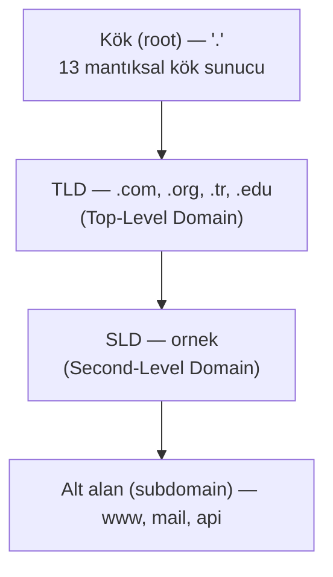
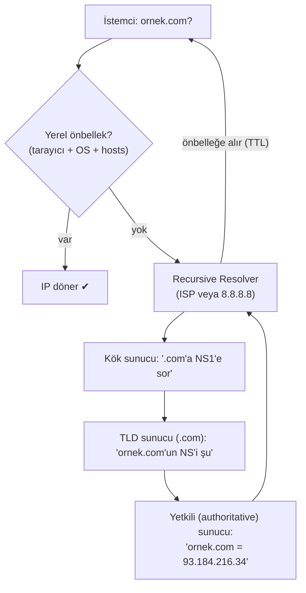

# 🔎 DNS Derinlemesine

DNS (Domain Name System), internetin "telefon rehberidir": insanların okuduğu alan adlarını (`ornek.com`) makinelerin kullandığı IP adreslerine (`93.184.216.34`) çevirir. Neredeyse her ağ işlemi bir DNS sorgusuyla başladığı için, DNS hem operasyonun kalbi hem saldırının en sevdiği hedeftir.

> Ön koşul: [tcp-ip-protokoller.md](tcp-ip-protokoller.md) (port 53). E-posta güvenliğiyle bağlantısı: [phishing-analizi.md](../12-sosyal-muhendislik-phishing/phishing-analizi.md) (SPF/DKIM/DMARC de DNS kayıtlarıdır).

---

## 1. Neden DNS var?

İnsan `172.217.16.206` gibi sayıları hatırlayamaz; `google.com` hatırlar. Ayrıca IP adresleri değişebilir (sunucu taşınır, yük dengelenir) ama alan adı sabit kalır. DNS bu iki dünyayı ayırarak **dolaylılık (indirection)** sağlar: adı değiştirmeden arkasındaki IP'yi değiştirebilirsin. Bu esneklik, CDN, yük dengeleme ve failover'ın temelidir. DNS'in temel kavramları ve mimarisi [RFC 1034](https://www.rfc-editor.org/rfc/rfc1034), uygulama ayrıntıları [RFC 1035](https://www.rfc-editor.org/rfc/rfc1035)'te tanımlanır.

---

## 2. Alan adı hiyerarşisi

Bir alan adı sağdan sola, en genelden en özele okunur:



`www.ornek.com.` (sondaki nokta kökü temsil eder) şöyle ayrışır:
- **`.`** → kök (root)
- **`com`** → TLD (Top-Level Domain)
- **`ornek`** → SLD (Second-Level Domain) — genelde satın aldığın kısım
- **`www`** → alt alan (subdomain / host)

---

## 3. DNS kayıt türleri

| Kayıt | Amaç | Örnek |
|-------|------|-------|
| **A** | Alan adı → IPv4 | `ornek.com → 93.184.216.34` |
| **AAAA** | Alan adı → IPv6 | `ornek.com → 2606:2800:220:1:...` |
| **CNAME** | Takma ad → başka alan adı | `www.ornek.com → ornek.com` |
| **MX** | E-posta sunucusu (Mail eXchange) | `ornek.com → mail.ornek.com (öncelik 10)` |
| **NS** | Bu alanın yetkili isim sunucusu | `ornek.com → ns1.saglayici.com` |
| **TXT** | Serbest metin (doğrulama, SPF/DKIM/DMARC) | `v=spf1 include:_spf.google.com ~all` |
| **PTR** | IP → alan adı (ters çözümleme) | `34.216.184.93.in-addr.arpa → ornek.com` |
| **SOA** | Bölge (zone) yetki/seri bilgisi | zone başına bir tane |
| **SRV** | Servis konumu (port dahil) | `_sip._tcp.ornek.com` |

> 📌 **Güvenlik bağlantısı:** SPF, DKIM ve DMARC birer **TXT/özel kayıttır**. E-posta sahteciliğini (spoofing) önlemenin temeli DNS'te yaşar — detay [phishing-analizi.md](../12-sosyal-muhendislik-phishing/phishing-analizi.md).

---

## 4. DNS çözümleme süreci (resolution)

Bir alan adını çözmek, birden çok sunucuya sırayla sormaktır. Bilgisayarın "boş, kimse bilmiyor" durumundaki tam yol (özyinelemeli çözümleme):



**Adımlar:**
1. **Önbellek kontrolü:** Tarayıcı → işletim sistemi → yerel `hosts` dosyası → resolver önbelleği. Bulunursa iş biter.
2. **Recursive resolver** (ISP'nin veya `8.8.8.8`/`1.1.1.1`) devreye girer; senin adına tüm zinciri gezer.
3. **Kök sunucu** hangi TLD sunucusuna gidileceğini söyler.
4. **TLD sunucu** (`.com`) alanın yetkili sunucusunu (NS) söyler.
5. **Yetkili (authoritative) sunucu** nihai cevabı (A kaydı) verir.
6. Resolver cevabı **TTL** (Time To Live) süresince önbelleğe alır ve istemciye döner.

### Elle sorgulama komutları

```bash
# dig — en detaylı (Linux/macOS)
dig ornek.com A          # A kaydını sorgula
dig ornek.com MX         # e-posta sunucularını gör
dig ornek.com TXT        # SPF/DKIM/DMARC görmek için
dig +short ornek.com     # sadece sonucu
dig @8.8.8.8 ornek.com   # belirli bir resolver'a sor

# nslookup — Windows + çapraz platform
nslookup ornek.com
nslookup -type=MX ornek.com

# ters çözümleme (IP -> ad)
dig -x 93.184.216.34
```

---

## 5. DNS güvenliği: saldırılar ve savunmalar

DNS varsayılan olarak **UDP/53** üzerinden **şifresiz** çalışır. Bu, onu klasik bir zayıf halka yapar.

### Başlıca saldırılar
- **DNS önbellek zehirleme (cache poisoning):** Resolver'ın önbelleğine sahte kayıt sokup kurbanı yanlış (saldırgan) IP'ye yönlendirme. → Kullanıcı `banka.com` yazar, saldırganın sahte sitesine gider.
- **DNS spoofing:** Sahte DNS cevabı enjekte etme (özellikle açık Wi-Fi'de).
- **DNS tünelleme (tunneling):** Veriyi DNS sorgularının içine gizleyip firewall'dan sızdırma — çoğu ağ DNS'i serbest bıraktığı için etkili bir kaçış (exfiltration) kanalı. IOC: anormal uzun/çok sayıda TXT sorgusu.
- **Domain fronting / fast-flux:** C2 altyapısını gizlemek için hızla değişen IP'ler.
- **Alt alan sayımı (subdomain enumeration):** Saldırgan keşif aşamasında `dig`, `dnsrecon`, `amass` ile alt alanları listeleyip saldırı yüzeyini haritalar → [kesif-enumerasyon.md](../10-pentest-metodolojisi/kesif-enumerasyon.md).

### Savunmalar
| Savunma | Ne yapar |
|---------|----------|
| **DNSSEC** | DNS cevaplarını dijital imzayla doğrular → zehirlemeyi/spoofing'i kırar (ama gizlilik sağlamaz). |
| **DoH / DoT** | DNS over HTTPS/TLS — sorguyu şifreler, gizliliği ve bütünlüğü artırır. |
| **DNS filtreleme (RPZ)** | Bilinen kötü alan adlarını (malware C2, phishing) engeller — ucuz ve etkili bir savunma katmanı. |
| **DNS log izleme** | SOC'ta anormal sorguları (tünelleme, DGA alan adları) tespit → [log-analizi.md](../11-soc-mavi-takim/log-analizi.md). |

---

## 6. Nüans: TTL ve önbellek gecikmesi

Bir DNS kaydını değiştirdiğinde, değişiklik **anında** yayılmaz. Eski cevap dünyanın dört bir yanındaki resolver'larda **TTL süresi** boyunca önbellekte kalır. Bu yüzden bir sunucu taşımasından önce TTL düşürülür ("düşük TTL'e çek, taşı, sonra yükselt"). Güvenlik açısından bu, zehirlenmiş bir kaydın da TTL boyunca kalıcı olması demektir.

---

## 7. Saldırı–savunma kesişimi (özet)

- DNS logları savunmanın altın madenidir: hemen her zararlı yazılım C2'sine ulaşmak için önce DNS sorgusu yapar. Zararlının alan adını yakalamak, tespitin en erken noktasıdır.
- Saldırgan için DNS hem keşif aracı (alt alan sayımı) hem sızdırma kanalıdır (tünelleme).
- `hosts` dosyası (`/etc/hosts`, `C:\Windows\System32\drivers\etc\hosts`) DNS'ten önce gelir → zararlı yazılım burayı değiştirerek kurbanı sessizce yönlendirebilir; bu dosyanın bütünlüğünü izlemek klasik bir savunmadır.

> **Sonraki:** [http-web-iletisimi.md](http-web-iletisimi.md).
