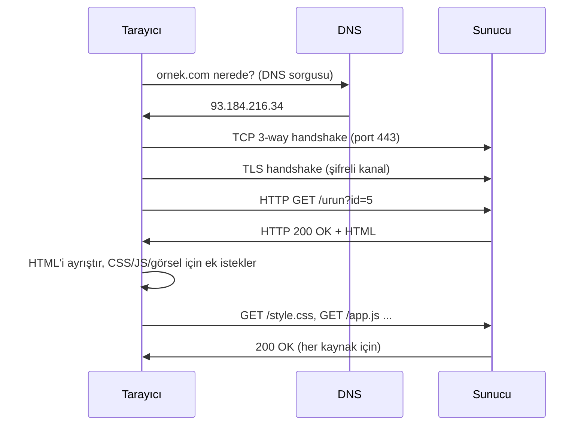

# 🌍 HTTP ve Web İletişimi

HTTP (HyperText Transfer Protocol), web'in konuştuğu dildir. Bir tarayıcıya adres yazmakla bir sayfanın gelmesi arasında geçen her şey HTTP'dir. Web güvenliğinin tamamı ([04-web-guvenligi](../04-web-guvenligi/web-mimarisi.md)) bu protokolün üstüne kurulduğu için, mekanizmasını iyi anlamak şart.

> Ön koşul: [tcp-ip-protokoller.md](tcp-ip-protokoller.md) (port 80/443). Devamı: [04-web-guvenligi](../04-web-guvenligi/web-mimarisi.md).

---

## 1. "Bir siteyi açmak" gerçekte ne demek?

`https://ornek.com/urun?id=5` yazıp Enter'a bastığında olan zincir:



1. **DNS çözümleme** → [dns-derinlemesine.md](dns-derinlemesine.md)
2. **TCP el sıkışması** (port 80 veya 443)
3. **TLS el sıkışması** (HTTPS ise) → şifreli kanal kurulur ([anahtar-degisimi-ve-imza.md](../05-kriptografi/anahtar-degisimi-ve-imza.md))
4. **HTTP isteği** gönderilir, **yanıt** gelir
5. Tarayıcı HTML'i ayrıştırır, gömülü kaynaklar (CSS/JS/görsel) için **ek istekler** yapar

---

## 2. HTTP istek/yanıt yapısı

HTTP, istek-yanıt (request-response) döngüsüne dayanır. İstemci ister, sunucu yanıtlar.

### İstek (request)
```http
GET /urun?id=5 HTTP/1.1
Host: ornek.com
User-Agent: Mozilla/5.0
Accept: text/html
Cookie: session=abc123
```
- **Metod satırı:** `GET /yol HTTP/1.1`
- **Başlıklar (headers):** `Host`, `User-Agent`, `Cookie`, `Authorization`...
- **Gövde (body):** POST/PUT'ta veri (form, JSON).

### Yanıt (response)
```http
HTTP/1.1 200 OK
Content-Type: text/html; charset=utf-8
Set-Cookie: session=abc123; HttpOnly; Secure; SameSite=Strict
Content-Length: 1274

<!DOCTYPE html>...
```

---

## 3. HTTP metodları

| Metod | Amaç | İdempotent? | Güvenlik notu |
|-------|------|:-----------:|---------------|
| **GET** | Veri getir | Evet | Parametreler URL'de → loglarda görünür, hassas veri koyma. |
| **POST** | Veri gönder/oluştur | Hayır | Gövdede veri; CSRF hedefi. |
| **PUT** | Kaynağı oluştur/değiştir | Evet | Yetkisiz açıksa dosya yükleme riski. |
| **DELETE** | Kaynağı sil | Evet | Erişim kontrolü kritik. |
| **PATCH** | Kısmi güncelleme | Hayır | — |
| **HEAD** | Sadece başlıkları getir | Evet | Keşifte kullanılır. |
| **OPTIONS** | Desteklenen metodları sor | Evet | CORS ön-uçuş (preflight) isteği. |

---

## 4. HTTP durum kodları (status codes)

| Aralık | Sınıf | Örnekler |
|--------|-------|----------|
| **1xx** | Bilgi | 100 Continue |
| **2xx** | Başarı | **200** OK, 201 Created, 204 No Content |
| **3xx** | Yönlendirme | 301 Kalıcı, 302 Geçici, 304 Not Modified |
| **4xx** | İstemci hatası | **400** Bad Request, **401** Unauthorized, **403** Forbidden, **404** Not Found, 429 Too Many Requests |
| **5xx** | Sunucu hatası | **500** Internal Error, 502 Bad Gateway, 503 Unavailable |

> 🔍 **Kesişim:** Bir pentester bu kodları okuyarak keşif yapar. `403` → var ama erişim yok (ilginç), `404` → yok, `401` → kimlik doğrulama gerekiyor, `500` → sunucu bir girdiyle patladı (enjeksiyon ipucu). `401` ile `403` farkı: 401 = "kim olduğunu kanıtla", 403 = "kim olduğunu biliyorum ama iznin yok".

---

## 5. Çerezler (cookies) ve oturum yönetimi

HTTP **durumsuzdur (stateless)**: her istek bağımsızdır, sunucu seni "hatırlamaz". Oturumu (kimin giriş yaptığını) sürdürmek için **çerezler** kullanılır.

1. Giriş yaparsın → sunucu `Set-Cookie: session=abc123` döner.
2. Tarayıcı bu çerezi saklar, sonraki her isteğe otomatik ekler.
3. Sunucu çereze bakıp seni tanır.

### Kritik çerez güvenlik bayrakları
| Bayrak | Ne yapar | Neyi önler |
|--------|----------|-----------|
| **HttpOnly** | JS'in çereze erişimini engeller | XSS ile çerez çalınmasını |
| **Secure** | Çerezi sadece HTTPS üzerinden gönderir | Ağda düz metin sızıntısını |
| **SameSite** | Çerezi siteler-arası isteklerde kısıtlar | CSRF saldırılarını |

> Bu üç bayrak, [xss.md](../04-web-guvenligi/zafiyet-siniflari/xss.md) ve [csrf-ssrf.md](../04-web-guvenligi/zafiyet-siniflari/csrf-ssrf.md) savunmalarının temelidir.

---

## 6. HTTP vs HTTPS ve önemli güvenlik başlıkları

- **HTTP (port 80):** Düz metin. Aradaki herkes (açık Wi-Fi, ISP, saldırgan) trafiği okur/değiştirir.
- **HTTPS (port 443):** TLS ile şifreli. Gizlilik + bütünlük + sunucu kimliği (sertifika → [pki-x509.md](../05-kriptografi/pki-x509.md)).

### Güvenlik başlıkları (security headers)
| Başlık | Koruma |
|--------|--------|
| `Strict-Transport-Security` (HSTS) | Tarayıcıyı hep HTTPS'e zorlar (SSL stripping'i önler). |
| `Content-Security-Policy` (CSP) | Hangi kaynaklardan script yükleneceğini kısıtlar → XSS azaltır. |
| `X-Frame-Options` | Sayfanın iframe'e gömülmesini engeller → clickjacking. |
| `X-Content-Type-Options: nosniff` | MIME tür tahminini kapatır. |

```bash
# Bir sitenin başlıklarını incele
curl -I https://ornek.com

# Tam istek/yanıtı gör (verbose)
curl -v https://ornek.com/urun?id=5
```

---

## 7. Nüans: durumsuzluk (statelessness) yanılgısı

HTTP durumsuz olduğu halde web uygulamaları "durumlu" hissettirir (giriş, sepet). Bu illüzyon tamamen **çerez/token** ile kurulur. Güvenlik açısından kritik sonuç: **kimlik, her istekte yeniden kanıtlanmak zorundadır**. Sunucu "bu istek gerçekten o oturumdan mı geliyor?" sorusunu her seferinde sormalıdır — bu sağlanmazsa oturum ele geçirme (session hijacking), IDOR ve yetki atlama doğar → [idor-erisim-kontrolu.md](../04-web-guvenligi/zafiyet-siniflari/idor-erisim-kontrolu.md).

---

## 8. Saldırı–savunma kesişimi

- **Burp Suite** tam olarak bu istek/yanıt döngüsünü araya girip (proxy) yakalar, değiştirir, tekrarlar → [burp-suite-rehberi.md](../04-web-guvenligi/burp-suite-rehberi.md). HTTP'yi bilmeyen Burp'ü kullanamaz.
- Web zafiyetlerinin büyük kısmı, sunucunun **istemciden gelen veriye güvenmesinden** doğar (başlıklar, çerezler, parametreler istemci tarafından değiştirilebilir). Altın kural: **"asla istemciye güvenme"**.
- `User-Agent`, `Referer`, `X-Forwarded-For` gibi başlıklar sahtelenebilir; bunlara dayalı güvenlik kararı (ör. IP kısıtlama) atlatılabilir.

> **Sonraki:** [routing-nat-vpn.md](routing-nat-vpn.md).
