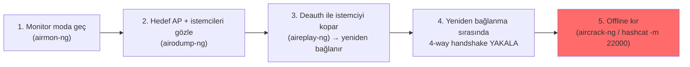
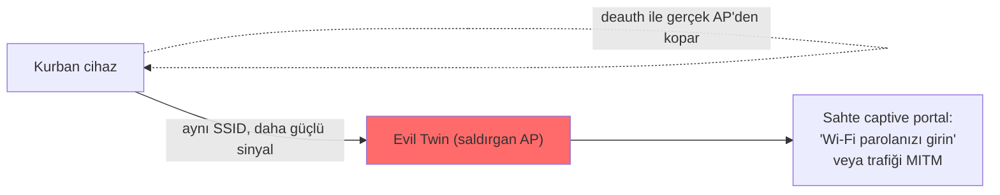

# 📶 Kablosuz Ağ Güvenliği (Wi-Fi)

Kablosuz ağlar, kablolu ağlardan temel bir farkla ayrılır: **iletim ortamı havadır ve herkese açıktır.** Kablolu ağda dinlemek için fiziksel erişim gerekir; Wi-Fi'de menzildeki herkes paketleri yakalayabilir. Bu dosya, Wi-Fi saldırılarının **neden ve nasıl** çalıştığını persona düzeyinde kurar (radyo frekansı/802.11 çerçeve iç yapısı gibi uzman ayrıntılarına girmeden).

> Ön koşul: [temel-kavramlar.md](temel-kavramlar.md) (AP, MAC, MITM), [pratik-lab/paket-analizi-wireshark.md](pratik-lab/paket-analizi-wireshark.md) (yakalama). Offline kırma bağı: [../05-kriptografi/pratik-lab/hash_kirma_john_hashcat.md](../05-kriptografi/pratik-lab/hash_kirma_john_hashcat.md).

> ⚠️ Wi-Fi saldırıları yalnızca **kendi ağında** veya açık izinli ortamda denenir. Başkasının ağına saldırmak/dinlemek yasa dışıdır ([../10-pentest-metodolojisi/metodoloji-ve-rules-of-engagement.md](../10-pentest-metodolojisi/metodoloji-ve-rules-of-engagement.md)).

---

## 1. Wi-Fi güvenlik protokollerinin evrimi

| Protokol | Durum | Not |
|----------|-------|-----|
| **WEP** | 🔴 Tamamen kırık | RC4 + zayıf IV; dakikalar içinde kırılır. Asla kullanma. |
| **WPA** | 🔴 Zayıf | TKIP; WEP'e geçici yama, artık güvensiz. |
| **WPA2** | 🟡 Yaygın standart | AES-CCMP; güçlü ama zayıf parola + handshake yakalama ile offline kırılabilir. |
| **WPA3** | 🟢 Modern | SAE (Dragonfly) el sıkışması; offline kırmaya dayanıklı, ileri gizlilik. |

Çoğu ağ hâlâ **WPA2-Personal** (PSK — ön paylaşımlı anahtar) kullanır, ve bu dosyanın ana saldırısı buna yöneliktir.

---

## 2. WPA2'nin zayıf noktası: 4-way handshake yakalama → offline kırma

WPA2-PSK'de bir istemci ağa bağlanırken, AP ile arasında **4-way handshake** gerçekleşir. Bu el sıkışma, parolanın (PSK) kendisini göndermez — ama parola + ağ bilgilerinden türetilen bir doğrulama değeri (MIC) içerir. Saldırgan bu handshake'i yakalarsa, parolayı **offline** tahmin edebilir: bir aday parolayı aynı türetmeden geçirip yakalanan MIC ile karşılaştırır.



```bash
# 1. Kablosuz kartı monitor moduna al (havayı dinleyebilmek için)
sudo airmon-ng start wlan0                # wlan0mon oluşur

# 2. Çevredeki ağları ve bağlı istemcileri gözle (kanal, BSSID, istemci MAC)
sudo airodump-ng wlan0mon

# 3. Belirli AP'yi hedefleyip handshake'i dosyaya yaz
sudo airodump-ng -c 6 --bssid AA:BB:CC:DD:EE:FF -w yakalama wlan0mon

# 4. (başka terminalde) bir istemciyi zorla kopar → yeniden bağlanınca handshake düşer
sudo aireplay-ng --deauth 5 -a AA:BB:CC:DD:EE:FF -c <istemci_MAC> wlan0mon

# 5. Yakalanan handshake'i offline kır (sözlük saldırısı)
aircrack-ng -w rockyou.txt yakalama-01.cap
# veya hashcat (WPA/WPA2 modu 22000, .hc22000'e çevirdikten sonra)
hashcat -m 22000 yakalama.hc22000 rockyou.txt
```

> **Neden çalışır ve savunmanın kalbi:** Handshake yakalandıktan sonra kırma tamamen **offline**'dır — AP'nin haberi olmaz, deneme sınırı/kilitlenme yoktur ([../10-pentest-metodolojisi/somuru-ve-sonrasi.md](../10-pentest-metodolojisi/somuru-ve-sonrasi.md) §1.5 online vs offline). Yani WPA2'nin güvenliği **tamamen parolanın gücüne** bağlıdır: `rockyou.txt`'te olan zayıf bir Wi-Fi parolası ([../05-kriptografi/pratik-lab/hash_kirma_john_hashcat.md](../05-kriptografi/pratik-lab/hash_kirma_john_hashcat.md)) saniyeler/dakikalar içinde düşer; uzun rastgele bir parola pratikte kırılamaz. **Bu, offline kırma temasının** (hash → sessiz/hızlı kırma) **kablosuza uygulanmış hâlidir.**

### Deauth neden mümkün? (nüans)
WPA2'de veri şifreli olsa da, **yönetim çerçeveleri (management frames)** — özellikle deauthentication — WPA2'de kimlik doğrulanmaz. Saldırgan, AP adına "bağlantını kes" çerçevesi göndererek istemciyi koparabilir (spoofing). Bu hem handshake yakalamayı tetikler hem de bir **hizmet reddi (DoS)** aracıdır. WPA3 ve 802.11w (Protected Management Frames) bu boşluğu kapatır.

---

## 3. Evil twin (kötü ikiz) ve rogue AP

Parolayı kırmak yerine, saldırgan **kurbanı kendi sahte AP'sine çekebilir**. Evil twin, meşru ağla **aynı SSID'yi** (ağ adını) yayınlayan sahte bir erişim noktasıdır ([temel-kavramlar.md](temel-kavramlar.md) tablodaki evil twin):



- Saldırgan gerçek AP'yi deauth ile bozarken kendi güçlü sinyalli ikizini yayınlar; cihazlar otomatik olarak "bilinen" SSID'ye (artık sahte olana) bağlanır.
- Sonra ya sahte bir **captive portal** ("ağ parolanızı doğrulayın") ile parolayı toplar, ya da tüm trafiğe **MITM** yapar ([temel-kavramlar.md](temel-kavramlar.md)) — düz metin kimlik bilgilerini [pratik-lab/paket-analizi-wireshark.md](pratik-lab/paket-analizi-wireshark.md)'deki gibi okur.

> **Kesişim:** Evil twin, ARP zehirlemenin ([temel-kavramlar.md](temel-kavramlar.md)) kablosuz karşılığıdır — ikisi de saldırganı **MITM konumuna** getirir ve TLS'in ([../05-kriptografi/pki-x509.md](../05-kriptografi/pki-x509.md)) neden zorunlu olduğunu gösterir: trafik şifreliyse, evil twin bile içeriği okuyamaz (ama captive portal ile parolayı hâlâ kandırabilir — insan katmanı → [../12-sosyal-muhendislik-phishing/phishing-analizi.md](../12-sosyal-muhendislik-phishing/phishing-analizi.md)).

---

## 4. Açık ağlar ve diğer riskler

- **Açık (şifresiz) Wi-Fi:** Tüm trafik düz metin havada uçar; menzildeki herkes yakalayabilir ([pratik-lab/paket-analizi-wireshark.md](pratik-lab/paket-analizi-wireshark.md)). Kafe/otel Wi-Fi'sinde HTTPS olmayan her şey açıktır. Savunma: VPN ([routing-nat-vpn.md](routing-nat-vpn.md)) ile tünelleme.
- **WPS (Wi-Fi Protected Setup):** Kolaylık için eklenen PIN mekanizması, tasarım hatası nedeniyle brute-force'a açıktır (Reaver/Pixie Dust). Kapatılmalı.
- **PMKID saldırısı:** Bazı AP'lerde istemci bağlanmasa bile handshake beklemeden hash elde edilebilir (client-less) — deauth gürültüsü olmadan daha sessiz.

---

## 5. WPA3'ün getirdiği

WPA3, WPA2'nin offline-kırma zayıflığını **SAE (Simultaneous Authentication of Equals / Dragonfly)** el sıkışmasıyla kapatır: parola artık yakalanıp offline denenemez (her deneme AP ile canlı etkileşim gerektirir → online'a döner, kilitlenebilir). Ayrıca ileri gizlilik ([../05-kriptografi/anahtar-degisimi-ve-imza.md](../05-kriptografi/anahtar-degisimi-ve-imza.md)) ve korunan yönetim çerçeveleri (deauth'a karşı) sağlar. Yine de geçiş (transition) modları ve uygulama hataları (ör. Dragonblood zafiyetleri) nüanslar barındırır.

---

## 6. Saldırı–savunma kesişimi (özet)

- **Wi-Fi güvenliği = parola gücü + protokol:** WPA2'de zincir, parolanın gücü kadar güçlüdür (offline kırma). Uzun rastgele parola + WPA3, en etkili savunmadır.
- **Ortak temalar:** Handshake yakalama→offline kırma (offline kırma teması → [../05-kriptografi/pratik-lab/hash_kirma_john_hashcat.md](../05-kriptografi/pratik-lab/hash_kirma_john_hashcat.md)); evil twin→MITM (ARP zehirleme teması → [temel-kavramlar.md](temel-kavramlar.md)); açık ağ dinleme→şifreleme gereği (TLS/VPN → [../05-kriptografi/pki-x509.md](../05-kriptografi/pki-x509.md)). Wi-Fi, bu repodaki üç büyük temayı (offline kırma, MITM, şifreleme zorunluluğu) tek bir fiziksel katmanda birleştirir.
- **Kurumsal:** WPA2/3-Enterprise (802.1X/RADIUS), PSK yerine bireysel kimlik doğrulama kullanır — PSK'nin "herkes aynı parolayı bilir" zaafını çözer, [06-iam](../06-kimlik-erisim-yonetimi-iam/aaa-ve-mfa.md) ilkeleriyle bağlanır.

> **Not (kapsam):** Bu dosya Wi-Fi saldırılarının mantığını persona düzeyinde kurar; RF/anten mühendisliği, 802.11 çerçeve iç yapısı ve gelişmiş kablosuz operasyonlar uzman (kablosuz güvenlik uzmanı) alanıdır → [../15-projeler/spesifikasyon-sonrasi-yol-haritasi.md](../15-projeler/spesifikasyon-sonrasi-yol-haritasi.md).
