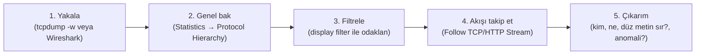

# 🦈 Pratik Lab: Paket Analizi (Wireshark & tcpdump)

Protokolleri teoride öğrendin ([../tcp-ip-protokoller.md](../tcp-ip-protokoller.md), [../temel-kavramlar.md](../temel-kavramlar.md)); bu lab, o teorinin **telde nasıl göründüğünü** okumayı öğretir. Paket analizi, bir hacker'ın "sistemi gerçekten anlaması"nın somut testidir: bir TCP el sıkışmasını, bir DNS sorgusunu, düz metin bir parolayı ham baytlarda tanıyabilmek. Hem saldırı (dinleme/sniffing) hem savunma (SOC/forensics → [../../11-soc-mavi-takim/dijital-forensics.md](../../11-soc-mavi-takim/dijital-forensics.md)) tarafında çekirdek beceridir.

> ⚠️ Trafik yakalama, yalnızca kendine ait ağda veya izinli ortamda yapılır — başkasının trafiğini dinlemek (sniffing) çoğu yerde yasa dışıdır ([../../10-pentest-metodolojisi/metodoloji-ve-rules-of-engagement.md](../../10-pentest-metodolojisi/metodoloji-ve-rules-of-engagement.md)). Pratik için: kendi makinen, kendi lab VM'lerin arası, veya hazır örnek `.pcap` dosyaları (Wireshark örnek yakalamaları).

---

## 1. İki araç: tcpdump (CLI) ve Wireshark (GUI)

- **tcpdump:** Komut satırı, sunucuda/uzakta hızlı yakalama. Yakala, dosyaya yaz, sonra Wireshark'ta aç.
- **Wireshark:** Grafik arayüz, derin protokol çözümleme (dissection), akış takibi, renklendirme. Analiz için ideal.
- **tshark:** Wireshark'ın CLI sürümü (ikisinin arası).

```bash
# tcpdump ile yakala ve dosyaya yaz (sonra Wireshark'ta aç)
sudo tcpdump -i eth0 -w yakalama.pcap          # arayüz eth0'ı dosyaya yaz
sudo tcpdump -i eth0 -n port 80                # canlı, HTTP, isim çözümü kapalı (-n)
sudo tcpdump -i eth0 -n host 10.10.10.5        # sadece bir host
```
> `-n` (isim çözümü kapalı) önemlidir: yoksa tcpdump her IP için DNS sorgusu yapıp hem yavaşlar hem kendi gürültüsünü yakalamaya karıştırır.

---

## 2. Filtreler: capture vs display (kritik ayrım)

Wireshark'ta iki farklı filtre türü vardır ve karıştırılırlar:

| | Capture filter (yakalama) | Display filter (görüntüleme) |
|---|---------------------------|------------------------------|
| Ne zaman | Yakalama **sırasında** — neyin kaydedileceğini sınırlar | Yakalama **sonrası** — kaydı süzer |
| Söz dizimi | BPF (`tcp port 80`) | Wireshark (`tcp.port == 80`) |
| Geri alınır mı | Hayır (yakalanmayan gitmiştir) | Evet (tüm veri durur, sadece görünüm süzülür) |

```text
# Capture filter (BPF) örnekleri:
host 10.10.10.5
tcp port 443
not arp and not port 53

# Display filter (Wireshark) örnekleri:
ip.addr == 10.10.10.5
tcp.port == 80
http.request.method == "POST"
dns.qry.name contains "evil"
tcp.flags.syn == 1 and tcp.flags.ack == 0     # sadece SYN paketleri (tarama tespiti)
```
> **Pratik kural:** Yoğun bir ağda **capture filter** ile gürültüyü baştan azalt (yoksa dosya devleşir); sonra **display filter** ile analiz sırasında odaklan.

---

## 3. TCP üçlü el sıkışmasını telde görmek

[../tcp-ip-protokoller.md](../tcp-ip-protokoller.md)'de teorisini kurduğun 3-way handshake, Wireshark'ta tam olarak üç pakettir. `tcp.flags` display filtresiyle izole edip bayrakları oku:

```text
No.  Kaynak        Hedef         Protokol  Bilgi
1    10.10.14.2 →  10.10.10.5    TCP       [SYN] Seq=0
2    10.10.10.5 →  10.10.14.2    TCP       [SYN, ACK] Seq=0 Ack=1
3    10.10.14.2 →  10.10.10.5    TCP       [ACK] Seq=1 Ack=1
```
`SYN` → `SYN, ACK` → `ACK`: teorinin telde doğrulanması. Bir **port taramasını** ([../../10-pentest-metodolojisi/kesif-enumerasyon.md](../../10-pentest-metodolojisi/kesif-enumerasyon.md)) burada tanırsın: SYN gönderilip `SYN,ACK` dönerse port açık; `RST,ACK` dönerse kapalı. Tek IP'den yüzlerce farklı porta hızlı SYN → tarama (SOC için IOA → [../../11-soc-mavi-takim/log-analizi.md](../../11-soc-mavi-takim/log-analizi.md)).

---

## 4. "Follow TCP Stream" — konuşmayı bütün görmek

Wireshark'ın en güçlü özelliği: bir pakete sağ tıkla → **Follow → TCP Stream**. Bu, dağınık paketleri tek bir **konuşma** olarak birleştirir (istemci kırmızı, sunucu mavi). Bir HTTP isteğini/yanıtını, bir FTP oturumunu tam olarak okursun.

> **Kesişim — düz metin kimlik bilgileri:** Şifresiz protokoller ([../tcp-ip-protokoller.md](../tcp-ip-protokoller.md)) kimlik bilgilerini **açıkça** taşır. Follow Stream ile bir HTTP POST, FTP veya Telnet oturumunda parolayı düz görürsün:
```text
# FTP oturumu (port 21) — Follow TCP Stream çıktısı:
220 Welcome to FTP server
USER admin
331 Password required
PASS S3cretP@ss           <-- parola DÜZ METİN
230 Login successful
```
```text
# Display filter ile HTTP POST parolalarını yakala:
http.request.method == "POST"
```
Bu, HTTPS/TLS'in ([../../05-kriptografi/anahtar-degisimi-ve-imza.md](../../05-kriptografi/anahtar-degisimi-ve-imza.md)) neden zorunlu olduğunu **gözle kanıtlar**: TLS'li trafikte Follow Stream sadece şifreli baytlar gösterir, parola görünmez. Bir MITM konumundaki ([../temel-kavramlar.md](../temel-kavramlar.md) ARP zehirleme) saldırgan, tam olarak bu düz metin oturumlarını hedefler.

---

## 5. Protokol analizleri: ARP, DNS, DHCP

Modül 01'de teorisini kurduğun yerel ağ protokolleri, pcap'te doğrudan görünür ve **anomalileri** ele verir:

- **ARP** ([../temel-kavramlar.md](../temel-kavramlar.md)): `arp` filtresi. **ARP zehirleme** tespiti: aynı IP için farklı MAC cevapları, veya bir MAC'in çok sayıda "gratuitous ARP" yayınlaması → biri MITM'e giriyor.
- **DNS** ([../dns-derinlemesine.md](../dns-derinlemesine.md)): `dns` filtresi. **Tünelleme/sızdırma** tespiti: anormal uzun/çok sayıda TXT sorgusu, rastgele görünen alt alan adları (`a8f3k2.evil.com`) → DNS tünelleme (malware C2 → [../../11-soc-mavi-takim/malware-analiz.md](../../11-soc-mavi-takim/malware-analiz.md)).
- **DHCP** ([../temel-kavramlar.md](../temel-kavramlar.md)): DORA sürecini (Discover/Offer/Request/Ack) paket paket görürsün; **sahte DHCP** tespiti: birden çok DHCP Offer, beklenmedik sunucudan.

```text
# Şüpheli DNS sorgularını süz
dns.qry.name.len > 40 or dns.qry.type == 16     # uzun adlar veya TXT sorguları
```

---

## 6. Pratik alıştırma akışı



**Kendi lab'ında dene:**
1. İki VM arasında (biri "istemci", biri "sunucu") bir FTP/HTTP oturumu kur, arada yakala.
2. Follow TCP Stream ile kimlik bilgisini düz metin gör → sonra aynısını HTTPS/SFTP ile yapıp farkı gör (şifreli).
3. `Statistics → Conversations` ile en çok konuşan IP'leri, `Statistics → Protocol Hierarchy` ile protokol dağılımını incele — bir olayda "bu makine neyle konuşuyor?" sorusunun cevabı budur.

---

## 7. Saldırı–savunma kesişimi (özet)

- **Saldırı tarafı:** Bir MITM/sniffing konumundaki saldırgan ([../temel-kavramlar.md](../temel-kavramlar.md) ARP zehirleme, [../routing-nat-vpn.md](../routing-nat-vpn.md)) tam da bu araçlarla düz metin kimlik bilgilerini, oturum çerezlerini ([../http-web-iletisimi.md](../http-web-iletisimi.md)) toplar. Açık Wi-Fi'de şifresiz trafik herkese açıktır.
- **Savunma tarafı:** Aynı beceri, forensics ([../../11-soc-mavi-takim/dijital-forensics.md](../../11-soc-mavi-takim/dijital-forensics.md)) ve olay analizinde bir saldırının ağ ayak izini (C2 bağlantısı, veri sızması, tarama) okumak için kullanılır. Network forensics, pcap okumaktır.
- **Ders:** Paket analizi, "şifreleme neden her yerde gerekli" sorusunun en ikna edici kanıtıdır — bir kez düz metin parolayı telde gördüğünde, TLS'i ([../../05-kriptografi/pki-x509.md](../../05-kriptografi/pki-x509.md)) bir daha "opsiyonel" görmezsin.

> **İlgili:** [../tcp-ip-protokoller.md](../tcp-ip-protokoller.md) (teori), [../../11-soc-mavi-takim/dijital-forensics.md](../../11-soc-mavi-takim/dijital-forensics.md) (network forensics), [../../11-soc-mavi-takim/malware-analiz.md](../../11-soc-mavi-takim/malware-analiz.md) (dinamik analizde ağ izleme).
