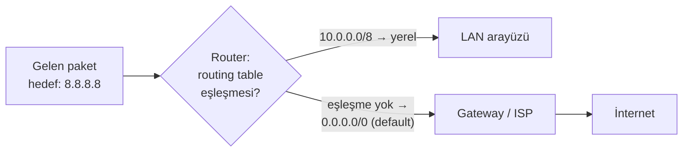
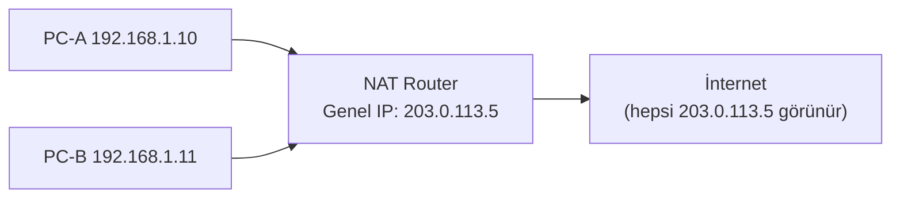
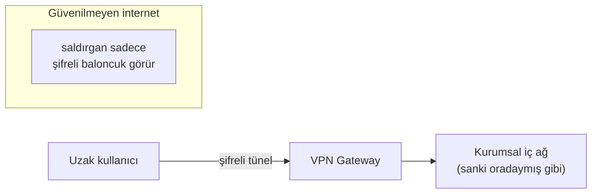
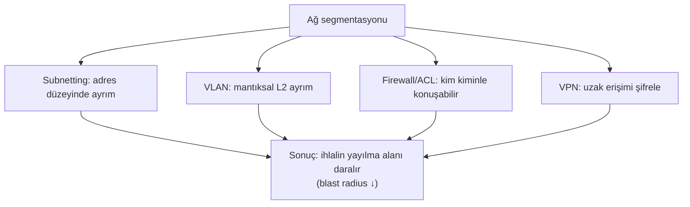

# 🛣️ Yönlendirme, NAT, VPN, VLAN ve Firewall

Bu dosya, paketlerin ağlar *arasında* nasıl dolaştığını (routing), özel IP'lerin internete nasıl çıktığını (NAT), trafiğin nasıl şifreli tünellendiğini (VPN), ağların nasıl mantıksal bölündüğünü (VLAN) ve nasıl filtrelendiğini (firewall) kapsar. Hepsi birlikte **ağ segmentasyonunun** — modern savunmanın temelinin — araç kutusudur.

> Ön koşul: [subnetting-cidr.md](subnetting-cidr.md), [temel-kavramlar.md](temel-kavramlar.md).

---

## 1. Yönlendirme (routing)

Bir router'ın işi tek cümledir: **"bu paketi nereye göndermeliyim?"** Router, hedef IP'yi **yönlendirme tablosundaki (routing table)** kayıtlarla eşleştirir ve en spesifik eşleşmeye (longest prefix match) göre bir sonraki adıma (next hop) yollar.



### Statik vs dinamik yönlendirme
- **Statik:** Yönetici rotaları elle girer. Küçük/öngörülebilir ağlarda; basit ve güvenli ama ölçeklenmez.
- **Dinamik:** Router'lar rotaları protokollerle otomatik öğrenir/paylaşır: **OSPF**, **EIGRP** (iç ağ), **BGP** (internet omurgası). Ölçeklenir ama saldırı yüzeyi açar.

> **Kesişim:** BGP güven temellidir; sahte BGP ilanı (**BGP hijacking**) ile bir saldırgan koca IP bloklarının trafiğini kendine çekebilir (gerçek olaylar yaşandı). Savunma: RPKI ile rota kaynağı doğrulama.

**Longest prefix match nüansı:** Tabloda hem `10.0.0.0/8` hem `10.1.2.0/24` varsa, `10.1.2.5` için **daha spesifik olan `/24` kazanır**. `0.0.0.0/0` (default route) en az spesifiktir; hiçbir şey eşleşmezse kullanılır.

---

## 2. NAT ve PAT

**Problem:** IPv4 adresleri kıt; herkese genel IP yetmez ([subnetting-cidr.md](subnetting-cidr.md) RFC 1918).
**Çözüm:** NAT (Network Address Translation) — birçok özel IP'yi tek genel IP'nin arkasına gizle.



- **NAT:** Bir özel IP ↔ bir genel IP (statik veya havuz).
- **PAT (NAT overload):** Çok özel IP → tek genel IP, **port numarasıyla ayırt edilir**. Ev/ofis yönlendiricilerinin yaptığı budur. Router bir çeviri tablosu tutar: `192.168.1.10:51000 ↔ 203.0.113.5:40001`.

### Nüans: NAT bir güvenlik özelliği mi?
Yaygın yanılgı: "NAT arkasındayım, güvendeyim." NAT bir **yan etki olarak** dışarıdan doğrudan bağlantıyı zorlaştırır (içeriden başlatılmayan trafiğin eşleşmesi yoktur) — ama bu **firewall değildir**. NAT'ın amacı adres tasarrufudur; güvenliği firewall sağlar. IPv6'da NAT genelde yoktur, bu yüzden orada firewall daha da kritiktir.

---

## 3. VLAN — mantıksal segmentasyon

**VLAN** (Virtual LAN), tek bir fiziksel switch'i birden çok mantıksal ağa böler. Muhasebe (VLAN 10), misafir (VLAN 20) ve sunucular (VLAN 30) aynı donanımı paylaşsa da birbirini göremez; aralarındaki trafik bir router/firewall'dan (inter-VLAN routing) geçmek zorundadır.

**Neden?** Segmentasyon = saldırı sınırlama. Misafir Wi-Fi'den ele geçen bir cihaz, muhasebe VLAN'ına doğrudan ulaşamaz. Bu, [zero-trust](../06-kimlik-erisim-yonetimi-iam/zero-trust.md) ve mikro-segmentasyonun kablolu karşılığıdır.

> **Kesişim — VLAN hopping:** Saldırgan, switch yanlış yapılandırılmışsa (dinamik trunking açık, native VLAN kötü seçilmiş) çift etiketleme (double tagging) ile başka VLAN'a paket sızdırabilir. Savunma: kullanılmayan portları kapat, trunk'ı elle sabitle, native VLAN'ı ayır.

---

## 4. Firewall temelleri

Firewall, trafiği bir **kural kümesine** göre geçiren/engelleyen kontrol noktasıdır. Kurallar CIDR ve port temellidir.

### Firewall türleri (gelişim sırası)
| Tür | Nasıl karar verir | Sınırı |
|-----|-------------------|--------|
| **Paket filtreleme (stateless)** | Her paketi tek tek: kaynak/hedef IP+port | Bağlantı durumunu bilmez. |
| **Durum bilgili (stateful)** | Bağlantıları izler; dönüş trafiğini otomatik tanır | Uygulama içeriğini görmez. |
| **Uygulama katmanı / NGFW** | L7'ye kadar bakar; uygulama, kullanıcı, imza | Daha yavaş/pahalı. |
| **WAF** | Sadece web trafiği (HTTP), SQLi/XSS filtreler | [web güvenliği](../04-web-guvenligi/web-mimarisi.md)'ne özel. |

### Örnek kural mantığı (iptables — Linux)
```bash
# Varsayılan: her şeyi reddet (default deny — güvenli temel)
iptables -P INPUT DROP

# Kurulu bağlantıların dönüşüne izin ver (stateful)
iptables -A INPUT -m state --state ESTABLISHED,RELATED -j ACCEPT

# SSH'a sadece yönetim ağından izin ver
iptables -A INPUT -p tcp --dport 22 -s 10.0.99.0/24 -j ACCEPT

# HTTP/HTTPS'i herkese aç
iptables -A INPUT -p tcp -m multiport --dports 80,443 -j ACCEPT
```

> **Altın ilke — "default deny":** Güvenli firewall, "her şeyi engelle, sadece gerekeni aç" mantığıyla kurulur; tersi ("her şeyi aç, kötüyü engelle") sürekli kaçak verir. Bu, [en az ayrıcalık](../00-baslangic/terminoloji-sozlugu.md) ilkesinin ağ karşılığıdır.

---

## 5. VPN — güvensiz ağ üzerinden güvenli tünel

**VPN** (Virtual Private Network), güvenilmeyen bir ağ (internet) üzerinden **şifreli bir tünel** kurar. İçinden geçen trafik gizlenir ve bütünlüğü korunur.



### VPN türleri
| Tür | Kullanım |
|-----|----------|
| **Uzaktan erişim (remote access)** | Çalışan evden kuruma bağlanır. |
| **Site-to-site** | İki ofis ağını internet üzerinden birleştirir. |
| **SSL/TLS VPN** | Tarayıcı/uygulama tabanlı (OpenVPN, WireGuard). |
| **IPsec VPN** | L3'te şifreleme; site-to-site'ın klasiği. |

### Nüans: VPN ne yapar, ne yapmaz
- **Yapar:** Trafiği taşıyıcıya/aradaki dinleyiciye karşı şifreler; uzak ağa güvenli erişim verir.
- **Yapmaz:** Uç noktayı (endpoint) güvenli yapmaz — zararlı yazılımlı bir laptop VPN üzerinden ağa girerse, tehdidi de içeri taşır. Bu yüzden modern yaklaşım "VPN ile örtük güven" yerine [zero-trust](../06-kimlik-erisim-yonetimi-iam/zero-trust.md)'a kayıyor.

---

## 6. Hepsi birlikte: katmanlı ağ savunması



Bu araçlar tek başına değil, katman katman kullanılır. Bir saldırgan bir katmanı geçse bile diğeri onu sınırlar — [derinlemesine savunma](../00-baslangic/terminoloji-sozlugu.md).

---

## 7. Saldırı–savunma kesişimi (özet)

- **Segmentasyon**, ransomware'in bir makineden tüm ağa yayılmasını (2017 WannaCry gibi) engelleyen en etkili yapısal savunmadır.
- Pentester'lar tam da bu segmentasyonu test eder: "misafir ağından sunucu ağına ulaşabiliyor muyum?" (yanal hareket) → [somuru-ve-sonrasi.md](../10-pentest-metodolojisi/somuru-ve-sonrasi.md).
- Yanlış yapılandırılmış tek bir firewall kuralı (`any-any allow`) tüm segmentasyonu geçersiz kılar; bu yüzden kural setleri düzenli denetlenir (audit).

> **Modül 01 tamamlanıyor.** Sonraki pratik: [subnet_calculator.py](pratik-scriptler/subnet_calculator.py) ve [port_tarayici.py](pratik-scriptler/port_tarayici.py). Ardından [02-linux-windows](../02-linux-windows/linux-temelleri.md).
