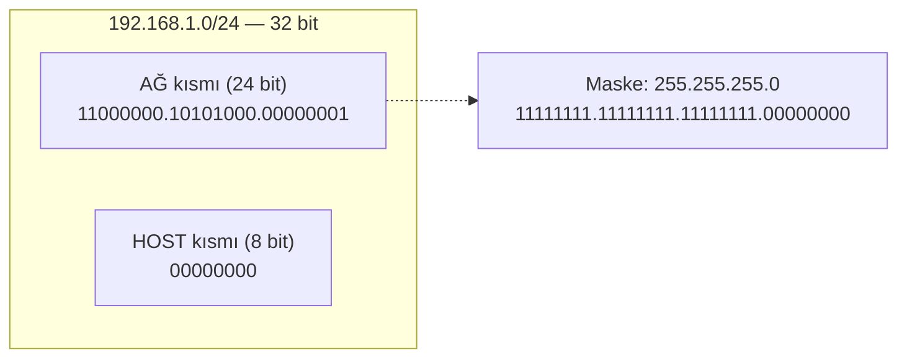

# 🧮 Subnetting ve CIDR — Derinlemesine + Pratik

> ⭐ **Bu, deponun en yüksek öncelikli iki dosyasından biridir.** Anki destesi subnetting'i *kasıtlı olarak* yalnızca kural/formül düzeyinde bıraktı — çünkü subnetting ezberle değil **elle çözerek** öğrenilir. Bu dosya o pratiği tamamlar: önce mekanizma, sonra **15+ elle çözülmüş problem**, sonra hız teknikleri.

**Hedef:** Bu dosyayı bitirdiğinde, kâğıt-kalemle (hesap makinesi olmadan) herhangi bir subnetting sorusunu ~30 saniyede çözebilmelisin. Bu, hem ağ mülakatlarının hem OSCP gibi sınavların klasik elemesidir.

---

## 1. Neden subnetting var? (Problem)

Bir kuruluşa `172.16.0.0/16` gibi büyük bir adres bloğu verildiğini düşün. Bu blok 65.536 adres içerir. Bunların hepsini tek bir düz ağda tutmak felakettir:
- **Broadcast fırtınası:** Tek bir broadcast tüm 65 bin cihaza gider → performans çöker.
- **Güvenlik:** Muhasebe ile misafir Wi-Fi aynı ağdaysa, birinden diğerine yanal hareket (lateral movement) serbesttir.
- **Yönetim:** Tek dev ağı izlemek/segmentlemek imkânsızlaşır.

**Çözüm:** Büyük bloğu, host bitlerinden ödünç alarak daha küçük **alt ağlara (subnet)** bölmek. Subnetting = "bir IP bloğunu daha küçük, yönetilebilir ve izole ağlara ayırma sanatı".

---

## 2. CIDR gösterimi ve maske

**CIDR** (Classless Inter-Domain Routing) `IP/önek` biçiminde yazılır: `192.168.1.0/24`. Buradaki `/24`, adresin soldan itibaren **24 bitinin "ağ" (network) kısmı** olduğunu, kalan `32 − 24 = 8` bitin **"host" kısmı** olduğunu söyler. CIDR, eski sınıf-temelli (classful) adreslemenin yerini alarak adres uzayının verimli kullanımını ve yönlendirme tablolarının küçülmesini sağlayan standarttır (kaynak: [RFC 4632](https://www.rfc-editor.org/rfc/rfc4632)).



**Subnet mask (alt ağ maskesi)**, hangi bitlerin ağ (1'ler) hangilerinin host (0'lar) olduğunu işaretler. Maske ile adres **AND**'lenerek ağ adresi bulunur.

### /önek ↔ maske dönüşüm tablosu (ezberlenmeli)

| Önek | Maske | Son oktet (bit) | Blok büyüklüğü | Toplam adres | Kullanılabilir host |
|:----:|:-----:|:---------------:|:--------------:|:------------:|:-------------------:|
| /24 | 255.255.255.**0** | 00000000 | 256 | 256 | 254 |
| /25 | 255.255.255.**128** | 10000000 | 128 | 128 | 126 |
| /26 | 255.255.255.**192** | 11000000 | 64 | 64 | 62 |
| /27 | 255.255.255.**224** | 11100000 | 32 | 32 | 30 |
| /28 | 255.255.255.**240** | 11110000 | 16 | 16 | 14 |
| /29 | 255.255.255.**248** | 11111000 | 8 | 8 | 6 |
| /30 | 255.255.255.**252** | 11111100 | 4 | 4 | 2 |
| /31 | 255.255.255.**254** | 11111110 | 2 | 2 | **2** (RFC 3021) |
| /32 | 255.255.255.**255** | 11111111 | 1 | 1 | 1 (tek host) |

> **Maske oktet değerleri** soldan bit ekleyerek çıkar: `128, 192, 224, 240, 248, 252, 254, 255`. Bunları ezberle — hızın anahtarı budur.

---

## 3. Dört temel formül

Bir alt ağ verildiğinde her şey bu dört formülden çıkar. `p` = önek uzunluğu, `h = 32 − p` = host biti sayısı.

| Sorulan | Formül | Örnek (/26) |
|---------|--------|-------------|
| **Toplam adres** | `2^h = 2^(32−p)` | `2^6 = 64` |
| **Kullanılabilir host** | `2^h − 2` | `64 − 2 = 62` |
| **Blok büyüklüğü** (ilgili oktette) | `256 − maske_oktet` | `256 − 192 = 64` |
| **Ağ adresi** | Host bitleri tümü **0** | `.0, .64, .128, .192` |
| **Broadcast adresi** | Host bitleri tümü **1** | ağ + blok − 1 |

**Neden `−2`?** Her alt ağda ilk adres (host bitleri tümü 0) = **ağ adresi**, son adres (tümü 1) = **broadcast adresi**. İkisi de bir host'a atanamaz.

**İki bilinçli istisna:**
- **/31** ([RFC 3021](https://www.rfc-editor.org/rfc/rfc3021)): Nokta-nokta (point-to-point) linklerde broadcast anlamsızdır; 2 adresin ikisi de host olur. Router-router bağlantılarında adres tasarrufu sağlar.
- **/32**: Tek bir spesifik host. Firewall kuralı, host route, ACL eşleşmesinde kullanılır.

---

## 4. "Sihirli sayı" (magic number / block size) yöntemi — hız tekniği

Elle subnetting'in en hızlı yolu **blok büyüklüğü** (magic number) yöntemidir. İkiliye hiç dönmeden çözersin:

1. Maskenin **"ilginç oktetini"** bul (255 olmayan ilk oktet).
2. **Blok büyüklüğü = 256 − o oktetteki maske değeri.**
3. Ağlar, o oktette **0'dan başlayıp blok büyüklüğü kadar artarak** sıralanır.
4. Verilen IP'nin düştüğü aralığı bul → ağ adresi = alt sınır, broadcast = bir sonraki ağın bir eksiği.

Bu yöntemi aşağıdaki problemlerde tekrar tekrar uygulayacağız — "kas hafızası" oluşana dek.

---

## 5. 🏋️ 15+ Elle Çözülmüş Problem

> Her problemi önce **kendin çöz**, sonra çözümü aç. Hedef süre problem başına <45 sn.

### Problem 1 — Temel /24
**Soru:** `192.168.10.0/24` ağının maskesi, kullanılabilir host sayısı, ilk/son host ve broadcast adresi nedir?

**Çözüm:**
- Maske: `/24` → `255.255.255.0`
- Host biti: `32 − 24 = 8` → host = `2^8 − 2 = 254`
- Ağ adresi: `192.168.10.0`
- İlk host: `.1`, son host: `.254`, broadcast: `.255`

---

### Problem 2 — /26 ile bölme
**Soru:** `192.168.1.0/26` — kaç alt ağ, her birinde kaç host, alt ağların ağ adresleri neler?

**Çözüm:**
- `/24` → `/26`: 2 bit ödünç → `2^2 = 4` alt ağ.
- Host: `2^(32−26) − 2 = 2^6 − 2 = 62`.
- Blok büyüklüğü: `256 − 192 = 64`.
- Ağlar (son oktet 0'dan 64'er artar): `.0`, `.64`, `.128`, `.192`

| Alt ağ | Ağ adresi | İlk host | Son host | Broadcast |
|--------|-----------|----------|----------|-----------|
| 1 | .0 | .1 | .62 | .63 |
| 2 | .64 | .65 | .126 | .127 |
| 3 | .128 | .129 | .190 | .191 |
| 4 | .192 | .193 | .254 | .255 |

---

### Problem 3 — Bir host hangi ağda?
**Soru:** `192.168.1.100/26` hangi alt ağa aittir? Ağ ve broadcast adresi?

**Çözüm:**
- Blok = 64. Ağlar: 0, 64, 128, 192.
- 100, `64` ile `128` arasında → ağ = **192.168.1.64**, broadcast = `128 − 1 =` **192.168.1.127**.
- Geçerli host aralığı: `.65 – .126`. Evet, 100 bu aralıkta.

---

### Problem 4 — /27 aralık bulma
**Soru:** `10.0.0.0/27` için ilk üç alt ağın broadcast adresleri?

**Çözüm:**
- Blok = `256 − 224 = 32`. Ağlar: 0, 32, 64, ...
- Broadcast'ler: `.31`, `.63`, `.95`.

---

### Problem 5 — /30 nokta-nokta
**Soru:** İki router'ı bağlayan bir WAN linki için `172.16.5.4/30` verildi. Kullanılabilir iki adres nedir?

**Çözüm:**
- Blok = `256 − 252 = 4`. Ağlar: .0, .4, .8...
- `172.16.5.4/30` → ağ = `.4`, broadcast = `.7`.
- Host'lar: **172.16.5.5** ve **172.16.5.6**. (Klasik router-router link.)

---

### Problem 6 — /30 sayma
**Soru:** `192.168.0.0/24` bloğunu `/30`'lara bölersem kaç adet nokta-nokta link elde ederim?

**Çözüm:** `2^(30−24) = 2^6 = 64` adet /30 link.

---

### Problem 7 — Maskeden host sayısı
**Soru:** Maskesi `255.255.240.0` olan bir ağda kaç kullanılabilir host vardır?

**Çözüm:**
- `240` = `11110000` → 3. oktette 4 bit ağ. Toplam ağ biti = `8 + 8 + 4 = 20` → `/20`.
- Host biti = `32 − 20 = 12` → `2^12 − 2 = 4094`.

---

### Problem 8 — Üçüncü oktette blok
**Soru:** `172.16.0.0/20` alt ağlarının ağ adresleri nasıl artar?

**Çözüm:**
- İlginç oktet 3. oktet, maske orada `240`. Blok = `256 − 240 = 16`.
- 3. oktet 16'şar artar: `172.16.0.0`, `172.16.16.0`, `172.16.32.0`, `172.16.48.0`, ...

---

### Problem 9 — Host adresinden ağ (3. oktet)
**Soru:** `172.16.20.55/20` hangi ağa aittir?

**Çözüm:**
- Blok (3. oktet) = 16. 3. oktet katları: 0, 16, 32...
- 20, `16` ile `32` arasında → ağ = **172.16.16.0**, broadcast = **172.16.31.255**.
- Host aralığı: `172.16.16.1 – 172.16.31.254`. 20.55 bu aralıkta. ✔

---

### Problem 10 — Kaç bit ödünç almalı? (host gereksinimi)
**Soru:** Her alt ağda en az **50 host** gerekiyor. `/24`'ten hangi önekle bölmelisin?

**Çözüm:**
- `2^h − 2 ≥ 50` → `2^6 − 2 = 62 ≥ 50` ✔ (`2^5 − 2 = 30`, yetmez).
- `h = 6` host biti → önek = `32 − 6 = /26`.

---

### Problem 11 — Kaç bit ödünç almalı? (ağ gereksinimi)
**Soru:** `192.168.1.0/24`'ü **en az 6 alt ağa** bölmelisin. Hangi önek?

**Çözüm:**
- `2^n ≥ 6` → `2^3 = 8 ≥ 6` ✔ → 3 bit ödünç → `/27`.
- Bonus: her alt ağda `2^(32−27) − 2 = 30` host, 8 alt ağdan 6'sını kullanırsın.

---

### Problem 12 — Ağ mı, host mu? (geçerlilik testi)
**Soru:** `192.168.1.128/26` bir host adresi olabilir mi?

**Çözüm:**
- Blok = 64. Ağlar: .0, .64, .128, .192.
- `.128` bir ağ sınırı → bu bir **ağ adresidir**, host'a atanamaz. **Hayır.**

---

### Problem 13 — Broadcast tespiti
**Soru:** `10.10.10.63/26` nedir — ağ, host, yoksa broadcast?

**Çözüm:**
- Blok = 64. `.0–.63` ilk alt ağ. `.63` = son adres → **broadcast**.

---

### Problem 14 — VLSM (değişken uzunlukta bölme)
**Soru:** `192.168.1.0/24`'ü şu gereksinimlerle böl: Ağ A = 100 host, Ağ B = 50 host, Ağ C = 25 host, iki adet /30 router linki. (En büyükten başla — VLSM kuralı.)

**Çözüm (büyükten küçüğe yerleştir):**

| Ağ | İhtiyaç | Önek | Blok | Ağ adresi | Aralık | Broadcast |
|----|---------|------|------|-----------|--------|-----------|
| A | 100 | /25 (126 host) | 128 | 192.168.1.0 | .1–.126 | .127 |
| B | 50 | /26 (62 host) | 64 | 192.168.1.128 | .129–.190 | .191 |
| C | 25 | /27 (30 host) | 32 | 192.168.1.192 | .193–.222 | .223 |
| Link 1 | 2 | /30 | 4 | 192.168.1.224 | .225–.226 | .227 |
| Link 2 | 2 | /30 | 4 | 192.168.1.228 | .229–.230 | .231 |

> **VLSM altın kuralı:** Her zaman **en büyük gereksinimden** başla ve adresleri sırayla dizerek doldur. Küçükten başlarsan çakışma/israf çıkar. Kalan `.232–.255` gelecekteki büyüme için serbest.

---

### Problem 15 — Route aggregation (supernetting)
**Soru:** `192.168.0.0/24`, `192.168.1.0/24`, `192.168.2.0/24`, `192.168.3.0/24` — bu dört ağı tek CIDR bloğunda topla.

**Çözüm:**
- Dördü de `192.168.0` – `192.168.3` arasında. 3. oktet ikili: `00000000, 00000001, 00000010, 00000011` — ilk 6 biti ortak, son 2 biti değişiyor.
- Ortak ön ek: `16 (ilk iki oktet) + 6 = 22` bit → **192.168.0.0/22** (4 × 256 = 1024 adres).

---

### Problem 16 — /31 istisnası
**Soru:** `10.0.0.0/31` içinde kaç kullanılabilir host vardır ve hangileridir?

**Çözüm:**
- Normalde `2^1 − 2 = 0` olurdu. Ama RFC 3021 gereği nokta-nokta linklerde `/31`'in **iki adresi de host**: `10.0.0.0` ve `10.0.0.1`. Broadcast yok.

---

## 6. Özel adres blokları (ezber + bağlam)

| Blok | Ad | Anlam |
|------|-----|-------|
| `10.0.0.0/8`, `172.16.0.0/12`, `192.168.0.0/16` | RFC 1918 özel ([kaynak](https://www.rfc-editor.org/rfc/rfc1918)) | İnternette yönlendirilmez; iç ağda serbest, NAT ile dışa çıkar. |
| `169.254.0.0/16` | APIPA / link-local | DHCP başarısız olunca cihaz kendine verir; **DHCP arızası işareti**. |
| `127.0.0.0/8` | Loopback | Paketi ağa çıkarmadan makineye döndürür (`127.0.0.1`). |
| `100.64.0.0/10` | CGNAT | Operatör düzeyi NAT. |
| `0.0.0.0/0` | Varsayılan rota / "her yer" | Yönlendirmede default route, dinlemede "tüm arayüzler". |

---

## 7. Nüans: maske adresin parçası değildir

Aynı IP, farklı maskelerle farklı ağlara ait olabilir. `192.168.1.10`:
- `/24` ile → `192.168.1.0` ağına ait.
- `/16` ile → `192.168.0.0` ağına ait.

Maske, adresin **nasıl yorumlanacağını** söyler; adresin kendisi değildir. Bir cihazın hangi trafiği "yerel" (aynı ağ, doğrudan gönder) sayacağını, hangisini router'a (gateway) yollayacağını bu belirler. **Yanlış maske = trafik yanlış yere gider** — hem arıza hem yanlış yapılandırma temelli güvenlik açığı kaynağı.

---

## 8. Saldırı–savunma kesişimi

- **Segmentasyon:** Doğru subnetting, VLAN'larla birlikte yanal hareketi (lateral movement) sınırlar. Kritik sistemler ayrı bir `/28`'de olursa, kullanıcı ağından ele geçen bir makine oraya doğrudan ulaşamaz.
- **Tarama kapsamı:** Bir pentester `nmap 10.0.0.0/24` yazdığında tam olarak 256 adresi tarar. CIDR'ı yanlış hesaplayan ya kapsamı kaçırır ya sözleşme (rules of engagement) dışına taşar → [10-pentest](../10-pentest-metodolojisi/metodoloji-ve-rules-of-engagement.md).
- **Firewall/ACL kuralları:** Kurallar CIDR ile yazılır. `/32` tek host'u, `/0` her şeyi ifade eder. Bir kuralda `/24` yerine yanlışlıkla `/0` yazmak, tüm interneti içeri almak demektir.

---

## 9. Pratik: hesaplayıcıyla doğrula

Elle çözdüklerini [subnet_calculator.py](pratik-scriptler/subnet_calculator.py) ile kontrol et. **Ama önce elle çöz** — script sadece doğrulama içindir, öğrenme elle olur.

```bash
python3 pratik-scriptler/subnet_calculator.py 192.168.1.100/26
```

> **Sonraki:** [dns-derinlemesine.md](dns-derinlemesine.md).
