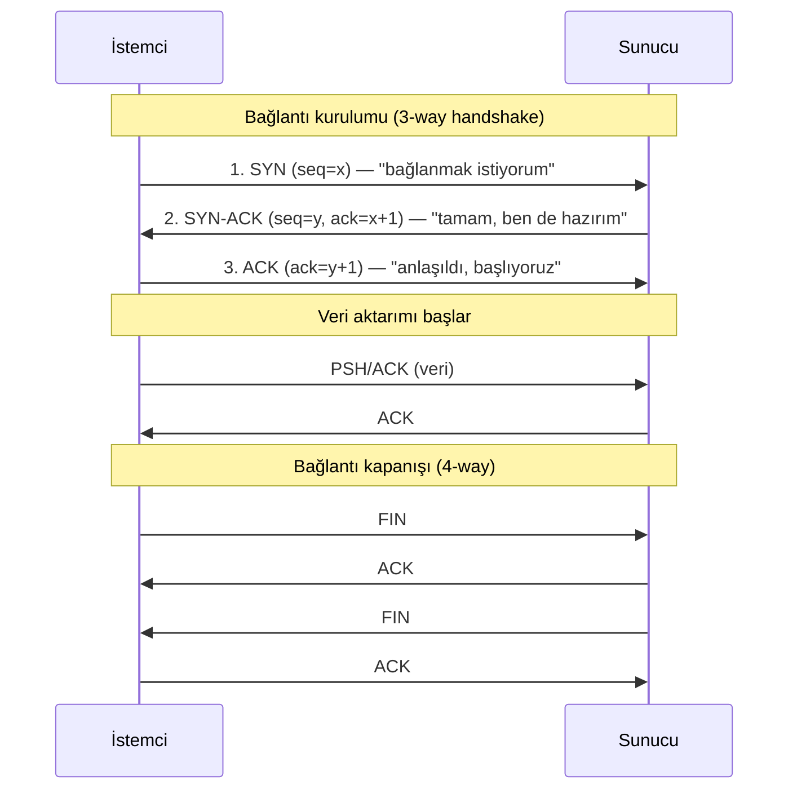

# 🔌 TCP/IP ve Temel Protokoller

Bu dosya, verinin ağ üzerinde fiilen nasıl taşındığını anlatır: güvenilir bağlantı kuran TCP, hızlı ve bağlantısız UDP, tanı protokolü ICMP, servisleri adresleyen portlar ve IPv6'ya geçiş.

> Ön koşul: [temel-kavramlar.md](temel-kavramlar.md). Portlar taramada kullanılır → [kesif-enumerasyon.md](../10-pentest-metodolojisi/kesif-enumerasyon.md).

---

## 1. TCP vs UDP: iki taşıma felsefesi

Taşıma katmanı (L4), uygulamalar arası uçtan uca iletişimi sağlar. İki ana protokol vardır ve seçim, "güvenilirlik mi hız mı?" ödünleşmesidir.

| Özellik | TCP | UDP |
|---------|-----|-----|
| Bağlantı | Bağlantı-yönelimli (handshake) | Bağlantısız (ateşle-unut) |
| Güvenilirlik | Garantili teslim, sıralama, yeniden iletim | Garanti yok |
| Hız / ek yük | Yavaş, yüksek ek yük | Hızlı, düşük ek yük |
| Kullanım | Web (HTTP/S), e-posta, SSH, dosya | DNS, VoIP, video, oyun, DHCP |
| Başlık boyutu | 20+ byte | 8 byte |

**Neden ikisi de var?** Bir web sayfasının yarısı gelirse işe yaramaz → TCP'nin garantisi gerekir. Ama canlı bir görüntülü görüşmede kaybolan bir kareyi yeniden istemek, geç geldiği için zaten anlamsızdır → UDP'nin hızı yeğlenir.

---

## 2. TCP üçlü el sıkışması (three-way handshake)

TCP, veri göndermeden önce iki taraf arasında bir bağlantı kurar. Bu, üç adımlı bir el sıkışmasıdır ve TCP'nin güvenilirliğinin temelidir. TCP'nin güncel resmî belirtimi, 1981 tarihli RFC 793'ün yerini alan [RFC 9293](https://www.rfc-editor.org/rfc/rfc9293)'tür.



**Adımların anlamı:**
1. **SYN** (synchronize): İstemci bir başlangıç sıra numarası (sequence number) gönderir.
2. **SYN-ACK**: Sunucu hem istemciyi onaylar (ACK) hem kendi sıra numarasını gönderir (SYN).
3. **ACK**: İstemci sunucuyu onaylar. Bağlantı kuruldu.

### Saldırı–savunma kesişimi: SYN ile ne yapılır?
- **SYN taraması (nmap `-sS`):** Saldırgan SYN gönderir; sunucu SYN-ACK ile cevap verirse port **açık**, RST ile cevap verirse **kapalı**. El sıkışması tamamlanmadığı için "yarı-açık (half-open)" tarama denir, daha sessizdir. Bkz. [port_tarayici.py](pratik-scriptler/port_tarayici.py).
- **SYN flood (DoS):** Saldırgan binlerce SYN gönderip hiç ACK göndermez; sunucunun yarı-açık bağlantı tablosu dolar ve meşru bağlantı kabul edemez. Savunma: **SYN çerezleri (SYN cookies)**, hız sınırlama.
- **TCP bayrakları (flags):** `SYN, ACK, FIN, RST, PSH, URG`. Farklı bayrak kombinasyonları farklı tarama türlerini (FIN, XMAS, NULL tarama) ve firewall atlatmayı mümkün kılar.

> **Telde görmek:** Bu el sıkışmayı ve bayrakları gerçek paketlerde okumak (ve bir taramayı/SYN flood'u pcap'te tanımak) için → [pratik-lab/paket-analizi-wireshark.md](pratik-lab/paket-analizi-wireshark.md). Teoriyi Wireshark'ta doğrulamak, protokolü "anlamak" ile "ezberlemek" arasındaki farktır.

---

## 3. ICMP — ağın tanı protokolü

ICMP (Internet Control Message Protocol), L3'te hata ve tanı mesajları taşır. Veri taşımaz; ağın "sinir sistemi"dir.

- **`ping`** = ICMP Echo Request/Reply. Bir host'un ayakta olup olmadığını test eder.
- **`traceroute`/`tracert`** = artan TTL değerleriyle yol üzerindeki her router'ı ortaya çıkarır.

```bash
ping -c 4 8.8.8.8            # Linux: 4 paket gönder
tracert 8.8.8.8             # Windows: yolu izle (Linux'ta: traceroute)
```

**Kesişim:** ICMP çoğu ağda tanı için açıktır ama kötüye kullanılabilir: **ICMP tünelleme** ile veri sızdırma (data exfiltration), ping taramasıyla canlı host keşfi, ping-of-death (eski). Bu yüzden bazı ortamlar ICMP'yi kısıtlar — ki bu da tanıyı zorlaştıran bir ödünleşmedir.

---

## 4. Portlar ve iyi bilinen (well-known) servisler

Bir IP adresi *makineyi*, port ise o makinedeki *servisi* belirler. Port 16 bittir → 0–65535 aralığı, üç bölgeye ayrılır:

| Aralık | Ad | Kullanım |
|--------|-----|----------|
| 0–1023 | İyi bilinen (well-known) | Standart servisler (HTTP, SSH). Yönetici ayrıcalığı gerektirir. |
| 1024–49151 | Kayıtlı (registered) | Uygulamalara atanmış (MySQL 3306). |
| 49152–65535 | Dinamik/geçici (ephemeral) | İstemcinin kısa süreli bağlantı portları. |

### Bilinmesi zorunlu portlar

| Port | Protokol | Servis | Güvenlik notu |
|------|----------|--------|---------------|
| 20/21 | TCP | FTP | Düz metin; SFTP/FTPS tercih et. |
| 22 | TCP | SSH | Güvenli uzaktan yönetim; brute-force hedefi. |
| 23 | TCP | Telnet | Düz metin — asla kullanma. |
| 25 | TCP | SMTP | E-posta gönderimi; açık röle riski. |
| 53 | TCP/UDP | DNS | [dns-derinlemesine.md](dns-derinlemesine.md). |
| 67/68 | UDP | DHCP | Sahte DHCP saldırıları. |
| 80 | TCP | HTTP | Şifresiz web. |
| 110 | TCP | POP3 | E-posta alma (eski). |
| 143 | TCP | IMAP | E-posta alma. |
| 389 | TCP/UDP | LDAP | Dizin servisi (AD). |
| 443 | TCP | HTTPS | TLS'li web. |
| 445 | TCP | SMB | Windows dosya paylaşımı; EternalBlue, ransomware yayılımı. |
| 3306 | TCP | MySQL | Veritabanı — dışa açık olmamalı. |
| 3389 | TCP | RDP | Windows uzak masaüstü; en çok saldırılan portlardan. |

> 📌 Bu tabloyu Anki'de ezberlersin; burada **neden** kritik olduklarını bağlama oturtuyoruz. Örneğin 445 (SMB) ve 3389 (RDP) internete açıksa, otomatik tarayıcılar dakikalar içinde bulur.

---

## 5. IPv6'ya geçiş

IPv4 adresleri (32 bit ≈ 4.3 milyar) tükendi. IPv6 (128 bit) bu problemi çözer ve giderek yaygınlaşır — güvenlik uzmanının artık görmezden gelemeyeceği bir alan.

### IPv4 vs IPv6

| | IPv4 | IPv6 |
|---|------|------|
| Adres boyutu | 32 bit | 128 bit (~3.4×10³⁸ adres) |
| Gösterim | `192.168.1.1` (ondalık) | `2001:0db8:85a3::8a2e:0370:7334` (hex) |
| Loopback | `127.0.0.1` | `::1` |
| Özel/yerel | RFC 1918 (`10/8` vb.) | ULA `fc00::/7`, link-local `fe80::/10` |
| Adres alma | DHCP | SLAAC (otomatik) veya DHCPv6 |
| NAT | Yaygın (adres kıtlığı) | Genelde gereksiz (bol adres) |

### IPv6 gösterim kuralları
- Baştaki sıfırlar atılır: `0db8` → `db8`.
- Ardışık sıfır blokları **bir kez** `::` ile kısaltılır: `2001:db8:0:0:0:0:0:1` → `2001:db8::1`.
- **`::1`** = loopback (IPv4'teki `127.0.0.1`), **`fe80::/10`** = link-local (her IPv6 arayüzünde otomatik var).

### SLAAC (Stateless Address Autoconfiguration)
IPv6'da bir cihaz, DHCP sunucusuna gerek kalmadan router'ın gönderdiği ağ önekini (prefix) alıp kendi adresini üretebilir. IPv4'te bu işi merkezî bir sunucu üzerinden DHCP/DORA süreci yapıyordu ([temel-kavramlar.md](temel-kavramlar.md)); IPv6'da cihaz büyük ölçüde kendi kendine yeter. Bu kolaylık, güvenlikte bir yüzey de açar.

### Saldırı–savunma kesişimi: IPv6'nın gizli riski
IPv6 çoğu modern işletim sisteminde **varsayılan açıktır** ama birçok ağ yöneticisi yalnızca IPv4'ü izler/filtreler. Sonuç: **kör nokta**. Saldırganlar SLAAC'ı kötüye kullanıp sahte router ilanı (RA — Router Advertisement) ile ortadaki-adam (man-in-the-middle) konumuna geçebilir (araç: `mitm6`). Bu saldırı, IPv4 dünyasındaki sahte DHCP (rogue DHCP) ve ARP zehirleme saldırılarının ([temel-kavramlar.md](temel-kavramlar.md)) IPv6'daki tam karşılığıdır — üçü de "kimlik doğrulamayan bir yerel ağ protokolünü istismar ederek MITM konumuna geçme" temasını paylaşır. Savunma: RA Guard, IPv6'yı ya bilinçli yönet ya da bilinçli kapat — "görmezden gelme".

---

## 6. Özet

- TCP = güvenilir+yavaş (handshake); UDP = hızlı+garantisiz.
- Üçlü el sıkışması hem bağlantının hem port taramasının/SYN flood'un temelidir.
- Port = servis kimliği; kritik portları (22, 80, 443, 445, 3389) bilmek şart.
- IPv6 artık isteğe bağlı değil; en azından savunma için tanınmalı.

> **Sonraki — en yüksek öncelikli dosya:** [subnetting-cidr.md](subnetting-cidr.md).
