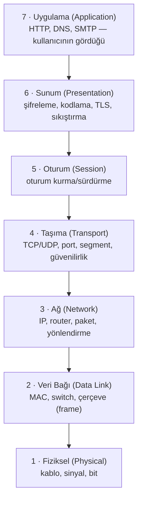
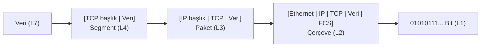

# 🌐 Ağ Temel Kavramları ve OSI Modeli

Ağ bilgisi, siber güvenliğin omurgasıdır: her saldırı ya ağ üzerinden gelir ya da ağda iz bırakır. Bu dosya, bir paketin bir cihazdan diğerine giderken geçtiği katmanları ve bunların güvenlik anlamını kurar.

> Devamı: [tcp-ip-protokoller.md](tcp-ip-protokoller.md), [subnetting-cidr.md](subnetting-cidr.md). Terimler: [terminoloji-sozlugu.md](../00-baslangic/terminoloji-sozlugu.md).

---

## 1. Ağ nedir ve neden katmanlıdır?

Ağ, veri paylaşmak için birbirine bağlı cihazlar topluluğudur. Ama iki cihazın "konuşması" aslında onlarca alt problemin çözülmesini gerektirir: fiziksel sinyal nasıl taşınacak? Hangi cihaza gidecek? Paket kaybolursa ne olacak? Uygulama veriyi nasıl anlayacak?

Bu karmaşayı yönetmek için ağ **katmanlara** bölünür. Her katman yalnızca kendi işini yapar ve altındaki/üstündeki katmana standart bir arayüz sunar. Böylece bir katman (ör. Wi-Fi yerine Ethernet) değişse üsttekiler etkilenmez. Bu **soyutlama (abstraction)**, güvenlikte de kritiktir: bir saldırı hangi katmandaysa savunma da o katmanda konumlanır.

### LAN, WAN ve topolojiler
- **LAN (yerel ağ):** Tek bir fiziksel alanda (ofis, ev) sınırlı ağ.
- **WAN (geniş ağ):** Coğrafi olarak dağıtık ağların birleşimi; internet en büyük WAN'dır.
- **Topoloji:** Cihazların bağlanış biçimi — yıldız (star, bugün en yaygın; merkezde switch), mesh (her düğüm birbirine; dayanıklı), bus/ring (eski). Topoloji, bir düğüm düştüğünde ağın ne kadar etkileneceğini belirler.

### Temel ağ cihazları

| Cihaz | Çalıştığı katman | Görevi | Güvenlik notu |
|-------|------------------|--------|---------------|
| **Hub** | 1 (fiziksel) | Geleni tüm portlara tekrarlar (eski). | Tüm trafiği herkese gönderir → dinleme (sniffing) çok kolay. |
| **Switch (anahtar)** | 2 (veri bağı) | MAC adresine göre yalnızca doğru porta iletir. | MAC tablosu taşırma (CAM overflow) ile hub gibi davranmaya zorlanabilir. |
| **Router (yönlendirici)** | 3 (ağ) | Farklı ağlar arasında IP'ye göre yol bulur. | ACL ve firewall'un doğal yeri; ağ segmentasyonunun kalbi. |
| **Firewall (güvenlik duvarı)** | 3–7 | Trafiği kurallara göre geçirir/engeller. | Bkz. [routing-nat-vpn.md](routing-nat-vpn.md). |
| **Access Point (AP)** | 2 | Kablosuz cihazları kablolu ağa bağlar. | Sahte AP (evil twin), WPA saldırıları. |

---

## 2. OSI 7 katman modeli

OSI (Open Systems Interconnection), ağ iletişimini 7 kavramsal katmana ayıran referans modeldir. Gerçekte internet TCP/IP modelini kullanır, ama OSI **düşünme ve sorun giderme dili** olarak standarttır: "bu bir katman 3 sorunu mu, katman 7 mi?" sorusu, hem ağ arızasını hem saldırıyı sınıflandırır.

### Katman katman — ne, hangi veri birimi, hangi saldırı

| # | Katman | Veri birimi (PDU) | Örnek protokol/adres | Tipik saldırı |
|---|--------|-------------------|----------------------|---------------|
| 7 | Uygulama | Veri (data) | HTTP, DNS, SMTP, SSH | SQLi, XSS, DNS zehirleme |
| 6 | Sunum | Veri | TLS/SSL, JPEG, ASCII | SSL stripping, zayıf şifre paketi |
| 5 | Oturum | Veri | NetBIOS, RPC, oturum belirteçleri | Oturum ele geçirme (hijacking) |
| 4 | Taşıma | **Segment** (TCP) / Datagram (UDP) | TCP, UDP, port numaraları | SYN flood, port tarama |
| 3 | Ağ | **Paket** (packet) | IP, ICMP, IPsec | IP spoofing, ICMP tünelleme |
| 2 | Veri Bağı | **Çerçeve** (frame) | Ethernet, MAC, ARP | ARP zehirleme, MAC spoofing, VLAN hopping |
| 1 | Fiziksel | **Bit** | Kablo, radyo, voltaj | Kablo dinleme (tap), jamming |

> 💡 **Hafıza ipucu (aşağıdan yukarı):** "**P**lease **D**o **N**ot **T**hrow **S**ausage **P**izza **A**way" → Physical, Data-link, Network, Transport, Session, Presentation, Application.

### Kapsülleme (encapsulation) — verinin katmanlarda paketlenişi

Bir uygulama veri gönderdiğinde, her katman kendi başlığını (header) ekleyerek veriyi "sarar". Alıcıda ters işlem (de-encapsulation) olur. Bu, bir mektubun zarfa, zarfın çantaya, çantanın araca konulması gibidir.

**Güvenlik açısından neden önemli?** Wireshark gibi bir araçla bir paketi incelediğinde, tam olarak bu iç içe başlıkları görürsün. Bir saldırıyı analiz etmek, doğru katmanın başlığını okuyup anormalliği bulmaktır: kaynak IP'de spoofing (L3), beklenmedik port (L4), veya kötü niyetli HTTP yükü (L7).

---

## 3. Nüans: OSI vs TCP/IP modeli

Sık karıştırılır. OSI 7 katmanlı *teorik* modeldir; TCP/IP 4 katmanlı *uygulanan* modeldir. Eşleme:

| TCP/IP (4 katman) | Karşılık gelen OSI katmanları |
|-------------------|-------------------------------|
| Uygulama | 7 + 6 + 5 |
| Taşıma | 4 |
| İnternet | 3 |
| Ağ Erişimi (Link) | 2 + 1 |

Pratikte mühendisler ikisini karıştırıp konuşur ("katman 7 firewall'u", "katman 2 switch"i). Önemli olan hangi işin nerede yapıldığını bilmektir, model sayısını değil.

---

## 4. Saldırı–savunma kesişimi

- **Segmentasyon = katmanlı savunma:** Ağı VLAN'lar ve firewall'larla bölmek, bir katmandaki ihlalin tüm ağa yayılmasını engeller ([routing-nat-vpn.md](routing-nat-vpn.md)). Bu, [zero-trust](../06-kimlik-erisim-yonetimi-iam/zero-trust.md) ve mikro-segmentasyonun temelidir.
- **Katman farkındalığı tespitte:** Bir SOC analisti "bu bir L3 DDoS mu yoksa L7 uygulama saldırısı mı?" ayrımını yapmak zorundadır çünkü savunma tamamen farklıdır (biri hacim filtreleme, diğeri WAF/rate limit).
- **Switch güvenliği:** Port güvenliği (port security), DHCP snooping ve Dynamic ARP Inspection, katman-2 saldırılarını (ARP zehirleme, sahte DHCP) durduran temel savunmalardır.

> **Sonraki:** Protokollerin nasıl konuştuğunu görmek için [tcp-ip-protokoller.md](tcp-ip-protokoller.md).
