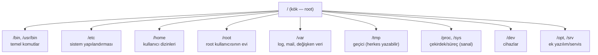

# 🐧 Linux Temelleri

Linux, sunucuların, güvenlik araçlarının (Kali) ve internet altyapısının büyük çoğunluğunun işletim sistemidir. Bir güvenlik uzmanı için Linux hem en sık **hedef** hem en önemli **araç platformudur**. Bu dosya, Linux'un güvenlik açısından kritik yapısını kurar.

> Komutların kategorize tam referansı: [linux-komut-referansi.md](linux-komut-referansi.md). Sıkılaştırma pratiği: [pratik-lab/linux-hardening-checklist.md](pratik-lab/linux-hardening-checklist.md). OS iç yapısı: [03-isletim-sistemi-ici](../03-isletim-sistemi-ici/surecler-ve-bellek.md).

---

## 1. Dosya sistemi hiyerarşisi (FHS)

Windows'un aksine Linux'ta sürücü harfi (C:, D:) yoktur; her şey tek bir kök (`/`) altında ağaç olarak asılır. Bu "her şey bir dosyadır" felsefesi (cihazlar, süreçler bile dosya gibi görünür) Linux'un temel tasarım ilkesidir.



| Dizin | İçerik | Güvenlik açısından önemi |
|-------|--------|--------------------------|
| **/etc** | Yapılandırma dosyaları | `/etc/passwd`, `/etc/shadow`, `/etc/sudoers` — enumerasyonun ilk durağı. |
| **/var/log** | Sistem/uygulama logları | Adli analiz ve tespit; saldırgan burayı temizlemek ister. |
| **/home**, **/root** | Kullanıcı verileri | SSH anahtarları, `.bash_history`, gizli dosyalar. |
| **/tmp**, **/dev/shm** | Herkesin yazabildiği alan | Saldırganın payload bıraktığı klasik yer. |
| **/proc** | Çalışan süreçlerin sanal görünümü | `/proc/<pid>` ile süreç/bellek incelemesi. |

> 📌 `/etc/passwd` **okunabilir** (kullanıcı listesi), ama parola hash'leri `/etc/shadow`'da tutulur ve yalnızca root okur. Bu ayrım, eski Unix'lerdeki "passwd herkese açık" zafiyetinin (parola hash'lerini çevrimdışı kırma) çözümüdür.

---

## 2. İzinler (permissions) — rwx modeli

Linux izinleri, "kim ne yapabilir" sorusunu üç özne × üç eylem matrisiyle cevaplar.

- **Özneler:** sahip (owner/user, `u`), grup (`g`), diğerleri (others, `o`).
- **Eylemler:** oku (`r`=4), yaz (`w`=2), çalıştır (`x`=1).

```
-rwxr-xr--   1 metin  devs   4096  ...  script.sh
│└┬┘└┬┘└┬┘
│ u  g  o
│
└ dosya türü ( - dosya, d dizin, l sembolik link )
```

**Sayısal (octal) gösterim:** her özne için r+w+x değerleri toplanır.
- `rwx` = 4+2+1 = **7**
- `r-x` = 4+0+1 = **5**
- `r--` = 4+0+0 = **4**
- Yani `-rwxr-xr--` = **754**.

```bash
chmod 640 gizli.conf     # sahip rw, grup r, diğerleri hiç
chmod u+x script.sh      # sahibe çalıştırma ekle
chmod -R 755 /var/www    # dizin ağacına özyinelemeli
chown metin:devs dosya   # sahip ve grup değiştir
```

### Nüans: dizinlerde x ne demek?
Bir **dizinde** `x`, "içine girebilme/geçebilme" (traverse) iznidir; `r` ise "içindekileri listeleyebilme". Bir dizine `x` verip `r` vermezsen, içindeki dosya adını **bilen** biri erişebilir ama `ls` ile listeleyemez. Bu ince ayrım, yanlış yapılandırma temelli erişim kontrolü hatalarının kaynağıdır.

---

## 3. Özel izin bitleri: SUID, SGID, Sticky bit

Bu üç özel bit, ayrıcalık yükseltmenin (privilege escalation) en klasik konusudur.

| Bit | Gösterim | Etki | Risk |
|-----|----------|------|------|
| **SUID** | `-rwsr-xr-x` (sahip x yerinde `s`) | Dosya, **sahibinin** yetkisiyle çalışır (genelde root). | SUID'li bir ikili istismar edilirse **root shell**. |
| **SGID** | `-rwxr-sr-x` (grup x yerinde `s`) | Dosya grubun yetkisiyle çalışır / dizinde yeni dosyalar grubu miras alır. | Grup ayrıcalığı sızıntısı. |
| **Sticky** | `drwxrwxrwt` (others x yerinde `t`) | Dizinde herkes yazabilir ama **yalnızca sahibi kendi dosyasını silebilir**. | `/tmp`'nin güvenli olmasını sağlar. |

```bash
# SUID'li dosyaları bul — pentest'te ilk yapılan enumerasyon
find / -perm -4000 -type f 2>/dev/null

# Örnek: 'passwd' komutu SUID root'tur, çünkü /etc/shadow'u
# güncellemek için geçici olarak root yetkisi gerekir.
ls -l /usr/bin/passwd    # -rwsr-xr-x ... root root
```

> **Kesişim:** `find / -perm -4000` çıktısında `nmap`, `vim`, `find`, `bash` gibi beklenmedik bir SUID binary görürsen, bu genelde ayrıcalık yükseltme yolu demektir (bkz. GTFOBins projesi). Savunmada: gereksiz SUID bitlerini kaldırmak sertleştirmenin temelidir → [linux-hardening-checklist.md](pratik-lab/linux-hardening-checklist.md).

---

## 4. Kullanıcılar, gruplar ve root

- **root (UID 0):** Mutlak yönetici. Her şeyi yapar; izin kontrolleri ona uygulanmaz.
- **Normal kullanıcılar (UID ≥ 1000):** Sınırlı yetki.
- **Servis/sistem kullanıcıları (UID 1–999):** Servislerin adına çalıştığı, giriş yapamayan hesaplar (`www-data`, `nobody`).

### sudo — kontrollü yetki yükseltme
`sudo`, bir kullanıcının belirli komutları root olarak çalıştırmasına, root parolasını paylaşmadan izin verir. Kurallar `/etc/sudoers` dosyasındadır (`visudo` ile düzenlenir).

```bash
sudo apt update            # tek komutu root olarak çalıştır
sudo -l                    # BENİM hangi komutları sudo ile çalıştırabileceğimi listele
sudo -i                    # root kabuğuna geç
```

> **Kesişim:** `sudo -l` pentest enumerasyonunun ilk komutlarındandır. Yanlış yapılandırılmış bir `sudo` kuralı (`(ALL) NOPASSWD: /usr/bin/vim` gibi) doğrudan root'a giden bir kapıdır. Bu, [en az ayrıcalık](../00-baslangic/terminoloji-sozlugu.md) ilkesinin neden kritik olduğunun canlı örneğidir.

---

## 5. Shell ve süreç yönetimi

**Shell**, komutlarını yorumlayan programdır (bash, zsh, sh). Etkileşimli kullanımın ötesinde, **saldırganların hedefi tam olarak bir shell elde etmektir** ("shell almak") → [somuru-ve-sonrasi.md](../10-pentest-metodolojisi/somuru-ve-sonrasi.md).

```bash
ps aux                  # tüm çalışan süreçler
top / htop              # canlı süreç/kaynak izleme
kill -9 <pid>           # süreci zorla sonlandır
jobs ; bg ; fg          # arka/ön plan iş yönetimi
nohup komut &           # oturum kapansa da çalışmaya devam
```

### Ortam değişkenleri ve PATH
`$PATH`, shell'in komutları hangi dizinlerde arayacağını belirler. **PATH ele geçirme (hijacking):** Saldırgan PATH'e yazılabilir bir dizin ekleyip meşru bir komut adıyla (`ls` gibi) zararlı bir dosya koyarsa, kurban o "komutu" çalıştırdığında zararlı çalışır. Bu, birçok privilege escalation senaryosunun temelidir.

---

## 6. Servisler ve systemd

Modern Linux dağıtımları servisleri **systemd** ile yönetir. Bir servis = arka planda çalışan uzun ömürlü süreç (web sunucusu, SSH, veritabanı).

```bash
systemctl status ssh        # servisin durumu
systemctl start/stop nginx  # başlat/durdur
systemctl enable nginx      # açılışta otomatik başlat
systemctl list-units --type=service   # tüm servisler
journalctl -u ssh -f        # bir servisin loglarını canlı izle
```

> **Kesişim:** systemd birimleri (`.service` dosyaları) ve zamanlayıcıları (`.timer`), zararlı yazılımın **kalıcılık (persistence)** için sevdiği yerlerdir. Yazılabilir bir `.service` dosyası = açılışta root olarak çalışan kod. Savunmada bu dosyaların bütünlüğü izlenir.

---

## 7. Loglar — savunmanın hafızası

`/var/log` altındaki dosyalar, sistemde ne olduğunun kaydıdır:

| Dosya | İçerik |
|-------|--------|
| `/var/log/auth.log` (Debian) / `secure` (RHEL) | Kimlik doğrulama, sudo, SSH girişleri |
| `/var/log/syslog` / `messages` | Genel sistem olayları |
| `/var/log/kern.log` | Çekirdek mesajları |
| `~/.bash_history` | Kullanıcının komut geçmişi |

```bash
grep "Failed password" /var/log/auth.log   # başarısız SSH denemeleri (brute-force?)
last                                        # son giriş yapan kullanıcılar
lastb                                       # başarısız girişler
```

> **Kesişim:** Saldırgan izini silmek için logları temizler/değiştirir. Bu yüzden loglar **merkezî bir sunucuya** (SIEM) anında gönderilir → [11-soc](../11-soc-mavi-takim/log-analizi.md). Yerelde silinse bile SIEM'de kalır.

---

## 8. Saldırı–savunma kesişimi (özet)

- Linux enumerasyonu (`id`, `sudo -l`, `find -perm -4000`, `/etc/crontab`, çevre değişkenleri) pentest'in kalbidir → [somuru-ve-sonrasi.md](../10-pentest-metodolojisi/somuru-ve-sonrasi.md).
- Savunma tarafında bu aynı noktalar sertleştirilir: SUID temizliği, sudo minimizasyonu, dosya bütünlüğü izleme, merkezî loglama → [linux-hardening-checklist.md](pratik-lab/linux-hardening-checklist.md).
- "Her şey bir dosyadır" felsefesi güçlü ama tehlikeli: yanlış izin verilmiş **tek bir dosya** (yazılabilir `/etc/passwd`, `/etc/shadow`, cron, systemd birimi) tüm sistemi düşürebilir.

> **Sonraki:** [linux-komut-referansi.md](linux-komut-referansi.md).
