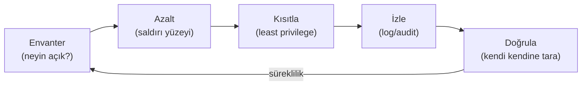

# 🛡️ Pratik Lab: Linux Sertleştirme (Hardening) Kontrol Listesi

> Bu bir **yapılacaklar laboratuvarıdır**, okuma metni değil. Bir Ubuntu/Debian VM'i (ör. VirtualBox'ta) kur ve her maddeyi **kendin uygula, çıktısını gözlemle**. Anki'nin kart yapmadığı "elle sertleştirme" becerisi burada gelişir.

**Hedef:** Varsayılan kurulu bir Linux sunucusunu, [en az ayrıcalık](../../00-baslangic/terminoloji-sozlugu.md) ve [derinlemesine savunma](../../00-baslangic/terminoloji-sozlugu.md) ilkelerine göre saldırı yüzeyini daraltacak şekilde yapılandırmak.

> ⚠️ Bunları **üretim sunucusunda değil**, tek kullanımlık bir lab VM'inde dene. Bazı adımlar (SSH kilitleme) yanlış yapılırsa kendini dışarıda bırakabilirsin.

---

## Bölüm 1 — Envanter ve temel durum

Sertleştirmeden önce sistemi **tanı**. Neyi kapatacağını bilmek için önce neyin açık olduğunu gör.

- [ ] **Açık portları/servisleri listele:**
  ```bash
  sudo ss -tulnp
  ```
  > 📸 EKRAN GÖRÜNTÜSÜ EKLENECEK: `ss -tulnp` çıktısı — hangi servislerin hangi portları dinlediği.

- [ ] **Çalışan servisleri gör:**
  ```bash
  systemctl list-units --type=service --state=running
  ```
- [ ] **Kullanıcı ve sudo yetkilerini incele:**
  ```bash
  cat /etc/passwd | grep -v nologin | grep -v false   # giriş yapabilen hesaplar
  getent group sudo                                    # sudo grubu üyeleri
  ```
- [ ] **SUID/SGID dosyalarını çıkar (temel çizgi/baseline):**
  ```bash
  find / -perm -4000 -type f 2>/dev/null > suid_baseline.txt
  find / -perm -2000 -type f 2>/dev/null > sgid_baseline.txt
  ```

---

## Bölüm 2 — Kullanıcı ve kimlik doğrulama sertleştirmesi

- [ ] **root ile doğrudan SSH girişini kapat** (`/etc/ssh/sshd_config`):
  ```
  PermitRootLogin no
  ```
- [ ] **Parola yerine SSH anahtarına geç** ve parola kimlik doğrulamasını kapat:
  ```
  PubkeyAuthentication yes
  PasswordAuthentication no
  ```
  ```bash
  # Önce anahtar üret ve kopyala (KENDİNİ KİLİTLEME!)
  ssh-keygen -t ed25519 -C "lab-key"
  ssh-copy-id kullanici@sunucu-ip
  # Sonra servisi yeniden başlat
  sudo systemctl restart ssh
  ```
- [ ] **Güçlü parola politikası** (`libpam-pwquality` ile min uzunluk/karmaşıklık).
- [ ] **Boş parolalı veya UID 0 olan ekstra hesap var mı?** (olmamalı):
  ```bash
  awk -F: '($2==""){print $1" BOŞ PAROLA!"}' /etc/shadow
  awk -F: '($3==0){print $1" UID 0!"}' /etc/passwd    # sadece root olmalı
  ```
- [ ] **Kullanılmayan/servis hesaplarına shell verme:** `usermod -s /usr/sbin/nologin <hesap>`.

> 📸 EKRAN GÖRÜNTÜSÜ EKLENECEK: `sshd_config` değişiklikleri sonrası parola ile bağlanma denemesinin reddedildiği terminal.

---

## Bölüm 3 — Servis ve saldırı yüzeyi azaltma

- [ ] **Gereksiz servisleri kapat/kaldır** (Bölüm 1'de bulduklarından ihtiyaç olmayanlar):
  ```bash
  sudo systemctl disable --now telnet.socket   # örnek: telnet asla kalmasın
  sudo apt purge <gereksiz-paket>
  ```
- [ ] **Telnet, FTP, rsh gibi düz metin protokolleri yok** — yerine SSH/SFTP.
- [ ] **Servisleri sadece gereken arayüze bağla** (`0.0.0.0` yerine `127.0.0.1` uygun olduğunda).

---

## Bölüm 4 — Firewall (default deny)

- [ ] **UFW ile "önce reddet" temeli kur:**
  ```bash
  sudo ufw default deny incoming
  sudo ufw default allow outgoing
  sudo ufw allow from 10.0.99.0/24 to any port 22   # SSH sadece yönetim ağından
  sudo ufw enable
  sudo ufw status verbose
  ```
  > Mantık: [routing-nat-vpn.md](../../01-ag-networking/routing-nat-vpn.md) firewall bölümü. "Her şeyi kapat, sadece gerekeni aç."

- [ ] **Brute-force'a karşı `fail2ban`:** başarısız SSH denemelerini yapan IP'leri otomatik yasakla.
  ```bash
  sudo apt install fail2ban
  sudo systemctl enable --now fail2ban
  sudo fail2ban-client status sshd
  ```

> 📸 EKRAN GÖRÜNTÜSÜ EKLENECEK: `ufw status verbose` ve `fail2ban-client status sshd` çıktıları.

---

## Bölüm 5 — Dosya sistemi ve izin sertleştirmesi

- [ ] **Gereksiz SUID bitlerini kaldır** (Bölüm 1 baseline'ına bakarak, şüpheli olanları):
  ```bash
  # Örnek: bir binary'nin SUID'ine gerçekten gerek yoksa
  sudo chmod u-s /yol/gereksiz-suid-binary
  ```
- [ ] **Hassas dosyaların izinleri doğru mu?**
  ```bash
  ls -l /etc/shadow      # 640 veya daha kısıtlı, sahibi root
  ls -l /etc/passwd      # 644, sadece root yazabilir
  ```
- [ ] **`/tmp`, `/dev/shm` gibi alanlarda `noexec`, `nosuid`** (mount seçenekleri, `/etc/fstab`).
- [ ] **World-writable (herkesin yazabildiği) dosyaları bul ve incele:**
  ```bash
  find / -xdev -type f -perm -0002 2>/dev/null
  ```

---

## Bölüm 6 — Loglama, güncelleme, izleme

- [ ] **Otomatik güvenlik güncellemeleri** (`unattended-upgrades`) veya düzenli `apt update && apt upgrade`.
- [ ] **Loglar merkezî bir yere gönderiliyor mu?** (saldırgan yerelde silse bile SIEM'de kalsın → [11-soc](../../11-soc-mavi-takim/siem-edr-soar.md)).
- [ ] **auditd** ile kritik dosya/komut denetimi:
  ```bash
  sudo apt install auditd
  sudo auditctl -w /etc/passwd -p wa -k passwd_degisiklik   # /etc/passwd yazma/öznitelik değişimini izle
  ```
- [ ] **Çekirdek parametreleri (`sysctl`):** IP forwarding kapalı (router değilse), ICMP redirect kapalı, ASLR açık.
  ```bash
  sysctl kernel.randomize_va_space    # 2 olmalı (tam ASLR)
  ```
  > ASLR neden önemli → [bellek-zafiyetleri-giris.md](../../03-isletim-sistemi-ici/bellek-zafiyetleri-giris.md).

---

## Bölüm 7 — Doğrulama (kendi kendine pentest)

Sertleştirmenin işe yaradığını **kanıtla**:

- [ ] Başka bir makineden `nmap` ile kendi VM'ini tara — Bölüm 3-4'ten sonra açık port sayısı düştü mü?
  ```bash
  nmap -sV <lab-vm-ip>
  ```
- [ ] Parola ile SSH bağlanmayı dene — reddediliyor mu?
- [ ] `fail2ban`'ı test et: kasıtlı 5 yanlış SSH denemesi yap, IP'nin yasaklandığını gör.

> 📸 EKRAN GÖRÜNTÜSÜ EKLENECEK: Sertleştirme öncesi vs sonrası `nmap` çıktısı yan yana (açık port sayısındaki düşüş).

---

## Özet: sertleştirme felsefesi



Sertleştirme tek seferlik değil, döngüseldir. Her yeni servis/kullanıcı yüzeyi büyütür; düzenli olarak baseline'a dön ve karşılaştır.

> **Modül 02 tamamlandı.** Sonraki: [03-isletim-sistemi-ici](../../03-isletim-sistemi-ici/surecler-ve-bellek.md).
