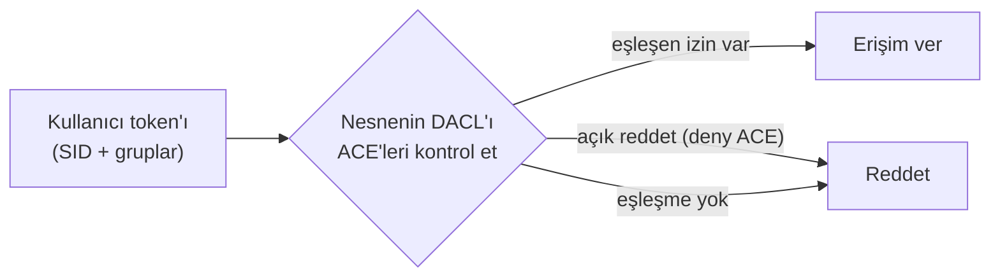
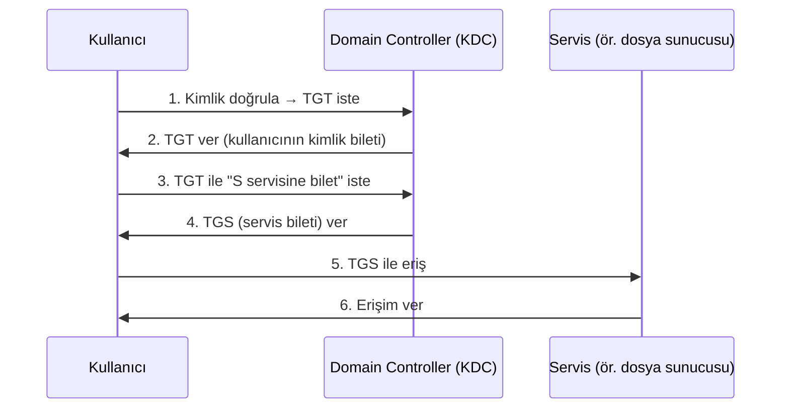

# 🪟 Windows Temelleri

Windows, kurumsal masaüstünün ve Active Directory ortamlarının hâkimidir. Pentest'in büyük kısmı (özellikle kurumsal red team) bir Windows/AD ortamında geçtiği için, Windows'un güvenlik mimarisini bilmek zorunludur. Bu dosya NTFS, ACL, UAC, registry ve Active Directory temellerini kurar.

> Komut referansı: [windows-komut-referansi.md](windows-komut-referansi.md). Log/olay analizi: [11-soc/log-analizi.md](../11-soc-mavi-takim/log-analizi.md).

---

## 1. Windows güvenlik mimarisinin temeli: SID ve token

Windows'ta her güvenlik nesnesi (kullanıcı, grup) bir **SID** (Security Identifier) ile tanımlanır — Linux'un UID'sinin karşılığı ama daha zengin.

- Kullanıcı giriş yapınca sistem ona bir **erişim belirteci (access token)** verir; bu token kullanıcının SID'ini ve gruplarını taşır.
- Bir kaynağa erişilmek istendiğinde, token'daki SID'ler kaynağın izin listesiyle (ACL) karşılaştırılır.

> **Kesişim:** Token'lar çalınabilir/taklit edilebilir (**token impersonation**, "pass-the-token"). Ele geçirilen bir makinede yüksek yetkili bir kullanıcının token'ını ödünç almak, AD yanal hareketinin klasik tekniğidir → [somuru-ve-sonrasi.md](../10-pentest-metodolojisi/somuru-ve-sonrasi.md).

---

## 2. NTFS ve ACL — dosya izinleri

**NTFS** (New Technology File System), Windows'un modern dosya sistemidir. İzinler, Linux'un basit rwx'inden çok daha ayrıntılı bir **ACL (Access Control List)** modeliyle verilir.

- Her dosya/klasörde bir **DACL** (Discretionary ACL) vardır: hangi SID'in ne yapabileceğini listeleyen **ACE'lerden** (Access Control Entry) oluşur.
- İzin türleri: Full Control, Modify, Read & Execute, List, Read, Write — ve bunların ince taneli (granular) hâlleri.
- **SACL** (System ACL) ise denetim/loglama (auditing) kurallarını tutar.

> **Nüans:** ACL'de **Deny (reddet) ACE'leri, Allow'dan önce** değerlendirilir. Ayrıca alt klasörler üst klasörden izin **miras alır (inheritance)** — yanlış yapılandırılmış miras, geniş erişim açıklarının yaygın kaynağıdır. `icacls` ile incelenir → [windows-komut-referansi.md](windows-komut-referansi.md).

### Alternatif Veri Akışları (ADS)
NTFS, bir dosyaya görünmez "ek akışlar" (alternate data streams) iliştirmeye izin verir (`dosya.txt:gizli.exe`). Zararlı yazılım veriyi/kodları buraya saklayabilir — klasik bir gizleme (obfuscation) tekniği.

---

## 3. UAC — Kullanıcı Hesabı Denetimi

**UAC** (User Account Control), bir yönetici kullanıcının bile günlük işleri **standart yetkiyle** yapmasını, yalnızca gerektiğinde ("Bu uygulamanın değişiklik yapmasına izin verilsin mi?") yükseltmesini sağlar.

- Yönetici oturumu aslında **iki token** taşır: biri standart, biri yükseltilmiş (elevated). UAC istemi, yükseltilmiş token'ı kullanmaya onay verir.
- Bu, [en az ayrıcalık](../00-baslangic/terminoloji-sozlugu.md) ilkesinin Windows'taki uygulamasıdır.

> **Kesişim — UAC bypass:** UAC bir güvenlik *sınırı değil, bir kolaylık/rahatsızlık katmanıdır* (Microsoft'un kendi tanımı). Auto-elevate özelliği olan sistem ikilileri kötüye kullanılarak (fodhelper, eventvwr gibi) UAC atlatılabilir. Yine de kapatmak değil, en yüksek seviyeye çekmek doğru savunmadır.

---

## 4. Registry (kayıt defteri)

**Registry**, Windows'un merkezî yapılandırma veritabanıdır — Linux'taki `/etc` + çok daha fazlası. Hiyerarşik anahtar/değer yapısındadır.

| Kök anahtar (hive) | İçerik |
|--------------------|--------|
| `HKLM` (HKEY_LOCAL_MACHINE) | Tüm makine için ayarlar |
| `HKCU` (HKEY_CURRENT_USER) | Mevcut kullanıcı ayarları |
| `HKCR`, `HKU`, `HKCC` | Dosya ilişkileri, tüm kullanıcılar, donanım profili |

> **Kesişim — kalıcılık (persistence):** Zararlı yazılımın favori yeri registry'nin **Run anahtarlarıdır**:
> - `HKCU\Software\Microsoft\Windows\CurrentVersion\Run`
> - `HKLM\...\CurrentVersion\Run`
>
> Buraya eklenen bir değer, kullanıcı/sistem her açılışta çalışır. Bu yüzden bunlar hem saldırganın kurduğu hem SOC'un izlediği ilk yerlerdir → [log-analizi.md](../11-soc-mavi-takim/log-analizi.md). Diğer kalıcılık noktaları: Scheduled Tasks, Services, WMI abonelikleri.

---

## 5. Active Directory (AD) temelleri

**Active Directory**, kurumsal Windows ağlarının merkezî kimlik ve erişim yönetim sistemidir. Kullanıcıları, bilgisayarları, grupları ve politikaları tek yerden yönetir. **Kurumsal pentest'in kalbidir.**

### Temel kavramlar
| Terim | Anlam |
|-------|-------|
| **Domain (alan)** | Ortak bir veritabanını paylaşan nesneler kümesi (`sirket.local`). |
| **Domain Controller (DC)** | AD veritabanını tutan ve kimlik doğrulayan sunucu. **En kritik varlık.** |
| **OU (Organizational Unit)** | Nesneleri gruplayan yönetim kabı. |
| **GPO (Group Policy Object)** | Politikaları (parola kuralı, kısıtlamalar) merkezî dağıtan mekanizma. |
| **Forest / Tree** | Domain'lerin hiyerarşik/güven ilişkili üst yapısı. |

### Kimlik doğrulama: Kerberos
AD, kimlik doğrulama için ağırlıklı olarak **Kerberos** kullanır (bilet tabanlı). Bir kullanıcı giriş yapınca DC'den bir **TGT** (Ticket Granting Ticket) alır; bununla servislere erişim biletleri (TGS) ister. Kerberos akışının detayı ve saldırıları (Kerberoasting, Golden Ticket) [somuru-ve-sonrasi.md](../10-pentest-metodolojisi/somuru-ve-sonrasi.md)'de.

> **Kesişim:** DC'yi ele geçiren, tüm domain'i ele geçirir ("domain admin"). Bu yüzden AD saldırıları (parola püskürtme, Kerberoasting, DCSync, Pass-the-Hash) red team'in ana konusudur; savunmada Tiered Admin modeli, LAPS, ve saldırı yollarını haritalayan BloodHound analizleri kullanılır.

---

## 6. Nüans: Linux vs Windows güvenlik modeli

| | Linux | Windows |
|---|-------|---------|
| Kimlik | UID/GID | SID + token |
| İzin | rwx (basit, hızlı) | ACL/ACE (ayrıntılı, karmaşık) |
| Yetki yükseltme | `sudo`, SUID | UAC, token, "Run as admin" |
| Merkezî kimlik | LDAP/Kerberos (kurulur) | Active Directory (yerleşik) |
| Yapılandırma | `/etc` metin dosyaları | Registry + GPO |
| Kalıcılık noktaları | cron, systemd, .bashrc | Run anahtarları, Scheduled Tasks, Services |

İkisini de bilmek şart: sunucular çoğunlukla Linux, kurumsal masaüstü/kimlik çoğunlukla Windows. Gerçek bir ihlal genelde ikisi arasında dolaşır.

---

## 7. Saldırı–savunma kesişimi (özet)

- **AD**, kurumsal saldırının otoyoludur; DC'yi korumak = kaleyi korumak.
- **Registry Run anahtarları, Scheduled Tasks, Services** kalıcılığın klasik üçlüsüdür — Sysmon ve EDR ile izlenir.
- **Token/hash tabanlı kimlik**, Pass-the-Hash ve Pass-the-Ticket gibi "parola bilmeden kimlik taklidi" saldırılarını mümkün kılar; savunmada Credential Guard, LSASS koruması devreye girer.

> **Sonraki:** [windows-komut-referansi.md](windows-komut-referansi.md).
