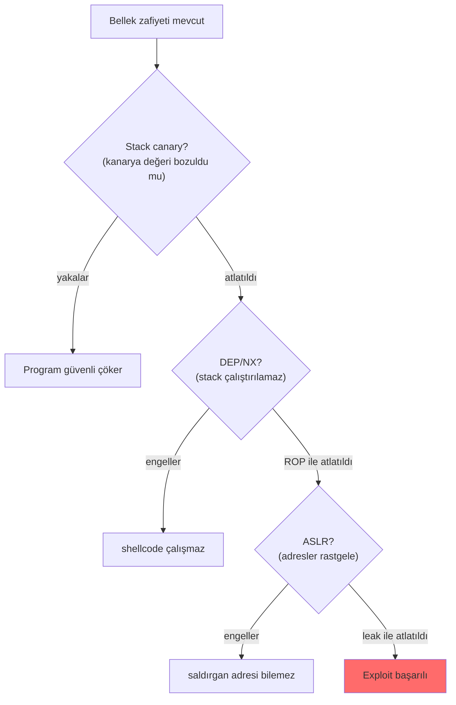

# 💥 Bellek Zafiyetlerine Giriş

Bellek güvenliği zafiyetleri (memory safety bugs), yazılım güvenliğinin en eski ve hâlâ en yıkıcı sınıfıdır. Bu dosya, buffer overflow'un **mantığını kavramsal olarak** kurar (satır satır exploit yazımı değil), neden bu kadar tehlikeli olduğunu ve modern savunmaların (ASLR/DEP/canary) bunları nasıl köreltmeye çalıştığını anlatır.

> Ön koşul: [surecler-ve-bellek.md](surecler-ve-bellek.md) (stack/heap düzeni). İlgili: [enjeksiyon-aileleri.md](../04-web-guvenligi/zafiyet-siniflari/enjeksiyon-aileleri.md) (kod/veri karışımı ortak kök nedeni).

---

## 1. Ortak kök neden: kod ile verinin karışması

Neredeyse tüm ciddi zafiyetlerin altında tek bir tema yatar: **saldırganın kontrol ettiği verinin, program tarafından "kod/komut" gibi yorumlanması.** Buffer overflow bunun bellek düzeyindeki hâlidir; SQLi, XSS, command injection ise üst katmanlardaki kardeşleridir → [enjeksiyon-aileleri.md](../04-web-guvenligi/zafiyet-siniflari/enjeksiyon-aileleri.md). Bu temanın en derin kökü donanım mimarisindedir: von Neumann mimarisinde kod ve veri aynı bellekte durduğu için ([00-baslangic/bilgisayar-temelleri.md](../00-baslangic/bilgisayar-temelleri.md)), "veri" olması gereken bir girdinin çalıştırılabilir "kod"a dönüşmesi fiziksel olarak mümkündür — buffer overflow tam olarak bu olanağı istismar eder.

Bellek güvenliği bağlamında spesifik kök neden: **sınır kontrolü yapılmayan bellek işlemleri.** Program, bir tampona (buffer) yazarken "bu veri tamponun boyutunu aşıyor mu?" diye kontrol etmezse, fazla veri **komşu belleğe taşar** ve orayı bozar.

---

## 2. Stack buffer overflow — mekanizma

Bir fonksiyon çağrıldığında, stack'te onun için bir **çerçeve (stack frame)** açılır. Bu çerçevede yerel değişkenler (buffer'lar dahil) ve fonksiyon bittiğinde nereye döneceğini söyleyen **dönüş adresi (return address)** yan yana durur.

```
Fonksiyon çağrılmadan önce stack (yüksek→düşük):

  [ ... önceki çerçeve ... ]
  [ DÖNÜŞ ADRESİ          ]  ← fonksiyon bitince buraya atlanacak
  [ kaydedilmiş çerçeve p.]
  [ buffer[64]            ]  ← saldırganın yazdığı yer (aşağı doğru dolar)
  [ ... ]

64 byte'lık buffer'a 100 byte yazılırsa:
  [ DÖNÜŞ ADRESİ ← EZİLDİ!]  ← saldırganın seçtiği adresle değişir
  [ AAAAAAAA...            ]  ← taşma dönüş adresine ulaştı
  [ buffer: AAAA...        ]
```

**Sonuç:** Fonksiyon `return` yaptığında, CPU **saldırganın yazdığı adrese** atlar. Saldırgan bu adresi kendi koduna (shellcode) veya var olan bir kod parçasına yönlendirebilir → **rastgele kod çalıştırma (arbitrary code execution)**.

### Neden C/C++'ta yaygın?
`strcpy`, `gets`, `sprintf` gibi eski C fonksiyonları **boyut kontrolü yapmaz**. `gets(buffer)` kullanıcıdan sınırsız veri okur — klasik açık kapı.

```c
// ZAFİYETLİ (asla böyle yazma)
void giris() {
    char buffer[64];
    gets(buffer);          // sınır kontrolü YOK — taşabilir
}

// GÜVENLİ
void giris() {
    char buffer[64];
    fgets(buffer, sizeof(buffer), stdin);   // boyutla sınırlı
}
```

> **Not:** Yukarıdaki mantık kavramsaldır ve savunmayı anlamak içindir. Fiili exploit geliştirme (offset bulma, shellcode, ROP) ayrı ve ileri bir konudur; giriş için güvenli bir lab (ör. TryHackMe "Buffer Overflow Prep", protostar) kullan → [15-projeler/spesifikasyon-sonrasi-yol-haritasi.md](../15-projeler/spesifikasyon-sonrasi-yol-haritasi.md).

---

## 3. Zafiyet aileleri (özet)

| Zafiyet | Ne olur | Bölge |
|---------|---------|-------|
| **Stack buffer overflow** | Yerel buffer taşar, dönüş adresi ezilir | Stack |
| **Heap overflow** | Heap'te taşma, komşu meta veri/işaretçi bozulur | Heap |
| **Use-after-free (UAF)** | Serbest bırakılmış bellek yeniden kullanılır | Heap |
| **Double free** | Aynı bellek iki kez serbest bırakılır | Heap |
| **Integer overflow** | Sayı taşması yanlış boyut hesabına → küçük tampon | Her yer |
| **Format string** | `printf(kullanıcı_girdisi)` — bellek okuma/yazma | Her yer |
| **Off-by-one** | Bir byte'lık taşma (döngü sınır hatası) | Stack/heap |

---

## 4. Modern savunmalar: exploit'i zorlaştırmak

İşletim sistemleri ve derleyiciler, bu zafiyetleri sömürmeyi **katman katman** zorlaştıran savunmalar geliştirdi. Hiçbiri tek başına mutlak değil; birlikte "derinlemesine savunma" oluştururlar.



### ASLR (Address Space Layout Randomization)
Bellek bölgelerinin (stack, heap, kütüphaneler) başlangıç adreslerini **her çalışmada rastgeleleştirir**. Saldırgan "shellcode'um `0x7fff1234`'te" diyemez, çünkü adres her seferinde değişir. Atlatma: bir bellek sızıntısı (info leak) ile gerçek adresi öğrenmek.
```bash
# Linux'ta ASLR durumu (2 = tam açık)
cat /proc/sys/kernel/randomize_va_space
```

### DEP / NX (Data Execution Prevention / No-eXecute)
Bellek sayfalarını "**ya yazılabilir ya çalıştırılabilir, ikisi birden değil**" (W^X) yapar. Stack'e yazılan shellcode çalıştırılamaz. Atlatma: **ROP** (Return-Oriented Programming) — var olan çalıştırılabilir kod parçalarını (gadget) zincirlemek.

### Stack canary (stack koruyucu / cookie)
Fonksiyon başında, dönüş adresinin hemen önüne rastgele bir "**kanarya**" değeri konur. Fonksiyon dönerken bu değer kontrol edilir; taşma onu bozduysa program **güvenli şekilde çöker** (exploit yerine crash). Adı, madencilerin zehirli gazı erken tespit için kullandığı kanaryadan gelir.

### CFI, PIE, Fortify ve diğerleri
Control Flow Integrity (kontrol akışını doğrular), PIE (kod adresini de rastgeleleştirir), `_FORTIFY_SOURCE` (derleme zamanı sınır kontrolü) gibi ek katmanlar.

---

## 5. Nüans: neden hâlâ var? (bellek-güvenli diller)

Bunca savunmaya rağmen bellek zafiyetleri her yıl ciddi CVE'lerin büyük kısmını oluşturur. Neden?
- Savunmalar exploit'i **zorlaştırır, imkânsız kılmaz** (leak + ROP kombinasyonuyla atlatılır).
- Milyarlarca satır eski C/C++ kodu (işletim sistemleri, tarayıcılar) hâlâ çalışıyor.

**Kökten çözüm — bellek-güvenli diller:** Rust, Go, Java, C# gibi diller sınır kontrolünü ve bellek yönetimini **dilin kendisi** garanti eder; tüm bir zafiyet sınıfını ortadan kaldırır. Bu yüzden ABD siber güvenlik kurumları (CISA/NSA) yeni projelerde bellek-güvenli dillere geçişi resmen tavsiye ediyor (kaynak: CISA/NSA "The Case for Memory Safe Roadmaps", [cisa.gov](https://www.cisa.gov/resources-tools/resources/case-memory-safe-roadmaps)). Rust'ın "ownership" (sahiplik) modeli use-after-free'yi derleme zamanında imkânsız kılar. Bu dil seçimi bir güvenlik kararıdır ve güvenli kodlamanın temel ilkelerinden biridir ([13-guvenli-kodlama-devsecops/guvenli-kodlama-ilkeleri.md](../13-guvenli-kodlama-devsecops/guvenli-kodlama-ilkeleri.md)).

> Dil seçimi bir güvenlik kararıdır → [13-guvenli-kodlama-devsecops/guvenli-kodlama-ilkeleri.md](../13-guvenli-kodlama-devsecops/guvenli-kodlama-ilkeleri.md).

---

## 6. Saldırı–savunma kesişimi (özet)

- **Kök neden ortaktır:** "Saldırgan verisi kod gibi yorumlanıyor" — bellek zafiyetlerinden web enjeksiyonlarına kadar aynı tema. Bunu görmek, tüm bir savunma felsefesini birleştirir.
- **Savunmalar katmanlıdır:** ASLR + DEP + canary birlikte, tek bir zafiyeti işletilebilir bir exploit'e dönüştürmeyi çok pahalı hâle getirir — ama bir sızıntıyla zincir kırılabilir.
- **Gelecek dilde:** Yeni kodu bellek-güvenli dilde yazmak, tek bir savunmadan daha etkilidir çünkü zafiyeti **var olmadan** engeller. PQC'de "matematiksel çeşitlilik" nasıl geleceğe hazırlıksa, bellek-güvenli diller de öyle → [post-kuantum-kriptografi.md](../05-kriptografi/post-kuantum-kriptografi.md).

> **Modül 03 tamamlandı.** Sonraki: [04-web-guvenligi/web-mimarisi.md](../04-web-guvenligi/web-mimarisi.md).
