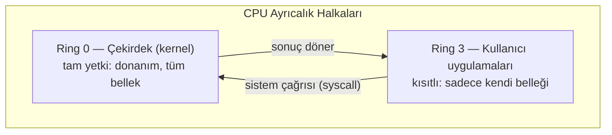
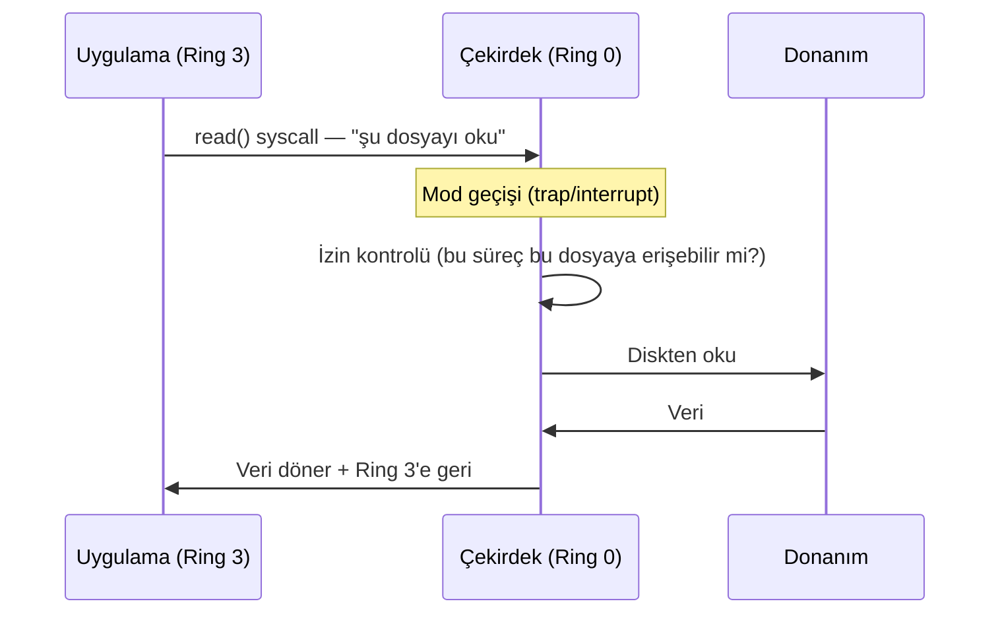
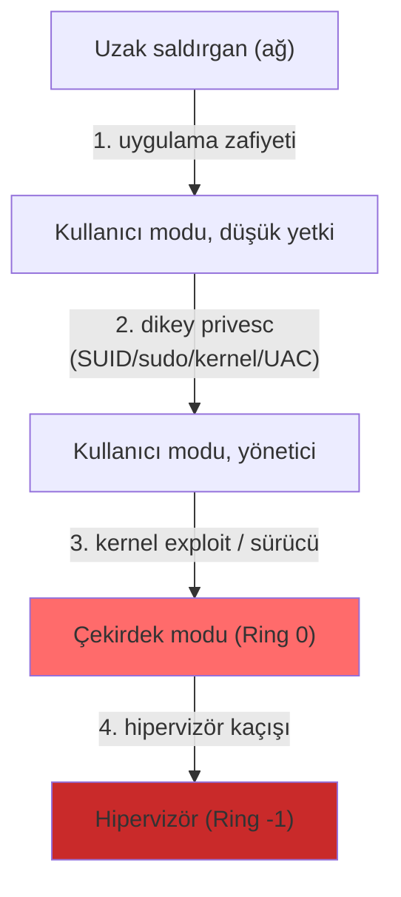

# 🔐 Kullanıcı Modu ve Çekirdek Modu

Modern işletim sistemi güvenliğinin **en temel sınırı** budur: kod ya kısıtlı **kullanıcı modunda (user mode)** ya da ayrıcalıklı **çekirdek modunda (kernel mode)** çalışır. Bu sınırın nasıl işlediğini ve nasıl aşıldığını anlamak, ayrıcalık yükseltmenin (privilege escalation) özünü anlamaktır.

> Ön koşul: [surecler-ve-bellek.md](surecler-ve-bellek.md). Karşılaştırma: [linux-temelleri.md](../02-linux-windows/linux-temelleri.md), [windows-temelleri.md](../02-linux-windows/windows-temelleri.md).

---

## 1. Neden iki mod var?

Eğer her program donanıma (diske, belleğe, ağa) doğrudan erişebilseydi, tek bir hatalı/kötü program tüm sistemi çökertebilir veya diğer programların verisini okuyabilirdi. **Çözüm:** kodu iki ayrıcalık seviyesine ayırmak.

- **Kullanıcı modu (user mode):** Uygulamalar burada çalışır. **Kısıtlıdır** — donanıma doğrudan erişemez, yalnızca kendi belleğine dokunabilir. "İzin ver" değil, "rica et" dünyası.
- **Çekirdek modu (kernel mode):** İşletim sistemi çekirdeği burada çalışır. **Tam yetkilidir** — tüm belleğe, tüm donanıma erişir. Ring 0.

Bu, donanım tarafından zorlanan **CPU ayrıcalık halkalarıyla (protection rings)** uygulanır:



> x86 mimarisi 4 halka (0–3) tanımlar ama pratikte çoğu OS yalnızca Ring 0 (çekirdek) ve Ring 3 (kullanıcı) kullanır. Sanallaştırmada bir de "Ring -1" (hipervizör) kavramı vardır → [09-cloud](../09-cloud-virtualizasyon/temel-kavramlar.md).

---

## 2. Sistem çağrısı (syscall) — kontrollü geçit

Bir kullanıcı programı diske yazmak, ağa paket göndermek veya yeni bir süreç oluşturmak istediğinde bunu **kendisi yapamaz** — çekirdekten **sistem çağrısıyla (syscall)** rica eder. Syscall, kullanıcı modundan çekirdek moduna geçişin **tek meşru kapısıdır**.



- Geçiş, bir **kesme/tuzak (trap/interrupt)** ile olur. CPU modu Ring 3 → Ring 0'a yükselir, çekirdek işi yapar, sonra Ring 3'e döner.
- **Kritik nokta:** Çekirdek, her syscall'da **izin kontrolü** yapar. "Bu süreç gerçekten bu dosyayı okuyabilir mi?" İşte tüm erişim kontrolü ([izinler](../02-linux-windows/linux-temelleri.md), ACL) burada uygulanır.

### Örnek syscall'lar
| Linux | Windows (kabaca) | İş |
|-------|------------------|-----|
| `read`, `write` | `NtReadFile`, `NtWriteFile` | Dosya G/Ç |
| `open`, `close` | `NtCreateFile` | Dosya aç/kapat |
| `fork`, `execve` | `NtCreateProcess` | Süreç oluştur |
| `socket`, `connect` | `WSA...` | Ağ |
| `mmap`, `mprotect` | `NtAllocateVirtualMemory` | Bellek yönetimi |

```bash
# Bir programın yaptığı TÜM syscall'ları izle (Linux) — güçlü analiz aracı
strace ls
strace -f -e trace=network curl http://ornek.com   # sadece ağ syscall'ları
```

> **Kesişim:** `strace`/`ltrace` (Linux) ve API Monitor / ETW (Windows), bir programın (veya zararlının) ne yaptığını syscall düzeyinde ortaya çıkarır — dinamik zararlı yazılım analizinin temelidir. Ayrıca EDR'ler tam da syscall/API çağrılarını izleyerek zararlı davranışı tespit eder; saldırganlar bu izlemeyi atlatmak için **doğrudan syscall (direct syscalls)** teknikleri kullanır.

---

## 3. İzin modelleri: Linux vs Windows (karşılaştırmalı)

Her iki sistem de aynı temel fikri (kullanıcı/çekirdek ayrımı + syscall'da izin kontrolü) farklı somutlaştırır.

| Konu | Linux | Windows |
|------|-------|---------|
| Ayrıcalıklı kullanıcı | **root** (UID 0) | **SYSTEM** / Administrator |
| Kimlik | UID/GID | SID + erişim token'ı |
| İzin kontrolü | Dosya modu (rwx) + POSIX capabilities | ACL/ACE (DACL) + ayrıcalıklar (privileges) |
| Yetki yükseltme | `sudo`, SUID, capabilities | UAC, `SeDebugPrivilege` vb., "Run as admin" |
| İnce taneli yetki | **Capabilities** (`CAP_NET_RAW` gibi) | **Privileges** (`SeImpersonatePrivilege` gibi) |

### Linux capabilities — root'u parçalara ayırmak
Geleneksel model "ya root'sun ya değilsin" der; bu, [en az ayrıcalık](../00-baslangic/terminoloji-sozlugu.md) ilkesini bozar. **Capabilities**, root yetkisini ~40 küçük parçaya böler. Örneğin bir web sunucusuna sadece "1024 altı port açma" yetkisi (`CAP_NET_BIND_SERVICE`) verilir, tam root değil.

```bash
getcap -r / 2>/dev/null    # capabilities atanmış dosyaları bul (privesc enumerasyonu!)
# Örn. bir binary'de cap_setuid varsa, root'a geçiş yolu olabilir
```

### Windows privileges
Windows token'ları belirli **ayrıcalıklar** taşır. Bazıları ele geçirildiğinde doğrudan SYSTEM'e giden yollardır:
- `SeImpersonatePrivilege` → "Potato" saldırıları
- `SeDebugPrivilege` → başka süreçlerin belleğine erişim (LSASS'tan kimlik çalma)
- `SeBackupPrivilege` → her dosyayı okuma (SAM/hash dökme)

> `whoami /priv` ile listelenir → [windows-komut-referansi.md](../02-linux-windows/windows-komut-referansi.md).

---

## 4. Nüans: "ayrıcalık yükseltme" gerçekte nedir?

İki farklı yükseltme türü karıştırılır:

- **Dikey (vertical) privesc:** Düşük yetkiden yüksek yetkiye — kullanıcı → root/SYSTEM. Genelde bir çekirdek zafiyeti, yanlış yapılandırılmış SUID/sudo veya bir Windows ayrıcalığı yoluyla.
- **Yatay (horizontal) privesc:** Aynı seviyede başka bir kullanıcıya geçiş — kullanıcı A → kullanıcı B (ör. IDOR ile başka kullanıcının verisine erişim → [idor-erisim-kontrolu.md](../04-web-guvenligi/zafiyet-siniflari/idor-erisim-kontrolu.md)).

**Kernel exploit'i neden bu kadar güçlü?** Çekirdek Ring 0'da çalıştığı için, çekirdekte bir zafiyet (ör. yazılabilir çekirdek belleği) doğrudan **tam sistem kontrolü** demektir — user-mode korumalarının (ASLR, sandbox) hepsini atlar. Bu yüzden çekirdek zafiyetleri en yüksek değerdedir ve yamaları en acildir.

---

## 5. Güven sınırları (trust boundaries) haritası



Her ok bir **güven sınırıdır** — savunma her sınırda ayrı ayrı konumlanır (derinlemesine savunma). Saldırgan içeri girdikçe yukarı tırmanmaya çalışır; savunmacı her basamağı zorlaştırır.

---

## 6. Saldırı–savunma kesişimi (özet)

- **Syscall = izin kontrol noktası:** Tüm erişim denetimi burada uygulanır; EDR/güvenlik ürünleri de burayı izler.
- **En az ayrıcalık teknikte somutlaşır:** Linux capabilities ve Windows privilege minimizasyonu, "her şey ya root ya değil" ikilisini kırar — saldırgan bir servisi ele geçirse bile tam root olamaz.
- **Kernel/hipervizör en yüksek ödül:** Yükseldikçe savunma azalır; bu yüzden çekirdek yamaları ve hipervizör izolasyonu ([09-cloud](../09-cloud-virtualizasyon/temel-kavramlar.md)) kritik önceliktir.

> **Sonraki:** [bellek-zafiyetleri-giris.md](bellek-zafiyetleri-giris.md).
