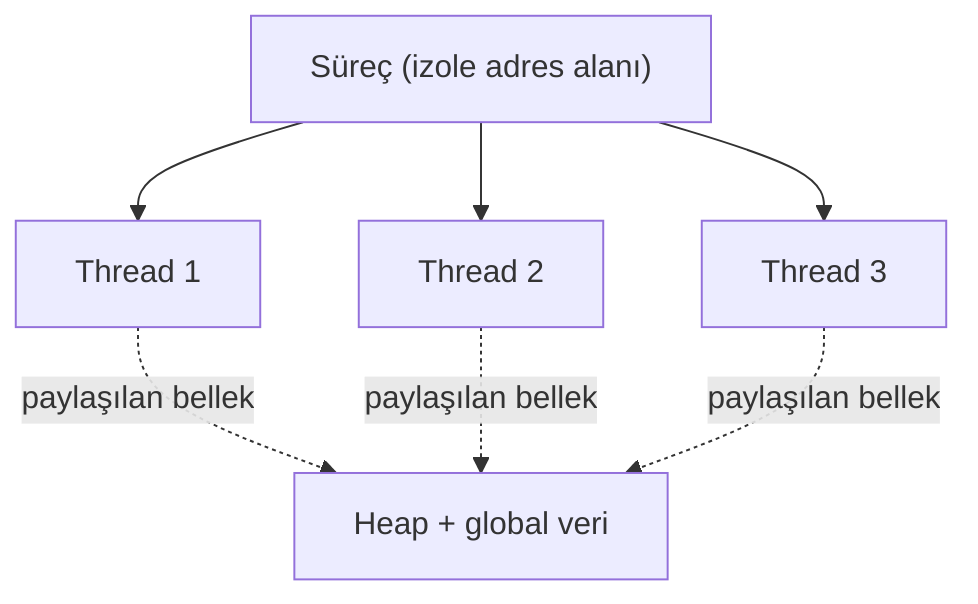
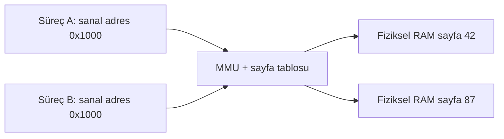
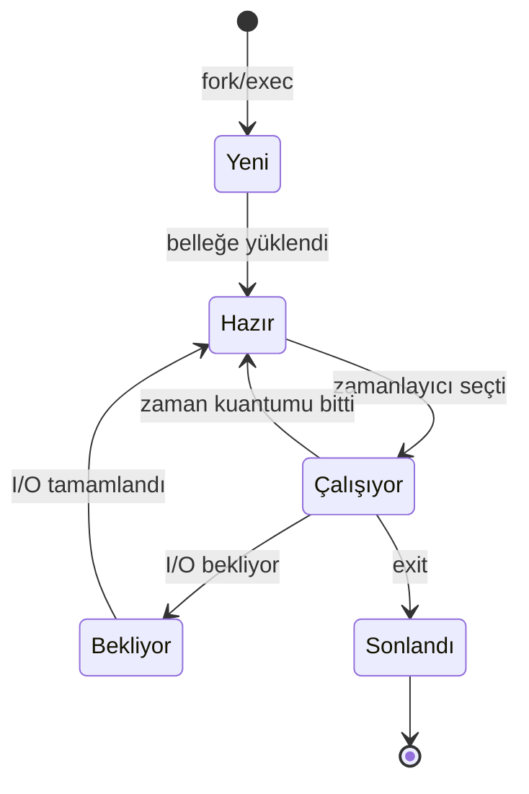

# ⚙️ Süreçler ve Bellek

Bir bilgisayarın "çalışması", özünde süreçlerin bellekte yaşamasıdır. Zafiyetlerin büyük kısmı (buffer overflow'dan kimlik bilgisi çalmaya) süreç ve bellek modelinin bir varsayımını istismar eder. Bu dosya o modeli kurar.

> Devamı: [kullanici-cekirdek-modu.md](kullanici-cekirdek-modu.md), [bellek-zafiyetleri-giris.md](bellek-zafiyetleri-giris.md). Temel: [bilgisayar-temelleri.md](../00-baslangic/bilgisayar-temelleri.md).

---

## 1. Süreç (process) nedir?

**Süreç**, çalışan bir programın örneğidir. Disk'teki program pasif bir dosyadır; çalıştırıldığında işletim sistemi ona bellek, bir kimlik (PID) ve kaynaklar atar — işte o an bir süreç doğar.

Her sürecin sahip olduğu:
- **PID** (Process ID): benzersiz kimlik.
- **Kendi sanal adres alanı** (aşağıda) — diğer süreçlerden izole.
- **Bir güvenlik bağlamı**: hangi kullanıcı adına çalışıyor (Linux: UID; Windows: token → [windows-temelleri.md](../02-linux-windows/windows-temelleri.md)).
- **Bir veya daha çok iş parçacığı (thread)**.

### Süreç vs iş parçacığı (thread)
- **Süreç:** Kendi izole belleği olan yürütme birimi. Süreçler birbirinin belleğini (normalde) göremez → **izolasyon = güvenlik sınırı**.
- **İş parçacığı (thread):** Bir sürecin *içinde* çalışan, aynı belleği **paylaşan** hafif yürütme birimi. Aynı sürecin thread'leri veriyi paylaşır (hızlı ama senkronizasyon riski).



> **Kesişim:** Süreç izolasyonu, bir uygulamanın çökmesinin/ele geçirilmesinin diğerlerini doğrudan etkilememesini sağlar. **Sandbox'lar** (tarayıcı sekmeleri, konteynerler) bu izolasyonu güçlendirir. İzolasyonu kırmak — bir süreçten başka bir sürecin belleğini okumak/yazmak — birçok saldırının hedefidir (process injection, [09-cloud](../09-cloud-virtualizasyon/container-guvenligi.md) container escape).

---

## 2. Sanal bellek (virtual memory) ve MMU

Her süreç, **sanki tüm belleğe tek başına sahipmiş gibi** çalışır. Gerçekte fiziksel RAM paylaşılır; bu illüzyonu **sanal bellek** kurar.

- Her süreç **sanal adresler** kullanır (0'dan başlayan kendi adres alanı).
- **MMU** (Memory Management Unit, donanım) ve işletim sistemi, bu sanal adresleri **fiziksel adreslere** çevirir (sayfa tabloları / page tables ile).
- Bellek **sayfalar (pages)** hâlinde (tipik 4 KB) yönetilir.



### Neden sanal bellek?
1. **İzolasyon:** A'nın `0x1000`'i ile B'nin `0x1000`'i farklı fiziksel yerlere gider → süreçler birbirine karışamaz.
2. **Esneklik:** RAM'den büyük programlar çalışabilir (kullanılmayan sayfalar diske "swap" edilir).
3. **Güvenlik:** Her sayfaya izin verilir (okunabilir/yazılabilir/çalıştırılabilir). Bu, **DEP/NX** (aşağıda) savunmasının temelidir.

> **Kesişim:** Sanal bellek çevirisi zamanlaması, **Meltdown/Spectre** gibi yan kanal (side-channel) saldırılarının istismar ettiği yerdir — MMU/önbellek davranışından, izin verilmeyen belleğin içeriği dolaylı olarak sızdırılabilir. Bu saldırılar, işlemcinin performans için kullandığı önbellek (cache) ve spekülatif yürütme mekanizmalarını hedefler; bu mekanizmaların neden var olduğu (von Neumann darboğazını aşma) [00-baslangic/bilgisayar-temelleri.md](../00-baslangic/bilgisayar-temelleri.md)'de anlatılan bellek hiyerarşisiyle doğrudan ilişkilidir — yani bir performans optimizasyonu, bir güvenlik zayıflığına dönüşmüştür.

---

## 3. Bir sürecin bellek düzeni (memory layout)

Bir süreç belleği, işlevsel bölgelere ayrılır. Bu düzeni bilmek, bellek zafiyetlerini anlamanın ön koşuludur.

```
Yüksek adresler
┌────────────────────────┐
│         Stack          │  ← yerel değişkenler, dönüş adresleri (aşağı büyür ↓)
│           ↓            │
│                        │
│           ↑            │
│         Heap           │  ← dinamik bellek (malloc/new) (yukarı büyür ↑)
├────────────────────────┤
│         BSS            │  ← ilklendirilmemiş global değişkenler
├────────────────────────┤
│         Data           │  ← ilklendirilmiş global/statik değişkenler
├────────────────────────┤
│         Text (Code)    │  ← programın makine kodu (salt-okunur, çalıştırılabilir)
└────────────────────────┘
Düşük adresler
```

| Bölge | İçerik | Güvenlik notu |
|-------|--------|---------------|
| **Text/Code** | Makine kodu | Salt-okunur olmalı (kod değişikliğini engeller). |
| **Data / BSS** | Global/statik değişkenler | — |
| **Heap** | Dinamik bellek (`malloc`, `new`) | Heap overflow, use-after-free, double-free. |
| **Stack** | Yerel değişkenler, fonksiyon dönüş adresleri | **Stack buffer overflow'un** sahnesi. |

### Stack vs Heap — kritik ayrım

| | Stack | Heap |
|---|-------|------|
| Yönetim | Otomatik (fonksiyon gir/çık) | Manuel (`malloc`/`free`) veya GC |
| Hız | Çok hızlı | Daha yavaş |
| Boyut | Sınırlı (taşarsa "stack overflow") | Büyük |
| Büyüme yönü | Aşağı (yüksek→düşük adres) | Yukarı |
| Tipik zafiyet | Buffer overflow → dönüş adresi ezme | Use-after-free, heap spraying |

> **Kesişim:** Stack'te fonksiyonun **dönüş adresi (return address)** yerel değişkenlerin yanında durur. Bir yerel buffer'ı taşırıp bu dönüş adresini ezmek = programın akışını saldırganın istediği yere yönlendirmek = klasik **stack buffer overflow** exploit'i → [bellek-zafiyetleri-giris.md](bellek-zafiyetleri-giris.md).

---

## 4. Süreç yaşam döngüsü ve durumları



- **İşletim sistemi zamanlayıcısı (scheduler)** hangi sürecin CPU'yu ne zaman kullanacağına karar verir (bağlam değişimi / context switch).
- Bir süreç I/O (disk, ağ) beklerken CPU'yu bırakır → başka süreç çalışır. Bu **eşzamanlılık (concurrency)** illüzyonunu yaratır.

### Süreç oluşturma
- **Linux:** `fork()` (kopya süreç oluştur) + `exec()` (yeni program yükle). Ebeveyn-çocuk ağacı oluşur (`pstree` ile görülür).
- **Windows:** `CreateProcess()`.

> **Kesişim:** Süreç **soy ağacı (parentage)** tehdit avında altındır: `winword.exe → cmd.exe → powershell.exe` zinciri son derece şüphelidir (bir Word belgesi neden PowerShell başlatsın?). EDR'ler tam olarak bu anormal ebeveyn-çocuk ilişkilerini avlar → [log-analizi.md](../11-soc-mavi-takim/log-analizi.md).

---

## 5. Süreçler arası iletişim (IPC) ve paylaşılan bellek

Süreçler izole olsa da bazen iletişmeleri gerekir. Bunun için kontrollü **IPC** mekanizmaları vardır: pipe, socket, paylaşılan bellek (shared memory), mesaj kuyruğu, sinyal (signal).

> **Kesişim:** IPC kanalları hem meşru hem istismar edilebilir. Örneğin Windows'ta **named pipe**'lar yanal hareket ve C2 için; paylaşılan bellek ise **process injection** (bir sürecin belleğine kod enjekte etme) için kullanılabilir.

---

## 6. Nüans: bellek "boş" değildir — kalıntı veri

Bir süreç sonlandığında veya `free()` çağrıldığında, bellekteki **veri hemen silinmez**; sadece "kullanılabilir" işaretlenir. Bu yüzden:
- Serbest bırakılan bellek yeniden ayrıldığında eski (belki hassas) veriyi içerebilir.
- RAM'de parolalar, anahtarlar, oturum token'ları düz metin kalabilir → **bellek adli analizi** (memory forensics) ve Mimikatz gibi araçların çalışma temeli budur.

Bu yüzden kriptografi kütüphaneleri hassas belleği kullandıktan sonra **kasıtlı olarak sıfırlar** (memory zeroing).

---

## 7. TOCTOU (time-of-check to time-of-use) yarışı

Bir program bir kaynağı (dosya, izin, bakiye) önce **kontrol eder** (check), sonra **kullanır** (use). Bu iki adım atomik değilse, arada küçük bir **zaman penceresi** açılır; saldırgan tam o pencerede kaynağı değiştirirse, program artık kontrol ettiği şeyi değil, saldırganın koyduğu şeyi kullanır. Bu, bir **yarış koşulunun** (race condition) klasik biçimidir: sonuç, olayların zamanlamasına bağlıdır.

**Klasik örnek — sembolik link (symlink) yarışı:** Ayrıcalıklı (ör. SUID) bir program bir dosyanın sahibini kontrol edip "senin, yazılabilir" der; kontrol ile açma arasında saldırgan o yolu `/etc/passwd`'a işaret eden bir symlink ile değiştirir. Program artık root yetkisiyle saldırganın hedeflediği dosyaya yazar → **yerel yetki yükseltme** ([../10-pentest-metodolojisi/privilege-escalation.md](../10-pentest-metodolojisi/privilege-escalation.md)).

**Neden zor bir sınıf:** Yarış penceresi mikrosaniyelerdir ve deterministik değildir — saldırgan yarışı "kazanmak" için binlerce kez dener. Bu, tespiti de zorlaştırır: tek bir başarılı deneme, gürültünün içinde kaybolur.

**Savunma — pencereyi kapat:**
- **Atomiklik:** Kontrol ve kullanımı tek, bölünemez adımda yap — yol (path) üzerinden değil dosya tanıtıcısı (file descriptor) üzerinden çalış (`open()` sonra `fstat`), `O_NOFOLLOW`/`openat` ile symlink takibini engelle.
- **Yetki düşür (drop privileges):** Ayrıcalıklı program kullanıcı dosyasına erişirken kullanıcının yetkisine iner.
- **Kilitleme/serileştirme:** Paylaşılan kaynağı kilitle; eşzamanlı erişimi serileştir.

> **Kesişim — aynı kök, farklı katman:** Web'de aynı "kontrol-sonra-kullan penceresi", eşzamanlı isteklerle bir limitin aşılması (limit-overrun) olarak görülür → [../04-web-guvenligi/zafiyet-siniflari/race-condition.md](../04-web-guvenligi/zafiyet-siniflari/race-condition.md). OS'ta symlink yarışı, web'de çift-harcama; ikisi de "iki adımın atomik olmaması"dır.

---

## 8. Saldırı–savunma kesişimi (özet)

- **İzolasyon savunmanın temeli:** Süreç/sanal bellek izolasyonu, sandbox ve konteyner güvenliğinin çekirdeğidir. Kırıldığında (Spectre, container escape) sonuçlar ağırdır.
- **Bellek = kanıt deposu:** Çalışan bir sistemde kimlik bilgileri, şifreleme anahtarları, zararlı kod yalnızca RAM'de olabilir → IR'de "önce bellek imajı" kuralı.
- **Stack/heap yapısı = exploit sahnesi:** Bellek zafiyetlerini ([bellek-zafiyetleri-giris.md](bellek-zafiyetleri-giris.md)) ve savunmalarını (ASLR/DEP/stack canary) anlamak, bu bölüm olmadan mümkün değildir.
- **Zamanlama da bir saldırı yüzeyidir:** TOCTOU/yarış koşulu, "iki adımın atomik olmaması" kök nedeniyle OS'ta (symlink→privesc) ve web'de (limit-overrun→çift-harcama) aynı biçimde karşımıza çıkar.

> **Sonraki:** [kullanici-cekirdek-modu.md](kullanici-cekirdek-modu.md).
