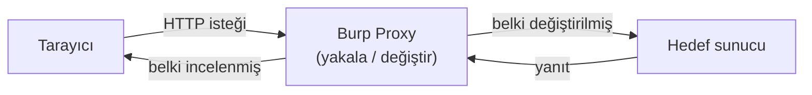
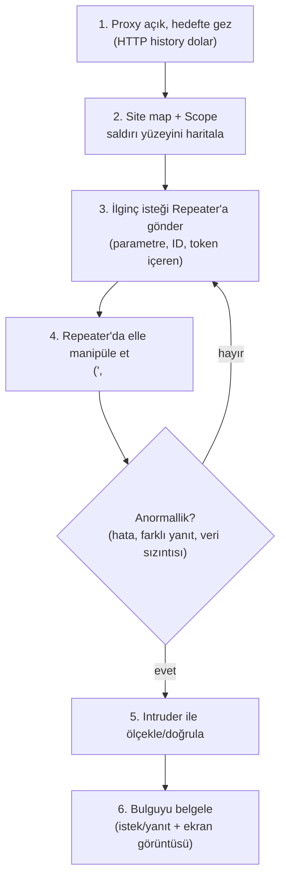

# 🧰 Burp Suite Rehberi

Burp Suite, web güvenlik testinin fiili standart aracıdır. Temelde bir **araya giren vekil sunucudur (intercepting proxy)**: tarayıcı ile sunucu arasına oturup her HTTP isteğini yakalar, incelemenize, değiştirmenize ve tekrar göndermenize izin verir. Bu, [web-mimarisi.md](web-mimarisi.md)'deki "istemciye asla güvenme" ilkesini pratikte kanıtlama aracıdır.

> Ön koşul: [http-web-iletisimi.md](../01-ag-networking/http-web-iletisimi.md) (HTTP döngüsü). Uygulama: [pratik-lab/juice-shop-notlari.md](pratik-lab/juice-shop-notlari.md).

---

## 1. Neden Burp? Araya giren vekil mantığı

Tarayıcıdaki JavaScript kontrolleri, gizli form alanları, devre dışı butonlar — hepsi **istemci tarafındadır** ve atlatılabilir. Burp, isteği tarayıcıdan çıkıp sunucuya varmadan **arada yakalar**; böylece tarayıcının izin vermeyeceği değişiklikleri (fiyatı `100` → `1` yapmak, `id=5` → `id=6`) elle uygularsınız.



---

## 2. Kurulum ve yapılandırma (adım adım)

> ⚠️ Burp'ü **yalnızca kendine ait veya izinli hedeflerde** kullan → [metodoloji-ve-rules-of-engagement.md](../10-pentest-metodolojisi/metodoloji-ve-rules-of-engagement.md).

1. **Kur:** Burp Suite Community (ücretsiz) — Kali'de yerleşik gelir veya portswigger.net'ten indir. `burpsuite` komutuyla başlat.
2. **Proxy dinleyicisini doğrula:** `Proxy → Options` → dinleyici `127.0.0.1:8080` çalışıyor olmalı (varsayılan).
3. **Tarayıcıyı Burp'e yönlendir:**
   - En kolayı: Burp'ün gömülü tarayıcısı (`Proxy → Intercept → Open Browser`).
   - Veya sistem/Firefox proxy ayarını `127.0.0.1:8080` yap (FoxyProxy eklentisi pratiktir).
4. **HTTPS için CA sertifikası ekle:** Tarayıcıda `http://burp` adresine git → CA sertifikasını indir → tarayıcıya güvenilen otorite olarak ekle. Aksi hâlde HTTPS siteleri sertifika hatası verir (çünkü Burp trafiği araya girer → [pki-x509.md](../05-kriptografi/pki-x509.md)).

**Doğru kurulumun kontrolü:** `Proxy → Proxy settings` altında dinleyicinin `Running` durumda ve `127.0.0.1:8080` adresinde olduğunu görmelisin. Sertifika doğru kuruluysa, `http://burp` adresine gidip CA'yı indirip tarayıcıya eklediğinde, artık HTTPS sitelerinde sertifika uyarısı **çıkmaz** ve `HTTP history` sekmesinde şifreli trafiğin (443) içeriği düz metin olarak görünür. Uyarı hâlâ çıkıyorsa, CA sertifikası tarayıcının güvenilen otoriteler deposuna eklenmemiş demektir.

---

## 3. Temel modüller (workflow sırasıyla)

### Proxy — yakala ve gözlemle
Tüm trafiğin geçtiği kalp. `Intercept is on` iken her istek elinizde durur; düzenleyip `Forward` ile iletir veya `Drop` ile atarsınız. `HTTP history` sekmesi geçmiş tüm istekleri tutar (recon için altın).

```
Kullanım: hedefte gez, HTTP history'de tüm endpoint'leri, parametreleri,
çerezleri, token'ları haritala. Bu senin saldırı yüzeyi haritan.
```

### Target & Site map
Gezdiğin site otomatik ağaç olarak çıkar. Kapsam (scope) tanımla (`Target → Scope`) → sadece izinli hedefe odaklan, gürültüyü filtrele.

### Repeater — elle tekrar/değiştir
Bir isteği alıp **defalarca değiştirip gönderdiğin** manuel test modülü. En çok kullanılan sekme. IDOR, SQLi, yetki testleri burada yapılır.
```
Örnek IDOR testi (Repeater):
  GET /api/basket/5   → kendi sepetim
  ID'yi 6 yap, Send    → başkasının sepeti geldi mi? → IDOR
Bkz. zafiyet-siniflari/idor-erisim-kontrolu.md
```

### Intruder — otomatik/parametrik saldırı
Bir parametreyi **otomatik olarak birçok değerle** dener. Kullanımlar:
- **Enumeration:** `id` parametresini `1..1000` gez, `200` dönenleri bul (IDOR toplu sömürü).
- **Brute-force:** Parola/kullanıcı adı listesi dene (kimlik doğrulama testi).
- **Fuzzing:** Parametreye özel karakterler (`'`, `<`, `;`, `../`) enjekte edip anormal yanıt ara.

> Not: Community sürümde Intruder **hız kısıtlıdır** (throttled); yoğun kullanım için Professional gerekir. Küçük listeler için Community yeterli.

### Decoder & Comparer
- **Decoder:** Base64/URL/hex/HTML kodlama-çözme; hash üretme. Token analizi için.
- **Comparer:** İki yanıtı karşılaştır (ör. geçerli vs geçersiz giriş — blind SQLi/kullanıcı enumerasyonu farkını görmek).

### Extender (BApp Store)
Eklentilerle Burp'ü genişletir (ör. çeşitli tarayıcı/analiz eklentileri).

---

## 4. Tipik test akışı (bir zafiyet avının anatomisi)



---

## 5. Nüans ve etik

- **Community vs Professional:** Community ücretsiz ama **aktif tarayıcı (scanner)** ve tam hızlı Intruder yoktur. Öğrenme ve manuel test için Community fazlasıyla yeterlidir; Professional otomatik zafiyet taraması ekler.
- **Burp bir "hack butonu" değildir:** Güç, senin HTTP'yi ([http-web-iletisimi.md](../01-ag-networking/http-web-iletisimi.md)) ve zafiyet sınıflarını ([zafiyet-siniflari/](zafiyet-siniflari/sqli.md)) anlamandadır. Burp sadece isteği eline verir; ne değiştireceğini sen bilirsin.
- **Kapsam disiplini:** `Scope` tanımlamak sadece pratik değil, **etik/yasal** bir zorunluluktur — yanlışlıkla kapsam dışı bir hedefe istek göndermeyi önler.
- **Alternatifler:** OWASP ZAP (tamamen açık kaynak, benzer işlev), mitmproxy (CLI). Kavramlar taşınır.

---

## 6. Savunma perspektifi

Burp'ü bilmek savunmacıya da yarar: Burp'ün ne kadar kolay isteği değiştirdiğini gören bir geliştirici, **neden istemci tarafı doğrulamaya asla güvenilmeyeceğini** somut olarak anlar. Ayrıca WAF/güvenlik ekipleri, Burp benzeri araçların ürettiği trafiği (anormal parametre fuzzing, hızlı ID enumerasyonu) tespit etmeyi öğrenir → [log-analizi.md](../11-soc-mavi-takim/log-analizi.md).

> **Sonraki:** [pratik-lab/juice-shop-notlari.md](pratik-lab/juice-shop-notlari.md).
