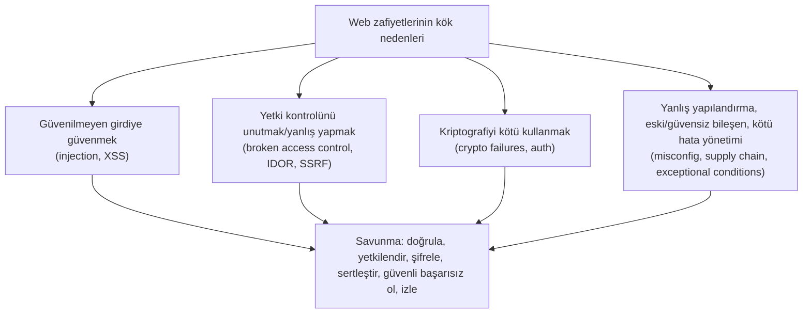

# 🔟 OWASP Top 10 — Tam Rehber (harita)

**OWASP Top 10**, web uygulamalarındaki en kritik güvenlik risklerinin, gerçek veriye dayalı, periyodik olarak güncellenen standart listesidir. Web güvenliğinin "ortak dili"dir — mülakatlar, denetimler ve raporlar bu çerçeveye atıfta bulunur.

> Bu dosya bir **harita/özet** olarak tasarlandı: en önemli kategorilerin derin anlatımı `zafiyet-siniflari/` alt dosyalarındadır; ilgili yerlerde link verilir. Ön koşul: [web-mimarisi.md](web-mimarisi.md).

> 📅 **Sürüm notu:** Aşağıdaki liste, güncel resmî sürüm olan **OWASP Top 10:2025**'e dayanır (kaynak: [owasp.org/Top10/2025](https://owasp.org/Top10/2025/)). Bir önceki 2021 sürümüne göre üç önemli değişiklik var: SSRF ayrı bir kategori olmaktan çıkıp **A01 Broken Access Control** altına alındı; "Vulnerable and Outdated Components" genişleyip **A03 Software Supply Chain Failures** oldu; ve **A10 Mishandling of Exceptional Conditions** (istisnai durumların yanlış ele alınması) tamamen yeni bir kategori olarak eklendi. Kategori adları/sıraları sürümden sürüme değişse de altta yatan zafiyet mekanizmaları (enjeksiyon, erişim kontrolü, kriptografi) kalıcıdır — bu yüzden burada hem güncel listeyi hem **kalıcı mekanizmaları** işliyoruz.

---

## Genel bakış tablosu (2025)

| # | Kategori | Öz | Derin dosya |
|---|----------|-----|-------------|
| **A01** | Broken Access Control (SSRF dahil) | Kullanıcının yetkisi olmayan işlem/veriye erişmesi; sunucuyu iç kaynaklara istek yaptırma | [idor-erisim-kontrolu.md](zafiyet-siniflari/idor-erisim-kontrolu.md), [csrf-ssrf.md](zafiyet-siniflari/csrf-ssrf.md) |
| **A02** | Security Misconfiguration | Yanlış/varsayılan yapılandırma | bu dosya §A02 |
| **A03** | Software Supply Chain Failures | Zafiyetli bağımlılık + build/dağıtım zinciri riskleri | [devsecops-ssdlc.md](../13-guvenli-kodlama-devsecops/devsecops-ssdlc.md) |
| **A04** | Cryptographic Failures | Hassas verinin zayıf/eksik şifrelenmesi | [05-kriptografi](../05-kriptografi/temel-kavramlar.md) |
| **A05** | Injection | Girdinin komut/sorgu olarak yorumlanması (SQLi, XSS dahil) | [sqli.md](zafiyet-siniflari/sqli.md), [enjeksiyon-aileleri.md](zafiyet-siniflari/enjeksiyon-aileleri.md) |
| **A06** | Insecure Design | Tasarım aşamasındaki güvenlik eksikliği | [stride](../08-grc-yonetisim-risk-uyum/stride-tehdit-modelleme.md) |
| **A07** | Authentication Failures | Zayıf kimlik doğrulama/oturum | [06-iam](../06-kimlik-erisim-yonetimi-iam/aaa-ve-mfa.md) |
| **A08** | Software or Data Integrity Failures | Doğrulanmamış güncelleme/serileştirme | [devsecops-ssdlc.md](../13-guvenli-kodlama-devsecops/devsecops-ssdlc.md) |
| **A09** | Security Logging and Alerting Failures | Tespit/uyarı/iz eksikliği | [11-soc](../11-soc-mavi-takim/log-analizi.md) |
| **A10** | Mishandling of Exceptional Conditions | Hataların yanlış ele alınması, "fail open", mantık hataları | [guvenli-kodlama-ilkeleri.md](../13-guvenli-kodlama-devsecops/guvenli-kodlama-ilkeleri.md) |

### 2021 → 2025 değişim özeti

| 2021 | 2025 | Değişim |
|------|------|---------|
| A01 Broken Access Control | A01 Broken Access Control | Aynı #1; **SSRF (eski A10) buraya eklendi** |
| A05 Security Misconfiguration | A02 | Yükseldi (#5 → #2) |
| A06 Vulnerable & Outdated Components | A03 Software Supply Chain Failures | Genişledi (tüm tedarik zinciri) |
| A02 Cryptographic Failures | A04 | Düştü |
| A03 Injection | A05 | Düştü |
| A04 Insecure Design | A06 | Düştü |
| A07 Identification & Auth Failures | A07 Authentication Failures | Ad kısaldı |
| A08 Software & Data Integrity | A08 | Aynı |
| A09 Logging & Monitoring | A09 Logging & Alerting | Ad değişti |
| A10 SSRF | — | A01'e taşındı |
| — | **A10 Mishandling of Exceptional Conditions** | **Yeni** |

---

## A01 — Broken Access Control (Bozuk Erişim Kontrolü)

**Ne:** Bir kullanıcının yetkisi olmadığı bir işlemi yapabilmesi veya veriye erişebilmesi. En sık görülen ve en yüksek etkili kategori; 2025'te **SSRF** de bu başlık altına alındı (SSRF de aslında "sunucunun erişmemesi gereken bir kaynağa eriştirilmesi", yani bir erişim kontrolü ihlalidir).
**Neden #1:** Erişim kontrolü her istekte, sunucuda, doğru şekilde uygulanmak zorundadır — bu her yerde kolayca unutulur.
**Örnekler:** IDOR (`/hesap?id=1044`), dikey yetki atlama (normal kullanıcı `/admin`'e erişir), yol geçişi (path traversal), eksik fonksiyon-seviyesi kontrol, SSRF.
➡️ Tam anlatım + PoC + önleme: **[idor-erisim-kontrolu.md](zafiyet-siniflari/idor-erisim-kontrolu.md)** (yatay/dikey yetki), **[csrf-ssrf.md](zafiyet-siniflari/csrf-ssrf.md)** (SSRF bölümü)

---

## A02 — Security Misconfiguration (Güvenlik Yanlış Yapılandırması)

**Ne:** Yazılım güvenli olabilir ama **yanlış ayarlanmış**: varsayılan parolalar, açık dizin listeleme, ayrıntılı hata mesajları (stack trace ifşası), gereksiz açık portlar/servisler, eksik güvenlik başlıkları ([http-web-iletisimi.md](../01-ag-networking/http-web-iletisimi.md) §6). 2025'te #5'ten #2'ye yükseldi — bulut ve karmaşık sistemlerde yanlış yapılandırmanın artan payını yansıtıyor.
**Örnekler:** `admin/admin` bırakılmış panel, S3 bucket'ın herkese açık olması ([09-cloud/temel-kavramlar.md](../09-cloud-virtualizasyon/temel-kavramlar.md) paylaşılan sorumluluk), debug modunun production'da açık kalması.
**Önleme:** Sertleştirme (hardening) temeli, otomatik yapılandırma taraması (CSPM), "default deny", minimal kurulum → [linux-hardening-checklist.md](../02-linux-windows/pratik-lab/linux-hardening-checklist.md).

---

## A03 — Software Supply Chain Failures (Yazılım Tedarik Zinciri Hataları)

**Ne:** 2021'in "Vulnerable and Outdated Components" kategorisinin genişlemiş hâli. Yalnızca zafiyetli kütüphaneleri değil, **tüm yazılım tedarik zincirini** kapsar: bağımlılıklar, build sistemleri, CI/CD boru hatları ve dağıtım altyapısı. Modern uygulamaların kodunun büyük kısmı üçüncü taraf bileşenlerden gelir.
**Klasik örnekler:** **Log4Shell (CVE-2021-44228)** — Log4j'deki tek zafiyet milyonlarca uygulamayı uzaktan kod çalıştırmaya açtı; **SolarWinds** — build sürecine enjekte edilen kodun binlerce kuruma yayılması.
**Önleme:** **SCA** (Software Composition Analysis), bağımlılık tarama (Dependabot, `npm audit`), SBOM (yazılım malzeme listesi), imzalı build/güncelleme ([anahtar-degisimi-ve-imza.md](../05-kriptografi/anahtar-degisimi-ve-imza.md) dijital imza), CI/CD sertleştirme.
➡️ **[devsecops-ssdlc.md](../13-guvenli-kodlama-devsecops/devsecops-ssdlc.md)** (tedarik zinciri güvenliği)

---

## A04 — Cryptographic Failures (Kriptografik Hatalar)

**Ne:** Hassas verinin (parola, kart, kişisel veri) korunmasında kriptografinin eksik/yanlış kullanımı.
**Örnekler:** HTTP üzerinden düz metin iletim, parolayı hash'lemeden veya zayıf hash (MD5) ile saklama ([02-linux-windows/linux-temelleri.md](../02-linux-windows/linux-temelleri.md) `/etc/shadow`), sabit kodlu (hardcoded) anahtar, zayıf TLS yapılandırması, salt kullanmama.
**Önleme:** Aktarımda TLS, saklamada güçlü şifreleme; parolalarda **Argon2/bcrypt** (asla düz veya MD5/SHA1); anahtar yönetimi.
➡️ Tam anlatım: **[05-kriptografi/temel-kavramlar.md](../05-kriptografi/temel-kavramlar.md)**, [pki-x509.md](../05-kriptografi/pki-x509.md)

---

## A05 — Injection (Enjeksiyon)

**Ne:** Güvenilmeyen girdinin bir yorumlayıcıya (SQL, OS shell, LDAP, tarayıcı) **komut/sorgu** olarak geçmesi. XSS de bu ailenin bir üyesidir. 2025'te #3'ten #5'e düştü (framework'lerin varsayılan korumaları arttığı için) ama hâlâ en yıkıcı sınıflardan.
**Ortak kök neden:** Kod ile verinin karışması → [enjeksiyon-aileleri.md](zafiyet-siniflari/enjeksiyon-aileleri.md). Bu, [bellek-zafiyetleri-giris.md](../03-isletim-sistemi-ici/bellek-zafiyetleri-giris.md)'deki buffer overflow ile aynı kök nedeni paylaşır (veri → kod).
➡️ Derin dosyalar: **[sqli.md](zafiyet-siniflari/sqli.md)**, **[xss.md](zafiyet-siniflari/xss.md)**, **[enjeksiyon-aileleri.md](zafiyet-siniflari/enjeksiyon-aileleri.md)**

---

## A06 — Insecure Design (Güvensiz Tasarım)

**Ne:** Kod hatası değil, **tasarım** hatası. Uygulama, güvenlik hiç düşünülmeden tasarlandığı için baştan zafiyetli. Örn. hız sınırı olmayan "şifre sıfırlama", iş mantığını (business logic) kötüye kullanmaya açık akışlar.
**Neden ayrı kategori:** Mükemmel yazılmış kod bile kötü tasarımı kurtaramaz. Çözüm **shift-left**: tehdit modellemeyi tasarım aşamasına taşımak.
➡️ **[stride-tehdit-modelleme.md](../08-grc-yonetisim-risk-uyum/stride-tehdit-modelleme.md)**, [guvenli-kodlama-ilkeleri.md](../13-guvenli-kodlama-devsecops/guvenli-kodlama-ilkeleri.md)

---

## A07 — Authentication Failures (Kimlik Doğrulama Hataları)

**Ne:** Zayıf kimlik doğrulama ve oturum yönetimi: zayıf parola politikası, brute-force korumasızlığı, oturum token'larının kötü yönetimi, MFA eksikliği, kimlik bilgisi doldurma (credential stuffing) savunmasızlığı. (2021'deki "Identification and Authentication Failures" adı 2025'te kısaldı.)
**Önleme:** MFA, güçlü parola + hesap kilitleme, güvenli oturum ([http-web-iletisimi.md](../01-ag-networking/http-web-iletisimi.md) çerez bayrakları), phishing'e dayanıklı FIDO2.
➡️ **[06-iam/aaa-ve-mfa.md](../06-kimlik-erisim-yonetimi-iam/aaa-ve-mfa.md)**

---

## A08 — Software or Data Integrity Failures (Bütünlük Hataları)

**Ne:** Yazılım veya verinin bütünlüğünün doğrulanmaması. İki alt tema: (1) **güvensiz deserialization** (serileştirilmiş nesneye güvenip kod çalıştırma), (2) doğrulanmamış güncelleme/eklenti. Tedarik zinciri boyutu 2025'te büyük ölçüde A03'e taşındı; A08 daha çok bütünlük doğrulaması eksikliğine odaklanır.
**Önleme:** Dijital imzayla güncelleme/veri doğrulama ([anahtar-degisimi-ve-imza.md](../05-kriptografi/anahtar-degisimi-ve-imza.md)), güvenli serileştirme (JSON, imzalı token).
➡️ **[devsecops-ssdlc.md](../13-guvenli-kodlama-devsecops/devsecops-ssdlc.md)**, [guvenli-kodlama-ilkeleri.md](../13-guvenli-kodlama-devsecops/guvenli-kodlama-ilkeleri.md)

---

## A09 — Security Logging and Alerting Failures (Loglama/Uyarı Hataları)

**Ne:** Yeterli log tutulmaması, izlenmemesi veya **uyarı üretilmemesi**. Bir saldırıyı **tespit edememek** de bir zafiyettir — çoğu ihlal aylarca fark edilmiyor. (2025'te "Monitoring" yerine "Alerting" vurgusu — sadece log tutmak değil, ondan uyarı üretmek de gerekir.)
**Önleme:** Merkezî loglama (SIEM), kritik olayların (giriş, yetki değişimi, hata) kaydı, uyarı kuralları, izleme.
➡️ **[11-soc/log-analizi.md](../11-soc-mavi-takim/log-analizi.md)**, [siem-edr-soar.md](../11-soc-mavi-takim/siem-edr-soar.md)

---

## A10 — Mishandling of Exceptional Conditions (İstisnai Durumların Yanlış Ele Alınması) 🆕

**Ne:** 2025'in **yeni** kategorisi. İstisnai/hatalı durumların (exception, error, sınır durumu) yanlış ele alınmasından doğan zafiyetler: hataların yanlış yönetilmesi, **"fail open"** (hata durumunda güvenli tarafa değil, açık tarafa düşme), mantık hataları, ayrıntılı hata mesajıyla bilgi sızdırma.
**Neden önemli:** Bir erişim kontrolü, hata durumunda "reddet" yerine "izin ver"e düşerse (fail open), tüm koruma çöker. Güvenli sistemler **fail closed/securely** ilkesini uygular — hata olduğunda en güvenli davranışa (erişimi reddet) düşer.
**Örnekler:** İstisna yakalanınca kullanıcıya stack trace dönmesi ([A02](#a02--security-misconfiguration-güvenlik-yanlış-yapılandırması) ile örtüşür), bir doğrulama hatasında isteğin yine de işlenmesi, yarış koşulları (race condition).
**Önleme:** Güvenli başarısızlık (fail securely), her istisnayı bilinçli ele alma, genel hata mesajı + detayı sadece loglama.
➡️ **[guvenli-kodlama-ilkeleri.md](../13-guvenli-kodlama-devsecops/guvenli-kodlama-ilkeleri.md)** ("güvenli başarısızlık" ilkesi)

---

## Kalıcı ders: kategoriler değişir, kök nedenler kalır

OWASP listesindeki numaralar/adlar sürümden sürüme değişse de (2021 → 2025 tablosunda görüldüğü gibi) bu dört kök neden kalıcıdır. Bir zafiyeti gördüğünde "bu hangi kök nedene ait?" diye sorabilmek, liste numarasını ezberlemekten çok daha değerlidir — çünkü liste güncellenir, kök neden kalır.

> **Sonraki — derin dosyalar:** [sqli.md](zafiyet-siniflari/sqli.md) → [xss.md](zafiyet-siniflari/xss.md) → [csrf-ssrf.md](zafiyet-siniflari/csrf-ssrf.md) → [idor-erisim-kontrolu.md](zafiyet-siniflari/idor-erisim-kontrolu.md) → [enjeksiyon-aileleri.md](zafiyet-siniflari/enjeksiyon-aileleri.md).
