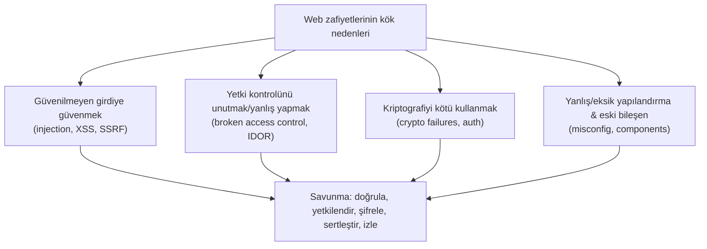

# 🔟 OWASP Top 10 — Tam Rehber (harita)

**OWASP Top 10**, web uygulamalarındaki en kritik güvenlik risklerinin, gerçek veriye dayalı, periyodik olarak güncellenen standart listesidir. Web güvenliğinin "ortak dili"dir — mülakatlar, denetimler ve raporlar bu çerçeveye atıfta bulunur.

> Bu dosya bir **harita/özet** olarak tasarlandı: en önemli kategorilerin derin anlatımı `zafiyet-siniflari/` alt dosyalarındadır; ilgili yerlerde link verilir. Ön koşul: [web-mimarisi.md](web-mimarisi.md).

> 📅 **Sürüm notu:** Aşağıdaki liste **OWASP Top 10:2021** kategorilerine dayanır (uzun süredir referans alınan yayınlanmış sürüm). OWASP listeyi birkaç yılda bir revize eder; güncel sürüm ve tam istatistikler için **owasp.org/Top10** kontrol edilmelidir *(doğrulanmalı)*. Kategori adları değişebilir ama altta yatan zafiyet sınıfları (enjeksiyon, erişim kontrolü, kriptografi) kalıcıdır — bu yüzden burada **kalıcı mekanizmalara** odaklanıyoruz.

---

## Genel bakış tablosu

| # | Kategori | Öz | Derin dosya |
|---|----------|-----|-------------|
| **A01** | Broken Access Control | Kullanıcının yetkisi olmayan işlem/veriye erişmesi | [idor-erisim-kontrolu.md](zafiyet-siniflari/idor-erisim-kontrolu.md) |
| **A02** | Cryptographic Failures | Hassas verinin zayıf/eksik şifrelenmesi | [05-kriptografi](../05-kriptografi/temel-kavramlar.md) |
| **A03** | Injection | Girdinin komut/sorgu olarak yorumlanması (SQLi, XSS dahil) | [sqli.md](zafiyet-siniflari/sqli.md), [enjeksiyon-aileleri.md](zafiyet-siniflari/enjeksiyon-aileleri.md) |
| **A04** | Insecure Design | Tasarım aşamasındaki güvenlik eksikliği | [stride](../08-grc-yonetisim-risk-uyum/stride-tehdit-modelleme.md) |
| **A05** | Security Misconfiguration | Yanlış/varsayılan yapılandırma | bu dosya §5 |
| **A06** | Vulnerable & Outdated Components | Zafiyetli kütüphane/bağımlılık | [devsecops-ssdlc.md](../13-guvenli-kodlama-devsecops/devsecops-ssdlc.md) |
| **A07** | Identification & Auth Failures | Zayıf kimlik doğrulama/oturum | [06-iam](../06-kimlik-erisim-yonetimi-iam/aaa-ve-mfa.md) |
| **A08** | Software & Data Integrity Failures | Doğrulanmamış güncelleme/serileştirme, tedarik zinciri | [devsecops-ssdlc.md](../13-guvenli-kodlama-devsecops/devsecops-ssdlc.md) |
| **A09** | Security Logging & Monitoring Failures | Tespit/iz eksikliği | [11-soc](../11-soc-mavi-takim/log-analizi.md) |
| **A10** | Server-Side Request Forgery (SSRF) | Sunucuyu iç kaynaklara istek yaptırma | [csrf-ssrf.md](zafiyet-siniflari/csrf-ssrf.md) |

---

## A01 — Broken Access Control (Bozuk Erişim Kontrolü)

**Ne:** Bir kullanıcının yetkisi olmadığı bir işlemi yapabilmesi veya veriye erişebilmesi. En sık görülen ve en yüksek etkili kategori.
**Neden #1:** Erişim kontrolü her istekte, sunucuda, doğru şekilde uygulanmak zorundadır — bu her yerde kolayca unutulur.
**Örnekler:** IDOR (`/hesap?id=1044`), dikey yetki atlama (normal kullanıcı `/admin`'e erişir), yol geçişi (path traversal), eksik fonksiyon-seviyesi kontrol.
➡️ Tam anlatım + PoC + önleme: **[idor-erisim-kontrolu.md](zafiyet-siniflari/idor-erisim-kontrolu.md)**

---

## A02 — Cryptographic Failures (Kriptografik Hatalar)

**Ne:** Hassas verinin (parola, kart, kişisel veri) korunmasında kriptografinin eksik/yanlış kullanımı.
**Örnekler:** HTTP üzerinden düz metin iletim, parolayı hash'lemeden veya zayıf hash (MD5) ile saklama, sabit kodlu (hardcoded) anahtar, zayıf TLS yapılandırması, salt kullanmama.
**Önleme:** Aktarımda TLS, saklamada güçlü şifreleme; parolalarda **Argon2/bcrypt** (asla düz veya MD5/SHA1); anahtar yönetimi.
➡️ Tam anlatım: **[05-kriptografi/temel-kavramlar.md](../05-kriptografi/temel-kavramlar.md)**, [pki-x509.md](../05-kriptografi/pki-x509.md)

---

## A03 — Injection (Enjeksiyon)

**Ne:** Güvenilmeyen girdinin bir yorumlayıcıya (SQL, OS shell, LDAP, tarayıcı) **komut/sorgu** olarak geçmesi. XSS de bu ailenin bir üyesidir.
**Ortak kök neden:** Kod ile verinin karışması → [enjeksiyon-aileleri.md](zafiyet-siniflari/enjeksiyon-aileleri.md).
➡️ Derin dosyalar: **[sqli.md](zafiyet-siniflari/sqli.md)**, **[xss.md](zafiyet-siniflari/xss.md)**, **[enjeksiyon-aileleri.md](zafiyet-siniflari/enjeksiyon-aileleri.md)**

---

## A04 — Insecure Design (Güvensiz Tasarım)

**Ne:** Kod hatası değil, **tasarım** hatası. Uygulama, güvenlik hiç düşünülmeden tasarlandığı için baştan zafiyetli. Örn. hız sınırı olmayan "şifre sıfırlama", iş mantığını (business logic) kötüye kullanmaya açık akışlar.
**Neden ayrı kategori:** Mükemmel yazılmış kod bile kötü tasarımı kurtaramaz. Çözüm **shift-left**: tehdit modellemeyi tasarım aşamasına taşımak.
➡️ **[stride-tehdit-modelleme.md](../08-grc-yonetisim-risk-uyum/stride-tehdit-modelleme.md)**, [guvenli-kodlama-ilkeleri.md](../13-guvenli-kodlama-devsecops/guvenli-kodlama-ilkeleri.md)

---

## A05 — Security Misconfiguration (Güvenlik Yanlış Yapılandırması)

**Ne:** Yazılım güvenli olabilir ama **yanlış ayarlanmış**: varsayılan parolalar, açık dizin listeleme, ayrıntılı hata mesajları (stack trace ifşası), gereksiz açık portlar/servisler, eksik güvenlik başlıkları ([http-web-iletisimi.md](../01-ag-networking/http-web-iletisimi.md) §6).
**Örnekler:** `admin/admin` bırakılmış panel, S3 bucket'ın herkese açık olması, debug modunun production'da açık kalması.
**Önleme:** Sertleştirme (hardening) temeli, otomatik yapılandırma taraması, "default deny", minimal kurulum → [linux-hardening-checklist.md](../02-linux-windows/pratik-lab/linux-hardening-checklist.md).

---

## A06 — Vulnerable and Outdated Components (Zafiyetli/Eski Bileşenler)

**Ne:** Uygulamanın kullandığı üçüncü taraf kütüphane/framework/paketlerin bilinen zafiyetler içermesi. Modern uygulamaların kodunun %80+'i bağımlılıklardan gelir.
**Klasik örnek:** **Log4Shell (CVE-2021-44228)** — Log4j kütüphanesindeki tek bir zafiyet, milyonlarca uygulamayı uzaktan kod çalıştırmaya açtı.
**Önleme:** **SCA** (Software Composition Analysis), bağımlılık tarama (Dependabot, `npm audit`, Snyk), SBOM (yazılım malzeme listesi).
➡️ **[devsecops-ssdlc.md](../13-guvenli-kodlama-devsecops/devsecops-ssdlc.md)** (tedarik zinciri güvenliği)

---

## A07 — Identification and Authentication Failures (Kimlik Doğrulama Hataları)

**Ne:** Zayıf kimlik doğrulama ve oturum yönetimi: zayıf parola politikası, brute-force korumasızlığı, oturum token'larının kötü yönetimi, MFA eksikliği, kimlik bilgisi doldurma (credential stuffing) savunmasızlığı.
**Önleme:** MFA, güçlü parola + hesap kilitleme, güvenli oturum ([http-web-iletisimi.md](../01-ag-networking/http-web-iletisimi.md) çerez bayrakları), FIDO2.
➡️ **[06-iam/aaa-ve-mfa.md](../06-kimlik-erisim-yonetimi-iam/aaa-ve-mfa.md)**

---

## A08 — Software and Data Integrity Failures (Bütünlük Hataları)

**Ne:** Güncellemelerin/verilerin bütünlüğünün doğrulanmaması. İki alt tema: (1) **güvensiz deserialization** (serileştirilmiş nesneye güvenip kod çalıştırma), (2) **tedarik zinciri** — doğrulanmamış güncelleme/CI-CD boru hattı ele geçirme.
**Klasik örnek:** **SolarWinds** — güncelleme mekanizmasına enjekte edilen zararlı kodun binlerce kuruma yayılması.
**Önleme:** Dijital imzayla güncelleme doğrulama ([anahtar-degisimi-ve-imza.md](../05-kriptografi/anahtar-degisimi-ve-imza.md)), CI/CD güvenliği, güvenilir kaynaklar.
➡️ **[devsecops-ssdlc.md](../13-guvenli-kodlama-devsecops/devsecops-ssdlc.md)**

---

## A09 — Security Logging and Monitoring Failures (Loglama/İzleme Hataları)

**Ne:** Yeterli log tutulmaması veya izlenmemesi. Bir saldırıyı **tespit edememek** de bir zafiyettir — çoğu ihlal aylarca fark edilmiyor.
**Önleme:** Merkezî loglama (SIEM), kritik olayların (giriş, yetki değişimi, hata) kaydı, uyarı kuralları, izleme.
➡️ **[11-soc/log-analizi.md](../11-soc-mavi-takim/log-analizi.md)**, [siem-edr-soar.md](../11-soc-mavi-takim/siem-edr-soar.md)

---

## A10 — Server-Side Request Forgery (SSRF)

**Ne:** Saldırganın, sunucuyu **kendi seçtiği bir kaynağa istek yapmaya** kandırması. Sunucu, iç ağdaki (normalde erişilemeyen) servislere veya bulut meta-veri servisine erişebildiği için tehlikeli.
**Bulut kesişimi:** Klasik SSRF hedefi bulut meta-veri uç noktasıdır (`169.254.169.254`) — buradan geçici kimlik bilgileri (credentials) çalınabilir. Savunma: **IMDSv2**.
➡️ Tam anlatım: **[csrf-ssrf.md](zafiyet-siniflari/csrf-ssrf.md)**

---

## Kalıcı ders: kategoriler değişir, kök nedenler kalır

OWASP listesindeki numaralar/adlar sürümden sürüme değişse de bu dört kök neden kalıcıdır. Bir zafiyeti gördüğünde "bu hangi kök nedene ait?" diye sorabilmek, ezberden çok daha değerlidir.

> **Sonraki — derin dosyalar:** [sqli.md](zafiyet-siniflari/sqli.md) → [xss.md](zafiyet-siniflari/xss.md) → [csrf-ssrf.md](zafiyet-siniflari/csrf-ssrf.md) → [idor-erisim-kontrolu.md](zafiyet-siniflari/idor-erisim-kontrolu.md) → [enjeksiyon-aileleri.md](zafiyet-siniflari/enjeksiyon-aileleri.md).
