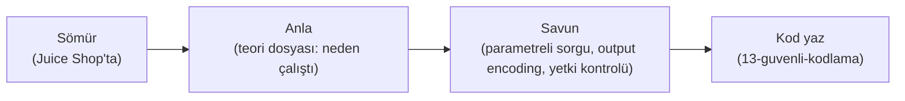

# 🧪 Pratik Lab: OWASP Juice Shop

> Bu bir **uygulama laboratuvarıdır**. OWASP Juice Shop, kasıtlı olarak zafiyetli, modern (Angular + Node.js + REST API) bir web uygulamasıdır — bu modülde öğrendiğin her zafiyeti (SQLi, XSS, IDOR, erişim kontrolü) **gerçek bir hedefte, yasal olarak** denemek için tasarlanmıştır.

**Neden Juice Shop (DVWA yerine/yanında)?** DVWA klasik PHP zafiyetlerini öğretir; Juice Shop ise **modern SPA + API** mimarisini yansıtır — bugünkü gerçek uygulamalara çok daha yakın. İkisi de değerli; burada Juice Shop'a odaklanıyoruz.

> Araç: [../burp-suite-rehberi.md](../burp-suite-rehberi.md). Zafiyet teorisi: [../zafiyet-siniflari/](../zafiyet-siniflari/sqli.md). Etik: [../../10-pentest-metodolojisi/metodoloji-ve-rules-of-engagement.md](../../10-pentest-metodolojisi/metodoloji-ve-rules-of-engagement.md).

---

## 1. Kurulum (üç yol)

```bash
# YOL 1 — Docker (en temiz, önerilen)
docker run --rm -p 3000:3000 bkimminich/juice-shop
# Tarayıcıda: http://localhost:3000

# YOL 2 — Node.js ile
git clone https://github.com/juice-shop/juice-shop.git
cd juice-shop && npm install && npm start

# YOL 3 — Hazır VM / TryHackMe odası (kurulum istemezsen)
```

> ⚠️ **Yalnızca kendi makinende (localhost).** Juice Shop'u internete açık bir sunucuda çalıştırma — kasıtlı zafiyetli olduğu için anında ele geçirilir.

> 📸 EKRAN GÖRÜNTÜSÜ EKLENECEK: `docker run` sonrası açılan Juice Shop ana sayfası (localhost:3000).

---

## 2. Keşif (recon) — önce haritalandır

Zafiyet aramadan önce uygulamayı **tanı** (metodoloji: [../../10-pentest-metodolojisi/kesif-enumerasyon.md](../../10-pentest-metodolojisi/kesif-enumerasyon.md)).

- [ ] Burp Proxy açıkken siteyi baştan sona gez → `HTTP history` dolsun.
- [ ] API uç noktalarını haritala: `/rest/...`, `/api/...` (Site map).
- [ ] Kimlik doğrulama akışını izle: giriş nasıl çalışıyor, token nerede taşınıyor (JWT? çerez?).
- [ ] "Score Board"u bul (Juice Shop'un gizli zorluk tablosu) — kendisi bir keşif zorluğudur.

---

## 3. Zafiyet alıştırmaları (teoriyi pratiğe bağla)

Her alıştırmada: **teori dosyasını aç → Burp'te dene → sonucu belgele.**

### 3.1 SQL Injection — kimlik doğrulama atlatma
> Teori: [../zafiyet-siniflari/sqli.md](../zafiyet-siniflari/sqli.md)
- [ ] Giriş formunda e-posta alanına: `' OR 1=1 --` dene.
- [ ] Yönetici olarak giriş yapabildin mi? Neden çalıştı? (Sorgu yapısını [sqli.md](../zafiyet-siniflari/sqli.md)'deki gibi kâğıda çıkar.)
- [ ] Burp Repeater'da giriş isteğini yakala, payload'ı orada da dene.

> 📸 EKRAN GÖRÜNTÜSÜ EKLENECEK: `' OR 1=1 --` ile admin oturumuna düşen giriş ekranı.

### 3.2 IDOR / Bozuk Erişim Kontrolü
> Teori: [../zafiyet-siniflari/idor-erisim-kontrolu.md](../zafiyet-siniflari/idor-erisim-kontrolu.md)
- [ ] Kendi sepetini görüntüle, isteği yakala: `GET /rest/basket/<id>`.
- [ ] Repeater'da `id`'yi değiştir → başka kullanıcının sepeti geliyor mu?
- [ ] Başka kullanıcının verisini (sipariş, geri bildirim) ID değiştirerek görebilir misin?

### 3.3 XSS
> Teori: [../zafiyet-siniflari/xss.md](../zafiyet-siniflari/xss.md)
- [ ] Arama kutusuna: `<iframe src="javascript:alert('xss')">` (DOM/reflected).
- [ ] Bir girdi alanına stored XSS dene (ör. kullanıcı adı/geri bildirim); başka bir oturumda tetiklenip tetiklenmediğini gözle.
- [ ] Çıktının nasıl kodlanması gerektiğini düşün — Angular neden bazı yerlerde otomatik koruyor?

### 3.4 Broken Authentication / JWT
> Teori: [../../06-kimlik-erisim-yonetimi-iam/federasyon-sso.md](../../06-kimlik-erisim-yonetimi-iam/federasyon-sso.md)
- [ ] Giriş sonrası JWT'yi Burp'te yakala, [jwt.io] mantığıyla çöz (Decoder).
- [ ] Token'ın hangi bilgileri taşıdığını (claim'ler) incele.
- [ ] Zayıf parola sıfırlama / güvenlik sorusu akışını test et.

### 3.5 Hassas veri ifşası / yapılandırma
> Teori: [../owasp-top10-tam-rehber.md](../owasp-top10-tam-rehber.md) (A02, A05)
- [ ] Açıkta kalmış dosyaları/dizinleri ara (`/ftp`, yedekler, `.md` dosyaları).
- [ ] Hata mesajları çok mu bilgi sızdırıyor?

---

## 4. Belgeleme — bulguları kaydet

Her bulgu için (pentest raporu alışkanlığı → [../../10-pentest-metodolojisi/pratik-lab/tryhackme-oda-notlari-sablonu.md](../../10-pentest-metodolojisi/pratik-lab/tryhackme-oda-notlari-sablonu.md)):

| Alan | İçerik |
|------|--------|
| **Zafiyet** | Ör. IDOR — /rest/basket |
| **Önem** | Kritik / Yüksek / Orta / Düşük (CVSS mantığı) |
| **Adımlar (PoC)** | Tekrar üretilebilir adımlar + istek/yanıt |
| **Ekran görüntüsü** | `assets/screenshots/` altına |
| **Etki** | Ne elde edildi (veri, hesap, RCE)? |
| **Öneri** | Nasıl düzeltilir (teori dosyasındaki savunma) |

> 📸 EKRAN GÖRÜNTÜSÜ EKLENECEK: Çözülen bir zorluğun Score Board'da "solved" olarak işaretlendiği an.

---

## 5. Öğrenme köprüsü: saldırıdan savunmaya

Juice Shop'un asıl değeri, her zafiyeti sömürdükten sonra **"bunu nasıl engellerdim?"** sorusunu sormaktır. Her alıştırmanın teori dosyasında birincil savunma vardır:



- SQLi çözdün → [sqli.md](../zafiyet-siniflari/sqli.md) parametreli sorgu bölümünü tekrar oku, kendi zafiyetli+güvenli mini örneğini yaz.
- IDOR çözdün → sunucu tarafı sahiplik kontrolünün ([idor-erisim-kontrolu.md](../zafiyet-siniflari/idor-erisim-kontrolu.md)) neden zorunlu olduğunu somut gördün.

---

## 6. Sonraki adımlar

- **DVWA** ile klasik PHP zafiyetlerini de dene (farklı bakış).
- **PortSwigger Web Security Academy** — ücretsiz, konu konu, dünyanın en iyi web güvenliği lab'ı.
- Bir sonraki seviye: bulduğun zafiyetleri [15-projeler/proje-onerileri.md](../../15-projeler/proje-onerileri.md)'deki "kendi zafiyetli uygulamanı yaz ve savun" projesiyle pekiştir.

> **Modül 04 tamamlandı.** Sonraki: [05-kriptografi/temel-kavramlar.md](../../05-kriptografi/temel-kavramlar.md).
