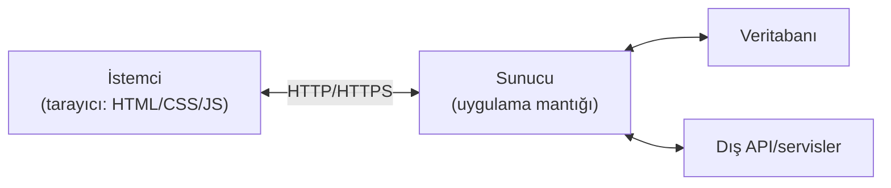
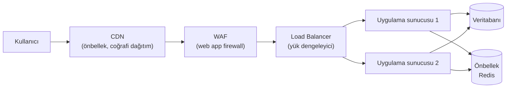

# 🕸️ Web Mimarisi

Web zafiyetlerini anlamadan önce, bir web uygulamasının parçalarını ve aralarındaki güven ilişkilerini bilmek gerekir. Bir saldırı her zaman bu mimarinin bir bileşenindeki veya bileşenler arasındaki bir varsayımı istismar eder. Bu dosya o zemini kurar.

> Ön koşul: [http-web-iletisimi.md](../01-ag-networking/http-web-iletisimi.md). Devamı: [owasp-top10-tam-rehber.md](owasp-top10-tam-rehber.md).

---

## 1. İstemci–sunucu modeli

Web, temelde **istemci (client)** ile **sunucu (server)** arasındaki bir konuşmadır ([http-web-iletisimi.md](../01-ag-networking/http-web-iletisimi.md)).



- **Ön uç (front-end / client-side):** Tarayıcıda çalışır — HTML (yapı), CSS (görünüm), JavaScript (davranış). Kullanıcının **kontrol ettiği** ortam.
- **Arka uç (back-end / server-side):** Sunucuda çalışır — uygulama mantığı, veritabanı erişimi, kimlik doğrulama. Güvenlik kararlarının **verilmesi gereken** yer.

> ⚠️ **Web güvenliğinin altın kuralı:** İstemci tarafı **saldırganın kontrolündedir**. Tarayıcıdaki her JavaScript kontrolü, gizli alan, devre dışı buton kolayca atlatılır (Burp ile isteği değiştirerek). Güvenlik **her zaman sunucuda** doğrulanmalıdır. "İstemci tarafı doğrulama kullanıcı deneyimi içindir, güvenlik için değildir."

---

## 2. Katmanlı web altyapısı

Gerçek uygulamalar tek sunucu değildir; istek, kullanıcıya ulaşana kadar birçok bileşenden geçer.



| Bileşen | Görev | Güvenlik rolü |
|---------|-------|---------------|
| **CDN** (Content Delivery Network) | Statik içeriği kullanıcıya yakın önbellekler | DDoS emilimi, TLS sonlandırma; yanlış yapılandırma → önbellek zehirleme. |
| **WAF** (Web Application Firewall) | HTTP trafiğini kural/imzayla filtreler | SQLi/XSS gibi bilinen desenleri engeller; atlatılabilir (encoding tricks). |
| **Load Balancer** | Trafiği sunuculara dağıtır | Tek nokta hatasını azaltır; TLS sonlandırma. |
| **Uygulama sunucusu** | İş mantığı | Asıl saldırı yüzeyi. |
| **Veritabanı** | Kalıcı veri | SQLi'nin hedefi; ağ segmentasyonuyla izole edilmeli. |

> **Nüans — WAF bir çözüm değil, bir katmandır:** WAF, kötü kodun **yerine geçmez**; bilinen saldırıları filtreleyerek zaman kazandırır. Atlatma teknikleri (çift kodlama, Unicode, parçalama) yüzünden tek savunma olarak asla yeterli değildir. Gerçek çözüm güvenli koddur → [zafiyet-siniflari/](zafiyet-siniflari/sqli.md).

---

## 3. Aynı Köken Politikası (Same-Origin Policy - SOP)

**SOP**, tarayıcı güvenliğinin temel taşıdır. Bir web sayfasındaki JavaScript'in, **yalnızca kendi kökeninden** (origin) gelen kaynaklara erişebilmesini sağlar.

**Köken (origin) = şema + alan adı + port.** Üçü de aynıysa aynı köken.

| URL | `https://banka.com/hesap` ile aynı köken mi? |
|-----|:---:|
| `https://banka.com/transfer` | ✅ Evet (sadece yol farklı) |
| `http://banka.com/hesap` | ❌ Hayır (şema http≠https) |
| `https://mail.banka.com/` | ❌ Hayır (alt alan farklı) |
| `https://banka.com:8443/` | ❌ Hayır (port farklı) |

**Neden var?** SOP olmasaydı, açık tuttuğun kötü bir sekmedeki JavaScript, başka sekmedeki bankacılık oturumunun verisini okuyabilirdi. SOP bu izolasyonu zorlar ve [csrf-ssrf.md](zafiyet-siniflari/csrf-ssrf.md), [xss.md](zafiyet-siniflari/xss.md) saldırılarının neden bu kadar önemli olduğunu (çünkü tam da bu sınırı hedeflerler) açıklar.

---

## 4. CORS — SOP'u kontrollü gevşetmek

SOP katıdır, ama gerçek uygulamalar bazen kökenler-arası erişime ihtiyaç duyar (ör. `app.com`'un `api.com`'a erişmesi). **CORS** (Cross-Origin Resource Sharing), sunucunun **hangi kökenlere izin verdiğini** başlıklarla ilan etmesine olanak tanır.

```http
Access-Control-Allow-Origin: https://app.com
Access-Control-Allow-Credentials: true
```

> **Kesişim — CORS yanlış yapılandırması:** En tehlikeli hata `Access-Control-Allow-Origin: *` **birlikte** `Allow-Credentials: true` (aslında tarayıcı bu kombinasyonu reddeder) veya gelen `Origin` başlığını **doğrulamadan yansıtmaktır** (reflection). İkincisinde saldırgan sitesi kurbanın kimlikli verisini okuyabilir. CORS'u gevşetmek = SOP korumasını kısmen kaldırmak; dikkatle yapılmalı.

---

## 5. API'ler ve modern web

Modern uygulamalar giderek **API-öncelikli**: ön uç (SPA/mobil) ile arka uç, API üzerinden JSON konuşur.

- **REST API:** Kaynak temelli, HTTP metodlarını kullanır (`GET /users/5`, `POST /orders`).
- **GraphQL:** Tek uç noktadan esnek sorgu; aşırı-veri-çekme (over-fetching) riskleri farklıdır.
- **Kimlik doğrulama:** Genelde token tabanlı (JWT → [federasyon-sso.md](../06-kimlik-erisim-yonetimi-iam/federasyon-sso.md)), çerez yerine `Authorization: Bearer ...` başlığı.

> **Kesişim:** OWASP'ın ayrı bir **API Security Top 10** listesi vardır çünkü API'lerin baskın zafiyeti [erişim kontrolü](zafiyet-siniflari/idor-erisim-kontrolu.md) hatalarıdır (BOLA — Broken Object Level Authorization, yani IDOR'un API hâli). `GET /api/orders/1043` yerine `1044` denemek klasik API IDOR testidir.

---

## 6. Nüans: güven sınırları ve saldırı yüzeyi

Bir web uygulamasında her **güven sınırı** (istemci↔sunucu, uygulama↔veritabanı, uygulama↔dış API) potansiyel bir saldırı noktasıdır. Tehdit modelleme ([stride-tehdit-modelleme.md](../08-grc-yonetisim-risk-uyum/stride-tehdit-modelleme.md)) tam da bu sınırlardaki veri akışını inceleyip "burada saldırgan ne yapabilir?" sorusunu sorar.

Temel ilke: **girdi güvenilmezdir.** Kullanıcıdan gelen her şey (URL parametreleri, form alanları, başlıklar, çerezler, JSON gövdesi, dosya adları) saldırgan tarafından değiştirilebilir ve sunucuya ulaşmadan önce **doğrulanmalı/temizlenmelidir**.

---

## 7. Saldırı–savunma kesişimi (özet)

- **İstemciye asla güvenme:** Web zafiyetlerinin çoğu bu kuralın ihlalidir.
- **SOP/CORS = tarayıcı izolasyonunun temeli:** XSS ve CSRF'in neden önemli olduğunu bu bağlam açıklar.
- **WAF ve CDN yardımcı katmanlardır, çözüm değil:** Asıl güvenlik güvenli kodda ve doğru mimaride yaşar.
- **API'ler yeni ön cephe:** Erişim kontrolü (IDOR/BOLA) modern web'in bir numaralı zafiyet sınıfıdır.

> **Sonraki:** [owasp-top10-tam-rehber.md](owasp-top10-tam-rehber.md).
