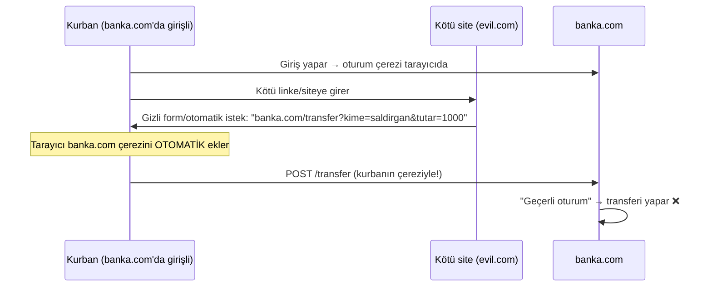
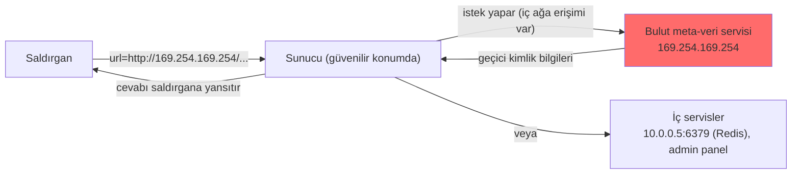

# 🔄 CSRF ve SSRF

İsimleri benzese de bu iki zafiyet tamamen farklıdır. **CSRF** kurbanın *tarayıcısını* kötüye kullanır (istemci-taraflı güveni istismar). **SSRF** ise *sunucuyu* kötüye kullanır (sunucunun iç ağa erişimini istismar). İkisini bir arada işliyoruz çünkü "forgery" (sahtecilik) kavramını ve tam olarak *kimin kandırıldığını* karşılaştırmak öğreticidir.

> Bağlam: [web-mimarisi.md](../web-mimarisi.md) (SOP/CORS). OWASP Top 10:2025 haritası: [owasp-top10-tam-rehber.md](../owasp-top10-tam-rehber.md). CSRF tarihsel olarak listede yer aldı; SSRF ise 2021'de ayrı bir kategoriyken (A10) **2025'te A01 Broken Access Control altına alındı** — çünkü SSRF de özünde sunucunun erişmemesi gereken bir kaynağa eriştirilmesidir (bir erişim kontrolü ihlali).

---

# Bölüm A — CSRF (Cross-Site Request Forgery)

## 1. Ne? — Mekanizma

CSRF, saldırganın kurbanı, **oturum açtığı bir sitede istemediği bir işlemi yapmaya** kandırmasıdır. Kurbanın tarayıcısı, o siteye ait çerezleri **her isteğe otomatik eklediği** için ([http-web-iletisimi.md](../../01-ag-networking/http-web-iletisimi.md)), saldırganın tetiklediği istek de kurbanın kimliğiyle gider.



### Saldırı örneği
Kurban `banka.com`'da girişliyken, saldırganın sayfasındaki şu form otomatik gönderilir:
```html
<!-- evil.com üzerinde, kurban farkında değil -->
<form action="https://banka.com/transfer" method="POST" id="f">
  <input type="hidden" name="kime" value="saldirgan">
  <input type="hidden" name="tutar" value="10000">
</form>
<script>document.getElementById('f').submit();</script>
```
Kurban sadece sayfayı açar; tarayıcı `banka.com` çerezini ekler; transfer kurbanın adına gerçekleşir.

## 2. Neden mümkün? Nüans

- **Kök neden:** Sunucu, isteğin "gerçekten kullanıcının kendi arayüzünden mi, yoksa başka bir siteden mi" geldiğini ayırt etmiyor; sadece geçerli çereze bakıyor.
- **CSRF veri okuyamaz:** SOP nedeniyle saldırgan yanıtı **göremez** (kör bir saldırıdır); sadece **durum değiştiren** işlemleri (transfer, şifre değişimi, ayar) tetikleyebilir.
- **XSS ile fark:** XSS kod çalıştırır ve CSRF token'ını bile okuyabilir (bu yüzden XSS varsa CSRF savunması çöker). CSRF ise kod çalıştırmaz, sadece istek tetikler.

## 3. Önleme

| Savunma | Nasıl çalışır |
|---------|---------------|
| **Anti-CSRF token** | Her formda, sunucunun ürettiği, saldırganın **bilemeyeceği** rastgele token. İstekte gelmezse reddet. Birincil savunma. |
| **SameSite çerez** | `SameSite=Strict/Lax` → çerez siteler-arası isteklerde gönderilmez. Modern tarayıcılarda güçlü savunma. |
| **Origin/Referer kontrolü** | İsteğin kökenini doğrula. |
| **Kritik işlemde yeniden kimlik** | Para transferi/şifre değişiminde parola/MFA iste. |

```html
<!-- GÜVENLİ — sunucu üretimi CSRF token -->
<form action="/transfer" method="POST">
  <input type="hidden" name="csrf_token" value="a1b2c3-rastgele-sunucu-tokeni">
  ...
</form>
```
```
Set-Cookie: session=...; SameSite=Strict; Secure; HttpOnly
```

---

# Bölüm B — SSRF (Server-Side Request Forgery)

## 1. Ne? — Mekanizma

SSRF'te saldırgan, **sunucuyu**, saldırganın seçtiği bir adrese istek yapmaya kandırır. Uygulama "bir URL'den içerik çek" gibi bir özellik sunuyorsa (görsel önizleme, webhook, PDF üretimi, URL doğrulama), saldırgan bu URL'yi **iç kaynaklara** çevirir.



### Neden sunucu değerli bir kurban?
Sunucu, saldırganın **dışarıdan erişemeyeceği** yerlere erişebilir: iç ağdaki servisler (`10.0.0.0/8`), localhost'taki yönetim panelleri (`127.0.0.1:8080`), ve en kritiği **bulut meta-veri servisi**.

## 2. Neden ciddi? Bulut kesişimi

Bulut sağlayıcılarında (AWS/GCP/Azure) `169.254.169.254` adresindeki **meta-veri servisi**, o sunucunun geçici IAM kimlik bilgilerini (credentials) döndürür. SSRF ile bu uç noktaya erişen saldırgan:
```
http://169.254.169.254/latest/meta-data/iam/security-credentials/rol-adi
```
→ **sunucunun bulut kimliğini çalar** → o kimliğin yetkisiyle bulut kaynaklarına (S3, DB) erişir. 2019 Capital One ihlali tam olarak böyle bir SSRF zinciriydi.

## 3. Nüans: atlatma yüzeyi geniş

Basit "iç IP'leri engelle" filtresi kolayca atlatılır:
- Alternatif IP gösterimleri: `127.0.0.1` → `2130706433` (ondalık), `0x7f000001` (hex), `127.1`.
- DNS rebinding: alan adı önce dış IP'ye, sonra iç IP'ye çözülür.
- Yönlendirme (redirect) zincirleri, `[::1]` (IPv6 loopback), URL şema hileleri (`file://`, `gopher://`).

Bu yüzden kara liste değil, **izin listesi (allow-list)** temel savunmadır.

> **Kesişim — SSRF'e giden başka bir kapı, XXE:** Sunucuyu iç kaynaklara bağlatmak için her zaman "URL çeken bir özellik" gerekmez; **XXE** (XML External Entity) bir XML ayrıştırıcısını `SYSTEM "http://169.254.169.254/..."` ile aynı iç hedeflere bağlatarak SSRF üretir → [enjeksiyon-aileleri.md](enjeksiyon-aileleri.md) (XXE). Yani "sunucu adıma istek yapıyor" yüzeyi, enjeksiyon ailesiyle örtüşür.

## 4. Önleme

| Savunma | Nasıl |
|---------|-------|
| **Allow-list** | Sunucunun erişebileceği hedefleri **beyaz listeyle** sınırla; gerisini reddet. Birincil. |
| **İç ağ segmentasyonu** | Uygulama sunucusunun iç yönetim servislerine/meta-veriye erişimini kısıtla. |
| **IMDSv2** (AWS) | Meta-veri servisine token zorunluluğu → basit SSRF ile erişilemez. |
| **Yanıtı yansıtma** | Çekilen içeriği ham olarak kullanıcıya döndürme. |
| **URL şeması kısıtla** | Sadece `http/https`; `file/gopher/dict` yasak. |

```python
# GÜVENLİ (kavramsal) — allow-list ile URL doğrulama
from urllib.parse import urlparse

IZINLI_HOSTLAR = {"api.guvenilir-ortak.com", "cdn.sirket.com"}

def guvenli_cek(url: str):
    p = urlparse(url)
    if p.scheme not in ("http", "https"):
        raise ValueError("Sadece http/https")
    if p.hostname not in IZINLI_HOSTLAR:        # kara liste DEĞİL, beyaz liste
        raise ValueError("İzin verilmeyen hedef")
    # ... isteği yap
```

---

## Karşılaştırma: CSRF vs SSRF (özet)

| | CSRF | SSRF |
|---|------|------|
| Kandırılan | Kurbanın **tarayıcısı** | **Sunucu** |
| İstismar edilen güven | Sitenin kullanıcı çerezine güveni | Sunucunun iç ağa erişimi |
| Saldırgan yanıtı görür mü? | Hayır (kör, SOP) | Genelde evet |
| Tipik hedef | Durum değiştiren işlem (transfer) | İç servisler, bulut meta-veri |
| Birincil savunma | Anti-CSRF token + SameSite | Allow-list + IMDSv2 + segmentasyon |

> **Sonraki:** [idor-erisim-kontrolu.md](idor-erisim-kontrolu.md).
