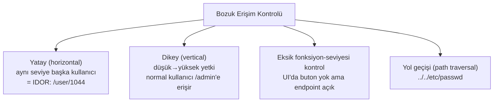

# 🔑 IDOR ve Bozuk Erişim Kontrolü

**Broken Access Control** (Bozuk Erişim Kontrolü), OWASP listesinin bir numaralı kategorisidir ve **IDOR** onun en yaygın somut hâlidir. Enjeksiyon gibi karmaşık payload'lar gerektirmez — çoğu zaman bir URL'deki sayıyı değiştirmek kadar basittir, ama etkisi yıkıcı olabilir.

> OWASP: [A01](../owasp-top10-tam-rehber.md). İlgili: [kullanici-cekirdek-modu.md](../../03-isletim-sistemi-ici/kullanici-cekirdek-modu.md) (dikey/yatay privesc kavramı).

---

## 1. Ne? — Erişim kontrolünün iki sorusu

Her istek iki soruyu geçmelidir:
1. **Kimlik doğrulama (authentication):** "Sen kimsin?" — giriş yaptın mı?
2. **Yetkilendirme (authorization):** "Bunu yapmaya iznin var mı?" — bu **spesifik** kaynağa/işleme erişebilir misin?

**Broken Access Control**, ikinci sorunun sorulmaması veya yanlış sorulmasıdır. Kullanıcı giriş yapmıştır (kimlik doğrulama tamam) ama başkasının verisine/işlevine erişebilir (yetkilendirme yok).

### IDOR (Insecure Direct Object Reference)
Uygulama bir nesneye **doğrudan, tahmin edilebilir bir referansla** (genelde sıralı ID) erişir ve **o nesnenin gerçekten bu kullanıcıya ait olup olmadığını kontrol etmez.**

```
GET /api/faturalar/1043    → kendi faturam ✔
GET /api/faturalar/1044    → BAŞKASININ faturası... ve sunucu veriyor ❌
```

### Zafiyetli kod
```python
# ZAFİYETLİ — sadece "giriş yapmış mı" kontrol ediliyor, "bu ONUN mu" değil
@app.route('/api/faturalar/<int:fatura_id>')
@login_required                      # kimlik doğrulama VAR
def fatura_getir(fatura_id):
    fatura = db.faturalar.get(fatura_id)   # ama SAHİPLİK kontrolü YOK
    return jsonify(fatura)
```

---

## 2. Neden bu kadar yaygın ve tehlikeli?

**Neden yaygın:**
- Erişim kontrolü **her uç noktada, her istekte** ayrı ayrı uygulanmalı; tek bir eksik kontrol yeter.
- Geliştirici çoğunlukla "mutlu yolu" (kendi verisine erişen kullanıcı) test eder, "başkasının ID'sini deneyen" saldırganı değil.
- Otomatik tarayıcılar bunu zor bulur (bağlam/iş mantığı gerektirir) → insan testi kritik.

**Neden tehlikeli:**
- **Toplu veri sızıntısı:** ID'leri sırayla artırarak (`1043, 1044, 1045...`) tüm kullanıcıların verisi çekilebilir (enumeration).
- Payload yok → WAF genelde yakalamaz, loglarda "normal" istek gibi görünür.

---

## 3. Erişim kontrolü atlama türleri



| Tür | Örnek |
|-----|-------|
| **Yatay (IDOR)** | Kullanıcı A, kullanıcı B'nin faturasını `id=1044` ile görür. |
| **Dikey** | Normal kullanıcı `/admin/panel`'e doğrudan URL ile erişir (menüde görünmese de). |
| **Eksik fonksiyon kontrolü** | Silme butonu sadece admin UI'ında ama `POST /api/delete/5` herkese açık. |
| **Path traversal** | `?dosya=../../../../etc/passwd` ile yetki dışı dosya okuma. |
| **Metod tabanlı** | `GET` engelli ama `POST`/`PUT` kontrol edilmemiş. |

---

## 4. Nüans: sık yapılan hatalar

- **"UI'da göstermiyorum, güvenli":** Butonu/menüyü gizlemek erişim kontrolü **değildir** (security by obscurity). Endpoint doğrudan çağrılabilir. Kontrol **sunucuda**, her istekte olmalı.
- **"ID'yi UUID/rastgele yaptım, IDOR bitti":** Tahmin edilemez ID **yardımcı** bir katmandır ama gerçek çözüm değil — UUID sızarsa (loglar, referer, paylaşım linki) yine erişilir. **Asıl çözüm sahiplik/yetki kontrolüdür.**
- **İstemci tarafı rol kontrolü:** JavaScript'te `if (user.isAdmin)` kontrolü atlatılır ([web-mimarisi.md](../web-mimarisi.md)). Sunucu her zaman yeniden kontrol etmeli.
- **Sadece bazı endpoint'lerde kontrol:** Yeni bir endpoint eklendiğinde kontrol unutulur → tek zayıf halka.

---

## 5. Saldırı–savunma kesişimi: PoC senaryosu

**Ortam:** Juice Shop ([../pratik-lab/juice-shop-notlari.md](../pratik-lab/juice-shop-notlari.md)) — IDOR/erişim kontrolü zorlukları içerir.

1. Kendi hesabınla giriş yap, kendi verini gösteren bir isteği yakala (Burp → [../burp-suite-rehberi.md](../burp-suite-rehberi.md)): `GET /api/basket/5`.
2. İstekteki ID'yi değiştir: `GET /api/basket/6`. Başkasının sepeti geldiyse → **IDOR**.
3. Dikey test: normal kullanıcıyla admin endpoint'ini (`/api/admin/...`) doğrudan çağır. Yanıt `200` ise → dikey yetki atlama.
4. Enumeration: Burp Intruder ile ID'yi `1..1000` gez, kaç tanesinin `200` döndüğünü gör.

**Burp Repeater'da IDOR'un görünümü** — kendi ID'n yerine başkasınınkini isteyince veri yine döner:
```http
GET /api/basket/6 HTTP/1.1        ← kendi sepetin id=5 iken 6'yı istedin
Host: hedef.local
Cookie: session=SENIN_OTURUMUN

HTTP/1.1 200 OK
Content-Type: application/json

{"id":6,"user":"baska_kullanici","items":[{"urun":"Laptop","fiyat":25000}]}
```
`200 OK` + başka kullanıcının verisi = **IDOR doğrulandı**. Sunucu "giriş yapmış mısın?" (evet) diye sordu ama "bu sepet senin mi?" (hayır) diye sormadı. Doğru davranış `404`/`403` dönmek olurdu.

---

## 6. Önleme

**Temel ilke:** Her istekte, **sunucu tarafında**, "bu kullanıcı bu spesifik kaynağa/işleme yetkili mi?" sorusunu sor.

### Sahiplik kontrolü (IDOR'a karşı)
```python
# GÜVENLİ — kaynağı kullanıcıya bağlayarak sorgula
@app.route('/api/faturalar/<int:fatura_id>')
@login_required
def fatura_getir(fatura_id):
    # Faturayı SADECE mevcut kullanıcının faturaları içinde ara
    fatura = db.faturalar.get(id=fatura_id, sahip_id=current_user.id)
    if fatura is None:
        abort(404)         # yoksa VEYA ona ait değilse: aynı cevap
    return jsonify(fatura)
```
> Not: Yetkisiz erişimde `403` yerine `404` dönmek, kaynağın **varlığını** bile sızdırmaz (enumeration'ı zorlaştırır).

### Katmanlı savunma
| Katman | Ne yapar |
|--------|----------|
| **Sunucu tarafı yetki kontrolü (her istekte)** | Birincil — sahiplik/rol doğrula. |
| **Deny-by-default** | Açıkça izin verilmeyen her şey reddedilir ([RBAC/ABAC](../../06-kimlik-erisim-yonetimi-iam/erisim-kontrol-modelleri.md)). |
| **Merkezî yetkilendirme** | Kontrolü her endpoint'e dağıtmak yerine tek yerde (middleware/policy) → unutma riski azalır. |
| **Rastgele/dolaylı referans** | UUID veya oturuma bağlı dolaylı ID (yardımcı katman). |
| **Loglama + hız sınırı** | Enumeration girişimini tespit et → [11-soc](../../11-soc-mavi-takim/log-analizi.md). |

> Erişim kontrol **modelleri** (RBAC, ABAC, deny-by-default) → [06-iam/erisim-kontrol-modelleri.md](../../06-kimlik-erisim-yonetimi-iam/erisim-kontrol-modelleri.md).

---

## 7. Özet

- **Ne:** Kimliği doğrulanmış kullanıcının, yetkisi olmayan kaynağa/işleme erişmesi.
- **IDOR:** Tahmin edilebilir referansla başkasının nesnesine erişim (yatay).
- **Neden #1:** Her istekte ayrı kontrol gerekir; bir eksik yeter; payload olmadığı için gizlidir.
- **Savunma:** Sunucu tarafı, her istekte sahiplik/rol kontrolü; deny-by-default; merkezî yetkilendirme.

> **Sonraki:** [enjeksiyon-aileleri.md](enjeksiyon-aileleri.md).
