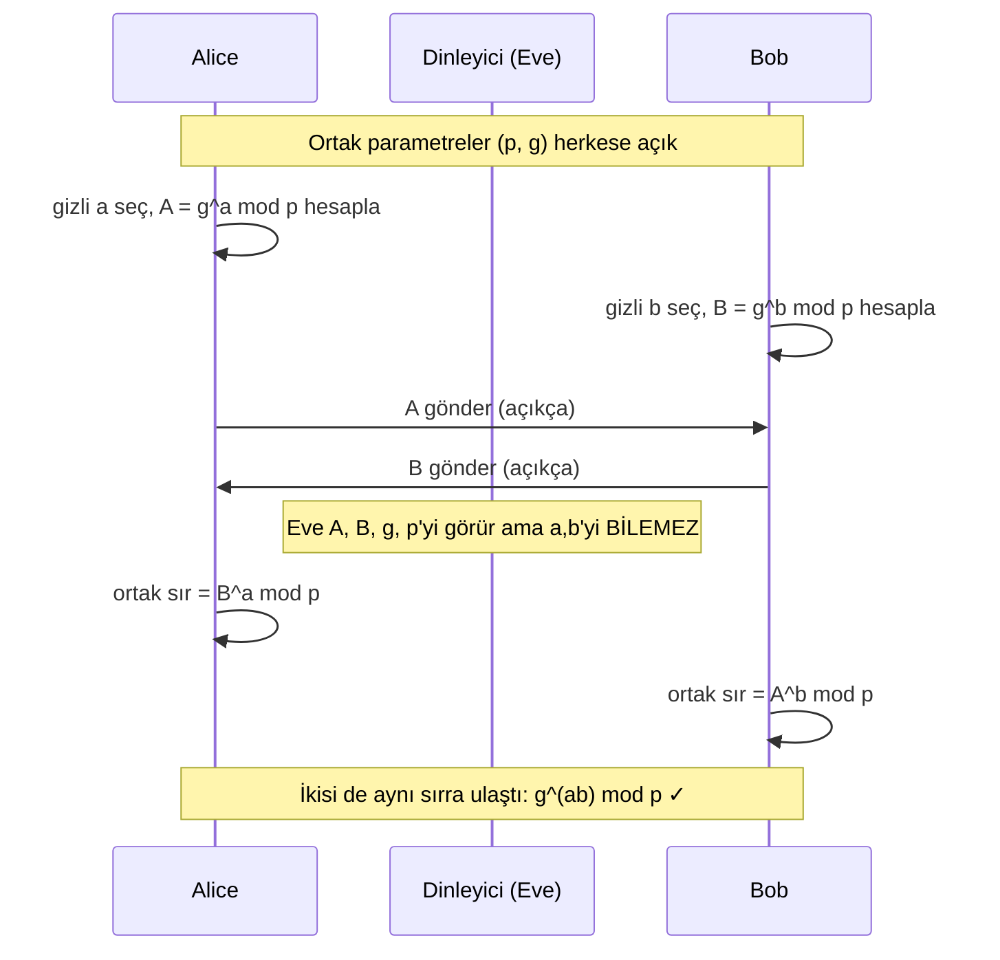
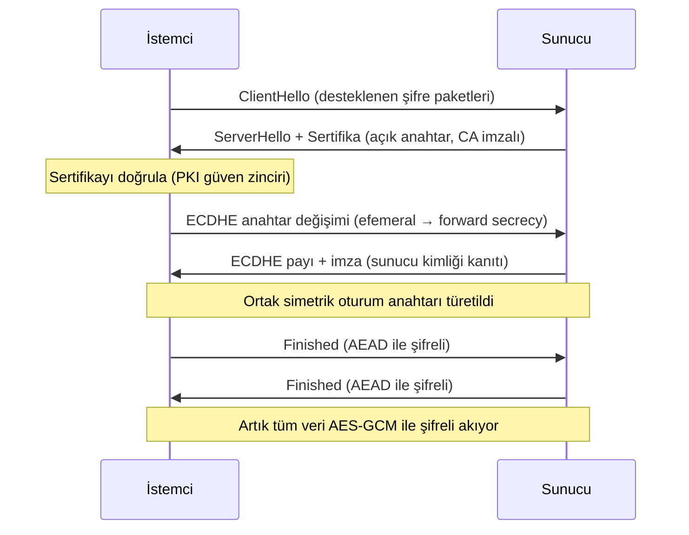

# 🤝 Anahtar Değişimi ve Dijital İmza

Simetrik şifreleme hızlıdır ama "iki taraf aynı gizli anahtarı güvensiz bir kanalda nasıl paylaşır?" sorusu vardı ([temel-kavramlar.md](temel-kavramlar.md)). Bu dosya o soruyu çözen **anahtar değişimini** (DH/ECDH), veriyi kimin gönderdiğini kanıtlayan **dijital imzayı**, ve bütünlük+kimlik veren **MAC/HMAC/AEAD**'yi kurar.

> Ön koşul: [temel-kavramlar.md](temel-kavramlar.md). Uygulama: [pki-x509.md](pki-x509.md), TLS.

---

## 1. Anahtar dağıtım problemi ve Diffie-Hellman

**Problem:** Alice ve Bob, herkesin dinlediği bir kanalda (internet) ortak bir gizli anahtarı, o anahtarı hiç göndermeden nasıl oluşturur?

**Diffie-Hellman (DH)** anahtar değişimi bunu 1976'da çözdü: iki taraf, açıkça bilgi alışverişi yapar ama **sonunda ikisinin de bildiği, dinleyicinin bilemediği** ortak bir sır üretir.



**Sihir:** Her iki taraf da `g^(ab) mod p` değerine ulaşır, ama dinleyici `A=g^a` ve `B=g^b`'yi görse bile `g^(ab)`'yi hesaplayamaz — çünkü `a` veya `b`'yi bulmak **ayrık logaritma problemidir** ([zorluk-varsayimlari.md](zorluk-varsayimlari.md)) ve pratik olarak çözülemez.

### ECDH — eliptik eğri versiyonu
**ECDH**, aynı fikri eliptik eğriler üzerinde uygular: **çok daha küçük anahtarla aynı güvenlik** (256-bit ECC ≈ 3072-bit RSA). Bugün TLS'de baskın olan budur.

### Nüans: İleri gizlilik (Forward Secrecy)
**Efemeral (geçici) DH (DHE/ECDHE):** Her oturum için **yeni** DH anahtarları üretilir ve sonra atılır. Sonuç: Sunucunun uzun-dönem özel anahtarı **gelecekte** çalınsa bile, **geçmiş** oturumlar çözülemez (çünkü o oturum anahtarları çoktan silindi). Buna **ileri gizlilik (forward secrecy)** denir ve modern TLS'in zorunlu özelliğidir.

> **Kesişim — "harvest now, decrypt later":** İleri gizlilik olmadan, saldırgan bugün şifreli trafiği kaydedip yıllar sonra anahtarı ele geçirdiğinde (veya kuantum bilgisayarla) çözebilir. Bu tehdit, doğrudan [post-kuantum-kriptografi.md](post-kuantum-kriptografi.md)'nin ana motivasyonudur.

---

## 2. Dijital imza — kimlik ve reddedilemezlik

Şifreleme "kimse okuyamasın" derken, **dijital imza** "bunu gerçekten ben gönderdim ve değiştirilmedi" der. Asimetrik kriptografinin **ters** kullanımıdır:

```mermaid
flowchart LR
    subgraph İmzalama (gönderen)
        M["Mesaj"] --> H["hash(M)"]
        H -->|"ÖZEL anahtarla şifrele"| S["İmza"]
    end
    subgraph Doğrulama (alıcı)
        M2["Mesaj"] --> H2["hash(M)"]
        S2["İmza"] -->|"AÇIK anahtarla çöz"| H3["hash'"]
        H2 --> C{"H == H'?"}
        H3 --> C
        C -->|"evet"| OK["Geçerli: doğru gönderen + değişmemiş ✓"]
        C -->|"hayır"| NO["Reddet ✗"]
    end
```

**Adımlar:**
1. Gönderen mesajın **hash'ini** alır (imzalanan tüm mesaj değil, özetidir — hız).
2. Bu hash'i **kendi özel anahtarıyla** şifreler = imza.
3. Alıcı, imzayı **gönderenin açık anahtarıyla** çözer, kendi hesapladığı hash ile karşılaştırır.
4. Eşleşirse: (a) mesaj **değişmemiş** (bütünlük), (b) yalnızca özel anahtar sahibi imzalayabileceği için **gönderen doğrulanmış** (kimlik) ve inkâr edemez (**reddedilemezlik**).

**Standartlar:** RSA imza, **ECDSA** (eliptik eğri), EdDSA (Ed25519).

**Kullanım:** TLS sertifikaları ([pki-x509.md](pki-x509.md)), yazılım/güncelleme imzalama ([A08 bütünlük](../04-web-guvenligi/owasp-top10-tam-rehber.md), SolarWinds dersi), kod imzalama, e-posta (S/MIME, PGP).

---

## 3. MAC ve HMAC — simetrik bütünlük

Dijital imza asimetriktir (açık anahtarla doğrulanır, reddedilemezlik verir). Bazen sadece **paylaşılan gizli anahtarı bilen iki taraf** arasında bütünlük+kimlik istenir — bu daha hızlıdır: **MAC (Message Authentication Code)**.

- **HMAC** = hash tabanlı MAC: `HMAC(K, mesaj)`. Anahtarı bilen üretir/doğrular; bilmeyen sahte MAC üretemez.
- İmzadan farkı: **reddedilemezlik yok** (her iki taraf da aynı anahtarı bildiği için "sen ürettin" denemez), ama **hızlı** ve simetrik.

```bash
# HMAC-SHA256 üretimi (openssl)
echo -n "mesaj" | openssl dgst -sha256 -hmac "gizli-anahtar"
```

| | Hash | HMAC | Dijital imza |
|---|------|------|--------------|
| Bütünlük | ✓ | ✓ | ✓ |
| Kimlik doğrulama | ✗ | ✓ (anahtar sahibi) | ✓ (açık anahtar) |
| Reddedilemezlik | ✗ | ✗ | ✓ |
| Anahtar | Yok | Paylaşılan gizli | Açık/özel çift |

---

## 4. AEAD — gizlilik + bütünlük tek işlemde

[temel-kavramlar.md](temel-kavramlar.md)'de belirtildi: şifreleme tek başına bütünlük vermez. Şifreli veri değiştirilebilir (bit-flipping saldırıları). Tarihsel çözüm "önce şifrele, sonra MAC ekle" idi ama sıralaması hatalara açıktı.

**AEAD (Authenticated Encryption with Associated Data)**, gizlilik ve bütünlüğü **tek, güvenli işlemde** birleştirir:
- **AES-GCM:** AES + Galois MAC. Donanım hızlandırmalı, TLS'in baskın modu.
- **ChaCha20-Poly1305:** Yazılımda/mobilde hızlı alternatif.

AEAD ayrıca "associated data" ile şifrelenmeyen ama **bütünlüğü korunan** başlık (ör. paket meta verisi) taşıyabilir. Bugün "sadece şifrele" değil, **her zaman AEAD** kullanılır.

---

## 5. Hepsi birlikte: TLS el sıkışması (bütünsel örnek)

Yukarıdaki tüm parçalar TLS'te (HTTPS'in temeli) birleşir:



1. **Asimetrik + PKI** → sunucu kimliği doğrulanır (sertifika → [pki-x509.md](pki-x509.md)).
2. **ECDHE** → ortak simetrik anahtar, ileri gizlilikle üretilir.
3. **Dijital imza** → sunucu, anahtar değişimini imzalayarak kimliğini kanıtlar.
4. **AEAD (AES-GCM)** → asıl veri hızlı+bütünlüklü şifrelenir.

Bu, "neden hem simetrik hem asimetrik hem hash hem imza var?" sorusunun tam, canlı cevabıdır.

---

## 6. Saldırı–savunma kesişimi (özet)

- **Ortadaki adam (MITM):** Anahtar değişimi tek başına kimlik doğrulamaz — saldırgan araya girip iki ayrı DH yapabilir. Bu yüzden DH, **imza/sertifika ile** birleştirilir (kimlik). Kimlik doğrulamasız DH (çıplak) MITM'e açıktır.
- **İleri gizlilik = geleceğe karşı sigorta:** ECDHE olmadan kaydedilen trafik, gelecekteki anahtar sızıntısıyla (veya kuantumla) çözülebilir → PQC motivasyonu.
- **İmza tedarik zincirini korur:** Yazılım güncellemelerini imzalamak, SolarWinds tarzı saldırıları engelleyen temel savunmadır ([A08](../04-web-guvenligi/owasp-top10-tam-rehber.md)).

> **Sonraki:** [pki-x509.md](pki-x509.md).
