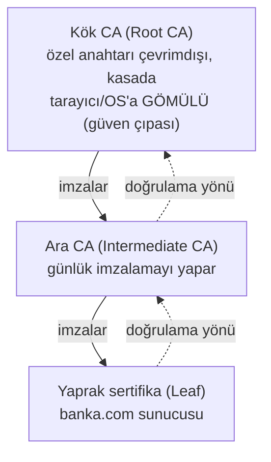
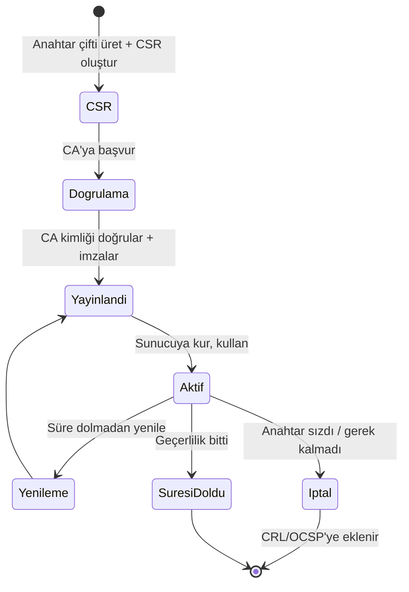

# 📜 PKI ve X.509 Sertifikaları

Dijital imza ve asimetrik şifreleme güçlüdür, ama bir sorun kalır: **bir açık anahtarın gerçekten iddia edilen kişiye/siteye ait olduğunu nasıl bilirim?** Saldırgan da bir anahtar çifti üretip "ben banka.com'um" diyebilir. **PKI (Public Key Infrastructure)** bu güven problemini çözer; internetin güven omurgasıdır.

> Ön koşul: [anahtar-degisimi-ve-imza.md](anahtar-degisimi-ve-imza.md). Uygulama: [openssl_ile_sertifika_pratikleri.md](pratik-lab/openssl_ile_sertifika_pratikleri.md), TLS/HTTPS.

---

## 1. Problem: açık anahtarı kime ait olduğunu doğrulamak

Alice, `banka.com`'a bağlanır ve bir açık anahtar alır. Ama bu anahtar gerçekten bankanın mı, yoksa araya giren bir saldırganın mı? Açık anahtarın kendisi bir kimlik taşımaz.

**Çözüm — güvenilen üçüncü taraf:** Herkesin güvendiği bir otorite (**CA — Certificate Authority**), "bu açık anahtar gerçekten banka.com'a aittir" diye **dijital olarak imzalar**. Bu imzalı belge bir **sertifikadır (X.509)**.

---

## 2. X.509 sertifikası nedir?

Bir sertifika, temelde **bir açık anahtarı bir kimliğe bağlayan, bir CA tarafından imzalanmış** belgedir. İçeriği:

| Alan | İçerik |
|------|--------|
| **Subject** | Kime ait (ör. `CN=banka.com`) |
| **Public Key** | Sahibinin açık anahtarı |
| **Issuer** | Hangi CA imzaladı |
| **Geçerlilik** | Başlangıç/bitiş tarihi |
| **Seri no** | Benzersiz kimlik |
| **SAN** (Subject Alternative Name) | Kapsadığı alan adları (`banka.com`, `www.banka.com`) |
| **İmza** | CA'nın bu sertifika üzerindeki imzası |

```bash
# Bir sitenin sertifikasını incele
openssl s_client -connect ornek.com:443 -servername ornek.com </dev/null 2>/dev/null | openssl x509 -noout -text
```

---

## 3. Güven zinciri (chain of trust)

Tek bir CA her sertifikayı doğrudan imzalamaz. Bunun yerine **hiyerarşik bir güven zinciri** vardır:



- **Kök CA (Root):** En tepedeki güven çıpası. Özel anahtarı son derece korunur (çevrimdışı). Kök sertifikalar **işletim sistemine ve tarayıcıya önceden gömülüdür** — güvenin başladığı yer.
- **Ara CA (Intermediate):** Kök tarafından imzalanır, günlük sertifika imzalamayı yapar (kökü riske atmamak için).
- **Yaprak (Leaf):** Sunucunun asıl sertifikası.

**Doğrulama:** Tarayıcı, `banka.com` sertifikasını alır → onu imzalayan ara CA'yı kontrol eder → onu imzalayan kök CA'ya ulaşır → kök zaten güvenilenler listesinde mi? Evet ise **zincir tamam, güven kurulur.** Herhangi bir halka kırılırsa (imza geçersiz, süresi dolmuş, kök tanınmıyor) tarayıcı uyarı verir.

> **Nüans — güven neye dayanır?** Tüm sistem, tarayıcı/OS'a gömülü **kök CA listesine** güvenmeye dayanır. Bir kök CA ele geçirilir veya kötü niyetli davranırsa (geçmişte oldu: DigiNotar 2011), sahte ama "geçerli" sertifikalar üretilebilir. Bu yüzden CA'lar denetlenir ve kötü davrananlar listeden çıkarılır (distrust).

> **Kesişim — aynı fikir başka yerde:** "En tepedeki güvenilen bir çıpadan aşağıya doğru güven aktarma" mantığı yalnızca sertifikalara özgü değildir. Aynı güven zinciri, bir bilgisayarın önyüklemesinde **Secure Boot** olarak karşımıza çıkar ([00-baslangic/bilgisayar-temelleri.md](../00-baslangic/bilgisayar-temelleri.md)): UEFI firmware'ine gömülü bir imzalama anahtarı (çıpa), önyükleyiciyi, o da çekirdeği imza doğrulayarak yükler. PKI'da çıpa "kök CA sertifikası", Secure Boot'ta "firmware'e gömülü platform anahtarı"dır; ikisi de en alttaki bir güven kararına dayanır ve o çıpa ele geçirilirse tüm zincir çöker.

---

## 4. Sertifika yaşam döngüsü



1. **CSR (Certificate Signing Request):** Sunucu anahtar çifti üretir, açık anahtarı + kimlik bilgisini içeren bir istek oluşturur. **Özel anahtar hiç sunucudan çıkmaz.**
2. **Doğrulama:** CA, başvuranın alan adına gerçekten sahip olduğunu doğrular (Domain Validation, Organization Validation, Extended Validation seviyeleri).
3. **Yayınlama:** CA sertifikayı imzalar ve verir.
4. **Yenileme:** Sertifikaların ömrü kısadır (bugün ~90 gün, Let's Encrypt); otomatik yenileme (ACME protokolü) standarttır.
5. **İptal (revocation):** Özel anahtar sızarsa sertifika süre dolmadan iptal edilmelidir.

---

## 5. İptal: CRL ve OCSP

Bir sertifika, süresi dolmadan önce geçersiz kılınmalıysa (anahtar çalındı), tarayıcı bunu nasıl öğrenir?

| Mekanizma | Nasıl çalışır | Sorun |
|-----------|---------------|-------|
| **CRL** (Certificate Revocation List) | CA, iptal edilen sertifikaların listesini yayınlar; tarayıcı indirir | Liste büyür, gecikmeli |
| **OCSP** (Online Certificate Status Protocol) | Tarayıcı CA'ya "bu sertifika geçerli mi?" diye canlı sorar | Gizlilik + gecikme (CA her ziyareti görür) |
| **OCSP Stapling** | Sunucu, CA'dan aldığı taze "geçerli" kanıtını sertifikaya iliştirir | En iyi çözüm — gizlilik + hız |

> **Nüans:** İptal kontrolü tarihsel olarak zayıf bir noktadır — bazı tarayıcılar CRL/OCSP hatasında "soft-fail" (yine de bağlan) yapar, bu da iptal edilmiş sertifikaların kullanılabilmesine yol açar. Bu yüzden kısa ömürlü sertifikalar (iptali gereksiz kılan) tercih edilir.

---

## 6. Sertifika dosya formatları (pratik karışıklık)

| Format | İçerik |
|--------|--------|
| **PEM** | Base64, `-----BEGIN CERTIFICATE-----` (en yaygın; `.pem`, `.crt`, `.key`) |
| **DER** | İkili (binary) form |
| **PKCS#12** | Sertifika + özel anahtar birlikte, parola korumalı (`.pfx`, `.p12`) |
| **CSR** | İmzalama isteği (`.csr`) |

---

## 7. Saldırı–savunma kesişimi

- **Burp/MITM proxy'nin çalışma prensibi:** Burp ([../04-web-guvenligi/burp-suite-rehberi.md](../04-web-guvenligi/burp-suite-rehberi.md)) HTTPS trafiğini görebilmek için **kendi kök CA'sını** tarayıcıya güvenilir olarak ekletir; sonra her site için sahte-ama-"geçerli" sertifika üretir. Bu, güven zincirinin nasıl çalıştığının (ve manipüle edilebileceğinin) canlı örneğidir.
- **Sertifika sabitleme (pinning):** Mobil uygulamalar, yalnızca belirli bir sertifikaya/CA'ya güvenerek MITM'i (Burp dahil) zorlaştırır.
- **Sertifika Şeffaflığı (Certificate Transparency):** Tüm yayınlanan sertifikalar herkese açık loglara yazılır; bir CA kötü niyetli sertifika verirse tespit edilebilir. Alan sahipleri kendi adlarına yanlış sertifika üretilmediğini izleyebilir.
- **PKI = tüm HTTPS'in temeli:** Bu güven modeli çökerse, internetteki "kilit simgesi" anlamsızlaşır. Bu yüzden CA ekosistemi yoğun denetlenir.

> **Sonraki:** [zorluk-varsayimlari.md](zorluk-varsayimlari.md).
