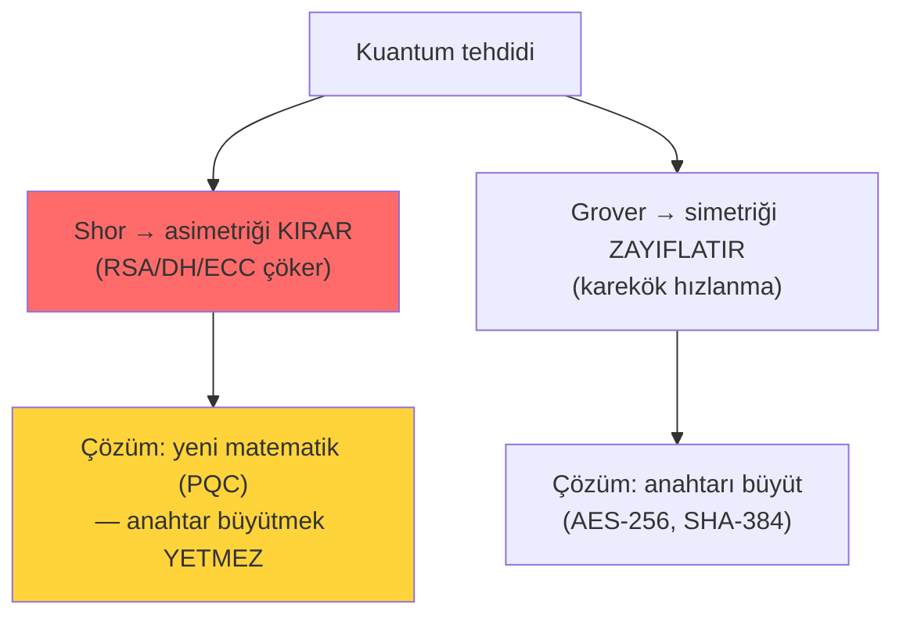
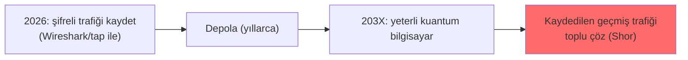
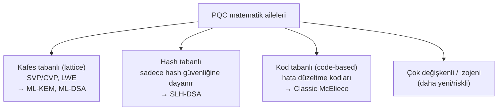
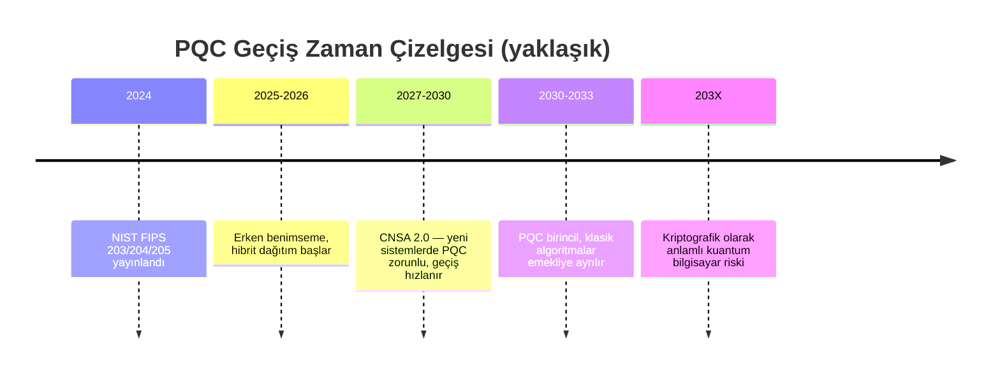
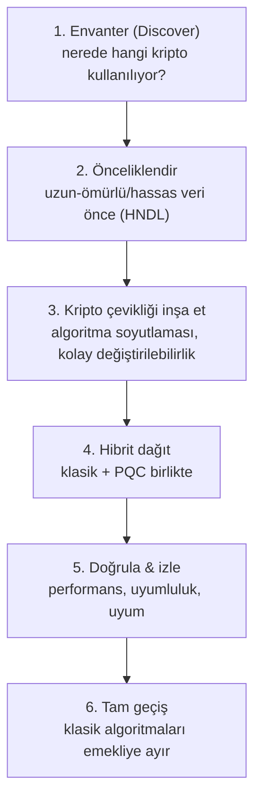

# ⚛️ Post-Kuantum Kriptografi (PQC)

> ⭐ **Bu, deponun en derin ve en özenli dosyasıdır.** Uzun vadeli hedefin (PQC alanında şirket kurmak, Security Architect yolu) doğrudan bu konudur. Buradaki amaç, PQC'yi hem kavramsal olarak sağlam kurmak hem de bir mimarın/kurucunun ihtiyaç duyacağı **stratejik ve operasyonel** çerçeveyi vermektir.

**Ön koşul zinciri:** [temel-kavramlar.md](temel-kavramlar.md) → [anahtar-degisimi-ve-imza.md](anahtar-degisimi-ve-imza.md) → [zorluk-varsayimlari.md](zorluk-varsayimlari.md) → **buradasın**.

> 📌 **Güncellik notu:** Bu dosyadaki standart numaraları (FIPS 203/204/205 sonlandı; FIPS 206/FN-DSA taslak; HQC ek KEM) ve NSA CNSA 2.0 tarihleri resmî NIST/NSA belgeleriyle doğrulanmıştır (satır-içi kaynaklar verildi). Yine de bu alan hızla gelişmektedir; kritik bir mimari karar öncesi [nist.gov PQC](https://csrc.nist.gov/projects/post-quantum-cryptography) sayfasından en güncel durum teyit edilmelidir.

---

## 1. Tehdit: kuantum bilgisayar neyi kırar?

Klasik açık anahtarlı kriptografi üç zorluk varsayımına dayanıyordu ([zorluk-varsayimlari.md](zorluk-varsayimlari.md)): factoring (RSA), discrete log (DH), ECDLP (ECC). Yeterince büyük, hataya-dayanıklı bir kuantum bilgisayar bu üçünü de yıkar.

### Shor algoritması — asimetriği kıran
**Shor (1994)**, factoring ve discrete log'u (dolayısıyla RSA, DH, ECC'yi) **polinom zamanda** çözer. Klasik bilgisayarda astronomik olan iş, kuantumda verimli hâle gelir.
- **Sonuç:** RSA, DH, ECDH, ECDSA — bugünkü tüm açık anahtarlı kriptografi **kırılır**.

### Grover algoritması — simetriği yalnızca zayıflatan
**Grover (1996)**, yapılandırılmamış arama problemini (ör. simetrik anahtarı kaba kuvvetle deneme) **karekök kadar** hızlandırır: `2^n` yerine `2^(n/2)`.
- **Sonuç:** Simetriği **kırmaz, zayıflatır**. AES-128 → efektif 64-bit güvenlik. Çözüm basit: **anahtarı büyüt** (AES-256 kullan → efektif 128-bit, hâlâ güvenli).

### Neden asimetrik çok daha ağır vurulur? (kritik nüans)
| | Simetrik (AES) | Asimetrik (RSA/ECC) |
|---|---|---|
| Kuantum saldırısı | Grover (karekök) | **Shor (polinom → yıkıcı)** |
| Etki | Zayıflar | **Tamamen kırılır** |
| Çözüm | Anahtarı 2× büyüt | **Tamamen yeni algoritma gerekir** |

Simetrik kriptografiyi bir parametre değişimiyle (AES-256) kurtarabiliriz. Asimetriği kurtaramayız — çünkü Shor problemin **kendisini** çözer, sadece hızlandırmaz. İşte PQC'nin varlık nedeni budur.

---

## 2. "Harvest now, decrypt later" — tehdit bugün başlıyor

En sık yapılan yanlış: "kuantum bilgisayar henüz yok, o yüzden acele yok." Bu yanlıştır.

**Harvest now, decrypt later (HNDL) / "önce topla, sonra çöz":** Saldırgan (özellikle devlet düzeyinde) **bugün** şifreli trafiği kaydedip depolar; kuantum bilgisayar olgunlaştığında **geçmişe dönük** çözer.

**Sonuç — kritik zamanlama mantığı:** Uzun süre gizli kalması gereken veriler (sağlık kayıtları, devlet sırları, uzun-dönem sözleşmeler, biyometri) **bugün** PQC ile korunmalıdır. "Verimin gizlilik ömrü + PQC'ye geçiş süresi > kuantum bilgisayarın gelişine kadarki süre" ise, **zaten geç kalmışsın demektir** (Mosca teoremi). Bu, [ileri gizlilik (forward secrecy)](anahtar-degisimi-ve-imza.md) tartışmasının kuantum boyutudur.

> **Bir kurucu/mimar için ders:** PQC bir "gelecek problemi" değil, **bugünün geçiş planlaması** problemidir. İş fırsatı da tam burada: kuruluşların envanterlerini çıkarıp geçiş yol haritası kurmaları gerekiyor.

---

## 3. Post-kuantum kriptografi nedir (ve ne değildir)?

**PQC:** **Klasik donanımda** çalışan, ama hem klasik hem kuantum bilgisayarların kıramayacağı, **yeni matematiksel zorluk varsayımlarına** dayanan asimetrik algoritmalar.

**PQC ≠ Kuantum kriptografi (QKD).** Sık karıştırılan kritik ayrım:
| | Post-Kuantum Kriptografi (PQC) | Kuantum Anahtar Dağıtımı (QKD) |
|---|---|---|
| Donanım | **Klasik** (mevcut bilgisayarlar) | Özel kuantum donanımı (foton, fiber) |
| Ne | Yeni matematiksel algoritmalar | Fizik yasalarıyla anahtar dağıtımı |
| Dağıtım | Yazılım güncellemesiyle her yere | Özel altyapı, sınırlı mesafe |
| Olgunluk | Standartlaştı, dağıtılabilir | Niş, pahalı, sınırlı |

PQC pratiktir çünkü **mevcut donanıma yazılımla** girer. NSA bu yüzden ulusal güvenlik sistemleri için **QKD'yi değil PQC'yi** önerir.

---

## 4. PQC'nin dayandığı yeni matematik aileleri

Shor'un çözemediği problemlere dayanan birkaç aile vardır. **Neden birden fazla?** Çünkü tek bir varsayıma bel bağlamak risklidir — biri kırılırsa diğerleri ayakta kalsın (matematiksel çeşitlilik = kripto çevikliği).

### Kafes tabanlı (lattice-based) — baskın aile
Bir **kafes (lattice)**, uzayda düzenli nokta ızgarasıdır. Zorluk: yüksek boyutlu bir kafeste **en kısa/en yakın vektörü bulmak** (SVP/CVP) pratik olarak imkânsızdır — kuantum bilgisayar için bile.

- **LWE (Learning With Errors) sezgisi:** Doğrusal denklemlere **küçük rastgele gürültü** eklenmiştir. Gürültüsüz denklem sistemi kolayca çözülür (lineer cebir); ama gürültü eklenince gizli vektörü bulmak zorlaşır. Güvenlik bu "gürültülü denklemleri çözme zorluğuna" dayanır.
- **Neden baskın?** İyi performans (hız + makul anahtar boyutu) ve sağlam güvenlik temeli. NIST'in seçtiği ana KEM ve imza bundandır.

### Hash tabanlı (hash-based) — en muhafazakâr
Güvenliği **yalnızca hash fonksiyonunun** ([temel-kavramlar.md](temel-kavramlar.md)) güvenliğine dayanır — yeni/egzotik bir varsayıma değil. Bu yüzden en güvenilir/muhafazakâr seçenektir (hash zaten iyi anlaşılmış). Dezavantaj: imzalar büyük/yavaş olabilir. **SLH-DSA** bundandır.

### Kod tabanlı (code-based)
Hata düzeltme kodlarını çözmenin zorluğuna dayanır (McEliece, 1978'den beri kırılmadı). Çok güvenli ama anahtarlar **çok büyük**.

---

## 5. NIST standartları: FIPS 203, 204, 205

NIST, yıllarca süren bir yarışmayla (2016–2024) ilk üç PQC standardını **13 Ağustos 2024'te** sonlandırdı; standartlar 14 Ağustos 2024'te yürürlüğe girdi (kaynak: [NIST CSRC PQC FIPS Approved](https://csrc.nist.gov/news/2024/postquantum-cryptography-fips-approved)). **Ezberlenmesi gereken üçlü:**

| Standart | Algoritma adı | Ne için | Matematik ailesi |
|----------|---------------|---------|------------------|
| **[FIPS 203](https://csrc.nist.gov/pubs/fips/203/final)** | **ML-KEM** (eski adı CRYSTALS-Kyber) | Anahtar kapsülleme (KEM) — RSA/ECDH yerine anahtar değişimi | Kafes (lattice) |
| **[FIPS 204](https://csrc.nist.gov/pubs/fips/204/final)** | **ML-DSA** (eski adı CRYSTALS-Dilithium) | Dijital imza — RSA/ECDSA yerine | Kafes (lattice) |
| **[FIPS 205](https://csrc.nist.gov/pubs/fips/205/final)** | **SLH-DSA** (eski adı SPHINCS+) | Dijital imza (yedek/muhafazakâr) | **Hash** tabanlı |

### Neden iki imza standardı (204 ve 205)?
Bu, kripto çevikliğinin ta kendisidir: **ML-DSA (204)** kafes tabanlıdır — hızlı, verimli, ama güvenliği (nispeten yeni) kafes varsayımına dayanır. **SLH-DSA (205)** hash tabanlıdır — daha yavaş/büyük ama güvenliği **kafes zorluğundan tamamen bağımsızdır**. Eğer bir gün kafes problemlerinde beklenmedik bir kırılma olursa, hash tabanlı imza hâlâ ayakta kalır. **Tek yumurtayı tek sepete koymama** ilkesi.

- **ML-KEM (203):** Anahtar değişimi/şifreleme için. TLS, VPN, mesajlaşmada RSA/ECDH'in yerini alacak.
- **ML-DSA (204):** Günlük imzalama için birincil seçim.
- **SLH-DSA (205):** Uzun ömürlü/yüksek güvence gereken imzalar ve çeşitlilik sigortası.

Bu üçlünün ötesinde standartlaşma sürüyor ve bir kurucu/mimar için takip edilmesi gereken iki gelişme var:
- **FN-DSA (FALCON) → FIPS 206:** Kafes tabanlı (NTRU kafesleri), ML-DSA'dan daha küçük imza üreten ama uygulaması daha hassas (kayan nokta) bir imza şeması. NIST taslağı (Initial Public Draft) 2025'te sunuldu; nihai standardın 2026 sonu–2027 başı civarında beklenmesi öngörülüyor (kaynak: [DigiCert — FN-DSA/FIPS 206](https://www.digicert.com/blog/quantum-ready-fndsa-nears-draft-approval-from-nist)).
- **HQC (kod tabanlı) → ek KEM:** NIST, ML-KEM'e **matematiksel çeşitlilik sigortası** olarak, kafesten bağımsız (kod tabanlı) bir yedek anahtar kapsülleme algoritması olan **HQC**'yi **Mart 2025'te** seçti (kaynak: [NIST PQC additional KEM](https://www.nist.gov/news-events/news/2024/08/nist-releases-first-3-finalized-post-quantum-encryption-standards)). Bu seçim, tıpkı iki imza standardı (204 kafes + 205 hash) gibi, "tek matematiksel varsayıma bel bağlama" ilkesinin KEM tarafındaki uygulamasıdır.

---

## 6. Geçiş stratejisi ve CNSA 2.0

### NSA CNSA 2.0 — takvim
**NSA'nın Commercial National Security Algorithm Suite 2.0**, ulusal güvenlik sistemleri (NSS) için PQC geçiş takvimini koyar (kaynak: [NSA CNSA 2.0](https://media.defense.gov/2022/Sep/07/2003071834/-1/-1/0/CSA_CNSA_2.0_ALGORITHMS_.PDF)). Öne çıkan tarihler: yazılım/firmware imzalamada PQC'ye **öncelik en geç 2025**, çoğu sistem sınıfı için geçişin **2030'a kadar** tamamlanması ve tüm NSS'te klasik algoritmaların **2033'e kadar** emekliye ayrılması hedeflenir. Firmware/yazılım imzalamanın öncelikli olması anlamlıdır: imzalar uzun ömürlüdür ve bugün üretilen imzalı yazılım yıllarca sahada kalır ([00-baslangic/bilgisayar-temelleri.md](../00-baslangic/bilgisayar-temelleri.md) Secure Boot).

### Hibrit dağıtım (geçişin köprüsü)
Geçiş döneminde en yaygın strateji **hibrit**: klasik (ECDH) **VE** post-kuantum (ML-KEM) anahtar değişimini **birlikte** yapıp sonuçları birleştirmek.
- **Neden?** PQC algoritmaları görece yeni; beklenmedik bir zayıflık çıkarsa, klasik katman hâlâ korur. İkisi birden kırılmadıkça güvenlik sürer. Google/Cloudflare TLS'te bunu (X25519+ML-KEM) çoktan dağıttı.

### Bir mimarın PQC geçiş yol haritası (operasyonel)

Bu yol haritası, senin **PQC şirketinin** sunacağı hizmetin iskeletidir: kuruluşlar bu altı adımı tek başlarına yapamıyor — kripto envanteri çıkarma, önceliklendirme ve çevik mimari en büyük darboğazlar.

---

## 7. Kripto çevikliği (crypto-agility) — mimari ilke

**Kripto çevikliği:** Kullanılan kriptografik algoritmayı, **sistemi baştan yazmadan** değiştirebilme yeteneği.

**Neden PQC'nin kalbinde?**
- Algoritmalar sabit kodlanırsa (hardcoded RSA), değişim = tüm sistemi yeniden yazmak = yıllar.
- Çevik tasarımda algoritma bir soyutlamanın arkasındadır; yeni bir standart çıkınca (veya biri kırılınca) yapılandırmayı değiştirmek yeter.

> **Kesişim — çeviklik eksikliğinin riski:** Bir algoritma kırıldığında (kuantum veya klasik) hızlı geçememek → **toplu maruziyet**. HNDL ile birleşince: hem geçmiş veri açığa çıkar hem de yeni veri korunamaz. Bu yüzden çeviklik, PQC'den *önce* inşa edilmesi gereken temeldir — PQC sadece ilk büyük "algoritma değişimi" testidir; sonuncusu olmayacak.

Bu ilke, [zorluk-varsayimlari.md](zorluk-varsayimlari.md)'nin "güvenlik bir varsayıma dayanır, varsayım çökebilir" dersinin doğrudan mimari sonucudur.

---

## 8. Nüans ve sık yanlışlar

- **"Kuantum yok, acele yok":** HNDL yüzünden yanlış — uzun-ömürlü veri bugün risk altında.
- **"PQC = QKD":** Hayır — PQC klasik donanımda yazılımdır; QKD özel fizik donanımıdır (§3).
- **"AES de bitti":** Hayır — Grover simetriği sadece zayıflatır; AES-256 güvende kalır.
- **"Tek algoritma seçelim":** Hayır — matematiksel çeşitlilik (203+204+205) bilinçli bir çeviklik stratejisidir.
- **"Sadece şifrelemeyi değiştir":** İmzalar da (firmware, sertifika, kod imzalama) geçmeli; hatta uzun-ömürlü imzalar (kök sertifikalar) en acil olanlar arasında.
- **Performans gerçek:** PQC anahtarları/imzaları klasikten büyüktür (ML-KEM açık anahtarı ~1KB+, SLH-DSA imzası KB'larca). Protokol/bant genişliği etkileri gerçek mühendislik problemleridir.

---

## 9. Saldırı–savunma kesişimi ve senin yolun

- **Savunma zamanlaması bir yarıştır:** "PQC'ye geçiş süresi + verinin gizlilik ömrü < kuantumun gelişi" tutmalı (Mosca). Bu, savunmacının bugün başlaması gereken bir hesaptır.
- **Saldırgan tarafı pasiftir ama sinsi:** HNDL için özel yetenek gerekmez — sadece trafiği kaydet ve bekle. Bu yüzden savunma, saldırıyı beklemeden proaktif olmalı.
- **Senin kariyer köprün:** Bu dosyadaki üç katman —
  1. **Teori:** neden klasik kripto düşüyor (Shor), yeni matematik nasıl direniyor (lattice/LWE).
  2. **Standart:** FIPS 203/204/205, ML-KEM/ML-DSA/SLH-DSA.
  3. **Strateji/mimari:** HNDL, hibrit geçiş, kripto çevikliği, CNSA 2.0 takvimi, envanter→geçiş yol haritası.

  Bir **Security Architect** ve **PQC kurucusu** için asıl değer üçüncü katmandadır: teoriyi bilen çok, ama kuruluşları güvenli şekilde geçiren az. İleri çalışma için: NIST PQC projesini takip et, Open Quantum Safe (liboqs) ile pratik yap, kafes matematiğini (LWE, Ring-LWE) matematik mühendisliği arka planınla derinleştir → [15-projeler/spesifikasyon-sonrasi-yol-haritasi.md](../15-projeler/spesifikasyon-sonrasi-yol-haritasi.md).

---

## 10. Özet (ezber kartı gibi ama bağlamlı)

| Kavram | Öz |
|--------|-----|
| **Shor** | Asimetriği (RSA/DH/ECC) KIRAR — polinom zaman |
| **Grover** | Simetriği ZAYIFLATIR (karekök) — AES-256 ile çözülür |
| **HNDL** | Bugün kaydet, yarın çöz → uzun-ömürlü veri bugün risk |
| **Lattice/LWE** | Gürültülü denklem çözme zorluğu → baskın PQC ailesi |
| **FIPS 203 / ML-KEM** | Kuantuma dayanıklı anahtar değişimi (RSA/ECDH yerine) |
| **FIPS 204 / ML-DSA** | Kuantuma dayanıklı imza (kafes) |
| **FIPS 205 / SLH-DSA** | Kuantuma dayanıklı imza (hash — çeşitlilik sigortası) |
| **Crypto-agility** | Sistemi yeniden yazmadan algoritma değiştirebilme |
| **CNSA 2.0** | NSA'nın ~2030 PQC geçiş hedefi |
| **Hibrit** | Klasik + PQC birlikte (geçiş köprüsü) |

> **Sonraki:** [pratik-lab/hash_kirma_john_hashcat.md](pratik-lab/hash_kirma_john_hashcat.md) ve [pratik-lab/openssl_ile_sertifika_pratikleri.md](pratik-lab/openssl_ile_sertifika_pratikleri.md).
