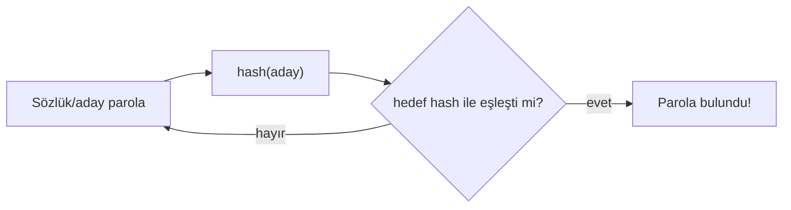

# 🔨 Pratik Lab: Hash Kırma (John the Ripper & Hashcat)

> Bu bir **pratik laboratuvardır**. Hash kırmayı **kendi ürettiğin hash'ler** üzerinde deneyerek, [temel-kavramlar.md](../temel-kavramlar.md)'deki "neden salt + yavaş KDF" savunmasının **saldırgan tarafını** somut olarak görürsün. Savunmayı gerçekten anlamak için saldırıyı bir kez yaşamak gerekir.

> ⚠️ **Etik:** Yalnızca **kendi ürettiğin** veya açık CTF/lab hash'lerini kır. Başkasının parola hash'ini izinsiz kırmak yasa dışıdır → [../../10-pentest-metodolojisi/metodoloji-ve-rules-of-engagement.md](../../10-pentest-metodolojisi/metodoloji-ve-rules-of-engagement.md).

---

## 1. Hash kırma nedir? (kavram tazeleme)

Hash tek yönlüdür ([temel-kavramlar.md](../temel-kavramlar.md)) — çıktıdan girdiyi *hesaplayamazsın*. Ama **tahmin edip doğrulayabilirsin**: bir parola adayını hash'le, hedef hash ile karşılaştır. Eşleşirse parolayı buldun. "Kırma" budur — matematiksel tersine çevirme değil, **hızlı tahmin**.



Bu yüzden savunma "hash'i tersine çevrilemez yapmak" değil (zaten öyle), **tahmini pahalı yapmaktır**: salt (ön-hesaplamayı engeller) + yavaş KDF (saniyede milyar yerine bin deneme).

---

## 2. Saldırı türleri

| Tür | Nasıl | Ne zaman |
|-----|-------|----------|
| **Sözlük (dictionary)** | Bilinen parola listesini dene (rockyou.txt) | İlk ve en verimli |
| **Kural tabanlı (rules)** | Sözlüğü dönüştür (`parola`→`P@ssw0rd!`) | Gerçekçi varyasyonlar |
| **Kaba kuvvet (brute-force / mask)** | Tüm kombinasyonlar (belirli desen) | Kısa/basit parolalar |
| **Rainbow table** | Ön-hesaplanmış hash tablosu | **Salt yoksa** — salt bunu öldürür |

---

## 3. Ortam ve araçlar

- **John the Ripper (JtR):** Esnek, otomatik format tespiti, CPU odaklı.
- **Hashcat:** GPU hızlandırmalı, dünyanın en hızlısı, geniş hash desteği.
- **Sözlük:** `rockyou.txt` (Kali'de `/usr/share/wordlists/rockyou.txt.gz`).

```bash
# rockyou.txt'i aç (Kali)
gunzip -k /usr/share/wordlists/rockyou.txt.gz
```

---

## 4. Alıştırma A — Zayıf hash kır (MD5, salt'sız)

**Amaç:** Salt'sız hızlı hash'in ne kadar savunmasız olduğunu görmek.

```bash
# 1. Kendi test hash'ini üret (zayıf: MD5, salt yok)
echo -n "password123" | md5sum | awk '{print $1}' > hash.txt
cat hash.txt    # 482c811da5d5b4bc6d497ffa98491e38

# 2. Hashcat ile kır (-m 0 = MD5, -a 0 = sözlük)
hashcat -m 0 -a 0 hash.txt /usr/share/wordlists/rockyou.txt

# 3. Sonucu göster
hashcat -m 0 hash.txt --show
```

Alternatif — John the Ripper:
```bash
echo "user:$(echo -n 'password123' | md5sum | awk '{print $1}')" > jtr_hash.txt
john --format=raw-md5 --wordlist=/usr/share/wordlists/rockyou.txt jtr_hash.txt
john --show --format=raw-md5 jtr_hash.txt
```

> 📸 EKRAN GÖRÜNTÜSÜ EKLENECEK: Hashcat'in `password123`'ü saniyeler içinde kırdığı çıktı (Status: Cracked).

**Gözlem:** `rockyou.txt`'te olan zayıf bir parola, salt'sız MD5 ile **saniyeler** içinde düşer.

---

## 5. Alıştırma B — Salt'ın etkisini gör

**Amaç:** Aynı parola, salt ile neden rainbow table'a karşı korunur?

```bash
# Aynı parola, iki farklı salt → tamamen farklı hash'ler
echo -n "salt1password123" | sha256sum
echo -n "salt2password123" | sha256sum
# İki çıktı tamamen farklı → tek bir rainbow table ikisini de çözemez
```

**Gözlem:** Salt olduğunda, saldırgan her kullanıcı için **ayrı** hesaplama yapmak zorunda; ön-hesaplanmış tablolar işe yaramaz. Salt gizli değildir ama saldırıyı ölçeklenemez kılar.

---

## 6. Alıştırma C — Yavaş KDF neden kırılmayı öldürür

**Amaç:** bcrypt/Argon2'nin neden MD5'ten milyonlarca kat güvenli olduğunu hız farkıyla görmek.

```bash
# MD5 hash'leme hızı (çok hızlı → saldırgan için kötü)
time (for i in $(seq 1 100000); do echo -n "test$i" | md5sum >/dev/null; done)

# bcrypt (Python) — kasıtlı yavaş
python3 -c "import bcrypt,time; t=time.time(); [bcrypt.hashpw(b'test', bcrypt.gensalt(rounds=12)) for _ in range(100)]; print('100 bcrypt:', round(time.time()-t,2),'sn')"
```

**Gözlem:** MD5 saniyede yüz binlerce; bcrypt saniyede yüzlerce (iş faktörüne göre). Saldırgan için bu, sözlük saldırısının **binlerce kat yavaşlaması** demek — brute-force ekonomik olarak çöker. Hashcat'te bcrypt (`-m 3200`) MD5'ten (`-m 0`) dramatik olarak yavaş kırılır; kendin dene ve hız farkını gözlemle.

---

## 7. Saldırıdan savunmaya köprü

Bu lab'ın asıl dersi tablo hâlinde:

| Gördüğün | Savunma çıkarımı |
|----------|------------------|
| MD5 saniyede kırıldı | Asla hızlı hash (MD5/SHA1) ile parola saklama |
| Salt'sız → rainbow table | Her parolaya benzersiz salt |
| bcrypt/Argon2 çok yavaş kırıldı | Yavaş, ayarlanabilir KDF kullan (Argon2 önerilen) |
| rockyou'daki parola anında düştü | Parola politikası + parola yöneticisi + MFA |

> Bu, [temel-kavramlar.md](../temel-kavramlar.md) §6 (salt/pepper/KDF) ve [A04 Cryptographic Failures](../../04-web-guvenligi/owasp-top10-tam-rehber.md) (OWASP Top 10:2025) savunmasının **neden** var olduğunu deneyimsel olarak kanıtlar.

---

## 8. Referans: sık hash modları (Hashcat)

| `-m` | Hash | Not |
|------|------|-----|
| 0 | MD5 | Kırık, hızlı |
| 100 | SHA1 | Kırık |
| 1400 | SHA-256 | Hızlı (parola için uygun değil) |
| 3200 | bcrypt | Yavaş, **iyi** (parola için) |
| 1800 | sha512crypt | Linux `/etc/shadow` ($6$) |
| 1000 | NTLM | Windows |
| 22000 | WPA-PBKDF2 | Wi-Fi el sıkışması |

```bash
# Linux /etc/shadow formatını kırma (kendi lab hesabın!)
# unshadow ile passwd+shadow birleştir, sonra john
sudo unshadow /etc/passwd /etc/shadow > birlesik.txt
john --wordlist=/usr/share/wordlists/rockyou.txt birlesik.txt
```

> **Sonraki:** [openssl_ile_sertifika_pratikleri.md](openssl_ile_sertifika_pratikleri.md).
