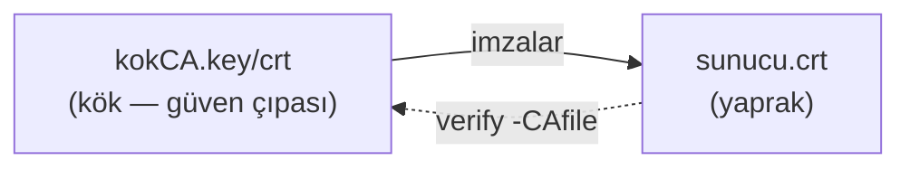

# 🔏 Pratik Lab: OpenSSL ile Sertifika ve Şifreleme Pratikleri

> Bu bir **pratik laboratuvardır**. OpenSSL ile anahtar üreterek, kendi CA'nı kurarak, sertifika imzalayarak ve şifreleme/hash işlemleri yaparak [pki-x509.md](../pki-x509.md) ve [temel-kavramlar.md](../temel-kavramlar.md)'deki teoriyi **elinle** kuracaksın. PKI'yı gerçekten anlamanın tek yolu bir tane kurmaktır.

Tüm komutlar standart `openssl` iledir (Linux/macOS/WSL/Git Bash). Çıktıları incele, dosyaları aç, ne olduğunu gör.

---

## 1. Simetrik şifreleme (AES)

```bash
# Bir dosyayı AES-256 ile şifrele (parola tabanlı)
echo "Gizli mesaj: PQC geleceği" > gizli.txt
openssl enc -aes-256-cbc -pbkdf2 -salt -in gizli.txt -out gizli.enc

# Şifreli dosyaya bak — okunamaz (ikili)
xxd gizli.enc | head

# Çöz
openssl enc -d -aes-256-cbc -pbkdf2 -in gizli.enc -out cozuldu.txt
cat cozuldu.txt
```
> **Gözlem:** `-pbkdf2` ile paroladan anahtar türetilir ([temel-kavramlar.md](../temel-kavramlar.md) KDF). Yanlış parola → çözme başarısız. Aynı girdiyi iki kez şifrele — `-salt` sayesinde çıktılar farklı olur.

---

## 2. Hash ve HMAC

```bash
# Dosya hash'i (bütünlük doğrulama)
openssl dgst -sha256 gizli.txt

# HMAC (anahtarlı bütünlük+kimlik → anahtar-degisimi-ve-imza.md)
openssl dgst -sha256 -hmac "paylasilan-gizli-anahtar" gizli.txt

# Bir bit değiştir, hash'in tamamen değiştiğini gör (çığ etkisi)
echo "Gizli mesaj: PQC geleceGi" > gizli2.txt   # tek harf farkı
openssl dgst -sha256 gizli.txt gizli2.txt
```
> **Gözlem:** Tek karakter değişimi hash'in yarısından fazlasını değiştirir (avalanche). Bu, dosya bütünlüğü doğrulamanın temelidir.

---

## 3. Asimetrik anahtar çifti (RSA ve EC)

```bash
# RSA özel anahtar üret (2048-bit)
openssl genrsa -out ozel_rsa.pem 2048

# Ondan açık anahtarı çıkar
openssl rsa -in ozel_rsa.pem -pubout -out acik_rsa.pem

# Modern alternatif: eliptik eğri (daha küçük, aynı güvenlik → zorluk-varsayimlari.md)
openssl ecparam -name prime256v1 -genkey -noout -out ozel_ec.pem
openssl ec -in ozel_ec.pem -pubout -out acik_ec.pem

# Anahtarın içine bak
openssl rsa -in ozel_rsa.pem -text -noout | head -20
```
> **Gözlem:** RSA özel anahtar dosyası büyük (asal çarpanlar, üsler); EC anahtarı çok daha küçük. [zorluk-varsayimlari.md](../zorluk-varsayimlari.md)'deki boyut karşılaştırmasını canlı gör.

---

## 4. Dijital imza (imzala + doğrula)

```bash
# Mesajı özel anahtarla imzala (→ anahtar-degisimi-ve-imza.md)
openssl dgst -sha256 -sign ozel_rsa.pem -out mesaj.imza gizli.txt

# Açık anahtarla doğrula
openssl dgst -sha256 -verify acik_rsa.pem -signature mesaj.imza gizli.txt
# "Verified OK" → doğru gönderen + değişmemiş

# Mesajı değiştir, doğrulamanın BAŞARISIZ olduğunu gör
echo "değiştirilmiş" >> gizli.txt
openssl dgst -sha256 -verify acik_rsa.pem -signature mesaj.imza gizli.txt
# "Verification Failure" → bütünlük ihlali yakalandı
```
> **Gözlem:** İmza, hem gönderen kimliğini hem bütünlüğü kanıtlar. Mesaj değişirse doğrulama çöker — yazılım imzalamanın ([A08](../../04-web-guvenligi/owasp-top10-tam-rehber.md)) neden tedarik zincirini koruduğu budur.

**İki durumun çıktısı yan yana:**
```text
# Mesaj değişmemişken:
$ openssl dgst -sha256 -verify acik_rsa.pem -signature mesaj.imza gizli.txt
Verified OK

# Mesaj değiştirildikten sonra (tek karakter bile):
$ openssl dgst -sha256 -verify acik_rsa.pem -signature mesaj.imza gizli.txt
Verification Failure
```
"Verified OK" hem gönderenin kimliğini (yalnızca özel anahtar sahibi imzalayabilir) hem bütünlüğü (mesaj değişmemiş) kanıtlar. Tek bir bit değişince "Verification Failure" — çünkü hash ([../temel-kavramlar.md](../temel-kavramlar.md)) tamamen değişir.

---

## 5. Kendi PKI'nı kur (mini CA + zincir)

Bu, [pki-x509.md](../pki-x509.md)'deki güven zincirini elinle kurmaktır: kendi kök CA'nı oluştur, bir sunucu sertifikası imzala, zinciri doğrula.

```bash
# ---- ADIM 1: Kök CA (Root CA) oluştur ----
openssl genrsa -out kokCA.key 4096
openssl req -x509 -new -key kokCA.key -sha256 -days 3650 \
  -out kokCA.crt -subj "/CN=Benim Kok CA/O=Lab/C=TR"

# ---- ADIM 2: Sunucu anahtarı + CSR (imzalama isteği) ----
openssl genrsa -out sunucu.key 2048
openssl req -new -key sunucu.key -out sunucu.csr \
  -subj "/CN=test.lab/O=Lab/C=TR"

# ---- ADIM 3: Kök CA, sunucu CSR'sini imzalar (yaprak sertifika) ----
openssl x509 -req -in sunucu.csr -CA kokCA.crt -CAkey kokCA.key \
  -CAcreateserial -out sunucu.crt -days 365 -sha256

# ---- ADIM 4: Güven zincirini doğrula ----
openssl verify -CAfile kokCA.crt sunucu.crt
# "sunucu.crt: OK" → zincir geçerli ✓

# Sertifikanın içeriğini incele (Subject, Issuer, geçerlilik)
openssl x509 -in sunucu.crt -noout -text | head -20
```



> **Gözlem:** Bu tam olarak bir gerçek CA'nın yaptığı iş. `verify` komutu, tarayıcının HTTPS'te yaptığı zincir doğrulamasının aynısı. Kök CA'ya güvenilmezse (senin kokCA.crt'in tarayıcıda yok) → "güvenilmeyen sertifika" uyarısı. Burp'ün kendi CA'sını neden tarayıcıya eklettiğini ([../pki-x509.md](../pki-x509.md)) şimdi tam anlıyorsun.

**Zincir doğrulama çıktısı:**
```text
$ openssl verify -CAfile kokCA.crt sunucu.crt
sunucu.crt: OK

$ openssl x509 -in sunucu.crt -noout -subject -issuer -dates
subject=CN = test.lab, O = Lab, C = TR
issuer=CN = Benim Kok CA, O = Lab, C = TR
notBefore=Jul  2 12:00:00 2026 GMT
notAfter=Jul  2 12:00:00 2027 GMT
```
`OK` = zincir geçerli: `sunucu.crt`'yi imzalayan `issuer` (Benim Kok CA), `-CAfile` ile verdiğin güvenilen köke ulaşıyor. Tarayıcının HTTPS'te yaptığı doğrulama tam olarak budur; fark, tarayıcının kök CA listesinin işletim sistemine gömülü olmasıdır ([../pki-x509.md](../pki-x509.md)).

---

## 6. Gerçek bir sitenin sertifikasını incele

```bash
# Canlı bir sitenin sertifika zincirini çek ve incele
openssl s_client -connect github.com:443 -servername github.com </dev/null 2>/dev/null \
  | openssl x509 -noout -issuer -subject -dates

# Tam zinciri gör
openssl s_client -connect github.com:443 -showcerts </dev/null 2>/dev/null | grep -E "s:|i:"
```
> **Gözlem:** Gerçek sertifikanın Issuer'ı (bir ticari/ücretsiz CA), geçerlilik süresi (kısa — modern uygulama), ve zinciri. [pki-x509.md](../pki-x509.md)'deki teoriyi canlı internette gör.

---

## 7. TLS sunucusu kur ve bağlan (isteğe bağlı ileri)

```bash
# Kendi sertifikanla basit bir TLS sunucusu çalıştır (test)
openssl s_server -accept 4443 -cert sunucu.crt -key sunucu.key -www

# Başka terminalden bağlan (kök CA ile doğrula)
openssl s_client -connect localhost:4443 -CAfile kokCA.crt
```
> **Gözlem:** Kendi kurduğun PKI ile şifreli bir TLS oturumu. Bu, [anahtar-degisimi-ve-imza.md](../anahtar-degisimi-ve-imza.md)'deki TLS el sıkışmasının elle çalışan hâlidir.

---

## 8. Öğrenme köprüsü

Bu lab'la şu teori dosyalarını elinle kanıtladın:
- **Simetrik/asimetrik/hash/imza** ([temel-kavramlar.md](../temel-kavramlar.md), [anahtar-degisimi-ve-imza.md](../anahtar-degisimi-ve-imza.md)) — hepsini komutla çalıştırdın.
- **PKI güven zinciri** ([pki-x509.md](../pki-x509.md)) — kendi CA'nı kurup sertifika imzaladın, doğruladın.
- **Anahtar boyutu farkı** ([zorluk-varsayimlari.md](../zorluk-varsayimlari.md)) — RSA vs EC dosya boyutunu gördün.

> **İleri PQC pratiği:** **OpenSSL 3.5.0** (8 Nisan 2025, LTS) artık üç NIST standardını — ML-KEM (FIPS 203), ML-DSA (FIPS 204), SLH-DSA (FIPS 205) — harici kütüphane olmadan **yerel (native)** destekler; TLS 1.3'te varsayılan anahtar paylaşımı hibrit `X25519MLKEM768`'e döner (kaynak: [OpenSSL 3.5 blog](https://openssl-library.org/post/2025-04-08-openssl-35-final-release/)). Bu sürümle `openssl genpkey -algorithm ML-DSA-65` gibi komutlarla PQC anahtarı üretip yukarıdaki imza/doğrulama akışını post-kuantum algoritmalarla tekrarla. Daha eski OpenSSL'de aynı şeyi **Open Quantum Safe (liboqs/oqs-provider)** sağlayıcısıyla yaparsın (kurulum sürümüne göre değişir). Detay için → [post-kuantum-kriptografi.md](../post-kuantum-kriptografi.md).

> **Modül 05 tamamlandı.** Sonraki: [06-kimlik-erisim-yonetimi-iam/aaa-ve-mfa.md](../../06-kimlik-erisim-yonetimi-iam/aaa-ve-mfa.md).
