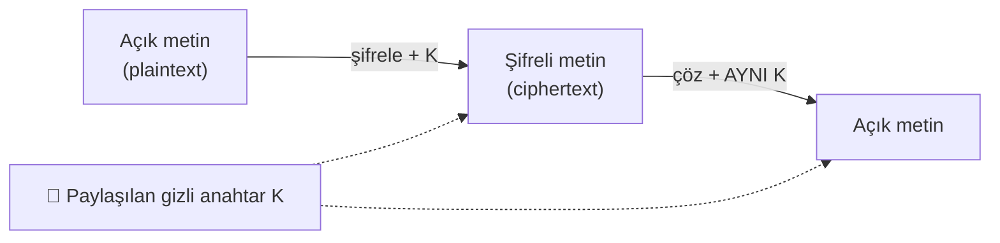
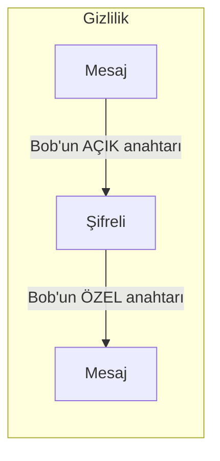

# 🔐 Kriptografi Temel Kavramları

Kriptografi, güvenliğin matematiksel temelidir: gizliliği (kimse okuyamasın), bütünlüğü (kimse değiştiremesin) ve kimlik doğrulamayı (kim olduğunu kanıtla) sağlayan araç kutusudur. Bu dosya simetrik/asimetrik şifreleme, hashing ve parola saklama temellerini kurar — sonraki dosyalar (anahtar değişimi, PKI, post-kuantum) bunun üstüne inşa edilir.

> Terimler: [terminoloji-sozlugu.md](../00-baslangic/terminoloji-sozlugu.md). Devamı: [anahtar-degisimi-ve-imza.md](anahtar-degisimi-ve-imza.md). Kariyer hedefi bağlamı: [post-kuantum-kriptografi.md](post-kuantum-kriptografi.md).

---

## 1. Üç temel hedef: gizlilik, bütünlük, kimlik

Kriptografinin çözdüğü problemler [CIA üçlüsüne](../08-grc-yonetisim-risk-uyum/guvenlik-kontrolleri-matrisi.md) doğrudan bağlanır:

| Hedef | Soru | Araç |
|-------|------|------|
| **Gizlilik (confidentiality)** | Veriyi kimse okuyamasın | Şifreleme (simetrik/asimetrik) |
| **Bütünlük (integrity)** | Veri değiştirilmemiş olsun | Hash, MAC/HMAC |
| **Kimlik doğrulama & reddedilemezlik** | Gönderen gerçekten o mu | Dijital imza, MAC |

> **Önemli ayrım:** Şifreleme **gizlilik** sağlar ama tek başına **bütünlük** sağlamaz. Şifreli veri de bozulabilir/değiştirilebilir. Modern sistemler bu yüzden **AEAD** (gizlilik + bütünlük birlikte) kullanır → [anahtar-degisimi-ve-imza.md](anahtar-degisimi-ve-imza.md).

---

## 2. Kodlama ≠ Şifreleme ≠ Hash (kritik ayrım)

Başlangıçta en çok karıştırılan üçlü ([bilgisayar-temelleri.md](../00-baslangic/bilgisayar-temelleri.md)):

| | Amaç | Geri döndürülebilir? | Anahtar? |
|---|------|:---:|:---:|
| **Kodlama** (Base64, URL) | Taşınabilir format | Evet, herkes | Yok |
| **Şifreleme** (AES, RSA) | Gizlilik | Evet, sadece anahtarla | Var |
| **Hash** (SHA-256) | Parmak izi / bütünlük | **Hayır** (tek yönlü) | Yok (HMAC hariç) |

> ⚠️ Base64 **koruma değildir**. `echo -n "sır" | base64` çıktısını herkes çözer. "Şifreledim" derken Base64 kullanmak, en yaygın başlangıç hatasıdır.

---

## 3. Simetrik şifreleme

**Aynı anahtar** hem şifreler hem çözer. Hızlıdır — büyük veri için idealdir.



- **Standart:** **AES** (Advanced Encryption Standard) — 128/192/256 bit anahtar. Bugünün altın standardı; donanım hızlandırmalı (AES-NI).
- **Akış (stream) alternatifi:** ChaCha20 — mobil/yazılımda hızlı.
- **Blok modları:** ECB (**asla kullanma** — desen sızdırır), CBC, ve tercih edilen **GCM** (AEAD, bütünlük dahil).

**Güçlü yanı:** Hız. **Zayıf yanı — anahtar dağıtım problemi:** İki taraf **aynı gizli anahtarı** nasıl güvenli paylaşacak? Anahtarı göndermek için güvenli bir kanal gerekir ama güvenli kanal kurmak için de anahtar gerekir → tavuk-yumurta. Bu problemi **asimetrik kriptografi** ve **anahtar değişimi** çözer → [anahtar-degisimi-ve-imza.md](anahtar-degisimi-ve-imza.md).

```bash
# AES-256-GCM ile şifreleme (openssl) — bütünlük dahil AEAD
openssl enc -aes-256-gcm -salt -in dosya.txt -out dosya.enc -k "parola"
# Çözme
openssl enc -d -aes-256-gcm -in dosya.enc -out cozuldu.txt -k "parola"
```

---

## 4. Asimetrik (açık anahtarlı) şifreleme

**İki matematiksel olarak bağlı anahtar:** açık anahtar (public key, herkese verilir) ve özel anahtar (private key, gizli tutulur).

- **Açık anahtarla şifrele → özel anahtarla çöz:** Gizlilik. Herkes bana açık anahtarımla şifreli mesaj yollayabilir, sadece ben (özel anahtarımla) açarım.
- **Özel anahtarla imzala → açık anahtarla doğrula:** Kimlik/bütünlük. Sadece ben imzalayabilirim, herkes doğrulayabilir → [anahtar-degisimi-ve-imza.md](anahtar-degisimi-ve-imza.md).



- **Standartlar:** **RSA** (factoring'e dayanır), **ECC** (eliptik eğri, aynı güvenlik daha küçük anahtarla).
- **Yavaştır** — bu yüzden büyük veriyi doğrudan asimetrikle şifrelemeyiz.

### Nüans: hibrit şifreleme (gerçek dünyada nasıl?)
TLS, PGP gibi sistemler **ikisini birleştirir (hibrit):**
1. **Asimetrik** ile bir **simetrik oturum anahtarını** güvenli paylaş (anahtar dağıtım problemini çöz).
2. Asıl veriyi **hızlı simetrik** (AES) ile şifrele.

Böylece asimetriğin anahtar-dağıtım gücü + simetriğin hızı birleşir. "Neden ikisi de var?" sorusunun cevabı budur.

| | Simetrik | Asimetrik |
|---|----------|-----------|
| Anahtar | Tek, paylaşılan | Çift (açık/özel) |
| Hız | Çok hızlı | Yavaş |
| Anahtar dağıtımı | Problem | Çözer |
| Kullanım | Toplu veri şifreleme | Anahtar değişimi, imza |
| Örnek | AES, ChaCha20 | RSA, ECC |

---

## 5. Hashing — tek yönlü parmak izi

**Hash fonksiyonu**, herhangi boyuttaki girdiyi **sabit uzunlukta**, geri döndürülemez bir çıktıya (özet/digest) çevirir.

```bash
echo -n "merhaba" | sha256sum
# 4d1877... (her zaman 256 bit = 64 hex karakter)
```

### İyi bir kriptografik hash'in özellikleri
| Özellik | Anlam |
|---------|-------|
| **Deterministik** | Aynı girdi → hep aynı çıktı |
| **Tek yönlü (preimage resistance)** | Çıktıdan girdiyi bulmak pratik olarak imkânsız |
| **Çığ etkisi (avalanche)** | Girdide 1 bit değişse çıktının yarısı değişir |
| **Çakışma direnci (collision resistance)** | İki farklı girdi aynı hash'i vermez |

- **Kullan:** **SHA-256**, SHA-3, BLAKE2.
- **Kullanma (kırık):** **MD5, SHA-1** — çakışma saldırılarına açık; bütünlük için bile artık güvenilmez.

**Kullanım alanları:** Dosya bütünlüğü doğrulama, dijital imza (imzalanan şey hash'tir), parola saklama (aşağıda), blok zinciri.

---

## 6. Parola saklama: salt, pepper, KDF

**Parolalar asla düz metin veya basit hash ile saklanmaz.** Neden ve nasıl:

### Neden düz hash yetmez?
- Saldırgan DB'yi ele geçirirse, `SHA256(parola)` değerlerini **rainbow table** (önceden hesaplanmış hash tabloları) ile hızla çözebilir.
- Aynı parolayı kullanan iki kişi **aynı hash'e** sahip olur → desen sızar.

### Salt (tuz)
Her parolaya özel, **rastgele ve benzersiz** bir değer eklenip öyle hash'lenir: `hash(salt + parola)`. Salt DB'de açıkça saklanır (gizli değildir).
- Rainbow table'ı **işe yaramaz** kılar (her kullanıcı için ayrı tablo gerekirdi).
- Aynı parolalar farklı hash'ler üretir.

### Pepper (biber)
Salt'a ek olarak, **tüm parolalar için ortak, gizli** (DB dışında, ör. uygulama config/HSM'de tutulan) bir değer. DB sızsa bile pepper bilinmediği için hash'ler çözülemez. Salt'ı tamamlar.

### KDF — kasıtlı yavaşlık
Modern parola saklama, hızlı SHA-256 değil, **kasıtlı olarak yavaş ve bellek-yoğun** anahtar türetme fonksiyonları (KDF) kullanır:
- **Argon2** (bugünkü öneri, 2015 şampiyonu), **bcrypt**, **scrypt**, **PBKDF2**.
- Neden yavaş? Saldırgan saniyede milyar yerine bin deneme yapabilsin → brute-force ekonomik olarak imkânsızlaşsın. "İş faktörü (work factor)" ayarlanabilir.

```python
# GÜVENLİ parola saklama (kavramsal — kütüphaneye bırak)
# pip install argon2-cffi
from argon2 import PasswordHasher
ph = PasswordHasher()
saklanan = ph.hash("kullanici_parolasi")   # salt otomatik, yavaş, güçlü
ph.verify(saklanan, "kullanici_parolasi")  # doğrulama
```

> **Kesişim:** Bir DB sızıntısında parolaların nasıl saklandığı her şeyi belirler: düz metin → felaket; MD5 → dakikalar içinde kırılır; Argon2 + salt → pratikte güvenli. Bu, [hash kırma lab'ının](pratik-lab/hash_kirma_john_hashcat.md) saldırgan tarafını ve [A02 Cryptographic Failures](../04-web-guvenligi/owasp-top10-tam-rehber.md)'in savunma tarafını birleştirir.

---

## 7. Saldırı–savunma kesişimi (özet)

- **Simetrik + asimetrik birlikte (hibrit):** TLS, HTTPS, VPN, imzalı güncellemeler — hepsi bu birleşime dayanır.
- **Hash çift taraflıdır:** Savunmada bütünlük/parola koruması; saldırıda hash kırma ([pratik-lab/hash_kirma_john_hashcat.md](pratik-lab/hash_kirma_john_hashcat.md)).
- **Kripto genelde matematikten değil, kullanımdan kırılır:** Zayıf hash (MD5), salt'sız saklama, ECB modu, sabit kodlu anahtar, kendi kripto algoritmanı yazmak ("don't roll your own crypto"). Algoritma sağlam olsa da yanlış kullanım öldürür.

> **Sonraki:** [anahtar-degisimi-ve-imza.md](anahtar-degisimi-ve-imza.md).
