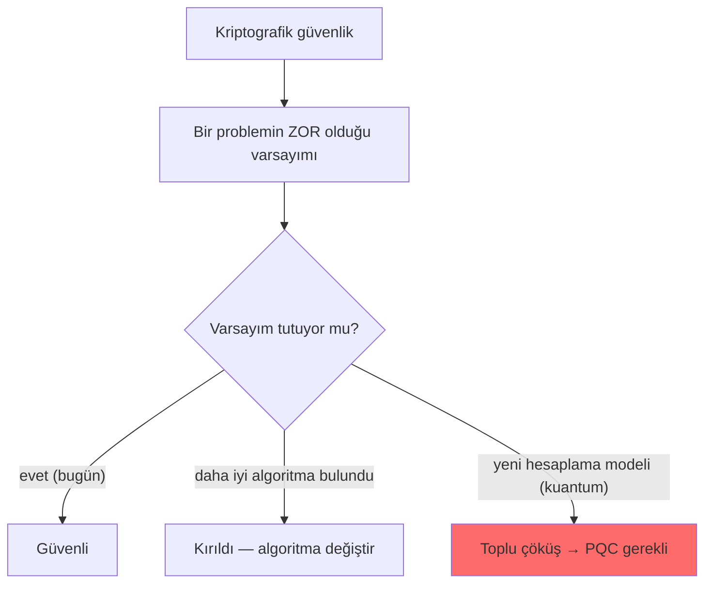
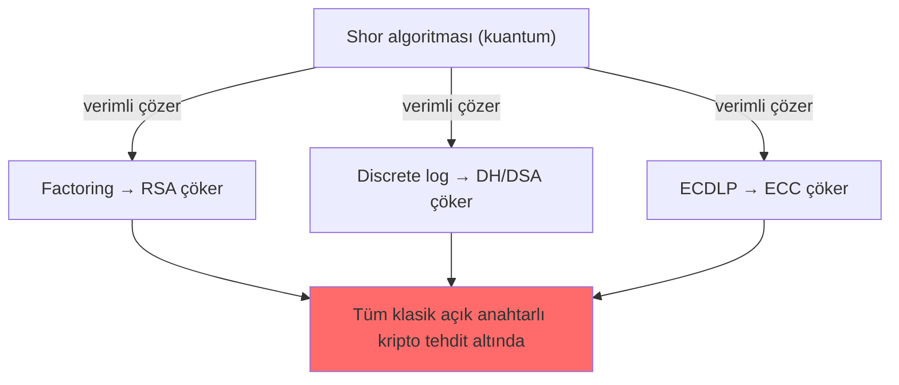

# 🧩 Zorluk Varsayımları (Hardness Assumptions)

Modern kriptografinin "kırılamaz" olması aslında **matematiksel bir bahistir**: belirli problemlerin verimli çözümü **olmadığı varsayılır** (ispatlanmaz). Bu dosya, klasik açık anahtarlı kriptografinin dayandığı üç zorluk varsayımını ve bunların neden "zor" sayıldığını açıklar. Bu, [post-kuantum-kriptografi.md](post-kuantum-kriptografi.md)'yi anlamanın ön koşuludur — çünkü kuantum tehdidi tam olarak bu varsayımları hedef alır.

> Ön koşul: [temel-kavramlar.md](temel-kavramlar.md), [anahtar-degisimi-ve-imza.md](anahtar-degisimi-ve-imza.md).

---

## 1. Neden kriptografi "varsayımlara" dayanır?

Sezgisel beklenti: "matematik kesin, kripto da kesin kırılamaz olmalı." Gerçek daha incedir.

**Kriptografik güvenlik, bazı problemlerin çözümünün pratik olmadığı varsayımına dayanır — bu bir ispat değil, bir varsayımdır.** Yani:
- "Bu problemi verimli çözen bir algoritma **yoktur**" ifadesi **ispatlanamaz** (bunu ispatlamak, ünlü P≠NP probleminin ötesine geçmeyi gerektirir).
- Sadece "onlarca yıldır en zeki insanlar denedi, verimli bir çözüm bulunamadı" gözlemine dayanır.

Bu yüzden bir algoritma "güvenli" derken kastedilen: **"bilinen en iyi saldırı, mevcut/öngörülebilir hesaplama gücüyle makul sürede çözemez."** Bir gün daha iyi bir algoritma (veya yeni bir hesaplama modeli — kuantum) çıkarsa, varsayım çöker.

> **Kesişim:** Bu "varsayıma dayalılık", neden **kripto çevikliğinin (crypto-agility)** kritik olduğunu açıklar — bir varsayım çökerse, sistemi baştan yazmadan algoritmayı değiştirebilmek gerekir → [post-kuantum-kriptografi.md](post-kuantum-kriptografi.md).

---

## 2. Üç klasik zorluk varsayımı

Klasik açık anahtarlı kriptografi üç problem üzerine kuruludur:

### (1) Tam sayı çarpanlarına ayırma (Integer Factorization) → RSA
İki büyük asal sayıyı çarpmak **kolaydır** (`p × q = n`). Ama sonucu (`n`) geri çarpanlarına ayırmak (`n → p, q`) **zordur**.

- **RSA** tam bu asimetriye dayanır: açık anahtar `n`'yi içerir; özel anahtar `p` ve `q`'yu bilmeyi gerektirir.
- 2048-bit bir `n`'yi çarpanlarına ayırmak, klasik bilgisayarlarla astronomik süre alır.

> **Tek yönlü fonksiyon sezgisi:** İleri yön kolay, geri yön zor. Bir camı kırmak kolay, parçaları birleştirmek zor gibi.

### (2) Ayrık logaritma (Discrete Logarithm) → DH, DSA
Bir grupta `g^x mod p` hesaplamak **kolaydır**. Ama `g`, `p` ve `g^x`'i bilip `x`'i bulmak **zordur** (ayrık logaritma).

- **Diffie-Hellman** ([anahtar-degisimi-ve-imza.md](anahtar-degisimi-ve-imza.md)) ve **DSA** buna dayanır.
- Dinleyici `A = g^a mod p`'yi görse bile `a`'yı bulamaz.

### (3) Eliptik eğri ayrık logaritma (ECDLP) → ECC, ECDH, ECDSA
Ayrık logaritmanın **eliptik eğriler** üzerindeki versiyonu. Eliptik eğri grubunda "bir noktayı k kez toplamak" kolay, ama sonuçtan `k`'yi bulmak zordur.

- **ECC**'nin avantajı: ECDLP, klasik ayrık logaritmadan **daha zordur**, bu yüzden **çok daha küçük anahtarla aynı güvenlik** sağlanır (256-bit ECC ≈ 3072-bit RSA). Mobil/IoT için ideal.

| Varsayım | Kolay yön | Zor yön | Kullanan |
|----------|-----------|---------|----------|
| Factoring | `p·q = n` | `n → p,q` | RSA |
| Discrete log | `g^x mod p` | `g^x → x` | DH, DSA, ElGamal |
| ECDLP | `k·P` (nokta toplama) | `kP → k` | ECC, ECDH, ECDSA |

---

## 3. Nüans: "zor" görecelidir — anahtar boyutu neden büyür?

Bir problemin "zorluğu" sabit değildir; hesaplama gücü ve algoritmalar geliştikçe **aynı güvenlik için daha büyük anahtar** gerekir.
- 1990'larda 512-bit RSA "güvenliydi"; bugün kırılabilir.
- Bugün 2048-bit RSA standart, 3072-bit öneriliyor.
- Bu, **algoritma sabit kalsa bile** saldırı gücünün arttığını gösterir (Moore yasası + daha iyi çarpanlara ayırma algoritmaları — örn. Sayı Alanı Eleği/GNFS).

**Simetrik vs asimetrik anahtar boyutu** bu yüzden çok farklıdır:

| Güvenlik seviyesi | Simetrik (AES) | RSA/DH | ECC |
|-------------------|:---:|:---:|:---:|
| 128-bit | 128 | 3072 | 256 |
| 192-bit | 192 | 7680 | 384 |
| 256-bit | 256 | 15360 | 512 |

Asimetrik anahtarlar çok daha büyük olmalı çünkü altında yatan problemler (factoring, discrete log) simetrik anahtarı kaba kuvvetle denemekten **daha verimli** saldırılara sahiptir.

---

## 4. Kritik gözlem: üç varsayım da AYNI kuantum saldırısına düşer

İşte [post-kuantum-kriptografi.md](post-kuantum-kriptografi.md)'nin can alıcı noktası: bu üç varsayım (factoring, discrete log, ECDLP) **birbirinden bağımsız görünse de**, aslında ortak bir kırılganlığa sahiptir.

**Shor algoritması** (1994), yeterince büyük bir kuantum bilgisayarda **üçünü de verimli çözer**. Yani RSA, DH, ECC — bugünkü tüm açık anahtarlı kriptografi — aynı anda çöker.

Bu yüzden PQC, **tamamen farklı matematiksel problemlere** (kafes/lattice, hash, kod tabanlı) dayanan yeni algoritmalar arar — Shor'un çözemediği problemler.

---

## 5. Saldırı–savunma kesişimi (özet)

- **Güvenlik = zaman/maliyet bahsi:** "Kırılamaz" değil, "kırmak pratik değil" demektir. Bu, hem anahtar boyutu seçimini hem algoritma ömrünü belirler.
- **Varsayım çökebilir:** Tarih, güvenli sanılan algoritmaların (MD5, SHA-1, DES, 512-bit RSA) düştüğünü gösteriyor. Bu yüzden [kripto çevikliği](post-kuantum-kriptografi.md) tasarım ilkesidir.
- **Kuantum ortak kırılganlık:** Klasik açık anahtarlı kriptografinin üç ayağı da tek bir kuantum algoritmasına (Shor) karşı savunmasız — bu, sonraki dosyanın (senin kariyer hedefinin) tam kalbi.

> **Sonraki — deponun en derin dosyası:** [post-kuantum-kriptografi.md](post-kuantum-kriptografi.md).
