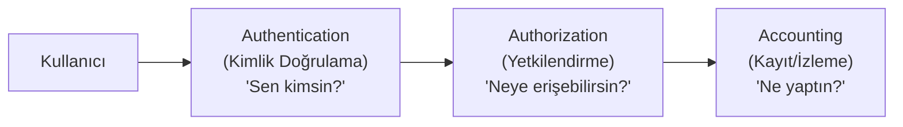
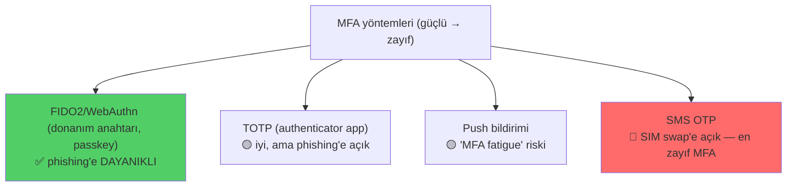

# 🪪 AAA ve Çok Faktörlü Kimlik Doğrulama (MFA)

Kimlik ve erişim yönetimi (IAM), "doğru kişinin doğru kaynağa doğru zamanda eriştiğinden" emin olma disiplinidir. Modern güvenlikte **kimlik yeni çevre güvenliğidir (identity is the new perimeter)** — çünkü bulut ve uzaktan çalışmayla klasik ağ sınırı çözüldü. Bu dosya AAA çerçevesini ve MFA'yı kurar.

> Terimler: [terminoloji-sozlugu.md](../00-baslangic/terminoloji-sozlugu.md). Devamı: [federasyon-sso.md](federasyon-sso.md), [zero-trust.md](zero-trust.md).

---

## 1. AAA çerçevesi

Her erişim üç adımdan geçer:

| Adım | Soru | Örnek |
|------|------|-------|
| **Authentication (kimlik doğrulama)** | Kim olduğunu kanıtla | Parola + MFA girişi |
| **Authorization (yetkilendirme)** | Neye iznin var | RBAC ile "muhasebe" rolü → sadece finans modülü |
| **Accounting (kayıt)** | Ne yaptığının izi | Log: "kullanıcı X, 14:03'te dosya Y'yi indirdi" |

> **Kritik ayrım:** Authentication ≠ Authorization. Kimliğini kanıtlamak (giriş), her şeye erişebileceğin anlamına gelmez. Bu ikisini karıştırmak, [broken access control / IDOR](../04-web-guvenligi/zafiyet-siniflari/idor-erisim-kontrolu.md) zafiyetlerinin kaynağıdır: kullanıcı "giriş yaptı" (authN ✓) diye "her veriye erişebilir" (authZ eksik) sanılıyor.

---

## 2. Kimlik doğrulama faktörleri

Kimlik üç tür "faktörle" kanıtlanır. Güçlü kimlik doğrulama, **farklı türlerden** faktörleri birleştirir.

| Faktör | Tür | Örnek | Zayıflık |
|--------|-----|-------|----------|
| **Bildiğin (knowledge)** | Bilgi | Parola, PIN, güvenlik sorusu | Çalınır, tahmin edilir, phishing |
| **Sahip olduğun (possession)** | Nesne | Telefon (TOTP), donanım token, akıllı kart | Çalınır ama fiziksel |
| **Olduğun (inherence)** | Biyometri | Parmak izi, yüz, iris | Değiştirilemez (sızarsa kalıcı) |
| **(ek) Bulunduğun yer/davranış** | Bağlam | Konum, cihaz, davranış deseni | Uyarlanabilir (adaptive) kimlik doğrulama |

---

## 3. MFA — çok faktörlü kimlik doğrulama

**MFA**, en az **iki farklı türden** faktör ister. Neden bu kadar önemli?

> **Neden MFA en yüksek getirili güvenlik kontrolü:** Parola tek başına en zayıf halkadır — phishing, sızıntı (data breach), yeniden kullanım, brute-force ile ele geçirilir. MFA, saldırgan parolayı ele geçirse bile **ikinci faktörü** de gerektirir. Microsoft'un verilerine göre MFA, hesap ele geçirme saldırılarının büyük çoğunluğunu (>%99) engeller.

**Nüans — "iki parola MFA değildir":** Parola + güvenlik sorusu, ikisi de "bildiğin" türdendir → tek faktör sayılır. Gerçek MFA **farklı türler** ister (bildiğin + sahip olduğun).

### MFA yöntemleri — güçten zayıfa

### TOTP vs HOTP
- **HOTP** (HMAC-based OTP): Sayaç tabanlı. Her kullanımda sayaç artar.
- **TOTP** (Time-based OTP): Zaman tabanlı. Kod her 30 saniyede değişir (`HMAC(gizli, zaman)`). Authenticator uygulamalarının kullandığı budur. Sunucu ve uygulama aynı gizli anahtarı paylaşır ([anahtar-degisimi-ve-imza.md](../05-kriptografi/anahtar-degisimi-ve-imza.md) HMAC).

### FIDO2 / WebAuthn — phishing'e dayanıklı altın standart
FIDO2, parola yerine **açık anahtar kriptografisi** ([temel-kavramlar.md](../05-kriptografi/temel-kavramlar.md)) kullanır:
- Cihazda bir anahtar çifti üretilir; özel anahtar **cihazdan hiç çıkmaz** (güvenli donanımda).
- Giriş, bir kriptografik meydan-okuma/imza (challenge-response) ile yapılır — paylaşılan bir sır yok.
- **Neden phishing'e dayanıklı:** İmza, kökene (origin) bağlıdır. Sahte site (`bank-login.evil.com`) kimlik bilgisini "yakalayamaz" çünkü tarayıcı imzayı yanlış kökene vermez. TOTP kodunu kullanıcı sahte siteye girebilir; FIDO2 imzasını giremez. **Passkey'ler** bunun tüketici dostu hâlidir.

---

## 4. Nüans: MFA'yı atlatma yöntemleri (savunmayı anlamak için)

MFA güçlüdür ama sihirli değildir. Saldırganların denedikleri:
- **SIM swap:** Kurbanın telefon numarasını ele geçirip SMS OTP'yi alma → SMS MFA'nın neden en zayıf olduğu.
- **MFA fatigue / push bombing:** Kurbana ardarda push bildirimi gönderip yorgunluktan "Onayla"ya basmasını sağlama. Savunma: numara eşleştirme (number matching).
- **Gerçek zamanlı phishing (AiTM):** Ortadaki-adam proxy'siyle (Evilginx) hem parolayı hem oturum çerezini/token'ı çalma → TOTP'yi bile atlatır. Savunma: **FIDO2** (kökene bağlı olduğu için AiTM'e dayanıklı).
- **Oturum token hırsızlığı:** MFA'dan *sonra* verilen oturum token'ını çalma ([http-web-iletisimi.md](../01-ag-networking/http-web-iletisimi.md), XSS/malware) → MFA'yı tamamen bypass. Savunma: token bağlama (token binding), kısa ömür.

> **Ders:** MFA katmanlardan biridir. En güçlü hâli (FIDO2) bile, ondan sonraki oturum yönetimi zayıfsa atlatılabilir. Derinlemesine savunma her zaman geçerli.

---

## 5. Parolasız (passwordless) geleceği

Endüstri, parolayı tamamen ortadan kaldırmaya (**passwordless**) doğru gidiyor:
- **Passkey'ler** (FIDO2 tabanlı) — parola yok, cihazın biyometrisi + kriptografik anahtar.
- Avantaj: phishing'e dayanıklı, sızdırılacak parola yok, kullanıcı dostu.
- Bu, "bildiğin faktörün" (parola — en zayıf) yerini "sahip olduğun + olduğun" faktörlere bırakması demek.

---

## 6. Saldırı–savunma kesişimi (özet)

- **Kimlik = yeni çevre:** Bulut/uzaktan çalışmada ağ sınırı çözüldüğü için, kimlik doğrulama savunmanın ön cephesi oldu → [zero-trust.md](zero-trust.md).
- **MFA = en yüksek getirili kontrol:** Kurulumu ucuz, etkisi büyük. Ama yöntem seçimi kritik (FIDO2 ≫ SMS).
- **AuthN ≠ AuthZ:** Kimlik doğrulama, erişim kontrolünü ([erisim-kontrol-modelleri.md](erisim-kontrol-modelleri.md)) gereksiz kılmaz — ikisi ayrı katmanlardır.
- **Kimlik saldırıları hâkim:** Kimlik bilgisi doldurma (credential stuffing), phishing, parola püskürtme (password spraying) bugünün en yaygın saldırılarıdır → [11-soc](../11-soc-mavi-takim/log-analizi.md) bunları loglardan avlar.

> **Sonraki:** [federasyon-sso.md](federasyon-sso.md).
