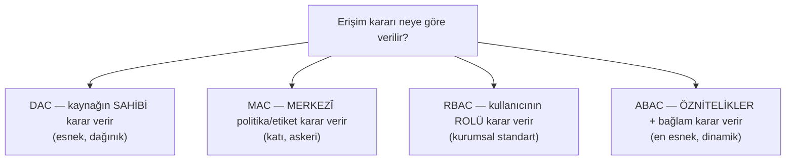
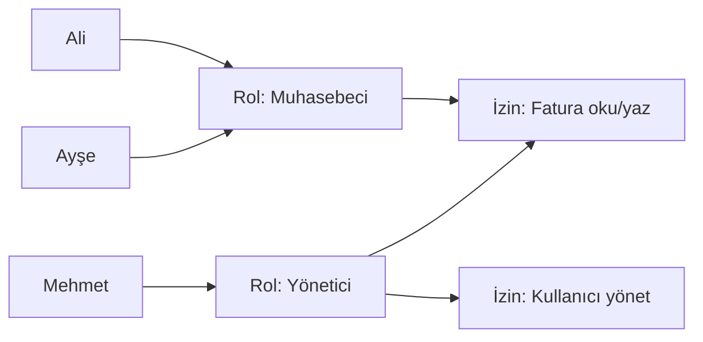

# 🚪 Erişim Kontrol Modelleri (RBAC / ABAC / DAC / MAC)

Kimlik doğrulandıktan sonra (authentication), "bu kimlik neye erişebilir?" sorusu gelir (authorization). Bu soruya **nasıl** cevap verildiği bir "erişim kontrol modeli" seçimidir. Bu dosya dört temel modeli karşılaştırır — [broken access control / IDOR](../04-web-guvenligi/zafiyet-siniflari/idor-erisim-kontrolu.md) zafiyetlerinin doğru modelin doğru uygulanmasıyla nasıl önlendiğini gösterir.

> Ön koşul: [aaa-ve-mfa.md](aaa-ve-mfa.md) (authN ≠ authZ). Uygulama zafiyeti: [idor-erisim-kontrolu.md](../04-web-guvenligi/zafiyet-siniflari/idor-erisim-kontrolu.md).

---

## 1. Dört model — genel bakış

| Model | Karar temeli | Esneklik | Tipik yer |
|-------|--------------|----------|-----------|
| **DAC** (Discretionary) | Kaynak sahibinin takdiri | Yüksek ama dağınık | Linux dosya izinleri, Windows ACL |
| **MAC** (Mandatory) | Merkezî zorunlu etiket/politika | Düşük, çok katı | Askeri/devlet, SELinux |
| **RBAC** (Role-Based) | Kullanıcının rolü | Orta, yönetilebilir | Çoğu kurumsal uygulama |
| **ABAC** (Attribute-Based) | Öznitelik + bağlam (zaman, konum) | En yüksek | Bulut, zero-trust, ince taneli |

---

## 2. DAC — İsteğe Bağlı Erişim Kontrolü

**Kaynağın sahibi**, kime erişim vereceğine karar verir. Esnek ama merkezî kontrol zayıftır.

- **Örnek:** Linux'ta `chmod` ([linux-temelleri.md](../02-linux-windows/linux-temelleri.md)) — dosya sahibi izinleri belirler. Windows ACL de DAC'tır.
- **Güçlü:** Basit, esnek, kullanıcı kendi verisini paylaşabilir.
- **Zayıf:** Dağınık kontrol → tutarsızlık, aşırı paylaşım. Bir kullanıcı yanlışlıkla hassas dosyayı "herkese açık" yapabilir. Truva atı bir kullanıcının yetkisiyle çalışıp onun kaynaklarını paylaşabilir.

---

## 3. MAC — Zorunlu Erişim Kontrolü

**Merkezî bir politika** (kullanıcı değil) erişimi belirler; kaynaklar ve özneler **güvenlik etiketleri** taşır (Gizli, Çok Gizli). Kullanıcı, sahibi olsa bile politikayı geçemez.

- **Örnek:** Askeri sınıflandırma (bir "Gizli" kullanıcı "Çok Gizli" belgeye erişemez), **SELinux**, AppArmor.
- **Güçlü:** En katı, en yüksek güvence. Kullanıcı takdiri devre dışı → insan hatası azalır.
- **Zayıf:** Esnek değil, yönetimi ağır. Günlük iş için fazla katı.

> **Bell-LaPadula modeli** (gizlilik): "yukarı okuma yok, aşağı yazma yok" (no read up, no write down) — MAC'in klasik gizlilik ilkesi.

---

## 4. RBAC — Rol Tabanlı Erişim Kontrolü

**Kurumsal dünyanın fiili standardı.** İzinler bireysel kullanıcılara değil, **rollere** atanır; kullanıcılar rollere yerleştirilir.

- **Örnek:** "Muhasebeci" rolü finans modülüne erişir; "İK" rolü personel verisine. Yeni muhasebeci gelince sadece role eklenir.
- **Güçlü:** Yönetilebilir, ölçeklenebilir, denetlenebilir. [En az ayrıcalığı](../00-baslangic/terminoloji-sozlugu.md) uygulamak kolay. Personel değişiminde izin yönetimi basit.
- **Zayıf:** **Rol patlaması (role explosion)** — çok ince ayrım gerektiğinde yüzlerce rol oluşur. Bağlam (zaman, konum) hesaba katmaz.

---

## 5. ABAC — Öznitelik Tabanlı Erişim Kontrolü

Erişim, **özniteliklerin ve bağlamın** (kullanıcı, kaynak, eylem, ortam) bir politika kuralıyla değerlendirilmesiyle verilir. En esnek ve dinamik model.

- **Örnek politika:** "Bir kullanıcı, **departmanı=finans** VE **saat 09:00–18:00 arası** VE **şirket ağından** ise finansal raporu okuyabilir."
- **Güçlü:** Çok ince taneli, dinamik, bağlam-duyarlı. [Zero-trust](zero-trust.md) ve bulutun tercih ettiği model. Rol patlamasını çözer.
- **Zayıf:** Karmaşık — politikaları yazmak/test etmek/denetlemek zor. Yanlış politika sessiz açıklar doğurabilir.

> **RBAC vs ABAC:** RBAC "sen kimsin (rolün ne)" der; ABAC "sen kimsin + neye + ne zaman + nereden + hangi koşulda" der. Modern sistemler genelde **hibrittir**: RBAC temeli + ABAC ile bağlamsal ince ayar.

---

## 6. Karşılaştırma tablosu

| Kriter | DAC | MAC | RBAC | ABAC |
|--------|-----|-----|------|------|
| Karar veren | Sahip | Merkezî politika | Rol ataması | Öznitelik/politika |
| Esneklik | Yüksek | Düşük | Orta | En yüksek |
| Yönetim kolaylığı | Dağınık | Ağır | **Kolay** | Karmaşık |
| Bağlam farkındalığı | Yok | Etiket | Yok | **Evet** (zaman/konum) |
| Ölçeklenme | Zayıf | Orta | **İyi** | İyi (ama karmaşık) |
| Tipik kullanım | Dosya sistemleri | Askeri, SELinux | Kurumsal uygulamalar | Bulut, zero-trust |

---

## 7. Ortak tasarım ilkeleri (modelden bağımsız)

Hangi model seçilirse seçilsin, bu ilkeler geçerlidir:

- **Deny by default (varsayılan reddet):** Açıkça izin verilmeyen her şey reddedilir. Güvenli temel. Firewall'daki ([routing-nat-vpn.md](../01-ag-networking/routing-nat-vpn.md)) "default deny" ile aynı felsefe.
- **En az ayrıcalık (least privilege):** Her özneye görev için gereken asgari yetki.
- **Görevler ayrılığı (separation of duties):** Kritik işlemler tek kişide toplanmasın (ör. ödemeyi isteyen ile onaylayan farklı olsun) → içeriden tehdit ve dolandırıcılığı zorlaştırır.
- **Sunucu tarafında zorlama:** Erişim kararı her zaman güvenilir tarafta (sunucu) verilir, istemcide değil ([idor-erisim-kontrolu.md](../04-web-guvenligi/zafiyet-siniflari/idor-erisim-kontrolu.md)).

---

## 8. Saldırı–savunma kesişimi

- **IDOR = erişim kontrol modelinin uygulanmaması:** Bir uygulama RBAC'a "sahip" olsa bile, her istekte sahiplik/rol kontrolünü **uygulamıyorsa** IDOR doğar. Model seçmek yetmez; **her istekte tutarlı uygulamak** gerekir.
- **Rol/öznitelik yükseltme:** Saldırgan, JWT'deki rolü ([federasyon-sso.md](federasyon-sso.md)) veya bir özniteliği değiştirmeye çalışır — bu yüzden token bütünlüğü (imza doğrulama) ve sunucu tarafı yeniden kontrol şart.
- **En az ayrıcalık ihlalleri privesc yolu açar:** Aşırı geniş roller/izinler ([linux-temelleri.md](../02-linux-windows/linux-temelleri.md) sudo, [windows-temelleri.md](../02-linux-windows/windows-temelleri.md) ayrıcalıklar) yanal hareket ve ayrıcalık yükseltmenin klasik kaynağıdır.

> **Sonraki:** [zero-trust.md](zero-trust.md).
