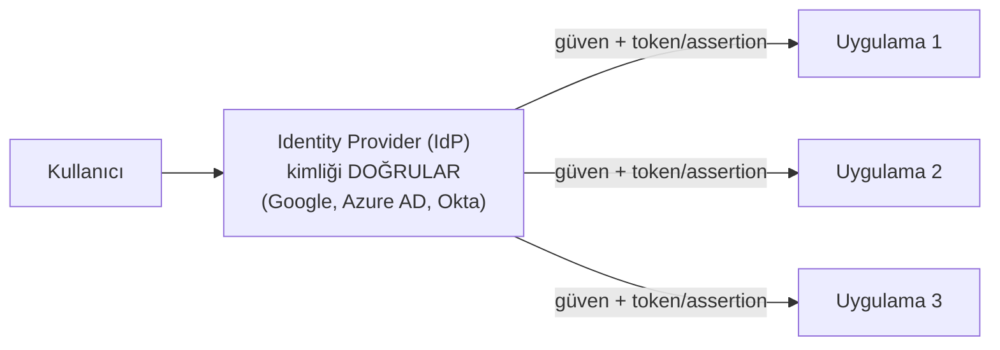
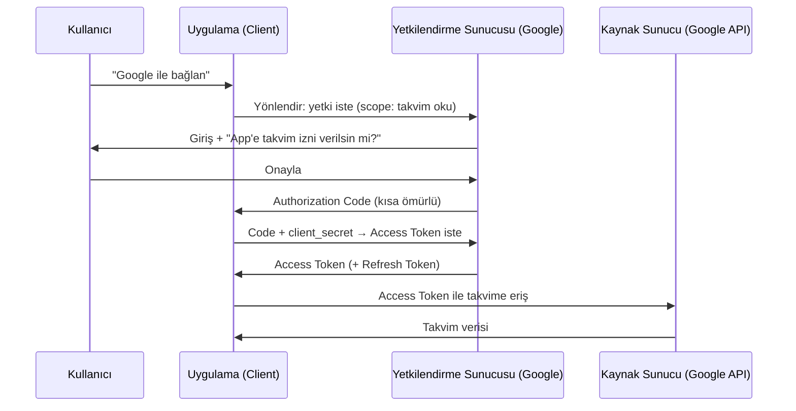

# 🔗 Federasyon, SSO, OAuth2/OIDC/SAML ve JWT

Modern uygulamalar kimliği tek başlarına yönetmez; "Google ile giriş yap" veya kurumsal SSO gibi **federasyon** mekanizmalarına dayanır. Bu dosya SSO'yu, onu mümkün kılan protokolleri (OAuth2, OIDC, SAML) ve taşıyıcı token JWT'yi kurar — sık karıştırılan bu kavramları netleştirir.

> Ön koşul: [aaa-ve-mfa.md](aaa-ve-mfa.md), [temel-kavramlar.md](../05-kriptografi/temel-kavramlar.md) (imza).

---

## 1. SSO ve federasyon: problem ve çözüm

**Problem:** Bir kullanıcının onlarca uygulama için ayrı parola tutması → zayıf/tekrarlanan parolalar, yönetim kâbusu.

- **SSO (Single Sign-On):** Bir kez giriş yap, birden çok uygulamaya tekrar giriş yapmadan eriş. Aynı **güven alanı** içinde.
- **Federasyon (federation):** Farklı **kuruluşlar/alanlar** arasında kimliğe güvenme. "Google'ın doğruladığı kişiye ben de güvenirim." Kimlik bir yerde (Identity Provider) doğrulanır, başka yerde (Service Provider) kabul edilir.



**Roller:**
- **IdP (Identity Provider):** Kimliği doğrulayan taraf (Google, Microsoft Entra/Azure AD, Okta).
- **SP (Service Provider) / RP (Relying Party):** Kimliğe güvenip erişim veren uygulama.

---

## 2. OAuth 2.0 vs OIDC vs SAML — kritik ayrım

En çok karıştırılan üçlü. **Tek cümlelik ayrım** (OAuth 2.0 çerçevesi [RFC 6749](https://www.rfc-editor.org/rfc/rfc6749)'da tanımlıdır):

| Protokol | Ne yapar | Analoji |
|----------|----------|---------|
| **OAuth 2.0** | **Yetkilendirme (authorization)** — "bu uygulamaya adına şu işi yapma izni ver" | Otel oda kartı: seni tanımlamaz, sadece belirli kapıları açar |
| **OIDC** (OpenID Connect) | **Kimlik doğrulama (authentication)** — OAuth üstüne "bu kişi kim" katmanı | Kimlik kartı: kim olduğunu söyler |
| **SAML** | Kimlik doğrulama + federasyon (kurumsal, XML) | Kurumsal kimlik + SSO'nun eski standardı |

> ⚠️ **En yaygın kavram hatası:** OAuth 2.0 bir **kimlik doğrulama** protokolü DEĞİLDİR — o bir **yetkilendirme** protokolüdür. "OAuth ile giriş" aslında yanlış kullanımdır; kimlik için **OIDC** (OAuth üstüne inşa edilmiş kimlik katmanı) gerekir. "Google ile giriş yap" aslında OIDC'dir.

### OAuth 2.0 akışı (Authorization Code Flow)



- **Access Token:** API'ye erişim için kısa ömürlü yetki. "Ne yapabilirsin" (scope).
- **Refresh Token:** Access token süresi dolunca yenisini almak için (uzun ömürlü, dikkatle saklanır).
- **Scope:** İznin kapsamı (`calendar.read`, `email`). [En az ayrıcalık](../00-baslangic/terminoloji-sozlugu.md): sadece gereken scope istenmeli.

### OIDC — kimlik katmanı
OIDC, OAuth akışına bir **ID Token** ekler: kullanıcının kim olduğunu (`sub`, `email`, `name`) taşıyan, IdP tarafından **imzalanmış** bir JWT. OAuth "ne yapabilir" derken, OIDC "kim" der.

### SAML — kurumsal klasik
XML tabanlı, kurumsal SSO'nun uzun süredir standardı. IdP bir imzalı **SAML assertion** üretir, SP doğrular. OIDC daha modern/hafif (JSON/REST) olsa da SAML kurumsal dünyada hâlâ yaygın.

---

## 3. JWT (JSON Web Token) — taşıyıcı token

**JWT**, taraflar arasında bilgiyi (talep/claim) güvenli taşıyan, imzalı bir token formatıdır (kaynak: [RFC 7519](https://www.rfc-editor.org/rfc/rfc7519)). OIDC ID token'ları ve birçok API kimlik doğrulaması JWT kullanır. JWT'nin sağladığı güvence, üzerindeki dijital imzadır ([05-kriptografi/anahtar-degisimi-ve-imza.md](../05-kriptografi/anahtar-degisimi-ve-imza.md)) — imza, payload'ın değiştirilmediğini kanıtlar ama içeriği gizlemez.

### Yapı: üç parça (nokta ile ayrılı)
```
eyJhbGci...  .  eyJzdWIi...  .  SflKxwRJ...
   HEADER          PAYLOAD        SIGNATURE
```

| Parça | İçerik | Base64 çözülebilir mi? |
|-------|--------|:---:|
| **Header** | Algoritma + tip (`{"alg":"RS256","typ":"JWT"}`) | Evet |
| **Payload** | Talepler/claims (`{"sub":"123","role":"admin","exp":...}`) | **Evet — gizli değildir!** |
| **Signature** | Header+Payload'ın imzası | — |

> ⚠️ **JWT payload'ı ŞİFRELİ DEĞİL, sadece Base64 kodludur.** Herkes okuyabilir ([bilgisayar-temelleri.md](../00-baslangic/bilgisayar-temelleri.md) kodlama≠şifreleme). JWT'ye **parola/sır koyma**. JWT'nin sağladığı **bütünlüktür** (imza) — payload değiştirilirse imza tutmaz.

### JWT güvenlik nüansları (klasik saldırılar)
- **`alg: none` saldırısı:** Bazı kütüphaneler header'daki `alg`'ı `none` kabul edip imzayı doğrulamadan geçirir → saldırgan payload'ı (rolü `admin` yapıp) değiştirir. Savunma: sunucu algoritmayı sabitler, `none` kabul etmez.
- **Zayıf sır / algoritma karışıklığı (RS256→HS256):** Asimetrik doğrulama beklenirken saldırgan simetrik zorlayıp açık anahtarı HMAC sırrı olarak kullanır. Savunma: algoritmayı katı doğrula.
- **Süre (`exp`) ve iptal:** JWT durumsuzdur — bir kez verilince süresi (`exp`) dolana dek geçerlidir; "çıkış yap" ile anında iptali zordur. Savunma: kısa ömür + refresh token + gerekirse iptal listesi.

> Bu saldırıları [Juice Shop lab'ında](../04-web-guvenligi/pratik-lab/juice-shop-notlari.md) JWT'yi Burp ile yakalayıp deneyebilirsin.

---

## 4. Nüans: token nerede saklanır? (güvenlik ödünleşmesi)

Tarayıcı uygulamalarında token/oturum saklama klasik bir ikilemdir:
| Yer | Risk |
|-----|------|
| **localStorage** | XSS ile okunabilir ([xss.md](../04-web-guvenligi/zafiyet-siniflari/xss.md)) |
| **Çerez (cookie)** | CSRF riski ([csrf-ssrf.md](../04-web-guvenligi/zafiyet-siniflari/csrf-ssrf.md)); ama `HttpOnly` + `SameSite` ile güçlenir |

Genel öneri: hassas oturum token'ları `HttpOnly`, `Secure`, `SameSite` çerezlerde — XSS'e karşı daha dayanıklı ([http-web-iletisimi.md](../01-ag-networking/http-web-iletisimi.md)).

---

## 5. Saldırı–savunma kesişimi (özet)

- **Federasyon çift taraflıdır:** SSO kullanıcı deneyimini ve güvenliği iyileştirir (tek güçlü kimlik + MFA), ama **IdP'yi tek hata noktası** yapar — IdP ele geçirilirse tüm bağlı uygulamalar düşer. Bu yüzden IdP hesapları en güçlü korumayı (FIDO2, ayrıcalıklı erişim) gerektirir.
- **Token = anahtar:** Access token/oturum çalınırsa, saldırgan parolayı ve MFA'yı bile atlar ([aaa-ve-mfa.md](aaa-ve-mfa.md)). Token güvenliği (kısa ömür, güvenli saklama, kökene bağlama) kritiktir.
- **Protokol karışıklığı = zafiyet:** OAuth'u kimlik doğrulama sanmak, yanlış güven kararlarına yol açar. Doğru araç: kimlik için OIDC, yetki için OAuth.

> **Sonraki:** [erisim-kontrol-modelleri.md](erisim-kontrol-modelleri.md).
