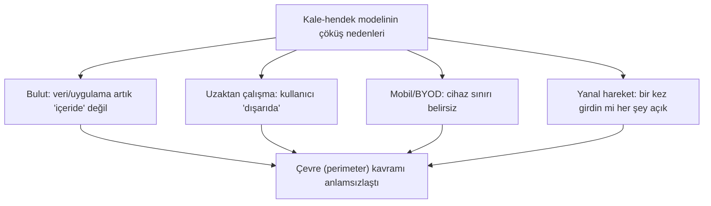
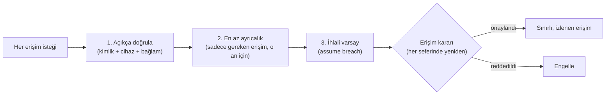

# 🛑 Sıfır Güven (Zero Trust)

Zero Trust, son on yılın en önemli güvenlik mimarisi kaymasıdır. Tek cümlelik özü: **"Asla güvenme, her zaman doğrula" (never trust, always verify).** Bu dosya, bu ilkenin neden ortaya çıktığını, nasıl uygulandığını ve klasik "kale ve hendek" modelinden farkını kurar.

> Ön koşul: [aaa-ve-mfa.md](aaa-ve-mfa.md), [erisim-kontrol-modelleri.md](erisim-kontrol-modelleri.md). Ağ tarafı: [routing-nat-vpn.md](../01-ag-networking/routing-nat-vpn.md).

---

## 1. Neden ortaya çıktı? Eski modelin çöküşü

**Klasik model — "kale ve hendek" (castle-and-moat):** Güçlü bir çevre (firewall, VPN) kur; içerisi "güvenilir", dışarısı "güvenilmez". Bir kez içeri girdin mi, ağdaki her şeye serbestçe eriş.

**Bu model neden çöktü?**

- **Bulut ve SaaS:** Veri artık şirket ağının "içinde" değil, internetin her yerinde.
- **Uzaktan çalışma:** Kullanıcılar çeviri dışında, ev/kafe ağlarından bağlanıyor.
- **Yanal hareket (lateral movement):** Kale-hendek modelinin en ölümcül kusuru — saldırgan çeperi bir kez aşınca (phishing, VPN), içeride **hiçbir engelle karşılaşmadan** yayılır ([routing-nat-vpn.md](../01-ag-networking/routing-nat-vpn.md)). WannaCry/NotPetya'nın yıkıcılığı buydu.

**Sonuç:** "İç ağ = güvenilir" varsayımı artık geçerli değil. Güven, konuma değil, **her istekte doğrulanan kimliğe/bağlama** dayanmalı.

---

## 2. Zero Trust'ın temel ilkeleri

1. **Açıkça doğrula (verify explicitly):** Her erişim kararı; kimlik, cihaz sağlığı, konum, davranış gibi tüm sinyallere dayanır. "Ağdasın" yetmez.
2. **En az ayrıcalıklı erişim (least privilege):** Kullanıcıya sadece o an, o iş için gereken erişim (just-in-time, just-enough-access). [erisim-kontrol-modelleri.md](erisim-kontrol-modelleri.md).
3. **İhlali varsay (assume breach):** Saldırganın zaten içeride olduğunu varsay; etki alanını (blast radius) minimize et, her şeyi izle/segmentle, uçtan uca şifrele.

> **"Asla güvenme, her zaman doğrula":** Ağ içi/dışı ayrımı yoktur; her istek, sanki güvenilmeyen bir ağdan geliyormuş gibi doğrulanır.

---

## 3. Mikro-segmentasyon — yanal hareketi öldürmek

Zero Trust'ın ağ tarafındaki uygulaması **mikro-segmentasyondur**: ağı geniş bölgeler yerine, iş yükü/uygulama düzeyinde **çok küçük, sıkı kontrollü bölgelere** ayırmak.

- Klasik segmentasyon ([routing-nat-vpn.md](../01-ag-networking/routing-nat-vpn.md)) VLAN düzeyindeydi ("misafir" vs "sunucu" ağı).
- **Mikro-segmentasyon** her iş yükünü (hatta her konteyneri) izole eder; aralarındaki her bağlantı açıkça izin gerektirir.
- **Sonuç:** Bir sunucu ele geçse bile, saldırgan yanındaki sunucuya bile **varsayılan olarak** ulaşamaz — her sıçrama yeni bir doğrulama duvarına çarpar. Yanal hareket pratikte durur.

---

## 4. Zero Trust'ın bileşenleri (pratik mimari)

| Bileşen | Rol |
|---------|-----|
| **Güçlü kimlik (IdP + MFA)** | Her erişimin temeli — [aaa-ve-mfa.md](aaa-ve-mfa.md), FIDO2. |
| **Cihaz güveni (device posture)** | Cihaz yamalı/yönetiliyor mu? Uyumsuz cihaza erişim yok. |
| **Politika motoru (PDP/PEP)** | Her isteği bağlama göre değerlendirir (ABAC benzeri). |
| **Mikro-segmentasyon** | Ağ düzeyinde izolasyon. |
| **Sürekli izleme** | Davranış anomalisi → oturum yeniden doğrulanır ([11-soc](../11-soc-mavi-takim/siem-edr-soar.md)). |
| **Uçtan uca şifreleme** | "İç ağ" güvenli varsayılmaz; her yerde TLS. |

> **ZTNA (Zero Trust Network Access):** VPN'in modern alternatifi. VPN "içeri al, sonra serbest bırak" derken, ZTNA her uygulamaya erişimi ayrı ayrı, kimlik/bağlam temelli verir — kullanıcı ağa değil, sadece izinli uygulamaya erişir.

---

## 5. Nüans: sık yanlış anlamalar

- **"Zero Trust bir ürün":** Hayır — bir **mimari/felsefedir**, satın alınan tek bir kutu değil. Satıcılar "Zero Trust ürünü" satar ama gerçek ZT, kimlik+cihaz+ağ+veri+izleme katmanlarının bir yolculuğudur.
- **"VPN'i kaldırınca Zero Trust olur":** Hayır — ZTNA VPN'in yerini alabilir ama ZT çok daha geniştir (kimlik, en az ayrıcalık, segmentasyon, izleme).
- **"Zero Trust = hiç kimseye güvenme, kullanışsız":** Hayır — "güvenme" konum/örtük güvene karşıdır; **doğrulanmış** kimliğe elbette erişim verilir. Amaç güvenliği artırırken kullanılabilirliği (adaptive: düşük riskte sürtünmesiz, yüksek riskte ek doğrulama) korumaktır.
- **Bir yolculuk, anahtar değil:** Kuruluşlar ZT'ye kademeli geçer (önce MFA + kimlik, sonra segmentasyon, sonra sürekli değerlendirme). NIST SP 800-207 referans çerçevedir.

---

## 6. Saldırı–savunma kesişimi (özet)

- **Yanal hareketi kırar:** ZT'nin en büyük savunma değeri, bir ihlalin tüm ağa yayılmasını (kale-hendek modelinin felaketi) engellemesidir. Ransomware'in yayılma yeteneği çöker.
- **Kimlik saldırılarını merkeze alır:** Çevre çözüldüğü için kimlik ön cephedir → phishing/MFA atlatma ([aaa-ve-mfa.md](aaa-ve-mfa.md)) ZT'nin en zorlu test noktasıdır; bu yüzden phishing'e dayanıklı MFA (FIDO2) ZT'nin köşe taşıdır.
- **İzleme = ihlali varsaymanın gereği:** "Assume breach" ilkesi, sürekli izleme ([11-soc](../11-soc-mavi-takim/siem-edr-soar.md)) ve hızlı müdahaleyi ([log-analizi.md](../11-soc-mavi-takim/log-analizi.md)) zorunlu kılar — çünkü saldırganın zaten içeride olabileceğini kabul ediyorsun.
- **PQC bağlantısı:** "Uçtan uca şifreleme her yerde" ilkesi, o şifrelemenin geleceğe dayanıklı olmasını da gerektirir → [post-kuantum-kriptografi.md](../05-kriptografi/post-kuantum-kriptografi.md).

> **Modül 06 tamamlandı.** Sonraki: [07-tehdit-modelleme-cerceveler/mitre-attck.md](../07-tehdit-modelleme-cerceveler/mitre-attck.md).
