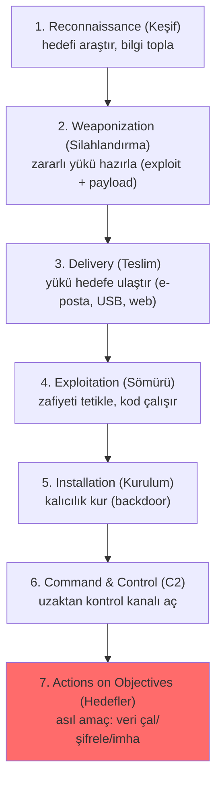
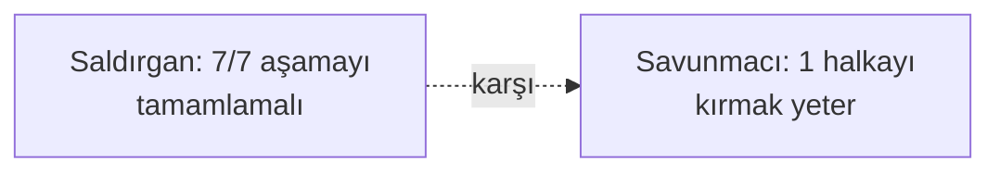
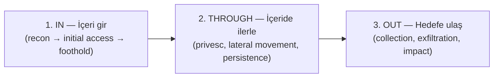

# ⛓️ Cyber Kill Chain ve Unified Kill Chain

Cyber Kill Chain, bir siber saldırının aşamalarını sıralı bir zincir olarak modelleyen, Lockheed Martin tarafından 2011'de geliştirilmiş klasik çerçevedir (kaynak: [Lockheed Martin Cyber Kill Chain](https://www.lockheedmartin.com/en-us/capabilities/cyber/cyber-kill-chain.html)). Askeri "öldürme zinciri" kavramından uyarlanmıştır. Temel öğretisi: **saldırı bir süreçtir ve zincirin herhangi bir halkasını kırmak saldırıyı durdurur.**

> Kardeş çerçeveler: [mitre-attck.md](mitre-attck.md) (daha ayrıntılı davranış), [pyramid-of-pain-diamond-model.md](pyramid-of-pain-diamond-model.md).

---

## 1. Yedi aşama

| # | Aşama | Saldırgan ne yapar | Savunma fırsatı |
|---|-------|--------------------|-----------------|
| 1 | **Reconnaissance** | Açık kaynak istihbaratı, tarama, hedef seçimi | Saldırı yüzeyini küçült, sızıntıyı izle |
| 2 | **Weaponization** | Exploit + payload paketle (ör. zararlı belge) | (saldırgan tarafında — doğrudan görünmez) |
| 3 | **Delivery** | Phishing e-postası, kötü link, USB | E-posta filtresi, kullanıcı eğitimi ([12-phishing](../12-sosyal-muhendislik-phishing/phishing-analizi.md)) |
| 4 | **Exploitation** | Zafiyeti tetikle, kod çalıştır | Yama, EDR, uygulama beyaz listesi |
| 5 | **Installation** | Backdoor/kalıcılık kur | Dosya bütünlüğü, Sysmon, EDR |
| 6 | **Command & Control** | C2 sunucusuyla haberleş | Ağ izleme, DNS/proxy analizi, C2 engelleme |
| 7 | **Actions on Objectives** | Veri sızdır, şifrele, yayıl | DLP, segmentasyon, anomali tespiti |

---

## 2. Neden? — "zinciri kırma" felsefesi

Kill Chain'in en güçlü fikri: **saldırının başarılı olması için TÜM aşamaların tamamlanması gerekir; savunmacının ise SADECE BİR halkayı kırması yeter.**

- Phishing e-postası filtrede takılırsa (Delivery kırıldı) → saldırı orada biter.
- Exploit yamalı bir sistemde çalışmazsa (Exploitation kırıldı) → biter.
- C2 trafiği engellenirse (C2 kırıldı) → saldırgan makineyi kontrol edemez.

Bu, **derinlemesine savunmanın** ([terminoloji-sozlugu.md](../00-baslangic/terminoloji-sozlugu.md)) neden işe yaradığını açıklar: her aşamada bir savunma katmanı = saldırganın her halkada başarısızlık riski. Ayrıca **erken aşamada** tespit daha ucuzdur (veri sızmadan önce).

---

## 3. Nüans: klasik Kill Chain'in sınırları

Orijinal model 2011'de tasarlandı ve bazı eleştiriler aldı:
- **Çok "çevre" odaklı:** İlk erişime (perimeter) ağırlık verir; ama modern saldırıların çoğu **içeriden** (insider) başlar veya kimlik bilgisiyle "meşru" giriş yapar → [zero-trust](../06-kimlik-erisim-yonetimi-iam/zero-trust.md) bunu adresler.
- **Doğrusal ve tek yönlü:** Gerçek saldırılar döngüseldir — saldırgan içeride yanal hareket ederken keşif-sömürü-kalıcılık döngüsünü **tekrar tekrar** yaşar. Tek düz zincir bunu yansıtmaz.
- **Malware odaklı:** "Weaponization/Installation" zararlı yazılım varsayar; ama "living off the land" (meşru araçlarla saldırı, dosyasız) saldırılar bu kalıba tam oturmaz.

### Unified Kill Chain — modern sentez
**Unified Kill Chain (2017)**, Lockheed Kill Chain ile MITRE ATT&CK'i birleştirir ve 18 aşamaya genişletir. Üç ana faza ayrılır:

- **Döngüsel ve gerçekçi:** "Through" fazı, saldırganın içeride tekrar tekrar döndüğü keşif-yayılma döngüsünü modeller.
- **ATT&CK ile hizalı:** Her aşama ATT&CK taktiklerine eşlenir → [mitre-attck.md](mitre-attck.md).

---

## 4. Çerçeveleri birlikte kullanma

Bu üç çerçeve rakip değil, farklı soyutlama seviyeleridir:

| Çerçeve | Soyutlama | Soru |
|---------|-----------|------|
| **Cyber Kill Chain** | Yüksek (7 aşama) | Saldırı hangi büyük evrede? |
| **Unified Kill Chain** | Orta (18 aşama, 3 faz) | Daha gerçekçi, döngüsel akış |
| **MITRE ATT&CK** | Düşük (yüzlerce teknik) | Her aşamada tam olarak hangi teknik? |

Bir olayı analiz ederken: Kill Chain ile "büyük resmi" (saldırı hangi aşamada yakalandı), ATT&CK ile "detayı" (hangi spesifik teknikler) anlatırsın.

---

## 5. Saldırı–savunma kesişimi (özet)

- **Erken kırış ucuzdur:** Zinciri ne kadar erken kırarsan (Delivery > Actions), hasar o kadar az. Bu yüzden phishing savunması ([12-phishing](../12-sosyal-muhendislik-phishing/phishing-analizi.md)) ve yama yönetimi yüksek getirilidir.
- **Her aşama bir savunma katmanı:** Kill Chain, derinlemesine savunmayı somut aşamalara oturtur — güvenlik yatırımını nereye yapacağını planlamanın haritası.
- **Tespit fırsat penceresi:** Savunmacı her aşamada bir "tespit fırsatı" arar; SOC'un ([11-soc](../11-soc-mavi-takim/siem-edr-soar.md)) hedefi, saldırganı mümkün olan en erken halkada yakalamaktır.

> **Sonraki:** [pyramid-of-pain-diamond-model.md](pyramid-of-pain-diamond-model.md).
