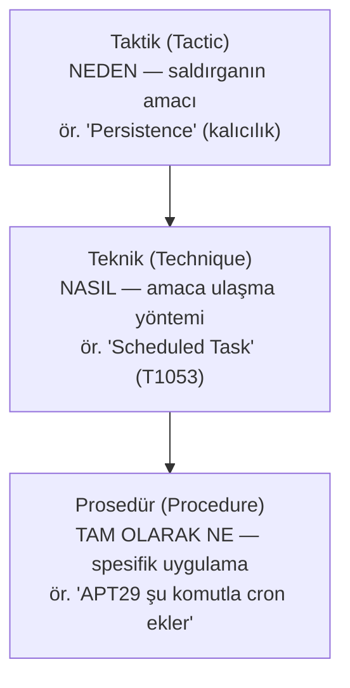
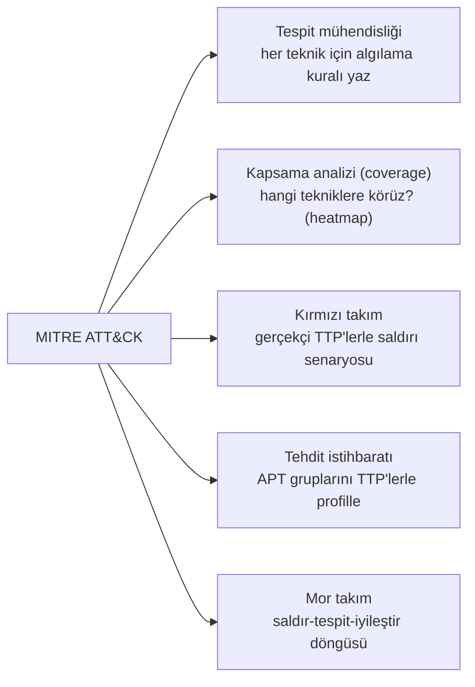

# 🎯 MITRE ATT&CK

MITRE ATT&CK (Adversarial Tactics, Techniques, and Common Knowledge), gerçek saldırganların kullandığı davranışların (taktik, teknik, prosedür) küresel, sürekli güncellenen bir bilgi tabanıdır (resmî kaynak: [attack.mitre.org](https://attack.mitre.org/)). Savunma dünyasının "ortak dili" hâline gelmiştir: bir tehdit avcısı, SOC analisti veya kırmızı takımcı ATT&CK terimleriyle konuşur. Bu dosya çerçeveyi ve pratik kullanımını kurar.

> Kardeş çerçeveler: [cyber-kill-chain.md](cyber-kill-chain.md), [pyramid-of-pain-diamond-model.md](pyramid-of-pain-diamond-model.md). Uygulama: [tehdit-istihbarati-ioc-ioa.md](tehdit-istihbarati-ioc-ioa.md), [11-soc](../11-soc-mavi-takim/log-analizi.md).

---

## 1. Ne? — TTP hiyerarşisi

ATT&CK, saldırgan davranışını üç seviyede tanımlar (**TTP**):

| Seviye | Soru | Örnek |
|--------|------|-------|
| **Taktik** | Saldırgan **neden** bunu yapıyor? (amaç) | Initial Access, Persistence, Exfiltration |
| **Teknik** | Bunu **nasıl** yapıyor? (yöntem) | Phishing (T1566), Scheduled Task (T1053) |
| **Prosedür** | **Tam olarak** nasıl uyguluyor? | Belirli bir grubun spesifik komut/aracı |

> **Neden bu ayrım güçlü:** Bir IP adresi ([pyramid-of-pain](pyramid-of-pain-diamond-model.md)) değişebilir, ama saldırganın *davranışı* (bir tekniği) daha kalıcıdır. ATT&CK davranışa odaklanarak, saldırganın araçlarını değiştirse bile onu yakalamayı hedefler.

---

## 2. ATT&CK matrisi ve taktikler

ATT&CK, **Enterprise** (kurumsal), **Mobile** ve **ICS** (endüstriyel) matrislerinden oluşur. Enterprise matrisi bir saldırının yaşam döngüsü boyunca taktikleri sütunlar hâlinde dizer. Basitleştirilmiş taktik akışı:

| # | Taktik | Amaç | Örnek teknik |
|---|--------|------|--------------|
| 1 | **Reconnaissance** | Hedef hakkında bilgi topla | Aktif tarama, açık kaynak istihbaratı |
| 2 | **Resource Development** | Saldırı altyapısı kur | Alan adı/hesap edin |
| 3 | **Initial Access** | İlk ayak izini elde et | Phishing (T1566), açık servis |
| 4 | **Execution** | Kodu çalıştır | PowerShell, komut satırı |
| 5 | **Persistence** | Erişimi koru | Scheduled Task (T1053), Registry Run |
| 6 | **Privilege Escalation** | Yetki yükselt | SUID, token, UAC bypass |
| 7 | **Defense Evasion** | Tespitten kaç | Log silme, obfuscation |
| 8 | **Credential Access** | Kimlik bilgisi çal | LSASS dump, Kerberoasting |
| 9 | **Discovery** | Ortamı keşfet | Ağ/hesap sayımı |
| 10 | **Lateral Movement** | Yanal yayıl | Pass-the-Hash, RDP |
| 11 | **Collection** | Veri topla | Ekran/klavye yakalama |
| 12 | **Command & Control** | Uzaktan yönet | C2 kanalı, DNS tünelleme |
| 13 | **Exfiltration** | Veriyi dışarı çıkar | Şifreli kanaldan gönderme |
| 14 | **Impact** | Hasar ver | Ransomware, veri imha |

> Bu taktikler [cyber-kill-chain.md](cyber-kill-chain.md)'in daha ayrıntılı, davranışsal karşılığıdır. Kill Chain 7 aşamalı "büyük resim"; ATT&CK her aşamada "tam olarak hangi teknikler" sorusunu cevaplar.

---

## 3. Neden? — Pratik kullanım alanları

ATT&CK sadece bir katalog değil, operasyonel bir araçtır:

- **Tespit mühendisliği (detection engineering):** Her teknik için "bunu nasıl tespit ederim?" sorusu → SOC kuralları ([log-analizi.md](../11-soc-mavi-takim/log-analizi.md)).
- **Kapsama haritası (ATT&CK Navigator):** Savunmanın hangi tekniklere karşı güçlü/zayıf olduğunu renkli matris üzerinde görselleştirme → kör noktaları bul.
- **Tehdit profilleme:** "APT29 şu teknikleri kullanır" → o gruba karşı öncelikli savunma.
- **Mor takım tatbikatı:** Kırmızı takım bir tekniği uygular, mavi takım tespit edebiliyor mu diye ölçer, boşluk kapatılır.

### Bir tekniği uçtan uca izlemek — örnek: T1003 (OS Credential Dumping)
Soyut bir katalog yerine tek bir tekniği somut izlemek, ATT&CK'in nasıl "kullanılan" bir araç olduğunu gösterir. **T1003.001 — LSASS Memory** tekniğini ele alalım (Credential Access taktiği):

- **Prosedür (saldırgan ne yapar):** Bir saldırgan `SeDebugPrivilege` ile LSASS sürecinin belleğini boşaltıp içindeki kimlik bilgilerini çalar ([../02-linux-windows/windows-temelleri.md](../02-linux-windows/windows-temelleri.md)) — klasik araç Mimikatz `sekurlsa::logonpasswords`, veya `procdump -ma lsass.exe lsass.dmp` ile bellek dökümü alıp offline işleme.
- **Tespit (savunmacı ne arar):** LSASS'a **anormal erişim** — Sysmon Event ID 10 (ProcessAccess) ile hedefi `lsass.exe` olan, `procdump`/beklenmedik bir süreçten gelen `GrantedAccess` maskesi (ör. `0x1010`, `0x1410`) ([../11-soc-mavi-takim/log-analizi.md](../11-soc-mavi-takim/log-analizi.md)). Bu bir **davranış** (IOA) tespitidir → aracın adı (Mimikatz) değişse bile "LSASS'a şüpheli erişim" davranışı kalır ([pyramid-of-pain-diamond-model.md](pyramid-of-pain-diamond-model.md)).
- **Azaltma (mitigation):** Credential Guard (LSASS'ı izole eder), en az ayrıcalık, `SeDebugPrivilege` kısıtlama.

Aynı teknik için "prosedür → tespit → azaltma" üçlüsünü çıkarabilmek, ATT&CK'in gerçek değeridir: her teknik, savunmacıya somut bir tespit kuralı ve azaltma yolu verir. ATT&CK'in savunma-odaklı kardeşi **MITRE D3FEND**, bu azaltma/karşı-önlemleri ayrıca kataloglar.

---

## 4. Nüans

- **ATT&CK ≠ tehdit modeli:** ATT&CK saldırgan davranışlarının **bilinen** kataloğudur (geçmişe/gözleme dayalı). [STRIDE](../08-grc-yonetisim-risk-uyum/stride-tehdit-modelleme.md) ise tasarım aşamasında **potansiyel** tehditleri sistematik türetir. İkisi tamamlayıcıdır: STRIDE "neler olabilir", ATT&CK "gerçekte neler yapılıyor".
- **Kapsama ≠ güvenlik:** Bir tekniği "tespit edebiliyor olmak", saldırıyı **durdurabilmek** demek değildir. Ayrıca %100 kapsama imkânsızdır — öncelik risk temelli olmalı.
- **Teknik ID'leri (T####) ortak dildir:** Bir raporda "T1566 gözlemlendi" demek, "phishing ile ilk erişim sağlandı" demektir — herkes aynı şeyi anlar. Bu standartlaşma ATT&CK'in en büyük katkısıdır.

---

## 5. Saldırı–savunma kesişimi (özet)

- **Davranış temelli savunma:** IOC'ler (IP, hash) kolayca değişir; ATT&CK teknikleri (davranış) değiştirmesi daha pahalıdır → [pyramid-of-pain](pyramid-of-pain-diamond-model.md). ATT&CK'e göre savunma kurmak, saldırganı "daha çok acıtan" yerden vurmaktır.
- **Ortak dil:** Kırmızı, mavi, mor takım ve tehdit istihbaratı ([tehdit-istihbarati-ioc-ioa.md](tehdit-istihbarati-ioc-ioa.md)) hepsi ATT&CK terimleriyle konuşarak boşluksuz iletişir.
- **Tespit önceliklendirme:** Sonsuz kaynak yok; ATT&CK, en olası/en etkili tekniklere odaklanmayı (heatmap) sağlar.

> **Sonraki:** [cyber-kill-chain.md](cyber-kill-chain.md).
