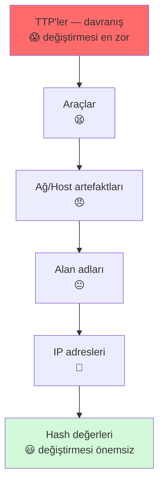
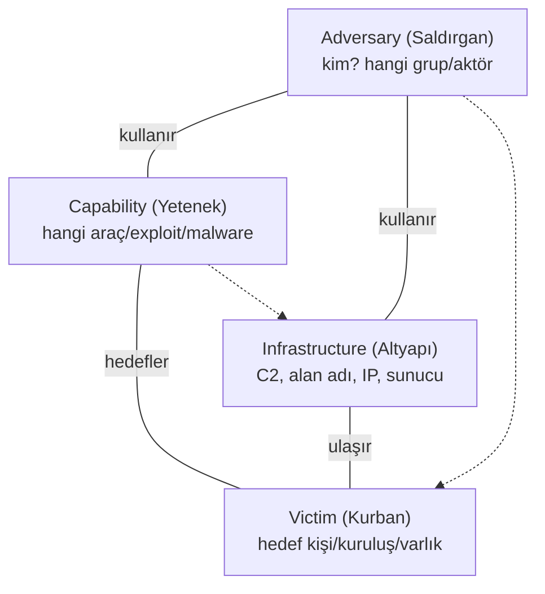
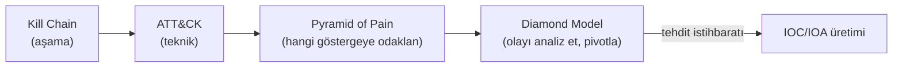

# 🔺 Pyramid of Pain ve Diamond Model

Bu iki çerçeve, tehdit istihbaratını **eyleme dönüştürmenin** iki farklı boyutunu verir. **Pyramid of Pain**, hangi göstergeleri engellemenin saldırganı en çok "acıttığını" gösterir. **Diamond Model**, tek bir saldırı olayını yapılandırılmış şekilde analiz etmenin çerçevesidir. İkisi birlikte, "neyi izleyeyim?" ve "bu olayı nasıl analiz edeyim?" sorularını cevaplar.

> Kardeş çerçeveler: [mitre-attck.md](mitre-attck.md), [cyber-kill-chain.md](cyber-kill-chain.md). Uygulama: [tehdit-istihbarati-ioc-ioa.md](tehdit-istihbarati-ioc-ioa.md).

---

## 1. Pyramid of Pain

David Bianco'nun **Pyramid of Pain** çerçevesi (kaynak: [Bianco'nun orijinal blog yazısı](https://detect-respond.blogspot.com/2013/03/the-pyramid-of-pain.html)), ele geçirme göstergelerini (IOC) "saldırgan için değiştirmesi ne kadar zor/acı verici" olduğuna göre sıralar. Tabana yakın göstergeler saldırganın kolayca değiştirebileceği, tepeye yakın olanlar ise onu gerçekten zorlayanlardır.

```
                     ▲ Saldırgana ACI SEVİYESİ
        ╱────────────────────────────╲
       ╱   TTP'ler (Davranışlar)      ╲   😱 "Zor!" — davranışı değiştirmek pahalı
      ╱────────────────────────────────╲
     ╱      Araçlar (Tools)             ╲  😫 "Zorlayıcı" — yeni araç geliştir/edin
    ╱────────────────────────────────────╲
   ╱   Ağ/Host Artefaktları               ╲ 😠 "Sinir bozucu"
  ╱────────────────────────────────────────╲
 ╱   Alan Adları (Domain Names)             ╲ 😐 "Basit" — yeni alan al
╱────────────────────────────────────────────╲
│   IP Adresleri                              │ 🙂 "Kolay" — IP değiştir
├──────────────────────────────────────────────┤
│   Hash Değerleri                            │ 😃 "Önemsiz" — tek bit değiştir, hash değişir
└──────────────────────────────────────────────┘
                     ▼ Değiştirmesi KOLAY
```



### Katman katman

| Seviye | Gösterge | Saldırgana maliyeti | Örnek |
|--------|----------|---------------------|-------|
| **Hash** | Dosya hash'i | **Önemsiz** — 1 bit değiştir, hash tamamen değişir | `MD5: a1b2...` |
| **IP** | IP adresi | Kolay — yeni sunucu/proxy | `185.x.x.x` |
| **Domain** | Alan adı | Basit ama biraz çaba (kayıt) | `evil-c2.com` |
| **Artefakt** | Ağ/host izi | Sinir bozucu — araçta değişiklik gerekir | Belirli User-Agent, registry anahtarı |
| **Araç** | Kullanılan araç | Zorlayıcı — yeni araç geliştir/öğren | Mimikatz, Cobalt Strike |
| **TTP** | Davranış/teknik | **En zor** — çalışma tarzını değiştir | Kerberoasting yöntemi, phishing tarzı |

### Neden bu kadar önemli? (temel içgörü)

> Çoğu savunma en alttaki (kolay) göstergelere odaklanır: "şu hash'i/IP'yi engelle". Ama saldırgan bunları **saniyeler içinde** değiştirir → savunma sürekli geride kalır. **Tepeye çıktıkça** (araç, TTP) saldırganı gerçekten zorlarsın: davranışını (TTP) tespit edecek bir savunma kurarsan, saldırgan araçlarını ve IP'lerini değiştirse bile yakalanır.

Bu, [MITRE ATT&CK](mitre-attck.md)'in neden bu kadar değerli olduğunu açıklar: ATT&CK **TTP seviyesinde** (piramidin tepesi) savunma kurmayı sağlar. "IP engelle" taktik bir kazanç; "davranış tespit et" stratejik bir kazançtır.

> **Saldırgan cephesinden aynı piramit:** Bir saldırganın AV/EDR atlatma çabası tam olarak bu piramide göre ölçeklenir — hash/imza (dip) değiştirmek ucuz ve kolayken, davranışı (TTP, tepe) gizlemek pahalı ve kırılgandır. Bu yüzden imza atlatmak (encoder/packer) basit, EDR'in davranışsal tespitini atlatmak zordur → [../10-pentest-metodolojisi/av-edr-atlatma.md](../10-pentest-metodolojisi/av-edr-atlatma.md).

---

## 2. Diamond Model — olay analizi çerçevesi

**Diamond Model**, tek bir saldırı olayını (intrusion) dört temel özellik üzerinden yapılandıran analiz çerçevesidir. Her olay bir "elmas"tır; dört köşesi birbirine bağlıdır.



| Köşe | Soru | Örnek |
|------|------|-------|
| **Adversary (Saldırgan)** | Kim yapıyor? | Bir APT grubu, siber suç çetesi |
| **Capability (Yetenek)** | Hangi araç/teknik? | Zararlı yazılım, exploit, phishing kiti |
| **Infrastructure (Altyapı)** | Nereden/neyle? | C2 sunucuları, alan adları, IP'ler |
| **Victim (Kurban)** | Kime karşı? | Hedeflenen kuruluş, kişi, sistem |

### Nasıl kullanılır? — pivotlama (pivoting)
Diamond Model'in gücü, bir köşeden diğerine **pivot** yapabilmektir: bir C2 IP'si (Infrastructure) bulunca, o altyapıyı kullanan diğer saldırıları/yetenekleri araştırıp saldırganı (Adversary) profilleyebilirsin.
- Bir zararlı örneği (Capability) → hangi altyapıya (Infrastructure) bağlanıyor?
- O altyapı → başka hangi kurbanları (Victim) hedeflemiş?
- Bu izler → hangi saldırgan grubuna (Adversary) işaret ediyor?

Bu, bir tek olaydan bir kampanyanın tamamını haritalamayı sağlar.

---

## 3. Çerçeveler birlikte: bütünsel resim

Bu bölümdeki dört çerçeve farklı sorulara cevap verir ve birbirini tamamlar:

| Çerçeve | Cevapladığı soru |
|---------|------------------|
| **[Cyber Kill Chain](cyber-kill-chain.md)** | Saldırı hangi **aşamada**? |
| **[MITRE ATT&CK](mitre-attck.md)** | Hangi spesifik **teknikler** kullanıldı? |
| **Pyramid of Pain** | Hangi göstergeyi engellemek en **değerli**? |
| **Diamond Model** | Bu **olay** nasıl yapılandırılır/analiz edilir? |



---

## 4. Saldırı–savunma kesişimi (özet)

- **TTP'ye yatırım stratejiktir:** Pyramid of Pain'in temel dersi — hash/IP engelleme (taktik, geçici) yerine davranış tespitine (TTP, kalıcı) yatırım yap. Bu, savunma kaynağını en yüksek getiriye yönlendirir.
- **Diamond ile kampanya görürsün:** Tek olayları izole görmek yerine, pivotlama ile bir saldırganın tüm operasyonunu haritalarsın → proaktif savunma.
- **Çerçeveler ortak dildir:** Bu çerçeveler, [tehdit istihbaratının](tehdit-istihbarati-ioc-ioa.md) ve SOC'un ([11-soc](../11-soc-mavi-takim/log-analizi.md)) yapılandırılmış düşünme araçlarıdır — sezgi yerine sistematik analiz sağlar.

> **Sonraki:** [tehdit-istihbarati-ioc-ioa.md](tehdit-istihbarati-ioc-ioa.md).
