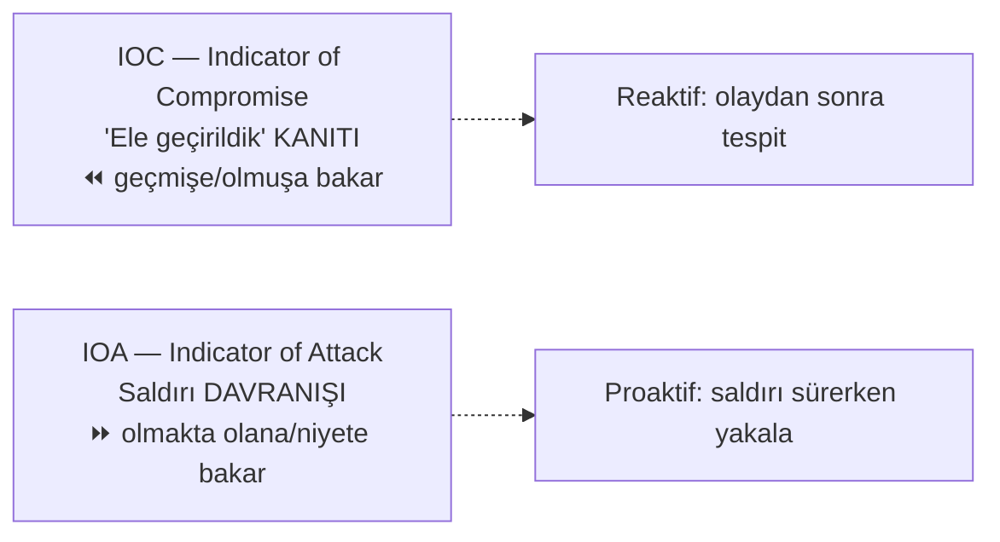
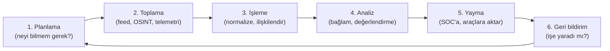

# 🕵️ Tehdit İstihbaratı: IOC ve IOA

Tehdit istihbaratı (threat intelligence), ham veriyi işlenmiş, eyleme dönüştürülebilir bilgiye çeviren disiplindir: "hangi tehditler var, nasıl davranıyorlar, biz nasıl korunuruz?" Bu dosya, istihbaratın iki temel yapı taşını — **IOC** (ne oldu) ve **IOA** (ne olmakta) — ve aralarındaki kritik farkı kurar.

> Ön koşul: [pyramid-of-pain-diamond-model.md](pyramid-of-pain-diamond-model.md), [mitre-attck.md](mitre-attck.md). Uygulama: [11-soc/log-analizi.md](../11-soc-mavi-takim/log-analizi.md).

---

## 1. IOC vs IOA — temel ayrım

| | IOC (Compromise) | IOA (Attack) |
|---|------------------|--------------|
| Sorusu | "Ele geçirildik mi?" (kanıt) | "Bir saldırı mı oluyor?" (davranış) |
| Zaman | Geçmiş — olay olmuş | Şimdiki — olay sürüyor |
| Örnek | Bilinen zararlı hash, C2 IP'si | "Word → PowerShell → şifreli C2 bağlantısı" davranışı |
| Doğa | Statik gösterge | Dinamik davranış dizisi |
| Piramitteki yeri | Alt (hash/IP — kolay değişir) | Üst (TTP — kalıcı) |

### IOC — ele geçirilme göstergesi
Bir ihlalin **kanıtı** olan somut artefaktlar:
- Zararlı dosya **hash'leri** (MD5/SHA256)
- Kötü **IP adresleri** ve **alan adları** (C2 altyapısı)
- Şüpheli **registry anahtarları**, dosya yolları, mutex'ler
- Anormal ağ trafiği imzaları

**Sınırı:** IOC'ler [Pyramid of Pain](pyramid-of-pain-diamond-model.md)'in genelde alt katmanlarıdır — saldırgan kolayca değiştirir. Ayrıca IOC "iş işten geçtikten sonra" (ele geçirilme *olmuş*) tespit eder. Yine de değerlidir: bilinen kötüleri hızlı engellemek ucuz ve etkilidir.

### IOA — saldırı göstergesi
Saldırının **niyetini/davranışını** yakalar, spesifik araçtan bağımsız:
- "Bir ofis belgesi bir betik yorumlayıcısı (PowerShell) başlattı" ([surecler-ve-bellek.md](../03-isletim-sistemi-ici/surecler-ve-bellek.md) süreç soy ağacı)
- "Bir süreç LSASS belleğine eriş­meye çalıştı" (kimlik hırsızlığı)
- "Kısa sürede çok sayıda dosya şifrelendi" (ransomware davranışı)

**Gücü:** Saldırgan hash'ini, IP'sini, aracını değiştirse bile **davranış** aynı kalır → IOA onu yine yakalar. TTP seviyesinde savunma budur.

---

## 2. Tehdit istihbaratı seviyeleri

İstihbarat farklı hedef kitlelere farklı soyutlamada sunulur:

| Seviye | Kime | İçerik |
|--------|------|--------|
| **Stratejik** | Yönetim/CISO | Trendler, risk manzarası, kim bizi neden hedefler |
| **Operasyonel** | SOC yöneticisi | Kampanyalar, aktör TTP'leri, öncelikler |
| **Taktik** | SOC analisti/avcı | Somut TTP'ler ([ATT&CK](mitre-attck.md)), tespit kuralları |
| **Teknik** | Otomasyon/araçlar | IOC beslemeleri (feed): hash, IP, domain listeleri |

---

## 3. İstihbarat yaşam döngüsü

Ham veri (feed) tek başına istihbarat değildir; **bağlam** kazanınca (bu IOC bize mi yönelik, hangi kampanyaya ait, ne yapmalıyız) eyleme dönüşür.

---

## 4. Kaynaklar ve paylaşım

- **Açık kaynak (OSINT):** VirusTotal, AbuseIPDB, açık IOC beslemeleri, güvenlik araştırmacı raporları.
- **Ticari:** Kurumsal tehdit istihbaratı sağlayıcıları.
- **Topluluk/sektörel:** ISAC'ler (sektöre özel paylaşım toplulukları), CERT/CSIRT bültenleri.
- **Paylaşım standartları:** **STIX** (istihbaratı yapılandırma dili) ve **TAXII** (paylaşım protokolü) — istihbaratın makineler arası otomatik paylaşımını sağlar; ikisi de OASIS tarafından standartlaştırılmıştır (kaynak: [OASIS STIX/TAXII](https://oasis-open.github.io/cti-documentation/)).

> **Nüans — beslemenin (feed) tuzağı:** Bağlamsız IOC feed'i "gürültü" üretir: binlerce IP/hash, çoğu senin ortamınla alakasız veya güncelliğini yitirmiş → yanlış pozitif ([log-analizi.md](../11-soc-mavi-takim/log-analizi.md)) seli. İyi istihbarat, hacim değil **ilgililik ve bağlamdır**.

---

## 5. Nüans: istihbaratın ikili doğası

- **IOC gerekli ama yetersiz:** Bilinen kötüleri engellemek ucuz kazanç; ama yalnızca IOC'ye dayanmak, saldırgan tek bit değiştirdiğinde kör kalmak demek. Bu yüzden olgun savunma **IOA/TTP'ye** ([mitre-attck.md](mitre-attck.md)) yükselir.
- **Atıf (attribution) zordur ve tehlikelidir:** "Bu saldırı X grubundan" demek çekicidir ama saldırganlar bilerek yanlış iz bırakır (false flag). Atıf, yüksek güven gerektirir; savunma kararları atıfa değil, gözlemlenen davranışa dayanmalı.
- **İstihbarat taze olmalı:** Bir IOC'nin değeri zamanla düşer (C2 kapanır, IP yeniden atanır). Eski feed'e güvenmek hem kör nokta hem yanlış pozitif üretir.

---

## 6. Saldırı–savunma kesişimi (özet)

- **IOC → reaktif, IOA → proaktif:** Olgunluk yolculuğu IOC (olmuşu tespit) seviyesinden IOA/TTP (olmakta olanı, hatta niyeti tespit) seviyesine çıkmaktır. Bu, [Pyramid of Pain](pyramid-of-pain-diamond-model.md)'de aşağıdan yukarı tırmanmaktır.
- **İstihbarat tehdit avını besler:** SOC'ta ([11-soc](../11-soc-mavi-takim/siem-edr-soar.md)) proaktif tehdit avcılığı (threat hunting), istihbarattaki TTP'leri hipoteze çevirip loglarda arar — "saldırgan bunu yapıyorsa, izini nerede görürüm?"
- **Paylaşım savunmayı güçlendirir:** Bir kuruluşun tespit ettiği IOC/TTP, paylaşıldığında (STIX/TAXII, ISAC) tüm topluluğu korur — saldırganın "bir kez kullan" avantajını kırar.

> **Modül 07 tamamlandı.** Sonraki: [08-grc-yonetisim-risk-uyum/guvenlik-kontrolleri-matrisi.md](../08-grc-yonetisim-risk-uyum/guvenlik-kontrolleri-matrisi.md).
