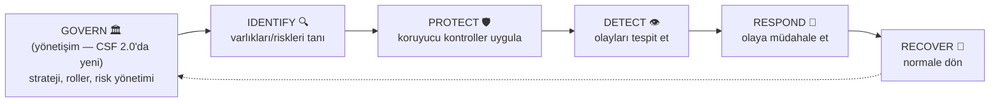
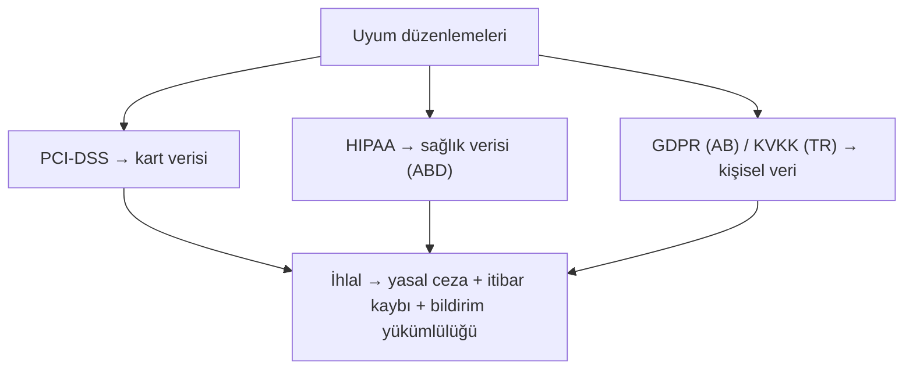

# 📐 Güvenlik Çerçeveleri: NIST CSF, ISO 27001 ve Uyum Düzenlemeleri

Güvenlik çerçeveleri, "neyi, nasıl, hangi sırayla yapmalıyım?" sorusuna yapılandırılmış cevap veren rehberlerdir. Sıfırdan güvenlik programı kurmaya çalışmak yerine, denenmiş çerçeveleri temel alırsın. Bu dosya en önemli çerçeveleri (NIST CSF, ISO 27001) ve uyum düzenlemelerini (PCI-DSS, HIPAA, GDPR/KVKK) ayırt eder.

> Ön koşul: [risk-yonetimi.md](risk-yonetimi.md), [guvenlik-kontrolleri-matrisi.md](guvenlik-kontrolleri-matrisi.md).

---

## 1. Çerçeve vs Standart vs Düzenleme (kritik ayrım)

Sık karıştırılan üç kavram:

| Kavram | Ne | Zorunlu mu? | Örnek |
|--------|-----|:---:|-------|
| **Çerçeve (framework)** | Rehber/en iyi uygulama seti | Gönüllü | NIST CSF |
| **Standart (standard)** | Sertifikalanabilir belirtim | Gönüllü (ama sertifika için uyulmalı) | ISO 27001 |
| **Düzenleme (regulation)** | Yasal zorunluluk | **Zorunlu** (ihlali cezalı) | GDPR, KVKK, HIPAA |

> **Nüans:** Uyum (compliance) ≠ güvenlik. Bir düzenlemeye uymak asgari bir taban sağlar ama gerçek güvenliği garanti etmez ("compliant but breached" — uyumlu ama ihlal edilmiş olabilirsin). Uyum bir başlangıç, hedef değildir.

---

## 2. NIST Siber Güvenlik Çerçevesi (CSF 2.0)

**NIST CSF**, ABD merkezli ama küresel kabul görmüş, esnek ve sektörden bağımsız bir çerçevedir. En büyük gücü, güvenliği anlaşılır **fonksiyonlara** ayırmasıdır. **CSF 2.0** (2024), önceki 5 fonksiyona **"Govern"** ekleyerek 6 fonksiyona çıktı.

| Fonksiyon | Soru | Örnek faaliyet |
|-----------|------|----------------|
| **Govern** (yönetişim) | Riski nasıl yönetiyoruz? | Strateji, roller, politika, tedarik zinciri risk yönetimi |
| **Identify** (tanımla) | Neyi koruyoruz? | Varlık envanteri, risk değerlendirme ([risk-yonetimi.md](risk-yonetimi.md)) |
| **Protect** (koru) | Nasıl koruyoruz? | Erişim kontrolü, şifreleme, eğitim, bakım |
| **Detect** (tespit et) | Olayı nasıl fark ederiz? | İzleme, SIEM ([11-soc](../11-soc-mavi-takim/siem-edr-soar.md)), anomali tespiti |
| **Respond** (müdahale et) | Ne yaparız? | Olay müdahale planı, iletişim, analiz |
| **Recover** (kurtar) | Nasıl toparlanırız? | Kurtarma planı, iyileştirme, RTO/RPO |

> **Neden bu kadar yaygın:** CSF, teknik olmayan yöneticilerin bile güvenliği anlayıp konuşmasını sağlar. Bir güvenlik programını bu 6 fonksiyona göre değerlendirmek, "nerede zayıfız?" sorusuna hızlı harita verir. Ayrıca [kill chain](../07-tehdit-modelleme-cerceveler/cyber-kill-chain.md) ve [kontrol işlevleriyle](guvenlik-kontrolleri-matrisi.md) (önleyici=Protect, tespit=Detect...) hizalanır.

---

## 3. ISO/IEC 27001 — sertifikalanabilir standart

**ISO 27001**, bir **Bilgi Güvenliği Yönetim Sistemi (ISMS)** kurmak için uluslararası standarttır. NIST CSF bir rehberken, ISO 27001 **sertifikalanabilir** — bağımsız denetçi onaylar, kuruluş "ISO 27001 sertifikalı" olur.

- **Odak:** Süreç ve yönetim. Güvenliği bir kerelik proje değil, **sürekli iyileşen bir sistem** (PDCA: Planla-Uygula-Kontrol et-Önlem al) olarak kurar.
- **Ek A kontrolleri:** Uygulanabilir kontrollerin bir kataloğu (erişim kontrolü, kriptografi, fiziksel güvenlik, tedarikçi ilişkileri vb.).
- **Neden değerli:** Sertifika, müşterilere/ortaklara "güvenliği ciddiye alıyoruz" kanıtı sunar — B2B ve ihalelerde çoğu zaman şart.

### NIST CSF vs ISO 27001
| | NIST CSF | ISO 27001 |
|---|----------|-----------|
| Türü | Çerçeve/rehber | Sertifikalanabilir standart |
| Odak | Sonuç/fonksiyon | Süreç/yönetim sistemi |
| Sertifika | Yok | Var (denetimli) |
| Esneklik | Yüksek | Yapılandırılmış |
| Kullanım | Hızlı değerlendirme, iletişim | Resmî belgeleme, sertifika |

İkisi **birlikte** kullanılabilir: CSF ile programı organize et, ISO 27001 ile belgele/sertifikala.

---

## 4. Uyum düzenlemeleri — yasal zorunluluklar

Bunlar gönüllü değil, **yasal** gerekliliklerdir; ihlali ceza/dava getirir.

| Düzenleme | Kapsam | Kilit gereksinim |
|-----------|--------|------------------|
| **PCI-DSS** | Kredi kartı işleyen herkes | Kart verisini koru (şifrele, segmentle, erişimi kısıtla). Teknik olarak en spesifik. |
| **HIPAA** | ABD sağlık verisi | Sağlık bilgisinin (PHI) gizliliği/güvenliği. |
| **GDPR** | AB vatandaşlarının kişisel verisi | Rıza, veri minimizasyonu, ihlal bildirimi (72 saat), "unutulma hakkı". Ağır cezalar (ciro %4'üne kadar). |
| **KVKK** | Türkiye kişisel veri | GDPR'a benzer; Türkiye'de kişisel veri işleyen herkes için zorunlu. |

> **GDPR/KVKK nüansı:** Bu düzenlemeler "veriyi koru"nun ötesinde **kişinin hakları** üzerine kuruludur (erişim, düzeltme, silme, taşınabilirlik hakkı) ve **veri ihlali bildirimini** zorunlu kılar. Bir ihlali gizlemek, ihlalin kendisinden daha büyük ceza getirebilir → [11-soc](../11-soc-mavi-takim/siem-edr-soar.md) tespit/bildirim yeteneği yasal bir gereklilik hâline gelir.

---

## 5. Nüans: uyum ≠ güvenlik (ama başlangıç noktası)

- **Uyum bir tavan değil, tabandır:** PCI-DSS'e uymak, "artık güvendeyiz" demek değildir — asgari kontrolleri sağlar. Gerçek güvenlik, uyumun ötesinde risk temelli düşünmeyi gerektirir.
- **"Kutu doldurma" tuzağı:** Uyumu bir onay listesi (checklist) gibi görmek tehlikelidir — kâğıtta uyumlu ama pratikte savunmasız olabilirsin. Çerçeveler düşünmeyi organize eder, düşünmenin yerine geçmez.
- **Çerçeveler örtüşür:** NIST CSF, ISO 27001 ve düzenlemeler büyük ölçüde aynı temel kontrolleri ister (erişim kontrolü, şifreleme, izleme, olay müdahalesi). Birini iyi yaparsan diğerlerinin çoğunu karşılarsın.

---

## 6. Saldırı–savunma kesişimi (özet)

- **Çerçeve = savunma haritası:** NIST CSF'in 6 fonksiyonu, bir saldırıya karşı savunmanın (tanı→koru→tespit→müdahale→kurtar) tam yaşam döngüsünü kapsar; kill chain ile ters simetriktir.
- **Uyum tespit/müdahaleyi zorunlu kılar:** GDPR/KVKK ihlal bildirimi, SOC'un ([11-soc](../11-soc-mavi-takim/log-analizi.md)) tespit yeteneğini yasal gereklilik yapar — savunma artık sadece "iyi fikir" değil, yükümlülük.
- **PQC ve uyum:** Düzenleyiciler ve CNSA 2.0 ([post-kuantum-kriptografi.md](../05-kriptografi/post-kuantum-kriptografi.md)) giderek PQC geçişini uyum gerekliliği hâline getiriyor — senin gelecekteki iş alanın tam bu kesişimde.

> **Sonraki:** [stride-tehdit-modelleme.md](stride-tehdit-modelleme.md).
