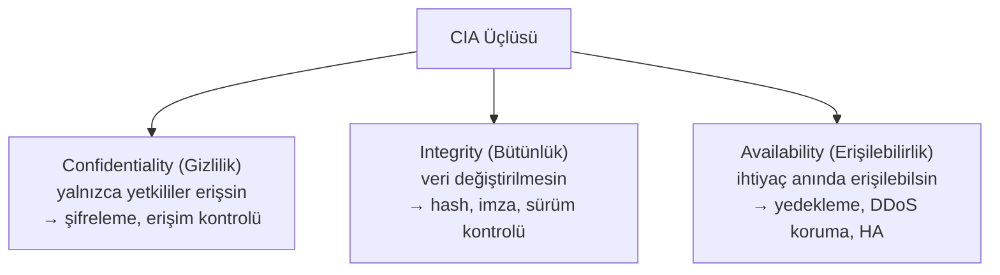
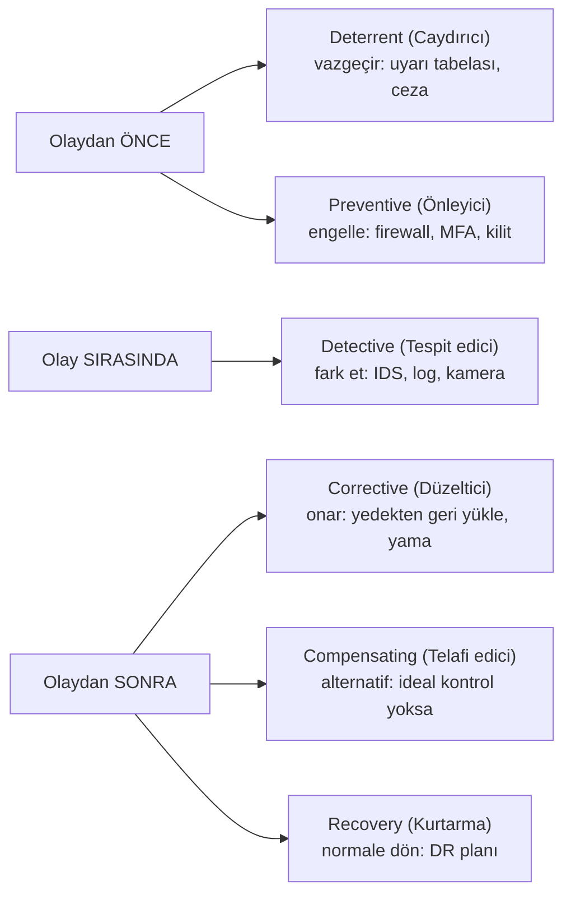

# 🎛️ Güvenlik Kontrolleri Matrisi

Güvenlik kontrolü, bir riski azaltmak için uygulanan herhangi bir önlemdir. Bu dosya, kontrolleri iki eksende (tür ve işlev) sınıflandıran matrisi kurar — bu sınıflandırma, "savunmamda hangi tür kontrol eksik?" sorusunu sistematik cevaplamayı sağlar. Ayrıca CIA üçlüsünü ve savunma derinliğini bu kontrollere bağlar.

> Terimler: [terminoloji-sozlugu.md](../00-baslangic/terminoloji-sozlugu.md). Devamı: [risk-yonetimi.md](risk-yonetimi.md).

---

## 1. CIA üçlüsü — kontrollerin hizmet ettiği hedef

Her güvenlik kontrolü nihayetinde bu üç hedeften birine (veya birkaçına) hizmet eder:

| Hedef | Tehdit | Örnek kontrol |
|-------|--------|---------------|
| **Gizlilik** | İfşa, sızıntı | Şifreleme ([05-kripto](../05-kriptografi/temel-kavramlar.md)), erişim kontrolü, DLP |
| **Bütünlük** | Yetkisiz değişiklik | Hash/imza, sürüm kontrolü, değişiklik yönetimi |
| **Erişilebilirlik** | Kesinti, DoS | Yedekleme, yük dengeleme, DDoS koruması, felaket kurtarma |

> **Nüans — üçü arasında gerilim:** Bu üç hedef bazen çakışır. Aşırı gizlilik (çok katı erişim) erişilebilirliği düşürür; yüksek erişilebilirlik (çok kopya) gizlilik yüzeyini büyütür. Güvenlik, iş ihtiyacına göre bu üçü arasında **denge** kurmaktır — üçünü de maksimuma çıkarmak değil.

> **Genişletmeler:** Bazı modeller CIA'ya **kimlik doğrulama, reddedilemezlik (non-repudiation)** ve **hesap verebilirlik** ekler (bazen "AAA" veya "Parkerian Hexad" olarak).

---

## 2. Kontrol türleri (control types) — nasıl uygulanır

Kontroller, **uygulama biçimlerine** göre sınıflandırılır:

| Tür | Ne | Örnek |
|-----|-----|-------|
| **Teknik (technical/logical)** | Teknoloji ile | Firewall, şifreleme, MFA, EDR, ACL |
| **İdari (administrative/managerial)** | Politika/süreç/insan | Güvenlik politikaları, eğitim, işe alım taraması, risk değerlendirme |
| **Fiziksel (physical)** | Fiziksel dünya | Kilit, kamera, kartlı geçiş, güvenlik görevlisi |

> **Neden üçü de gerekli:** En güçlü şifreleme (teknik), zayıf bir parola politikası (idari eksik) veya kilitsiz sunucu odası (fiziksel eksik) ile boşa gider. [Derinlemesine savunma](../00-baslangic/terminoloji-sozlugu.md) her üç türü kapsar.

---

## 3. Kontrol işlevleri (control functions) — ne zaman etki eder

Kontroller, saldırı zamanına göre işlevlerine göre de sınıflandırılır ([cyber-kill-chain.md](../07-tehdit-modelleme-cerceveler/cyber-kill-chain.md) ile ilişkili):

| İşlev | Ne zaman | Amaç | Örnek |
|-------|----------|------|-------|
| **Caydırıcı (deterrent)** | Önce | Saldırganı vazgeçir | Uyarı afişi, yasal sonuç |
| **Önleyici (preventive)** | Önce | Olayı engelle | Firewall, MFA, kilit, en az ayrıcalık |
| **Tespit edici (detective)** | Sırasında | Olayı fark et | IDS/SIEM, log, kamera, alarm |
| **Düzeltici (corrective)** | Sonra | Zararı gider | Yedekten geri yükleme, yama, karantina |
| **Telafi edici (compensating)** | — | İdeal kontrol yoksa alternatif | MFA yerine ek izleme + IP kısıtlama |
| **Kurtarma (recovery)** | Sonra | Normale dön | Felaket kurtarma (DR), yeniden kurulum |

---

## 4. Kontrol matrisi (iki eksen birlikte)

Gerçek gücü, iki ekseni **birlikte** düşünmektir: her kontrol hem bir **tür** (teknik/idari/fiziksel) hem bir **işlevdir** (önleyici/tespit edici...). Bu matris, kör noktaları ortaya çıkarır.

| | Caydırıcı | Önleyici | Tespit edici | Düzeltici |
|---|-----------|----------|--------------|-----------|
| **Teknik** | Login uyarı bannerı | Firewall, MFA, şifreleme | IDS, SIEM, EDR | Otomatik karantina, yedek |
| **İdari** | Disiplin politikası | Güvenlik eğitimi, işe alım taraması | Denetim (audit), log incelemesi | Olay müdahale planı |
| **Fiziksel** | Uyarı tabelası, çit | Kilit, kartlı geçiş, mantrap | Kamera (CCTV), hareket sensörü | Yangın söndürme, yedek güç |

> **Kullanım:** Bir savunmayı değerlendirirken bu matrisi doldur. Hücreler boşsa (ör. hiç "tespit edici" kontrolün yoksa — [A09 loglama hatası](../04-web-guvenligi/owasp-top10-tam-rehber.md)), orası kör noktandır. İyi savunma matriste **dengeli dağılmıştır**.

---

## 5. Nüans: kontrol seçimi risk temelli olmalı

Sonsuz kontrol uygulanamaz (maliyet, kullanılabilirlik, karmaşıklık). Hangi kontrolün nereye uygulanacağı, **risk değerlendirmesiyle** belirlenir → [risk-yonetimi.md](risk-yonetimi.md):
- Yüksek riskli varlığa katmanlı, güçlü kontroller.
- Düşük riskli varlığa orantılı, hafif kontroller.
- Kontrolün maliyeti, koruduğu varlığın değerini aşmamalı (bir kilit, kilitlediği şeyden pahalı olmamalı).

Bu, kontrol matrisini [çerçevelerle](cerceveler-nist-iso.md) (NIST CSF, ISO 27001) birleştirir: çerçeveler "hangi kontrol alanlarını düşünmelisin" diye rehberlik eder, risk değerlendirmesi "hangisine ne kadar yatırım" der.

---

## 6. Saldırı–savunma kesişimi (özet)

- **Dengeli savunma:** Sadece önleyici kontrollere (firewall) güvenmek yetmez — önleme başarısız olursa (ki olur, "assume breach") **tespit edici** ve **düzeltici** katmanlar devreye girmeli. Kill Chain'in her aşamasında bir kontrol.
- **İnsan katmanı ihmal edilemez:** En pahalı teknik kontroller, zayıf idari kontrollerle (eğitimsiz kullanıcı, kötü politika) çöker — phishing ([12-phishing](../12-sosyal-muhendislik-phishing/phishing-analizi.md)) tam da bunu istismar eder.
- **Matris = boşluk analizi aracı:** Bir olaydan sonra "hangi işlev/tür başarısız oldu?" diye matriste yeri işaretlemek, savunma yatırımını nereye yapacağını gösterir.

> **Sonraki:** [risk-yonetimi.md](risk-yonetimi.md).
