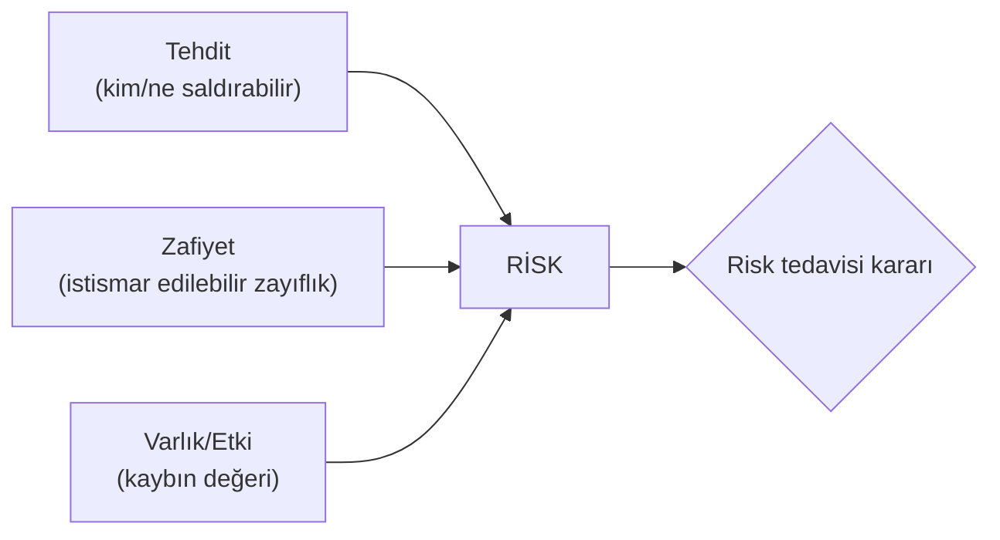
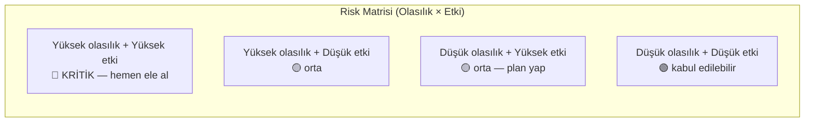
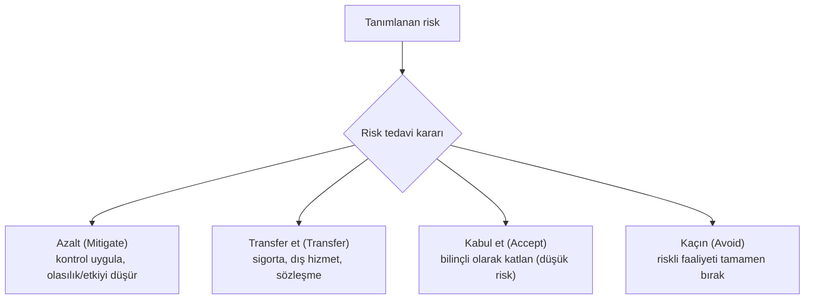
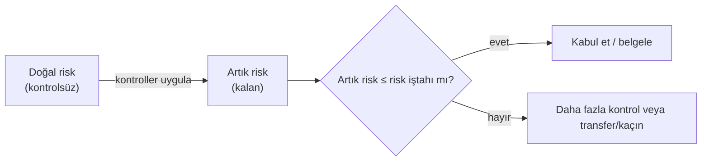

# ⚖️ Risk Yönetimi

Güvenlik, sonsuz kaynakla her riski sıfırlamak değildir — **sınırlı kaynağı en yüksek riske yönlendirme** sanatıdır. Risk yönetimi bu önceliklendirmeyi sistematik yapar. Bu dosya risk hesabını (nitel + nicel: SLE/ARO/ALE), risk tedavi seçeneklerini ve artık (residual) risk kavramını kurar.

> Ön koşul: [guvenlik-kontrolleri-matrisi.md](guvenlik-kontrolleri-matrisi.md). Çerçeveler: [cerceveler-nist-iso.md](cerceveler-nist-iso.md).

---

## 1. Risk nedir? Temel denklem

**Risk = Tehdit × Zafiyet × Etki** (kavramsal). Üç bileşenden biri sıfırsa risk yoktur:
- **Tehdit** yoksa (kimse istismar etmek istemiyor) → risk yok.
- **Zafiyet** yoksa (istismar edilebilir zayıflık yok) → risk yok.
- **Etki/Varlık değeri** yoksa (kaybedecek bir şey yok) → risk önemsiz.



Pratik formülasyon: **Risk = Olasılık (likelihood) × Etki (impact)**. Bir olayın gerçekleşme olasılığı ile gerçekleşirse vereceği zararın çarpımı.

---

## 2. Nitel (qualitative) risk değerlendirmesi

En yaygın ve pratik yöntem: olasılık ve etkiyi **kategorilerle** (Düşük/Orta/Yüksek) derecelendirip bir **risk matrisine** yerleştirmek.



| | Düşük etki | Orta etki | Yüksek etki |
|---|:---:|:---:|:---:|
| **Yüksek olasılık** | 🟡 Orta | 🔴 Yüksek | 🔴 Kritik |
| **Orta olasılık** | 🟢 Düşük | 🟡 Orta | 🔴 Yüksek |
| **Düşük olasılık** | 🟢 Düşük | 🟢 Düşük | 🟡 Orta |

- **Güçlü:** Hızlı, sezgisel, veri gerektirmez, iletişimi kolay.
- **Zayıf:** Öznel ("orta" ne demek?), kıyaslaması zor, bütçe gerekçelendirmesi güç.

---

## 3. Nicel (quantitative) risk değerlendirmesi: SLE / ARO / ALE

Parasal değerlerle **sayısal** risk hesabı. Bütçe kararlarını ve kontrol yatırımını gerekçelendirmek için kritik. Üç formül:

| Terim | Açılım | Anlam | Formül |
|-------|--------|-------|--------|
| **AV** | Asset Value | Varlığın değeri | (girdi) |
| **EF** | Exposure Factor | Bir olayda kaybedilen oran (%) | (girdi) |
| **SLE** | Single Loss Expectancy | Tek olayın maliyeti | **SLE = AV × EF** |
| **ARO** | Annualized Rate of Occurrence | Yılda kaç kez olur | (girdi/tahmin) |
| **ALE** | Annualized Loss Expectancy | Yıllık beklenen kayıp | **ALE = SLE × ARO** |

### Örnek hesap
Bir müşteri veritabanı sunucusu (varlık):
- **AV** = 500.000 TL (varlık değeri)
- **EF** = %40 (bir ihlalde verinin/değerin %40'ı etkilenir)
- **SLE** = 500.000 × 0.40 = **200.000 TL** (tek olayın maliyeti)
- **ARO** = 0.5 (iki yılda bir, yani yılda 0.5 kez)
- **ALE** = 200.000 × 0.5 = **100.000 TL/yıl** (yıllık beklenen kayıp)

### Kontrol kararı: maliyet-fayda
Bir güvenlik kontrolü, ALE'yi düşürdüğü kadar değerlidir:
```
Kontrol öncesi ALE          = 100.000 TL/yıl
Kontrol (ör. EDR) yıllık maliyeti = 30.000 TL/yıl
Kontrol sonrası ALE (tahmin) = 20.000 TL/yıl
────────────────────────────────────────────
Yıllık net fayda = (100.000 − 20.000) − 30.000 = 50.000 TL kazanç → kontrol MANTIKLI
```
> **Altın kural:** Bir kontrolün yıllık maliyeti, sağladığı ALE azalmasından **düşük** olmalı. Aksi hâlde kontrol ekonomik değildir. Güvenlik kararları duygu değil, bu hesapla verilmeli.

---

## 4. Risk tedavisi (risk treatment) — dört seçenek

Bir risk tanımlandıktan sonra, ona ne yapılacağına dair **dört** temel karar vardır:



| Seçenek | Ne zaman | Örnek |
|---------|----------|-------|
| **Azalt (mitigate/reduce)** | Kontrol uygulamak mantıklı | EDR kur, MFA ekle, yama yap |
| **Transfer et (transfer)** | Riski başkasına devret | Siber sigorta, bulut sağlayıcıya taşıma |
| **Kabul et (accept)** | Kalan risk düşük, tedavi maliyeti yüksek | Küçük bir riski bilinçli üstlen |
| **Kaçın (avoid)** | Risk çok yüksek, faaliyet vazgeçilebilir | Riskli özelliği/pazarı hiç yapmama |

> **Nüans — "kabul" bilinçli olmalı:** Risk kabul etmek, "görmezden gelmek" değildir. Kabul edilen risk **belgelenir**, sorumlusu (risk owner) bellidir ve düzenli gözden geçirilir. Belgelenmemiş "kabul" aslında ihmaldir.

---

## 5. Artık (residual) risk ve risk iştahı

- **Doğal (inherent) risk:** Hiçbir kontrol yokken var olan risk.
- **Artık (residual) risk:** Kontroller uygulandıktan **sonra** kalan risk.
- **Risk iştahı (risk appetite):** Kuruluşun kabul etmeye razı olduğu risk seviyesi.



> **Kritik gerçek — risk asla sıfırlanmaz:** %100 güvenlik yoktur. Amaç riski **iştah seviyesinin altına** indirmektir, sıfıra değil. Sıfır riske ulaşmaya çalışmak sonsuz maliyet + kullanılamaz sistem demektir. İyi risk yönetimi, "kabul edilebilir" ile "aşırı" arasındaki çizgiyi bilir.

---

## 6. İş sürekliliği: RTO ve RPO

Erişilebilirlik ([guvenlik-kontrolleri-matrisi.md](guvenlik-kontrolleri-matrisi.md) CIA) riskleri için iki kritik metrik:
- **RTO (Recovery Time Objective):** Bir kesintiden sonra sistemin **ne kadar sürede** geri gelmesi gerektiği (kabul edilebilir kesinti süresi).
- **RPO (Recovery Point Objective):** **Ne kadar veri kaybı** kabul edilebilir (son yedekten bu yana geçen süre).

> Örnek: RPO = 1 saat → en fazla 1 saatlik veri kaybı kabul edilebilir → en az saatlik yedek gerekir. RTO = 4 saat → sistem 4 saatte ayağa kalkmalı → uygun yedekleme/DR altyapısı. Bu metrikler yedekleme stratejisini ve maliyetini belirler.

---

## 7. Saldırı–savunma kesişimi (özet)

- **Önceliklendirme her şeydir:** Pentest/zafiyet taraması yüzlerce bulgu üretir; hangisini önce düzelteceğini **risk** (olasılık × etki, CVSS + varlık değeri) belirler → [somuru-ve-sonrasi.md](../10-pentest-metodolojisi/somuru-ve-sonrasi.md) CVSS.
- **Kontrol yatırımı gerekçelenir:** ALE hesabı, "neden EDR/MFA'ya bütçe" sorusuna sayısal cevap verir — güvenlik ekibinin yönetimle konuştuğu dil budur.
- **Artık risk kabul edilir, unutulmaz:** Kalan riski belgelemek, bir olay olduğunda "bilinçli kabul edilmişti" ile "ihmal edildi" arasındaki farkı belirler — hem yasal hem etik açıdan kritik.
- **PQC bağlantısı:** "Harvest now, decrypt later" ([post-kuantum-kriptografi.md](../05-kriptografi/post-kuantum-kriptografi.md)) klasik bir risk hesabıdır: verinin gizlilik ömrü (etki süresi) × kuantum tehdidinin olasılığı → bugün PQC'ye yatırım kararı.

> **Sonraki:** [cerceveler-nist-iso.md](cerceveler-nist-iso.md).
