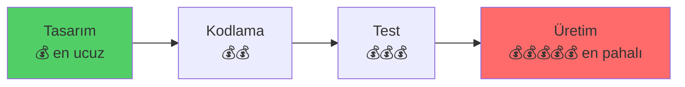
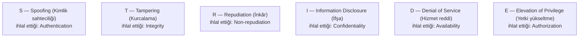
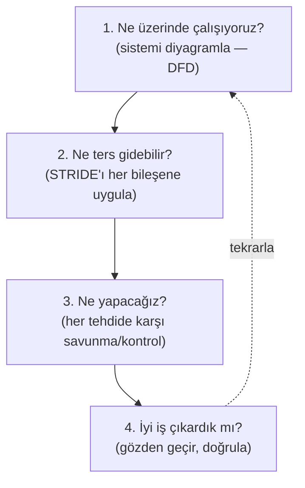
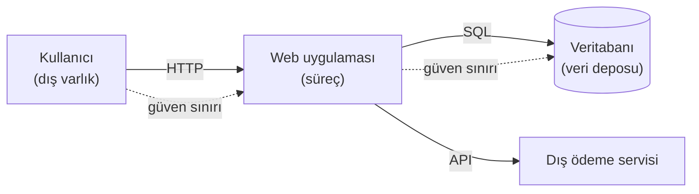

# 🎲 STRIDE Tehdit Modelleme

Tehdit modelleme, bir sistemi **tasarım aşamasında** inceleyip "burada ne ters gidebilir?" sorusunu sistematik sormaktır. Bu, güvenliği koda dökülmeden önce düşünmek (**shift-left**) demektir — bir zafiyeti üretimde bulmaktan çok daha ucuzdur. STRIDE, Microsoft'un bu iş için geliştirdiği en yaygın çerçevedir.

> İlgili: [insecure design (OWASP Top 10:2025 A06)](../04-web-guvenligi/owasp-top10-tam-rehber.md), [mitre-attck.md](../07-tehdit-modelleme-cerceveler/mitre-attck.md) (STRIDE potansiyeli, ATT&CK gözlemi türetir).

---

## 1. Neden tehdit modelleme? Shift-left

Bir zafiyetin düzeltme maliyeti, yaşam döngüsünde ne kadar geç bulunursa o kadar artar:

Tehdit modelleme, güvenliği **tasarım aşamasına** taşır (shift-left → [devsecops-ssdlc.md](../13-guvenli-kodlama-devsecops/devsecops-ssdlc.md)). Bir tasarım hatasını (ör. hız sınırı olmayan şifre sıfırlama) diagram üzerinde bulmak, üretimde istismar edilmesini beklemekten kat kat ucuzdur. Bu, [OWASP A06 Insecure Design](../04-web-guvenligi/owasp-top10-tam-rehber.md)'in doğrudan panzehiridir.

---

## 2. STRIDE — altı tehdit kategorisi

STRIDE, altı tehdit türünün baş harflerinden oluşur ve Microsoft tarafından geliştirilmiştir (kaynak: [Microsoft STRIDE / Threat Modeling](https://learn.microsoft.com/en-us/azure/security/develop/threat-modeling-tool-threats)). Her biri, bir güvenlik hedefinin ([CIA + ek](guvenlik-kontrolleri-matrisi.md)) ihlalidir:

| Harf | Tehdit | İhlal ettiği hedef | Örnek | Savunma |
|------|--------|--------------------|-------|---------|
| **S** | Spoofing (kimlik sahteciliği) | Authentication | Başkası gibi giriş yapma, IP spoofing | Güçlü kimlik doğrulama, MFA ([06-iam](../06-kimlik-erisim-yonetimi-iam/aaa-ve-mfa.md)) |
| **T** | Tampering (kurcalama) | Integrity | Veri/paket/dosya değiştirme | Hash, imza, giriş doğrulama ([05-kripto](../05-kriptografi/anahtar-degisimi-ve-imza.md)) |
| **R** | Repudiation (inkâr) | Non-repudiation | "Ben yapmadım" (iz yok) | Loglama, dijital imza, denetim izi |
| **I** | Information Disclosure (ifşa) | Confidentiality | Hassas veri sızması | Şifreleme, erişim kontrolü |
| **D** | Denial of Service | Availability | Sistemi çökertme/yavaşlatma | Hız sınırı, ölçekleme, DDoS koruması |
| **E** | Elevation of Privilege | Authorization | Düşük yetkiden yükseğe ([03-os](../03-isletim-sistemi-ici/kullanici-cekirdek-modu.md)) | En az ayrıcalık, giriş doğrulama, izolasyon |

> **Hafıza köprüsü:** STRIDE'ın altı kategorisi, [CIA üçlüsü + kimlik/inkâr/yetki] ihlallerinin tam listesidir. Her STRIDE harfi bir güvenlik hedefinin "ihlal edilmiş" hâlidir — bu yüzden STRIDE, "bu bileşende hangi hedeflerim tehdit altında?" sorusunu eksiksiz kapsar.

---

## 3. Tehdit modelleme süreci (dört soru)

Adam Shostack'ın klasik dört sorusu, tehdit modellemenin özüdür:

### Adım 1: Veri Akış Diyagramı (DFD)
Sistemi bileşenlere ayır: **süreçler** (uygulama), **veri depoları** (DB), **dış varlıklar** (kullanıcı, 3. parti) ve aralarındaki **veri akışları**. En önemlisi **güven sınırlarını (trust boundaries)** çiz — bir isteğin güvenilmez bölgeden güvenilir bölgeye geçtiği yerler ([web-mimarisi.md](../04-web-guvenligi/web-mimarisi.md)).

### Adım 2-3: Her sınıra/bileşene STRIDE uygula
Kullanıcı → Web sınırında: **S** (sahte kullanıcı?), **T** (istek kurcalama?), **I** (yanıtta veri sızıntısı?), **D** (istek seli?), **E** (yetki atlama?). Her tehdide bir savunma eşle.

---

## 4. Örnek: bir giriş (login) akışının STRIDE analizi

| STRIDE | Tehdit | Savunma |
|--------|--------|---------|
| **S** | Brute-force / credential stuffing ile başkası gibi giriş | MFA, hesap kilitleme, hız sınırı |
| **T** | İstekteki `role=user`'ı `role=admin` yapma | Sunucu tarafı yetki, imzalı token ([federasyon-sso.md](../06-kimlik-erisim-yonetimi-iam/federasyon-sso.md)) |
| **R** | Kullanıcı "ben giriş yapmadım" der | Giriş loglama + zaman damgası |
| **I** | Hata mesajı "kullanıcı yok / parola yanlış" ayrımı (enumeration) | Genel hata mesajı |
| **D** | Giriş uç noktasını istek seliyle çökertme | Hız sınırı, CAPTCHA |
| **E** | Şifre sıfırlama akışıyla başka hesabı ele geçirme | Güvenli token, sahiplik doğrulama |

> Bu tablo, tek bir akışın bile ne kadar çok tehdit yüzeyi olduğunu gösterir — ve STRIDE'ın bunları **sistematik** (hiçbirini atlamadan) ortaya çıkardığını.

---

## 5. Nüans: STRIDE ve diğer çerçeveler

- **STRIDE (potansiyel) vs ATT&CK (gözlem):** STRIDE tasarımda **olabilecek** tehditleri türetir; [ATT&CK](../07-tehdit-modelleme-cerceveler/mitre-attck.md) gerçekte **gözlenen** teknikleri kataloglar. STRIDE "önce düşün", ATT&CK "sonra tanı" — ikisi tehdit yaşam döngüsünün iki ucudur.
- **STRIDE vs DREAD:** DREAD (Damage, Reproducibility, Exploitability, Affected users, Discoverability) tehditleri **puanlamak** için kullanılırdı; bugün genelde [risk hesabı](risk-yonetimi.md) (olasılık × etki) veya CVSS tercih edilir.
- **Diğer yöntemler:** PASTA (saldırgan-merkezli), Attack Trees, LINDDUN (gizlilik odaklı). STRIDE en yaygın ve öğrenmesi en kolay olanıdır.

---

## 6. Saldırı–savunma kesişimi (özet)

- **Proaktif savunmanın özü:** Tehdit modelleme, saldırıyı beklemeden zafiyeti tasarımda yakalar — en ucuz, en yüksek getirili savunma noktası (shift-left).
- **Sistematiklik atlanmayı önler:** Sezgi bazı tehditleri kaçırır; STRIDE'ın altı kategorisini her güven sınırına uygulamak, kör noktaları kapatır.
- **Herkesin işi:** Tehdit modelleme sadece güvenlik ekibinin değil, geliştiricinin de aracıdır → [DevSecOps](../13-guvenli-kodlama-devsecops/devsecops-ssdlc.md) kültürünün temeli. Bir mimar/kurucu için ([post-kuantum-kriptografi.md](../05-kriptografi/post-kuantum-kriptografi.md) hedefin) tehdit modelleme, güvenli sistem tasarımının vazgeçilmez refleksidir.

> **Modül 08 tamamlandı.** Sonraki: [09-cloud-virtualizasyon/temel-kavramlar.md](../09-cloud-virtualizasyon/temel-kavramlar.md).
