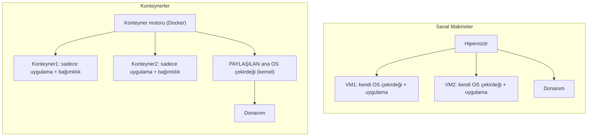
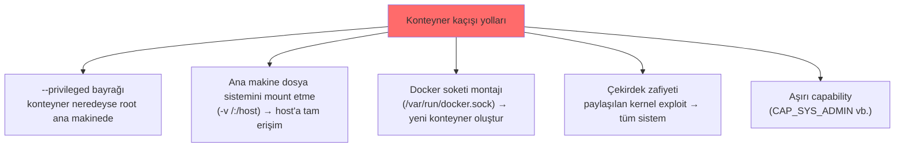
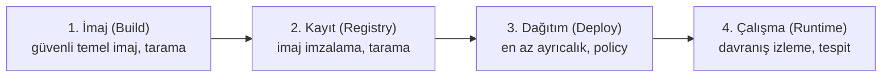

# 📦 Konteyner Güvenliği

Konteynerler (Docker, Kubernetes) modern uygulama dağıtımının standardı oldu. Sanal makinelerden farklı bir izolasyon modeli kullanırlar — bu fark, güvenlik açısından kritik sonuçlar doğurur. Bu dosya konteyner vs VM farkını, konteyner kaçışını (container escape) ve savunma katmanlarını kurar.

> Ön koşul: [temel-kavramlar.md](temel-kavramlar.md) (sanallaştırma), [surecler-ve-bellek.md](../03-isletim-sistemi-ici/surecler-ve-bellek.md) (izolasyon), [kullanici-cekirdek-modu.md](../03-isletim-sistemi-ici/kullanici-cekirdek-modu.md) (çekirdek).

---

## 1. Konteyner vs VM — temel fark

Her ikisi de izolasyon sağlar, ama **farklı seviyede**:



| | Sanal Makine (VM) | Konteyner |
|---|-------------------|-----------|
| İzolasyon seviyesi | Donanım/hipervizör (güçlü) | OS/çekirdek (daha zayıf) |
| Çekirdek | Her VM'in **kendi** çekirdeği | **Paylaşılan** ana çekirdek |
| Boyut | GB'larca (tam OS) | MB'larca (sadece uygulama) |
| Başlatma | Dakikalar | Saniyeler/milisaniyeler |
| Yoğunluk | Az (ağır) | Çok (hafif) |
| Güvenlik sınırı | **Güçlü** (hipervizör) | **Daha zayıf** (paylaşılan çekirdek) |

> **Kritik güvenlik sonucu:** Konteynerler **çekirdeği paylaşır**. Bu, onları hafif ve hızlı yapar ama izolasyonu VM'lerden **daha zayıftır**: paylaşılan çekirdekte bir zafiyet, tüm konteynerleri ve ana sistemi etkileyebilir. VM'de her sistemin kendi çekirdeği olduğu için izolasyon daha kalındır. "Konteyner güvenlik sınırı VM kadar güçlü değildir" — bu, mimari karar verirken bilinmesi gereken temel gerçektir.

---

## 2. Konteyner nasıl izole eder? (Linux temelleri)

Docker sihir değil — Linux çekirdeğinin üç özelliğini kullanır ([linux-temelleri.md](../02-linux-windows/linux-temelleri.md)):

| Mekanizma | Ne yapar |
|-----------|----------|
| **Namespaces** | Görünürlüğü izole eder — konteyner sadece kendi süreçlerini, ağını, dosya sistemini görür |
| **cgroups** (control groups) | Kaynağı sınırlar — CPU, bellek kotası (bir konteyner tüm makineyi tüketemesin) |
| **Capabilities / seccomp / AppArmor** | Yetkiyi kısıtlar — konteynerin yapabileceği syscall'ları/işlemleri daraltır ([kullanici-cekirdek-modu.md](../03-isletim-sistemi-ici/kullanici-cekirdek-modu.md)) |

İzolasyon bu mekanizmaların **doğru yapılandırılmasıyla** sağlanır — biri gevşetilirse (ör. `--privileged` bayrağı) izolasyon çöker.

---

## 3. Konteyner kaçışı (container escape)

**Container escape**, bir konteynerin içindeki kodun izolasyonu kırıp **ana makineye (host)** veya diğer konteynerlere erişmesidir. Paylaşılan çekirdek nedeniyle, kaçış = tüm sistemin (ve üzerindeki tüm konteynerlerin) ele geçirilmesi.

### Yaygın kaçış yolları


| Yol | Neden tehlikeli |
|-----|-----------------|
| **`--privileged`** | Konteynere neredeyse tam ana makine yetkisi verir → kaçış neredeyse hazır |
| **Docker soketi montajı** | `docker.sock`'a erişen konteyner, ana makinede yeni (privileged) konteyner oluşturup kaçabilir |
| **Ana FS montajı** | `-v /:/host` ile ana makinenin tüm dosya sistemi konteynerde |
| **Çekirdek exploit** | Paylaşılan çekirdekte bir zafiyet doğrudan ana makineye |
| **Aşırı capability** | `CAP_SYS_ADMIN` gibi geniş yetkiler kaçışı kolaylaştırır |

> **Kesişim:** Bir saldırgan bir web uygulamasında RCE elde edip ([enjeksiyon-aileleri.md](../04-web-guvenligi/zafiyet-siniflari/enjeksiyon-aileleri.md)) kendini bir konteynerde bulunca, ilk hedefi **kaçıştır** — `--privileged` mi, `docker.sock` erişilebilir mi, hangi capability'ler var diye enumerasyon yapar. Savunma bu yolları kapatmaktır.

---

## 4. Konteyner güvenliği katmanları

Konteyner güvenliği, imajdan çalışma zamanına bir yaşam döngüsüdür:



### Savunma kontrol listesi
| Katman | Kontrol |
|--------|---------|
| **İmaj** | Minimal temel imaj (distroless/alpine), bilinen zafiyetleri tara (Trivy, Grype) → [devsecops-ssdlc.md](../13-guvenli-kodlama-devsecops/devsecops-ssdlc.md) SCA |
| **İmaj** | Root olarak çalıştırma (`USER` direktifi ile non-root), imaj imzalama |
| **Sırlar** | Parola/anahtarı imaja gömme (secrets management) |
| **Çalışma zamanı** | `--privileged` KULLANMA, gereksiz capability'leri düşür (`--cap-drop ALL`) |
| **Çalışma zamanı** | Salt-okunur dosya sistemi, seccomp/AppArmor profilleri |
| **Ağ** | Konteynerler arası ağı segmentle (mikro-segmentasyon → [zero-trust](../06-kimlik-erisim-yonetimi-iam/zero-trust.md)) |
| **Orkestrasyon** | Kubernetes RBAC, Pod Security Standards, network policy |

```bash
# GÜVENLİ konteyner çalıştırma örneği (savunma pratiği)
docker run \
  --user 1000:1000 \          # non-root
  --cap-drop ALL \            # tüm capability'leri düşür
  --read-only \               # salt-okunur FS
  --security-opt no-new-privileges \
  --memory 512m --cpus 1 \    # kaynak sınırı (cgroups)
  benim-uygulamam:latest
# --privileged YOK, docker.sock montajı YOK, / montajı YOK
```

---

## 5. Kubernetes ve orkestrasyon güvenliği (kısa)

Üretimde konteynerler tek tek değil, **Kubernetes** gibi orkestratörlerle yönetilir. Bu yeni saldırı yüzeyleri ekler:
- **RBAC yanlış yapılandırması:** Aşırı geniş ServiceAccount izinleri.
- **Açık API sunucusu / kubelet:** Yönetim düzlemine yetkisiz erişim.
- **Secrets yönetimi:** Kubernetes secrets varsayılan olarak yalnızca base64 (şifreli değil) → [temel-kavramlar.md](../05-kriptografi/temel-kavramlar.md).
- **Pod-to-pod ağ:** Varsayılan olarak her pod her poda ulaşır → network policy ile segmentle.

> CIS Benchmark ve Pod Security Standards, Kubernetes sertleştirmesinin referanslarıdır.

---

## 6. Saldırı–savunma kesişimi (özet)

- **İzolasyon ödünleşmesi:** Konteynerler hız/yoğunluk için izolasyondan feda eder. Yüksek güvenlik gereken çok-kiracılı senaryolarda VM (veya gVisor/Kata gibi güçlendirilmiş çalışma zamanları) tercih edilebilir. Mimari karar risk temelli olmalı ([risk-yonetimi.md](../08-grc-yonetisim-risk-uyum/risk-yonetimi.md)).
- **`--privileged` = kapı açık:** Konteyner kaçışlarının çoğu yanlış yapılandırmadan (privileged, soket montajı, aşırı capability) kaynaklanır — exotic exploit değil. En az ayrıcalık burada da hayat kurtarır.
- **Tedarik zinciri:** Konteyner imajları dış kaynaklardan gelir → zafiyetli/kötü imaj riski ([A06/A08](../04-web-guvenligi/owasp-top10-tam-rehber.md)). İmaj tarama ve imzalama, DevSecOps'un ([devsecops-ssdlc.md](../13-guvenli-kodlama-devsecops/devsecops-ssdlc.md)) zorunlu parçası.

> **Modül 09 tamamlandı.** Sonraki: [10-pentest-metodolojisi/metodoloji-ve-rules-of-engagement.md](../10-pentest-metodolojisi/metodoloji-ve-rules-of-engagement.md).
