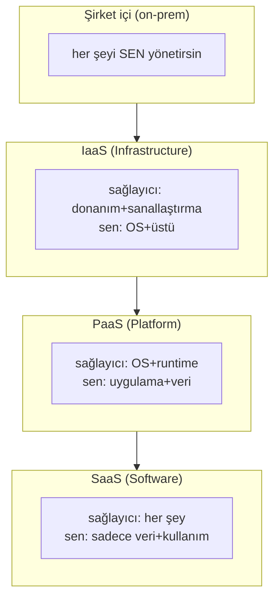
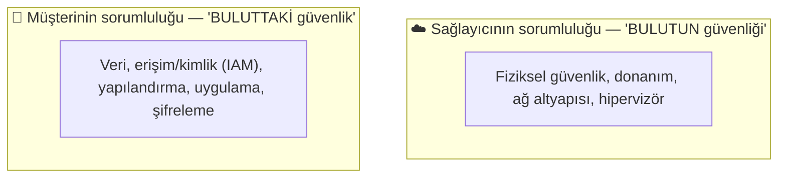
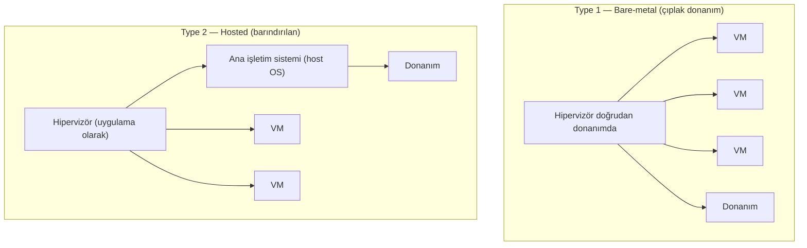

# ☁️ Bulut ve Sanallaştırma Temelleri

Bulut, modern BT'nin varsayılan altyapısıdır — ve bu, güvenlik sorumluluğunun ve saldırı yüzeyinin köklü şekilde değiştiği anlamına gelir. Bu dosya hizmet modellerini (IaaS/PaaS/SaaS), paylaşılan sorumluluk modelini ve altta yatan sanallaştırmayı (hipervizör) kurar.

> İlgili: [container-guvenligi.md](container-guvenligi.md), [surecler-ve-bellek.md](../03-isletim-sistemi-ici/surecler-ve-bellek.md) (izolasyon), SSRF bulut kesişimi ([csrf-ssrf.md](../04-web-guvenligi/zafiyet-siniflari/csrf-ssrf.md)).

---

## 1. Bulut nedir ve neden güvenlik açısından farklı?

Bulut, başkasının (sağlayıcının) altyapısını internet üzerinden, talep üzerine, kullandığın kadar öde modeliyle kiralamaktır. Beş temel özelliği: talep üzerine self-servis, geniş ağ erişimi, kaynak havuzlama, hızlı esneklik (elasticity), ölçülen hizmet. Bu beş özellik ve üç hizmet modeli (IaaS/PaaS/SaaS), NIST'in resmî bulut tanımında (SP 800-145) belirlenmiştir (kaynak: [NIST SP 800-145](https://csrc.nist.gov/pubs/sp/800/145/final)).

**Güvenlik açısından neden farklı?**
- **Çevre çözüldü:** Veri/uygulama artık senin veri merkezinde değil → [zero-trust](../06-kimlik-erisim-yonetimi-iam/zero-trust.md) gerekli.
- **Sorumluluk paylaşıldı:** Güvenliğin bir kısmı sağlayıcıda, bir kısmı sende (aşağıda).
- **Hız = risk:** Bir komutla yüzlerce sunucu açılır → yanlış yapılandırma anında ölçeklenir (açık S3 bucket'ları).
- **API-öncelikli:** Her şey API ile yönetilir → API/kimlik güvenliği kritik.

---

## 2. Hizmet modelleri: IaaS / PaaS / SaaS

Bulut, "ne kadarını sağlayıcı yönetir, ne kadarını sen" ekseninde üç modele ayrılır.

| Model | Sağlayıcı yönetir | Sen yönetirsin | Örnek | Analoji (pizza) |
|-------|-------------------|----------------|-------|-----------------|
| **IaaS** | Donanım, ağ, sanallaştırma | OS, çalışma zamanı, uygulama, veri | AWS EC2, Azure VM | Mutfağı kirala, pizzayı sen yap |
| **PaaS** | + OS, çalışma zamanı | Uygulama, veri | App Engine, Heroku, Azure App Service | Hazır hamur al, malzemeyi sen koy |
| **SaaS** | Her şey | Sadece veri/yapılandırma | Gmail, Microsoft 365, Salesforce | Pizzayı hazır sipariş et |

---

## 3. Paylaşılan sorumluluk modeli (shared responsibility)

Bulut güvenliğinin **en kritik kavramı**. "Bulut sağlayıcı her şeyi korur" yanılgısı en yaygın ve en tehlikeli hatadır. Gerçek: sorumluluk **paylaşılır** ve sınır hizmet modeline göre kayar.

| Katman | IaaS | PaaS | SaaS |
|--------|:----:|:----:|:----:|
| Veri sınıflandırma | 👤 | 👤 | 👤 |
| Kimlik ve erişim (IAM) | 👤 | 👤 | 👤 (paylaşımlı) |
| Uygulama | 👤 | 👤 | ☁️ |
| İşletim sistemi | 👤 | ☁️ | ☁️ |
| Sanallaştırma/hipervizör | ☁️ | ☁️ | ☁️ |
| Fiziksel donanım/ağ | ☁️ | ☁️ | ☁️ |

> 🔑 **Sabit kural — her modelde müşteride kalanlar:** **Veri, kimlik/erişim yönetimi (IAM) ve doğru yapılandırma** her zaman büyük ölçüde müşterinin sorumluluğundadır. Bulut ihlallerinin ezici çoğunluğu sağlayıcının değil, **müşterinin yanlış yapılandırmasından** kaynaklanır: herkese açık depolama (S3 bucket), aşırı geniş IAM izinleri, açık yönetim portları. Sağlayıcı "bulutun güvenliğini", müşteri "buluttaki güvenliği" sağlar.

> **Kesişim:** [SSRF → bulut meta-veri](../04-web-guvenligi/zafiyet-siniflari/csrf-ssrf.md) saldırısı, tam da müşteri tarafındaki bir zafiyetin (uygulama SSRF) bulut kimliğini çalmaya nasıl dönüştüğünü gösterir — sağlayıcı burada suçlanamaz, savunma (IMDSv2, IAM en az ayrıcalık) müşteridedir. 2019'daki Capital One ihlali (100+ milyon kayıt) tam olarak bu zincirdi: bir SSRF, EC2 meta-veri servisinden IAM kimlik bilgisi çaldı ve o kimlikle S3 bucket'ları okundu — OWASP Top 10:2025'te SSRF'in neden A01 (Broken Access Control) altına alındığının ([04-web-guvenligi/owasp-top10-tam-rehber.md](../04-web-guvenligi/owasp-top10-tam-rehber.md)) canlı örneği.

---

## 4. Sanallaştırma ve hipervizör

Bulutun altında **sanallaştırma** yatar: tek bir fiziksel sunucu, birden çok izole **sanal makineye (VM)** bölünür. Bunu yöneten katman **hipervizördür (hypervisor)**.

| | Type 1 (Bare-metal) | Type 2 (Hosted) |
|---|---------------------|-----------------|
| Konum | Doğrudan donanımda | Bir ana OS üzerinde |
| Performans | Yüksek | Daha düşük |
| Kullanım | **Üretim/bulut** (VMware ESXi, Hyper-V, KVM, Xen) | Masaüstü/test (VirtualBox, VMware Workstation) |
| Güvenlik | Daha küçük saldırı yüzeyi | Ana OS zafiyetleri de miras |

> **Öğrenme lab'ın Type 2:** VirtualBox ile Kali/Ubuntu VM'leri çalıştırmak Type 2'dir → [linux-hardening-checklist.md](../02-linux-windows/pratik-lab/linux-hardening-checklist.md). Bulut sağlayıcıları ise Type 1 kullanır.

### VM izolasyonu ve hipervizör kaçışı
Sanallaştırmanın güvenlik vaadi **izolasyondur**: bir VM'deki kod, komşu VM'lere veya ana sisteme erişememelidir ([surecler-ve-bellek.md](../03-isletim-sistemi-ici/surecler-ve-bellek.md)). Bu sınırı kırmak — bir VM'den hipervizöre/diğer VM'lere kaçmak — **hipervizör kaçışı (VM escape)** denir ve bulutun en kritik/en yüksek değerli zafiyetidir. Çok-kiracılı (multi-tenant) bulutta, bir kaçış = başka müşterilerin verisine erişim. Bu yüzden hipervizör güvenliği ([kullanici-cekirdek-modu.md](../03-isletim-sistemi-ici/kullanici-cekirdek-modu.md) "Ring -1") sağlayıcının en yüksek önceliğidir.

---

## 5. Bulut güvenlik araçları ve kavramları

| Kavram | Ne |
|--------|-----|
| **CSPM** (Cloud Security Posture Management) | Yanlış yapılandırmaları (açık bucket, geniş IAM) sürekli tarar |
| **CWPP** (Cloud Workload Protection) | İş yüklerini (VM/konteyner) korur |
| **CNAPP** | CSPM+CWPP birleşik bulut-doğal platform |
| **CASB** | Bulut uygulama erişimini denetler/görünürlük |
| **IAM** (bulutta) | En kritik kontrol — kimin neye erişebileceği ([erisim-kontrol-modelleri.md](../06-kimlik-erisim-yonetimi-iam/erisim-kontrol-modelleri.md)) |

> **Nüans — yanlış yapılandırma bir numaralı bulut riski:** Karmaşık bulut ortamlarında (yüzlerce servis, binlerce izin) en büyük tehdit exotic bir exploit değil, **basit bir yanlış ayardır**. CSPM araçları bu yüzden vardır; [en az ayrıcalık](../00-baslangic/terminoloji-sozlugu.md) IAM'de her yerdekinden daha zordur ve daha kritiktir.

---

## 6. Saldırı–savunma kesişimi (özet)

- **Paylaşılan sorumluluk = savunma sınırı:** Neyin senin sorumluluğunda olduğunu bilmemek, en büyük bulut ihlali kaynağıdır. "Sağlayıcı halleder" varsayımı açık bucket'lara yol açar.
- **IAM yeni çevre:** Bulutta ağ sınırı çözüldüğü için kimlik/erişim en kritik kontroldür → [zero-trust](../06-kimlik-erisim-yonetimi-iam/zero-trust.md), aşırı izinler = yanal hareket otoyolu.
- **İzolasyon her şeydir:** VM (ve konteyner → [container-guvenligi.md](container-guvenligi.md)) izolasyonu bulut güvenliğinin temelidir; kaçış saldırıları en yüksek etkilidir.
- **Yapılandırma > exploit:** Bulut savunmasının çoğu, süslü saldırıları durdurmak değil, basit hataları (açık port, geniş izin, şifresiz veri) önlemektir → CSPM + [DevSecOps](../13-guvenli-kodlama-devsecops/devsecops-ssdlc.md).

> **Sonraki:** [container-guvenligi.md](container-guvenligi.md).
