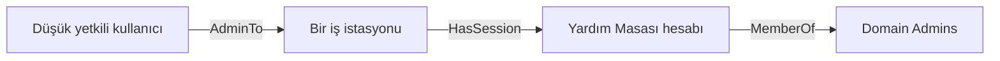
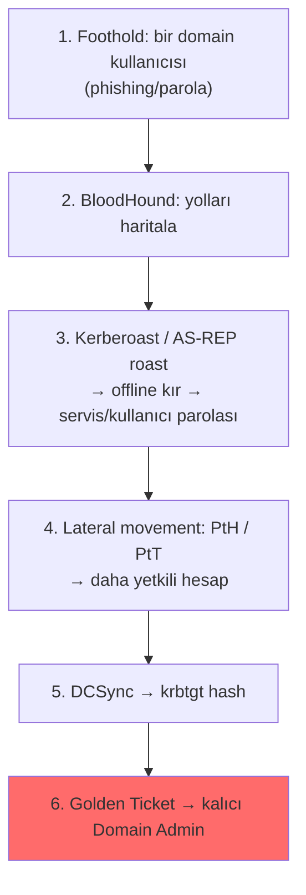

# 🏰 Active Directory Saldırıları

Kurumsal ağların ezici çoğunluğu **Active Directory (AD)** ile yönetilir ([../02-linux-windows/windows-temelleri.md](../02-linux-windows/windows-temelleri.md)). Gerçek kurumsal pentest/red team büyük ölçüde AD saldırısıdır: tek bir düşük yetkili domain kullanıcısından **Domain Admin**'e (tüm domain'in kontrolü) tırmanmak. Bu dosya, en yaygın AD saldırılarının **mekanizmasını** kurar — persona düzeyinde "neden çalışıyor" (forest mimarisi tasarımına girmeden).

> Ön koşul: [../02-linux-windows/windows-temelleri.md](../02-linux-windows/windows-temelleri.md) (AD, Kerberos, TGT/TGS, NTLM/SAM), [privilege-escalation.md](privilege-escalation.md), [../05-kriptografi/pratik-lab/hash_kirma_john_hashcat.md](../05-kriptografi/pratik-lab/hash_kirma_john_hashcat.md) (offline kırma).

> ⚠️ Yalnızca izinli ortamlarda ([metodoloji-ve-rules-of-engagement.md](metodoloji-ve-rules-of-engagement.md)).

---

## 1. Kerberos hatırlatması (neden saldırılar mümkün)

AD kimlik doğrulaması ağırlıklı olarak **Kerberos** ile yapılır ([../02-linux-windows/windows-temelleri.md](../02-linux-windows/windows-temelleri.md)): kullanıcı Domain Controller'dan (KDC) bir **TGT** (Ticket Granting Ticket) alır, sonra bu TGT ile servislere erişim için **TGS** (service ticket) biletleri ister. Saldırıların çoğu, bu bilet sisteminin iki tasarım özelliğini istismar eder:
1. **Servis biletleri (TGS), o servis hesabının parola hash'iyle şifrelenir** → bileti alan, offline olarak o hash'i kırmayı deneyebilir (Kerberoasting).
2. **Ön kimlik doğrulama (pre-authentication) kapalı olan hesaplar** için, KDC kullanıcının hash'iyle şifreli bir yanıtı kimlik doğrulamadan verir → offline kırma (AS-REP roasting).

Yani AD saldırılarının çoğu, aslında [../05-kriptografi/pratik-lab/hash_kirma_john_hashcat.md](../05-kriptografi/pratik-lab/hash_kirma_john_hashcat.md)'deki **offline hash kırmanın** Kerberos'a uygulanmış hâlidir — bir kez daha "çalınan hash'i sessizce, hedefin göremeyeceği hızda kır" teması ([somuru-ve-sonrasi.md](somuru-ve-sonrasi.md) §1.5 online vs offline).

---

## 2. Enumerasyon: BloodHound

Bir AD ortamında ilk iş, ilişkileri **haritalamaktır**. **BloodHound**, AD nesnelerini (kullanıcı, grup, bilgisayar, ACL, oturum) toplayıp bir **grafik** olarak gösterir ve "bu düşük yetkili kullanıcıdan Domain Admin'e giden en kısa yol nedir?" sorusunu cevaplar (kaynak: [github.com/BloodHoundAD/BloodHound](https://github.com/BloodHoundAD/BloodHound)).


BloodHound'un değeri, elle görülemeyen **dolaylı yolları** (A, B'nin oturumuna sahip; B, C grubunda; C, DC üzerinde haklı…) ortaya çıkarmasıdır. Bu, [../07-tehdit-modelleme-cerceveler/pyramid-of-pain-diamond-model.md](../07-tehdit-modelleme-cerceveler/pyramid-of-pain-diamond-model.md)'deki "pivot" (bir düğümden diğerine ilerleme) fikrinin AD grafiğindeki hâlidir.

---

## 3. Kerberoasting

**Mekanizma:** Domain'deki herhangi bir kimliği doğrulanmış kullanıcı, bir **SPN** (Service Principal Name) kayıtlı servis hesabı için TGS bileti isteyebilir. Bu bilet, o **servis hesabının parola hash'iyle** şifrelenir. Saldırgan bileti alıp offline kırmaya çalışır — başarılı olursa servis hesabının **düz metin parolasını** elde eder.

```bash
# Impacket ile SPN'li hesapların biletlerini iste ve hash'leri çıkar
GetUserSPNs.py -request -dc-ip 10.10.10.10 domain.local/dusuk_kullanici:parola
# Çıkan $krb5tgs$ hash'ini offline kır (hashcat -m 13100)
hashcat -m 13100 kerberoast.hash rockyou.txt
```
> **Neden çalışır:** Servis hesapları genellikle (a) yüksek yetkili ve (b) zayıf/eski parolalıdır (insan tarafından belirlenmiş, nadiren değişen). Herhangi bir kullanıcı bileti isteyebildiği için saldırı **düşük yetkiyle** başlar ve **offline** olduğu için hedef görmez ([../05-kriptografi/temel-kavramlar.md](../05-kriptografi/temel-kavramlar.md) — savunma yine güçlü/uzun parola). **Savunma:** servis hesaplarına uzun rastgele parolalar (gMSA — group Managed Service Accounts), en az ayrıcalık.

---

## 4. AS-REP Roasting

**Mekanizma:** Bir hesapta "Kerberos pre-authentication" **kapalıysa**, KDC, kullanıcının parola hash'iyle şifreli bir yanıtı (AS-REP) **kimlik doğrulaması istemeden** verir. Saldırgan bu yanıtı alıp offline kırar — hesabın parolasına ulaşır. Kerberoasting'e benzer ama servis değil, kullanıcı hesabı hedefler ve önkoşulu "pre-auth kapalı" hesaplardır.
```bash
GetNPUsers.py -dc-ip 10.10.10.10 domain.local/ -usersfile kullanicilar.txt -no-pass
hashcat -m 18200 asrep.hash rockyou.txt
```
**Savunma:** pre-authentication'ı kapalı hesap bırakma; güçlü parola.

---

## 5. Pass-the-Hash / Pass-the-Ticket / Overpass-the-Hash

Bu üçlü, kimlik bilgisini **kırmadan doğrudan kullanma** ailesidir — parolayı bilmen gerekmez, kimliğin kriptografik kanıtını (hash/bilet) sunman yeter.

| Teknik | Ne kullanılır | Nasıl |
|--------|---------------|-------|
| **Pass-the-Hash (PtH)** | NTLM hash | Hash'i doğrudan NTLM kimlik doğrulamaya sun ([../02-linux-windows/windows-temelleri.md](../02-linux-windows/windows-temelleri.md)) |
| **Pass-the-Ticket (PtT)** | Kerberos bileti (TGT/TGS) | Çalınan bileti belleğe enjekte edip kimliğe bürün |
| **Overpass-the-Hash** | NTLM hash → TGT | Hash'i kullanarak Kerberos TGT al (NTLM'den Kerberos'a geç) |

```bash
# Pass-the-Hash (Impacket ile hash'le uzak komut)
psexec.py -hashes :<NTLM_HASH> domain.local/Administrator@10.10.10.20
```
> **Neden çalışır:** Windows kimlik doğrulaması, "parolayı bilme" yerine "parolanın türevini (hash/bilet) sunma" temeline dayanır ([../02-linux-windows/windows-temelleri.md](../02-linux-windows/windows-temelleri.md)). Bu yüzden hash'i çalmak = kimliği çalmak; kırmaya gerek bile yok. Bu, Moniker Link ([../12-sosyal-muhendislik-phishing/phishing-analizi.md](../12-sosyal-muhendislik-phishing/phishing-analizi.md)) ile sızan hash'in neden bu kadar değerli olduğunu da açıklar. **Savunma:** Credential Guard, LSASS koruması, katmanlı yönetici modeli (tiering), SMB imzalama.

---

## 6. Golden Ticket ve DCSync (domain hakimiyeti)

Bunlar, saldırganın zaten yüksek yetkiye ulaştıktan sonra **kalıcı domain hakimiyeti** kurduğu tekniklerdir:

- **DCSync:** Yeterli hakka (Replicating Directory Changes) sahip bir hesap, bir Domain Controller'ı taklit ederek **herhangi bir kullanıcının hash'ini** (Administrator, `krbtgt` dahil) DC'den "replikasyon" adı altında ister — LSASS'a dokunmadan tüm parolaları çeker (`secretsdump.py`, Mimikatz `lsadump::dcsync`).
- **Golden Ticket:** `krbtgt` hesabının hash'i ele geçirilince (ör. DCSync ile), saldırgan **kendi TGT'lerini** üretebilir — istediği kullanıcı/grup üyeliğiyle, KDC'nin doğrulayacağı geçerli biletler. Bu, "kendi pasaportunu basan" saldırgandır: `krbtgt` hash'i değişene dek domain'i istediği gibi gezer.

> **Neden yıkıcı:** `krbtgt` hash'i tüm Kerberos biletlerinin imza anahtarıdır ([../05-kriptografi/anahtar-degisimi-ve-imza.md](../05-kriptografi/anahtar-degisimi-ve-imza.md) imza mantığı). Onu ele geçirmek, imza anahtarını ele geçirmek gibidir — artık her "kimlik kanıtını" sen üretebilirsin. **Savunma:** `krbtgt` parolasını düzenli (iki kez) döndürmek, DC'leri katı korumak, DCSync haklarını denetlemek.

---

## 7. Tipik AD saldırı zinciri (bir bakışta)



Her adım önceki modüllerdeki bir kavrama dayanır: foothold ([somuru-ve-sonrasi.md](somuru-ve-sonrasi.md)), offline kırma ([../05-kriptografi/pratik-lab/hash_kirma_john_hashcat.md](../05-kriptografi/pratik-lab/hash_kirma_john_hashcat.md)), hash/bilet kimliği ([../02-linux-windows/windows-temelleri.md](../02-linux-windows/windows-temelleri.md)), imza anahtarı hakimiyeti ([../05-kriptografi/anahtar-degisimi-ve-imza.md](../05-kriptografi/anahtar-degisimi-ve-imza.md)).

---

## 8. Saldırı–savunma kesişimi (özet)

- **DC = kale:** Domain Controller'ı ele geçiren tüm domain'i ele geçirir; bu yüzden DC'ler en yüksek korumayı, tiered admin modelini ve yoğun izlemeyi ([../11-soc-mavi-takim/log-analizi.md](../11-soc-mavi-takim/log-analizi.md) Event 4768/4769 Kerberos biletleri) gerektirir.
- **Tespit:** Kerberoasting anormal TGS istekleriyle (çok sayıda SPN bileti), DCSync anormal replikasyon istekleriyle, Golden Ticket tutarsız bilet ömürleriyle tespit edilebilir — davranışsal (IOA → [../07-tehdit-modelleme-cerceveler/tehdit-istihbarati-ioc-ioa.md](../07-tehdit-modelleme-cerceveler/tehdit-istihbarati-ioc-ioa.md)) tespit.
- **Zero Trust bağlamı:** AD'nin "bir kez içeri gir, sonra bilet sistemiyle serbestçe gez" modeli, [../06-kimlik-erisim-yonetimi-iam/zero-trust.md](../06-kimlik-erisim-yonetimi-iam/zero-trust.md)'un neden ortaya çıktığını açıklar — yanal hareketi varsayılan kabul eden mimari, tam da AD saldırılarının otoyoludur.

> **Not (kapsam):** Bu dosya persona düzeyinde "bu saldırılar neden çalışır"ı kurar; AD **forest/trust mimarisi tasarımı** ve gelişmiş operasyonel teknikler (ör. constrained/unconstrained delegation zincirleri) uzman (kurumsal red team / AD güvenlik mimarı) alanıdır → [../15-projeler/spesifikasyon-sonrasi-yol-haritasi.md](../15-projeler/spesifikasyon-sonrasi-yol-haritasi.md).
