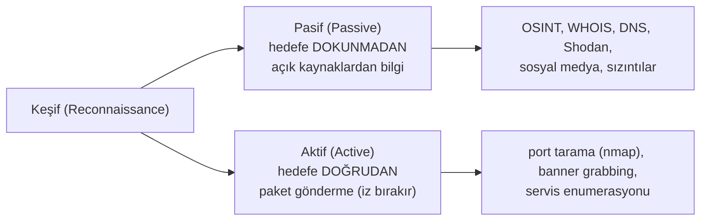

# 🔭 Keşif ve Enumerasyon (Nmap Tam Referans)

Keşif (reconnaissance) ve enumerasyon, bir pentest'in **en kritik ama en çok küçümsenen** aşamasıdır. "Saldırı, bilgiye dayanır" — ne kadar iyi keşif yaparsan, sömürü o kadar kolaydır. Bu dosya pasif/aktif keşfi ve endüstri standardı tarama aracı **Nmap**'i tam referansıyla kurar.

> ⚠️ Yalnızca izinli hedeflerde → [metodoloji-ve-rules-of-engagement.md](metodoloji-ve-rules-of-engagement.md). Ön koşul: [tcp-ip-protokoller.md](../01-ag-networking/tcp-ip-protokoller.md) (portlar), [subnetting-cidr.md](../01-ag-networking/subnetting-cidr.md).

---

## 1. Pasif vs aktif keşif



| | Pasif | Aktif |
|---|-------|-------|
| Hedefe temas | Yok (gizli) | Var (loglanır) |
| Tespit riski | Çok düşük | Yüksek |
| Araçlar | WHOIS, dig, Shodan, theHarvester, Google dorking | nmap, gobuster, enum4linux |
| Ne zaman | Her zaman önce | Kapsam netleştikten sonra |

### Pasif keşif araçları
```bash
whois ornek.com                    # kayıt/sahiplik bilgisi
dig ornek.com ANY                  # DNS kayıtları (→ dns-derinlemesine.md)
# Shodan: internete açık cihazları/servisleri arayan arama motoru (shodan.io)
# theHarvester: e-posta/alt alan toplama
# Google dorking: site:ornek.com filetype:pdf, inurl:admin
```

---

## 2. Nmap — port ve servis tarama

**Nmap** (Network Mapper), aktif keşfin standart aracıdır. Temel iş akışı: canlı host'ları bul → açık portları bul → servisleri/sürümleri tespit et → zafiyet ipuçları topla.

### Temel tarama türleri

```bash
# Host keşfi (ping tarama) — hangi cihazlar canlı?
nmap -sn 192.168.1.0/24              # sadece host keşfi, port taramaz

# TCP SYN taraması (varsayılan, hızlı, "yarı-açık" → tcp-ip-protokoller.md)
sudo nmap -sS 192.168.1.10

# TCP connect taraması (root gerekmez, tam 3-way handshake)
nmap -sT 192.168.1.10

# UDP taraması (yavaş ama DNS/SNMP/DHCP için kritik)
sudo nmap -sU 192.168.1.10
```

### Kritik bayraklar (flags)

| Bayrak | İşlev |
|--------|-------|
| `-sS` | SYN (stealth) tarama — varsayılan, hızlı |
| `-sT` | TCP connect tarama (yetki gerektirmez) |
| `-sU` | UDP tarama |
| `-sV` | **Servis/sürüm tespiti** (zafiyet araştırması için altın) |
| `-O` | İşletim sistemi tespiti |
| `-p-` | **Tüm 65535 portu** tara (varsayılan sadece ilk 1000) |
| `-p 22,80,443` | Belirli portlar |
| `-A` | Agresif: `-sV -O` + script + traceroute |
| `-T0`–`-T5` | Zamanlama/hız (T0 en yavaş/gizli, T4 hızlı, T5 agresif) |
| `-oN/-oX/-oG` | Çıktıyı dosyaya (normal/XML/grepable) kaydet |
| `--script` | NSE script çalıştır (aşağıda) |

### Tipik iş akışı (kademeli)
```bash
# 1. Hızlı: tüm portları bul (sadece açık/kapalı)
sudo nmap -sS -p- --min-rate 1000 192.168.1.10 -oN portlar.txt

# 2. Derin: bulunan açık portlarda servis/sürüm + script
sudo nmap -sV -sC -p 22,80,443 192.168.1.10 -oN detay.txt

# 3. En kapsamlı (izinli/lab hedefte)
sudo nmap -A -p- 192.168.1.10 -oN tam.txt
```

> 📸 EKRAN GÖRÜNTÜSÜ EKLENECEK: `nmap -sV` çıktısı — açık portlar, servis adları ve sürümleri (ör. `22/tcp open ssh OpenSSH 8.2`).

---

## 3. NSE — Nmap Scripting Engine

Nmap sadece port taramaz; **NSE script'leri** ile zafiyet tespiti, brute-force, enumerasyon yapar.

```bash
# Varsayılan güvenli script'ler
nmap -sC 192.168.1.10               # = --script=default

# Belirli kategori
nmap --script vuln 192.168.1.10     # bilinen zafiyet taraması
nmap --script "http-*" 192.168.1.10 # HTTP ile ilgili tüm script'ler

# Belirli servis enumerasyonu
nmap --script smb-enum-shares -p 445 192.168.1.10   # SMB paylaşımları
nmap --script ssl-enum-ciphers -p 443 192.168.1.10  # TLS şifre paketleri
```

| NSE kategorisi | İş |
|----------------|-----|
| `default` (`-sC`) | Güvenli, genel enumerasyon |
| `vuln` | Bilinen zafiyetleri tara |
| `discovery` | Ağ/servis keşfi |
| `auth`, `brute` | Kimlik doğrulama testi (dikkatli!) |
| `safe` / `intrusive` | Zararsız / müdahaleci ayrımı |

---

## 4. Servise özel enumerasyon

Nmap açık portları bulunca, her servis için **derinlemesine enumerasyon** yapılır. "Servis = kapı; enumerasyon = kapıyı yoklamak."

| Port/Servis | Enumerasyon araçları/teknikleri |
|-------------|----------------------------------|
| **80/443 HTTP(S)** | `gobuster`/`ffuf` (dizin/dosya keşfi), `nikto`, `whatweb`, Burp ([burp-suite-rehberi.md](../04-web-guvenligi/burp-suite-rehberi.md)) |
| **445 SMB** | `enum4linux`, `smbclient`, `smbmap` (paylaşım, kullanıcı) |
| **21 FTP** | Anonim giriş denemesi, `ftp` |
| **22 SSH** | Sürüm, kullanıcı enumerasyonu, anahtar |
| **53 DNS** | `dig axfr` (zone transfer), alt alan sayımı ([dns-derinlemesine.md](../01-ag-networking/dns-derinlemesine.md)) |
| **3389 RDP** | Sürüm, NLA durumu |
| **389 LDAP** | `ldapsearch` (dizin/AD bilgisi) |
| **161 SNMP** | `snmpwalk` (topluluk string'i "public" ise altın madeni) |

```bash
# Web dizin keşfi (gizli sayfa/panel bulma)
gobuster dir -u http://192.168.1.10 -w /usr/share/wordlists/dirb/common.txt

# SMB enumerasyonu
enum4linux -a 192.168.1.10
smbclient -L //192.168.1.10 -N     # anonim paylaşım listesi
```

> 📸 EKRAN GÖRÜNTÜSÜ EKLENECEK: `gobuster` ile keşfedilen gizli dizinler (ör. `/admin`, `/backup`).

---

## 5. Nüans: enumerasyon = pentest'in %80'i

- **"Yeterince enumerate etmedim" en yaygın başarısızlık:** OSCP dahil pratik sınavlarda takılanların çoğu, exploit bilmediğinden değil, **yeterince derin enumerasyon yapmadığından** takılır. Bir sömürü yolu neredeyse her zaman keşif verisinin içinde gizlidir.
- **Sürüm = zafiyet anahtarı:** `-sV` ile bulunan servis sürümü (ör. `vsftpd 2.3.4`), doğrudan bir CVE aramasına ([somuru-ve-sonrasi.md](somuru-ve-sonrasi.md)) dönüşür.
- **UDP'yi unutma:** Çoğu kişi sadece TCP tarar; DNS, SNMP, DHCP gibi kritik servisler UDP'dedir ve gözden kaçar.
- **Sabır:** `-p-` (tüm portlar) yavaştır ama yüksek portlarda (ör. 8080, 8443, 31337) saklı servisler bulunur.

---

## 6. Saldırı–savunma kesişimi (özet)

- **Keşif çift taraflı görünür:** Aktif tarama savunmacının loglarında ([log-analizi.md](../11-soc-mavi-takim/log-analizi.md)) iz bırakır — çok sayıda bağlantı/reddedilen paket "birisi bizi tarıyor" sinyalidir (IOA → [tehdit-istihbarati-ioc-ioa.md](../07-tehdit-modelleme-cerceveler/tehdit-istihbarati-ioc-ioa.md)).
- **Saldırı yüzeyi azaltma savunmadır:** Enumerasyonun bulduğu her açık port/servis bir risktir → sertleştirme ([linux-hardening-checklist.md](../02-linux-windows/pratik-lab/linux-hardening-checklist.md)) tam da bu yüzeyi küçültür. "Kendini nmap'le" savunma pratiğidir.
- **Bilgi asimetrisi:** Pentester ne kadar çok bilirse o kadar güçlüdür; savunmacı da kendi ortamını saldırgandan iyi tanımalı (varlık envanteri → [NIST CSF Identify](../08-grc-yonetisim-risk-uyum/cerceveler-nist-iso.md)).

> **Sonraki:** [somuru-ve-sonrasi.md](somuru-ve-sonrasi.md).
